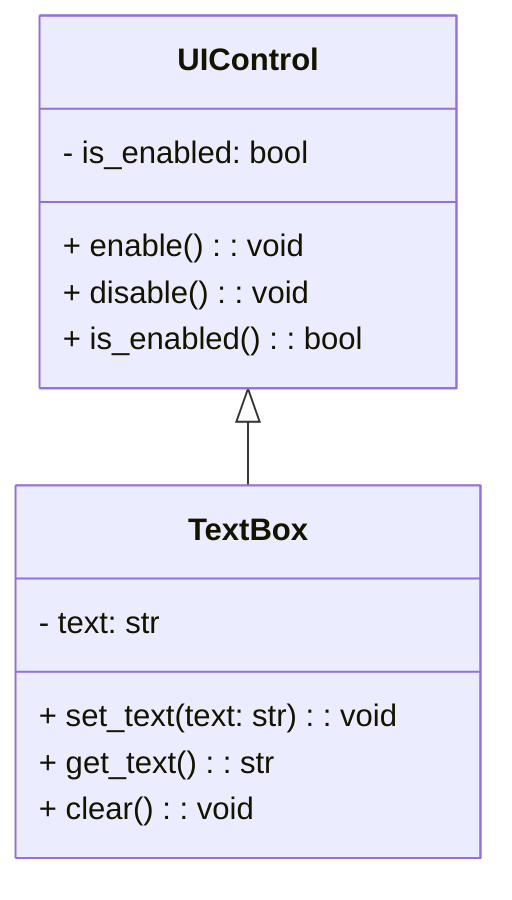

# 📚 Single Inheritance in Python

This guide explains **single inheritance** in Python using an example with `UIControl` as a base class and `TextBox` as a derived class. Single inheritance allows a child class to inherit methods and properties from a single parent class, promoting code reuse and modularity.

---

## 📑 Table of Contents

1. [🔍 What is Single Inheritance?](#-what-is-single-inheritance)
2. [⚙️ Code Example](#-code-example)
3. [📝 Explanation](#-explanation)
   - [UIControl Class](#uicontrol-class)
   - [TextBox Class](#textbox-class)
4. [💡 Usage Example](#-usage-example)
5. [📜 Summary](#-summary)

---

### 🔍 What is Single Inheritance?

In **single inheritance**, a class inherits from one and only one parent class. This means the child class can access methods and properties of the parent class, enabling **code reuse** and **logical structuring** of functionality.

In our example:
- The `UIControl` class serves as a base class, offering functionality to enable and disable a control.
- The `TextBox` class inherits from `UIControl`, gaining the enabling/disabling functionality while adding text-related methods.

---

### Class Diagram


### ⚙️ Code Example

```python
# Define a class named UIControl
class UIControl:
    def __init__(self):
        self._is_enabled = True

    def enable(self):
        self._is_enabled = True

    def disable(self):
        self._is_enabled = False

    def is_enabled(self):
        return self._is_enabled

# Define a class named TextBox that inherits from UIControl
class TextBox(UIControl):
    def __init__(self):
        super().__init__()
        self._text = ""

    def set_text(self, text):
        self._text = text

    def clear(self):
        self._text = ""

# Create an instance of the TextBox class
control = TextBox()
control.disable()
print(control.is_enabled())  # Output: False
```

---

### 📝 Explanation

This code demonstrates single inheritance with `UIControl` as the parent class and `TextBox` as the child class. 

#### 🖥️ UIControl Class

The `UIControl` class provides basic enabling and disabling functionality. It defines the following:

- **`__init__` Method**: Initializes `_is_enabled` to `True`.
- **`enable` Method**: Sets `_is_enabled` to `True`, enabling the control.
- **`disable` Method**: Sets `_is_enabled` to `False`, disabling the control.
- **`is_enabled` Method**: Returns the current state of `_is_enabled`.

#### 📝 TextBox Class

The `TextBox` class inherits from `UIControl`, extending it with text-specific methods:

- **Inheritance**: `TextBox` inherits all methods from `UIControl`.
- **`__init__` Method**: Calls the parent `__init__` using `super()` to initialize `_is_enabled` and then initializes `_text` as an empty string.
- **`set_text` Method**: Sets `_text` to the provided text.
- **`clear` Method**: Clears `_text`, setting it to an empty string.

---

### 💡 Usage Example

```python
# Instantiate a TextBox object
control = TextBox()

# Use inherited disable method
control.disable()

# Check if the control is enabled (expected: False)
print(control.is_enabled())  # Output: False

# Use TextBox-specific methods
control.set_text("Hello World")
print(control._text)  # Output: Hello World
control.clear()
print(control._text)  # Output: (empty string)
```

In this example:
1. `TextBox` inherits `enable`, `disable`, and `is_enabled` from `UIControl`.
2. We create a `TextBox` instance, disable it, and confirm it’s disabled.
3. We set text to "Hello World" and then clear it.

---

### 📜 Summary

- **Single Inheritance**: A class inherits from one parent class, allowing it to reuse the parent’s methods and properties.
- **Example**: `UIControl` serves as a base class, providing enable/disable functionality, while `TextBox` inherits from it and adds text-related features.
- **Benefits**: Promotes code reuse, logical organization, and modularity.

