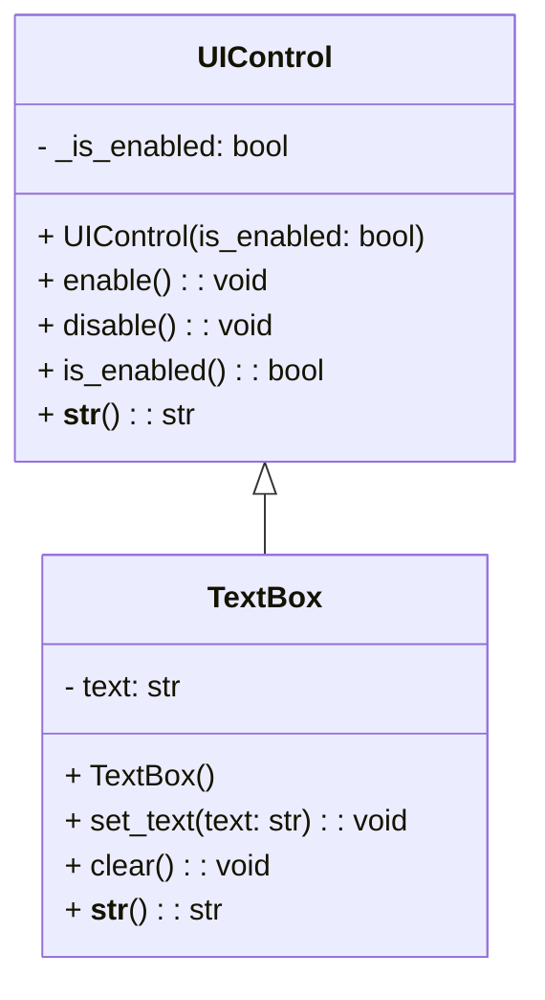

# 🔄 Method Overriding in Python

**Method overriding** is a fundamental concept in object-oriented programming where a subclass provides its own specific implementation of a method that’s already defined in its superclass. This enables subclasses to tailor or refine the behavior of inherited methods, leading to enhanced flexibility, customization, and maintainability in code.

---

## 📑 Table of Contents

1. [✨ What is Method Overriding?](#-what-is-method-overriding)
2. [💡 Benefits of Method Overriding](#-benefits-of-method-overriding)
3. [🛠️ Implementing Method Overriding in Python](#️-implementing-method-overriding-in-python)
4. [📘 Example with `UIControl` and `TextBox`](#-example-with-uicontrol-and-textbox)
5. [📜 Summary](#-summary)

---

### ✨ What is Method Overriding?

In Python, **method overriding** happens when a subclass provides its own implementation for a method that is already defined in its superclass. This allows objects of the subclass to execute the overridden method rather than the one from the superclass, enabling customization of inherited behavior.

---

### 💡 Benefits of Method Overriding

1. **Polymorphism**: Enables objects of different classes to be treated uniformly, which enhances code flexibility and readability.
2. **Customization**: Allows subclasses to tailor inherited methods to meet specific requirements, without altering the superclass.
3. **Extensibility**: Facilitates the extension of existing classes by refining or modifying behavior, promoting code reuse and maintainability.

---

### 🛠️ Implementing Method Overriding in Python

In the example provided, **method overriding** is demonstrated through a `TextBox` subclass that overrides the `__str__` method of its superclass, `UIControl`.

- **Superclass (`UIControl`)**:
  - Defines a `__str__` method to return a string representation of the object’s enabled status.
  - Includes other methods like `enable`, `disable`, and `is_enabled` to control and check the object's enabled state.

- **Subclass (`TextBox`)**:
  - Inherits from `UIControl`.
  - Overrides the `__str__` method to return the value of the `text` attribute instead of the enabled status.
  - Adds additional methods, such as `set_text` and `clear`, for manipulating the `text` attribute.

---

### 📘 Example with `UIControl` and `TextBox`

Here’s an example illustrating **method overriding** with comments to explain each part.

```python
class UIControl:
    def __init__(self, is_enabled=True):
        self._is_enabled = is_enabled

    def __str__(self):
        return str(self.is_enabled())  # Original string representation in UIControl

    def enable(self):
        self._is_enabled = True

    def disable(self):
        self._is_enabled = False

    def is_enabled(self):
        return self._is_enabled


class TextBox(UIControl):
    def __init__(self):
        super().__init__(True)  # Initializes TextBox with is_enabled set to True
        self.text = ""

    def __str__(self):
        return self.text  # Overrides __str__ to return text instead of is_enabled status

    def set_text(self, text):
        self.text = text

    def clear(self):
        self.text = ""


# Creating instances and demonstrating method overriding
control = UIControl()
print(str(control))  # Output: "True" (shows UIControl's is_enabled status)

textbox = TextBox()
textbox.set_text("Muhammad Hashim")
print(textbox)  # Output: "Muhammad Hashim" (shows TextBox's text attribute)
```

### Class Diagram:


#### Explanation

1. **Inheritance**: `TextBox` inherits all methods and attributes of `UIControl`.
2. **Overriding `__str__`**: The `TextBox` class overrides the `__str__` method from `UIControl`. Instead of showing the enabled status (as `UIControl` does), `TextBox` displays its `text` attribute.
3. **Polymorphism in Action**: When `print(textbox)` is called, Python invokes the overridden `__str__` method in `TextBox`, not the one in `UIControl`. This is a demonstration of polymorphic behavior, as `textbox` is treated according to its specific class.

---

### 📜 Summary

Method overriding is a powerful tool in Python that enhances flexibility, customization, and extensibility in object-oriented programming:

- **Polymorphism**: Allows consistent interfaces across classes.
- **Customization**: Enables subclasses to tailor inherited behavior.
- **Extensibility**: Promotes reusability and maintainability by refining behavior without modifying the superclass.

In this example, `TextBox` customizes its `__str__` method to display its `text` attribute, while still inheriting the general structure of `UIControl`. This demonstrates how method overriding can provide specific behavior for subclasses while retaining a shared interface.
