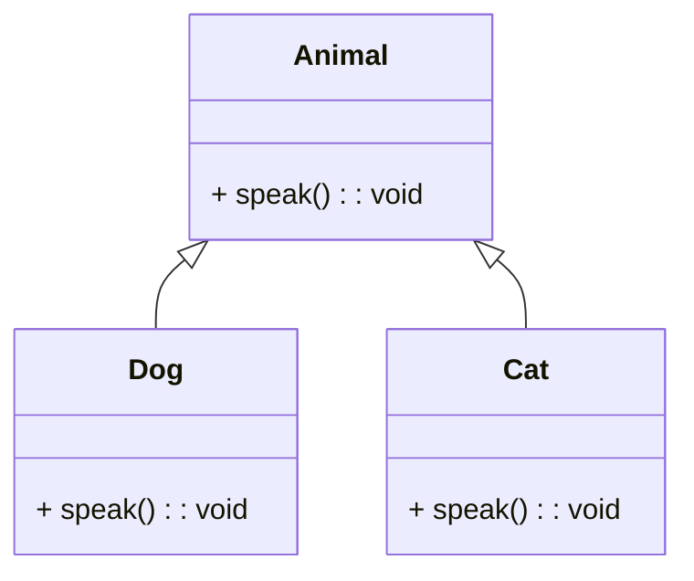
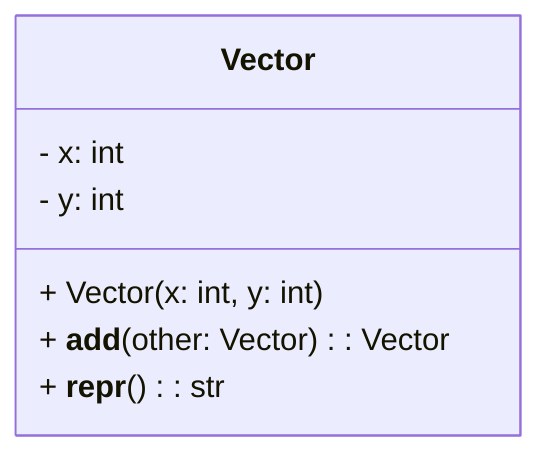
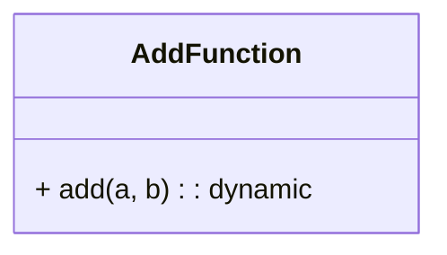
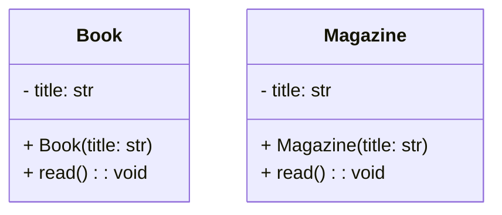
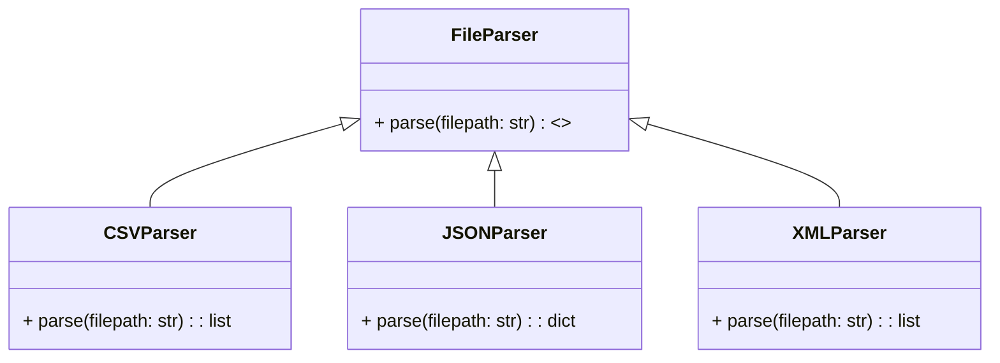

# 🐍 Polymorphism in Python

Welcome to this in-depth guide on **Polymorphism in Python**! In this guide, we’ll dive into what polymorphism is, its advantages, and how Python uses concepts like duck typing to implement polymorphism. We’ll explore practical examples and a real-world scenario on reading data from different file types. Let’s get started!

---

## 📚 Table of Contents

- [🐍 Polymorphism in Python](#-polymorphism-in-python)
  - [📚 Table of Contents](#-table-of-contents)
  - [🧩 Introduction to Polymorphism](#-introduction-to-polymorphism)
  - [🤔 Why Polymorphism is Useful in Python](#-why-polymorphism-is-useful-in-python)
  - [🐍 What Makes Python Polymorphic?](#-what-makes-python-polymorphic)
  - [🦆 Duck Typing and Polymorphism](#-duck-typing-and-polymorphism)
  - [📝 Polymorphism Examples in Python](#-polymorphism-examples-in-python)
    - [🚀 Method Overriding](#-method-overriding)
    - [➕ Operator Overloading](#-operator-overloading)
    - [🎛️ Polymorphic Functions](#️-polymorphic-functions)
    - [🦆 Duck Typing Example](#-duck-typing-example)
  - [🌐 Real-World Examples](#-real-world-examples)
    - [📄 File Handling with Different File Types](#-file-handling-with-different-file-types)
      - [Sample Data Files](#sample-data-files)
      - [File Parsers Implementation](#file-parsers-implementation)
      - [Explanation](#explanation)
  - [🎯 Conclusion](#-conclusion)
  - [📖 References](#-references)

---

## 🧩 Introduction to Polymorphism

**Polymorphism** is a core concept in object-oriented programming (OOP), enabling objects of different classes to be accessed through the same interface. Derived from Greek, *poly* (many) and *morph* (form), polymorphism represents "one interface, many implementations."

In OOP, polymorphism allows functions to operate on objects of different types and execute corresponding methods at runtime. This adaptability is essential for writing flexible and scalable code.

---

## 🤔 Why Polymorphism is Useful in Python

Polymorphism enhances code by making it:

- **Maintainable**: Generic functions and classes that operate across types simplify code maintenance.
- **Reusable**: Promotes the use of interfaces and abstract classes, creating reusable code components.
- **Extensible**: Enables easy expansion by adding new classes with common interfaces, enhancing code flexibility.

---

## 🐍 What Makes Python Polymorphic?

Python’s **dynamic typing** and **flexibility** inherently support polymorphism. Key features that make Python naturally polymorphic include:

- **Dynamic Typing**: Variables can refer to objects of any type at runtime.
- **Duck Typing**: Focuses on the methods an object has rather than the object’s specific class.
- **Method Overriding**: Allows subclasses to redefine methods from their superclasses.
- **Operator Overloading**: Supports customizing operators (`+`, `-`, `*`, etc.) for user-defined classes.

---

## 🦆 Duck Typing and Polymorphism

In Python, **duck typing** means that if an object has required methods, it’s treated as compatible, regardless of its class type. This concept aligns with the saying:

> "If it looks like a duck and quacks like a duck, it’s probably a duck."

With duck typing, an object’s type is less important than the methods it implements, making it a powerful form of polymorphism.

---

## 📝 Polymorphism Examples in Python

Let’s explore polymorphism in action through Python examples.

## Diagram



### 🚀 Method Overriding

_Method overriding_ is when a subclass redefines a method from its superclass.

```python
class Animal:
    def speak(self):
        print("The animal makes a sound")

class Dog(Animal):
    def speak(self):
        print("Woof!")

class Cat(Animal):
    def speak(self):
        print("Meow!")

# Demonstrate polymorphism
def animal_sound(animal):
    animal.speak()

dog = Dog()
cat = Cat()

animal_sound(dog)  # Output: Woof!
animal_sound(cat)  # Output: Meow!
```

**Explanation**: The `animal_sound` function works with any object having a `speak` method, showcasing polymorphism.

### ➕ Operator Overloading

_Operator overloading_ allows us to define custom behavior for operators with user-defined classes.

## Diagram


## Code
```python
class Vector:
    def __init__(self, x, y):
        self.x = x
        self.y = y

    def __add__(self, other):
        return Vector(self.x + other.x, self.y + other.y)

    def __repr__(self):
        return f"Vector({self.x}, {self.y})"

v1 = Vector(2, 4)
v2 = Vector(5, -1)
v3 = v1 + v2

print(v3)  # Output: Vector(7, 3)
```

**Explanation**: Here, `__add__` is overloaded to add two `Vector` instances, allowing the `+` operator to work with `Vector` objects.

### 🎛️ Polymorphic Functions

Functions in Python can handle various types of arguments due to polymorphism.

## Diagram


## Default Polymorphism
```python
def add(a, b):
    return a + b

print(add(5, 3))                   # Output: 8
print(add("Hello, ", "World!"))    # Output: Hello, World!
```

**Explanation**: The `add` function works with both numbers and strings due to polymorphism in the `+` operator.

### 🦆 Duck Typing Example

An example of duck typing, where the type of the object is less relevant than the methods it implements.

## Diagram


## Code 
```python
class Book:
    def __init__(self, title):
        self.title = title

    def read(self):
        print(f"You start reading '{self.title}'.")

class Magazine:
    def __init__(self, title):
        self.title = title

    def read(self):
        print(f"You flip through the magazine '{self.title}'.")

def start_reading(item):
    item.read()

book = Book("1984")
magazine = Magazine("National Geographic")

start_reading(book)       # Output: You start reading '1984'.
start_reading(magazine)   # Output: You flip through the magazine 'National Geographic'.
```

**Explanation**: The `start_reading` function works with any object having a `read` method, irrespective of its class.

---

## 🌐 Real-World Examples

Polymorphism is widely applied in real-world applications to improve flexibility and maintainability. Below, we illustrate file handling using polymorphism to work with different file types.

### Diagram


### 📄 File Handling with Different File Types

Imagine an app that reads data from CSV, JSON, and XML files. We can define a common interface and implement it differently for each file type.

#### Sample Data Files

**data.csv**
```csv
name,age,city,hobbies,passion,career
Muhammad Hashim,24,Islamabad,"Coffee, Mountain trips","Software Engineering","Python Instructor"
```

**data.json**
```json
[
  {"name": "Muhammad Hashim", "age": 24, "city": "Islamabad", "hobbies": ["Coffee", "Mountain trips"]}
]
```

**data.xml**
```xml
<people>
  <person>
    <name>Muhammad Hashim</name>
    <age>24</age>
    <city>Islamabad</city>
  </person>
</people>
```

#### File Parsers Implementation

```python
class FileParser:
    def parse(self, file_path):
        raise NotImplementedError("Subclasses should implement this method")


class CSVParser(FileParser):
    def parse(self, file):
        import csv
        print(f"Parsing CSV file: {file}")
        rows = []
        try:
            with open(file, 'r', encoding='utf-8') as f:
                reader = csv.DictReader(f)
                for row in reader:
                    rows.append(dict(row))
            return rows
        except Exception as e:
            print(f"Error parsing CSV file: {e}")
            return []  # ← return list, not None


class JSONParser(FileParser):
    def parse(self, filepath):
        import json
        print(f"Parsing JSON file: {filepath}")
        try:
            with open(filepath, 'r', encoding='utf-8') as file:
                data = json.load(file)
            # Normalize to list
            if isinstance(data, list):
                return data
            return [data]
        except Exception as e:
            print(f"Error parsing JSON file: {e}")
            return []


class XMLParser(FileParser):
    def parse(self, filepath):
        import xml.etree.ElementTree as ET

        print(f"Parsing XML file: {filepath}")
        data = []
        try:
            tree = ET.parse(filepath)
            root = tree.getroot()

            def _text(elem, default=None):
                return elem.text.strip() if (elem is not None and elem.text) else default

            for person in root.findall('person'):
                hobbies_parent = person.find('hobbies')
                hobbies = []
                if hobbies_parent is not None:
                    hobbies = [
                        _text(hobby, "")
                        for hobby in hobbies_parent.findall('hobby')
                        if _text(hobby) is not None
                    ]

                person_data = {
                    'name': _text(person.find('name'), ""),
                    'age': _text(person.find('age')),
                    'city': _text(person.find('city'), ""),
                    'hobbies': hobbies,
                    'passion': _text(person.find('passion')),
                    'career': _text(person.find('career')),
                }

                if person_data['age'] is not None:
                    try:
                        person_data['age'] = int(person_data['age'])
                    except ValueError:
                        pass

                data.append(person_data)

            return data
        except Exception as e:
            print(f"Error parsing XML file: {e}")
            return []


def process_file(parser, filepath):
    data = parser.parse(filepath) or []  # ensure iterable
    print(f"Processed data from {filepath}:")
    if not data:
        print("(no records)")
    else:
        for item in data:
            print(item)
    print('-' * 40)


parsers = [CSVParser(), JSONParser(), XMLParser()]
filepaths = ['data.csv', 'data.json', 'data.xml']

for parser, filepath in zip(parsers, filepaths):
    process_file(parser, filepath)

```

#### Explanation

- **CSVParser**: Parses CSV data into a list of dictionaries.
- **JSONParser**: Parses JSON data into a Python list.
- **XMLParser**: Parses XML data and extracts specific tags.

The `process_file` function works with any parser implementing the `parse` method, showcasing polymorphism.

---

## 🎯 Conclusion

Polymorphism in Python fosters flexibility and reuse by enabling functions to operate on objects with different types. The real-world file-handling example highlights polymorphism’s power, showcasing how code can be adapted to new file types with minimal changes.

---

## 📖 References

- Python Official Documentation on [Polymorphism](https://docs.python.org/3/tutorial/classes.html#polymorphism)
- [Real Python Guide to Polymorphism](https://realpython.com/) 
