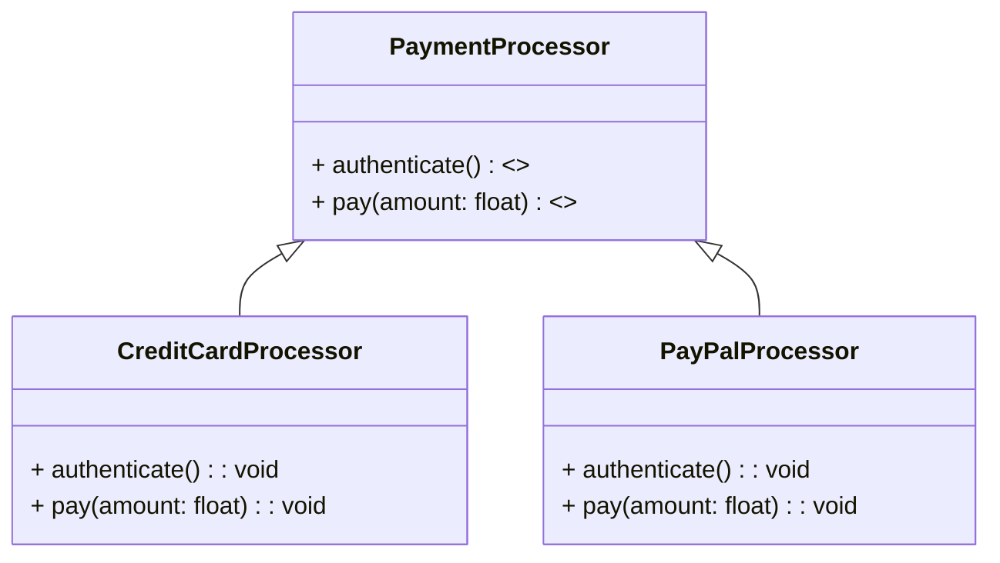
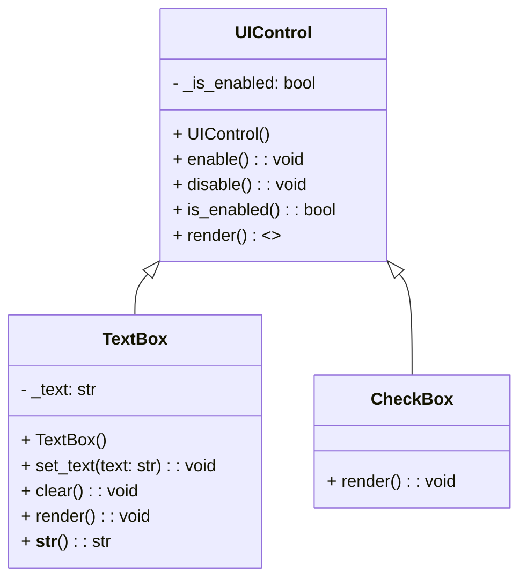

# 🐍 Abstract Base Classes (ABCs)

## 📑 Table of Contents

- [🐍 Abstract Base Classes (ABCs)](#-abstract-base-classes-abcs)
  - [📑 Table of Contents](#-table-of-contents)
  - [🎓 Introduction to Abstract Base Classes (ABCs)](#-introduction-to-abstract-base-classes-abcs)
  - [📚 What is an Abstract Class in Python?](#-what-is-an-abstract-class-in-python)
  - [🛠️ The `abc` Module and Metaclass](#️-the-abc-module-and-metaclass)
    - [🧬 Metaclass in `abc` (ABCMeta)](#-metaclass-in-abc-abcmeta)
    - [📝 The `@abstractmethod` Decorator](#-the-abstractmethod-decorator)
  - [🚫 The `NotImplementedError` Exception](#-the-notimplementederror-exception)
  - [🌍 Real-world Examples of Abstract Classes](#-real-world-examples-of-abstract-classes)
    - [💳 Example 1: Payment Processing System](#-example-1-payment-processing-system)
      - [Abstract Base Class](#abstract-base-class)
      - [Concrete Implementations](#concrete-implementations)
      - [Usage](#usage)
    - [🖥️ Example 2: UI Controls Framework](#️-example-2-ui-controls-framework)
      - [Abstract Base Class](#abstract-base-class-1)
      - [Concrete Implementations](#concrete-implementations-1)
      - [Usage](#usage-1)
  - [🎯 Conclusion](#-conclusion)


## 🎓 Introduction to Abstract Base Classes (ABCs)

Abstract Base Classes (ABCs) provide a way to define clear interfaces in Python. They are a structured way to declare methods that **must** be implemented by any subclass, ensuring consistency and encouraging good design in your code.

- **Purpose**: They enforce a “contract” between the base class and its derived classes.
- **Benefits**: By defining common methods across related classes, ABCs help maintainable and extensible code in large applications.


## 📚 What is an Abstract Class in Python?

An **abstract class** is a class that’s designed only to be inherited. It contains **abstract methods** (methods with declarations but no implementations). Any subclass of an abstract class must implement these abstract methods.

**Key Points:**

- **Cannot be Instantiated**: You cannot create an instance of an abstract class directly.
- **Enforce Consistency**: Abstract classes ensure that subclasses follow a specific structure.
- **Promote Code Reusability**: Abstract classes allow shared functionality across multiple classes.


## 🛠️ The `abc` Module and Metaclass

Python’s `abc` module provides the foundation for defining abstract base classes.

```python
from abc import ABC, abstractmethod
```

### 🧬 Metaclass in `abc` (ABCMeta)

- **Metaclass**: A class that defines the behavior of other classes.
- **`ABCMeta`**: The metaclass used by the `abc` module to create ABCs.
- **Inherit from `ABC`**: By inheriting from `ABC`, a class becomes abstract, setting the metaclass automatically to `ABCMeta`.

```python
from abc import ABC

class MyABC(ABC):
    pass
```

### 📝 The `@abstractmethod` Decorator

The `@abstractmethod` decorator is used to define methods that must be overridden in subclasses.

- **Requirement**: Subclasses must implement all abstract methods.
- **Prevents Instantiation**: If a subclass doesn’t implement all abstract methods, it becomes abstract and cannot be instantiated.

```python
class Animal(ABC):

    @abstractmethod
    def make_sound(self):
        pass
```

In this example, any subclass of `Animal` **must** implement the `make_sound` method.


## 🚫 The `NotImplementedError` Exception

**`NotImplementedError`** is useful when you want a method to be overridden in a subclass but don’t want to enforce it as abstract.

- **Usage**: Defines method stubs that subclasses should override.
- **Error Message**: Raising this exception provides a clear message when a subclass hasn’t implemented a required method.

```python
class Shape:

    def area(self):
        raise NotImplementedError("Subclass must implement this method")
```

**When to use**: Use `NotImplementedError` for methods that should be overridden in subclasses without strict enforcement through an abstract class.


## 🌍 Real-world Examples of Abstract Classes

Abstract classes shine in situations where multiple classes share a common structure but differ in specific behaviors. Let’s look at two examples:


### 💳 Example 1: Payment Processing System

A payment processing system needs to handle different payment methods like **Credit Cards** and **PayPal**. We want each payment method to have methods for **authentication** and **payment processing**.

### Payment Processing System Diagram


#### Abstract Base Class

```python
from abc import ABC, abstractmethod

class PaymentProcessor(ABC):

    @abstractmethod
    def authenticate(self):
        pass

    @abstractmethod
    def pay(self, amount):
        pass
```

#### Concrete Implementations

```python
class CreditCardProcessor(PaymentProcessor):

    def authenticate(self):
        print("Authenticating credit card...")

    def pay(self, amount):
        print(f"Processing credit card payment of ${amount}")

class PayPalProcessor(PaymentProcessor):

    def authenticate(self):
        print("Authenticating PayPal account...")

    def pay(self, amount):
        print(f"Processing PayPal payment of ${amount}")
```

#### Usage

```python
def process_payment(processor: PaymentProcessor, amount: float):
    processor.authenticate()
    processor.pay(amount)

processor = CreditCardProcessor()
process_payment(processor, 100.0)
```

**Explanation**:

- **PaymentProcessor**: Defines the required methods `authenticate` and `pay`.
- **CreditCardProcessor** and **PayPalProcessor**: Implement these methods with specific behaviors for each payment type.
- **Consistent Interface**: This enforces a consistent interface, allowing you to add other payment methods seamlessly.


### 🖥️ Example 2: UI Controls Framework

A UI framework has different UI controls like **TextBox** and **CheckBox**. Each UI control needs to define a method for **rendering** itself on the screen.

### UI Control Diagram


#### Abstract Base Class

```python
from abc import ABC, abstractmethod

class UIControl(ABC):
    def __init__(self):
        self._is_enabled = True

    @abstractmethod
    def render(self):
        pass

    def enable(self):
        self._is_enabled = True

    def disable(self):
        self._is_enabled = False

    def is_enabled(self):
        return self._is_enabled
```

**Explanation**:

- **`UIControl`**: Represents a generic UI control, with a mandatory `render` method.
- Includes concrete methods `enable`, `disable`, and `is_enabled` for common functionality.

#### Concrete Implementations

```python
class TextBox(UIControl):
    def __init__(self):
        super().__init__()
        self._text = ""

    def render(self):
        print("Render TextBox")

    def __str__(self):
        return self._text

    def set_text(self, text):
        self._text = text

    def clear(self):
        self._text = ""

class CheckBox(UIControl):
    def render(self):
        print("Render CheckBox")
```

#### Usage

```python
textbox = TextBox()
checkbox = CheckBox()

textbox.set_text("Hello, World!")
print(textbox)
textbox.render()
checkbox.render()
```

**Output**:

```
Hello, World!
Render TextBox
Render CheckBox
```

**Explanation**:

- Instances of **TextBox** and **CheckBox** implement `render`, creating a consistent interface across UI controls.
- This setup promotes polymorphism by allowing different controls to be managed under a single `UIControl` type.


## 🎯 Conclusion

Abstract Base Classes in Python offer a structured approach for enforcing that derived classes implement specific methods. They are invaluable for designing complex applications, particularly for:

1. **API Consistency**: By defining required methods, ABCs ensure all derived classes follow a specific structure.
2. **Code Reusability**: Define common behavior in abstract classes, reducing duplication in subclasses.
3. **Polymorphism**: Work with derived classes interchangeably, making code more flexible and easier to extend.


