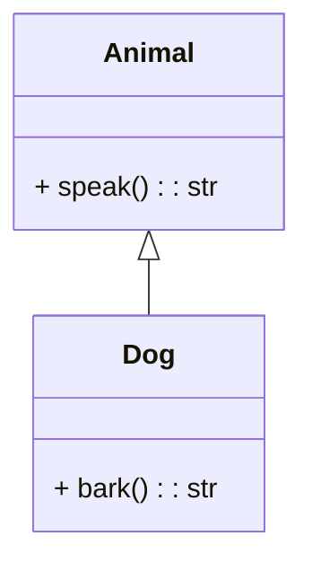
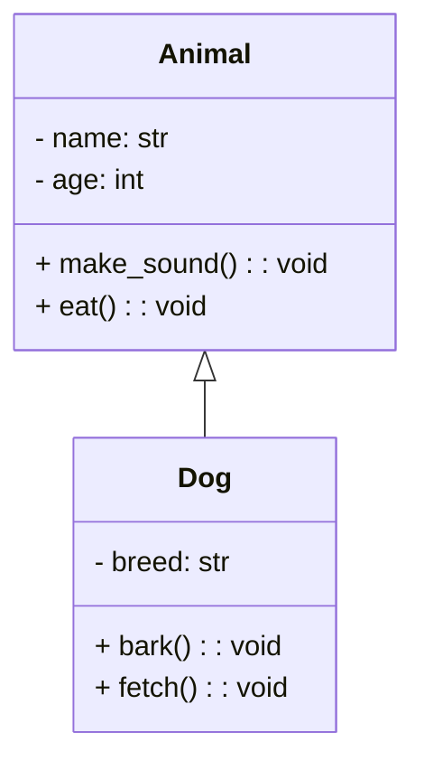
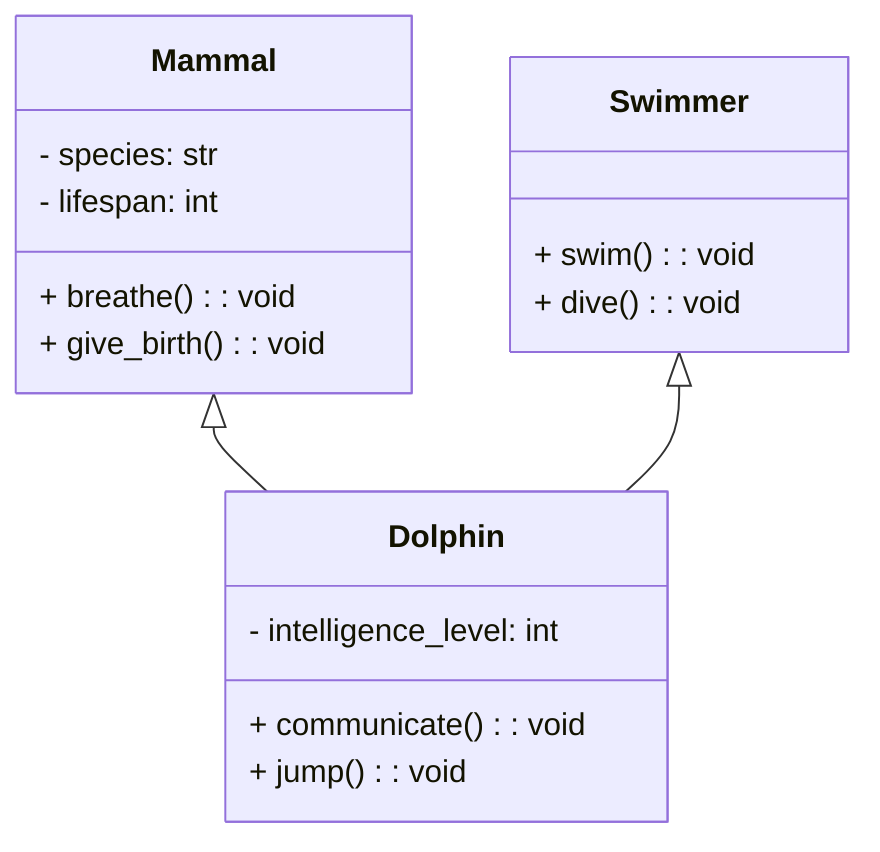
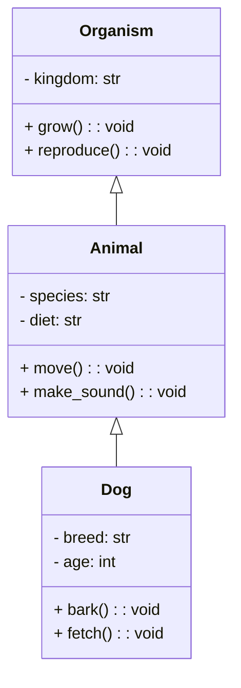
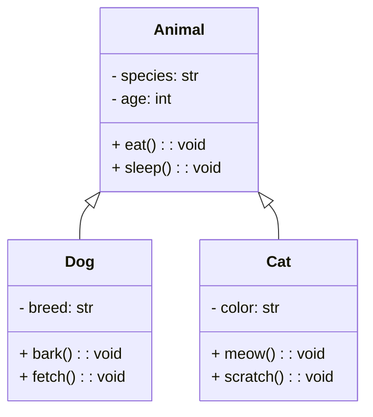

# 🐍 Inheritance in Python

Welcome to a comprehensive guide on **Inheritance in Python**! Inheritance is a fundamental concept in object-oriented programming (OOP) that enables a child class to acquire attributes and methods from a parent class. This not only helps organize code but also promotes reusability and modularity.

---

## 📑 Table of Contents

- [🐍 Inheritance in Python](#-inheritance-in-python)
  - [📑 Table of Contents](#-table-of-contents)
    - [📘 What is Inheritance?](#-what-is-inheritance)
      - [Example](#example)
    - [📝 Types of Inheritance](#-types-of-inheritance)
      - [Examples](#examples)
    - [💡 Inheritance in Django and FastAPI](#-inheritance-in-django-and-fastapi)
    - [🔍 The `super()` Method](#-the-super-method)
      - [Example](#example-1)
    - [🏗️ Constructor Overriding](#️-constructor-overriding)
      - [Example](#example-2)
    - [🔄 Method Overriding](#-method-overriding)
      - [Example](#example-3)
    - [➕ Operator Overloading](#-operator-overloading)
      - [Example](#example-4)
    - [🔗 Mixins in Inheritance](#-mixins-in-inheritance)
      - [Why Mixins are Useful](#why-mixins-are-useful)
      - [Example](#example-5)
    - [🌐 Multiple Inheritance and MRO](#-multiple-inheritance-and-mro)
      - [Example](#example-6)
    - [📜 Summary](#-summary)

---

### 📘 What is Inheritance?

Inheritance enables a **child class** to inherit attributes and methods from a **parent class**. It allows us to extend or customize the functionality of the parent class, fostering efficient code reuse.

###  Graphical Representation:




#### Example

```python
class Animal:
    def speak(self):
        return "Some sound"

class Dog(Animal):  # Dog inherits from Animal
    def bark(self):
        return "Woof!"

dog = Dog()
print(dog.speak())  # Output: Some sound
print(dog.bark())   # Output: Woof!
```

---

### 📝 Types of Inheritance

Python supports various types of inheritance structures:

1. **Single Inheritance**: Inherits from one parent class.
2. **Multiple Inheritance**: Inherits from multiple parent classes.
3. **Multilevel Inheritance**: A chain of inheritance where each class inherits from the one above.
4. **Hierarchical Inheritance**: Multiple child classes inherit from a single parent class.
5. **Hybrid Inheritance**: A combination of the above inheritance types.

#### Examples

###  Single Inheritance:


###  Multiple  Inheritance:


# Multilevel Inheritance


# Hierarchical Inheritance


### 💡 Inheritance in Django and FastAPI

In popular Python libraries like Django and FastAPI, **Single Inheritance** and **Mixins** are frequently used:

- **Single Inheritance**: Keeps code structure straightforward and easy to manage.
- **Mixins**: Add extra functionality without disturbing the main inheritance hierarchy, making the code more modular and reusable.

---

### 🔍 The `super()` Method

The `super()` function in Python is used to call methods from a **parent class** within a **child class**. It is particularly useful for constructor inheritance and method overriding.

#### Example

```python
class Animal:
    def __init__(self, name):
        self.name = name

class Dog(Animal):
    def __init__(self, name, breed):
        super().__init__(name)  # Calls the parent class constructor
        self.breed = breed

dog = Dog("Buddy", "Golden Retriever")
print(dog.name)   # Output: Buddy
print(dog.breed)  # Output: Golden Retriever
```

---

### 🏗️ Constructor Overriding

**Constructor overriding** occurs when a child class provides its own version of the constructor (`__init__`), which replaces the parent’s constructor.

#### Example

```python
class Animal:
    def __init__(self, species):
        self.species = species

class Dog(Animal):
    def __init__(self, species, name):
        super().__init__(species)  # Calls parent constructor
        self.name = name

dog = Dog("Mammal", "Rex")
print(dog.species)  # Output: Mammal
print(dog.name)     # Output: Rex
```

---

### 🔄 Method Overriding

**Method overriding** allows a child class to provide a specific implementation of a method that’s already defined in its parent class.

#### Example

```python
class Animal:
    def sound(self):
        return "Some sound"

class Dog(Animal):
    def sound(self):  # Overrides the parent class method
        return "Woof!"

dog = Dog()
print(dog.sound())  # Output: Woof!
```

---

### ➕ Operator Overloading

**Operator overloading** lets you define custom behavior for operators in your classes. In Python, this is achieved by implementing special methods like `__add__`, `__sub__`, etc.

#### Example

```python
class Vector:
    def __init__(self, x, y):
        self.x = x
        self.y = y

    def __add__(self, other):
        return Vector(self.x + other.x, self.y + other.y)

v1 = Vector(1, 2)
v2 = Vector(3, 4)
v3 = v1 + v2  # Uses the __add__ method
print(v3.x, v3.y)  # Output: 4, 6
```

---

### 🔗 Mixins in Inheritance

**Mixins** are classes that provide additional functionality, designed to be used alongside primary classes but not as standalone classes. They’re widely used in frameworks like Django.

#### Why Mixins are Useful

Mixins allow for **modular code** by enabling you to add functionality to classes without creating deep inheritance hierarchies. This helps in keeping code simple and reusable.

#### Example

```python
class WalkMixin:
    def walk(self):
        return "Walking"

class Animal:
    pass

class Dog(Animal, WalkMixin):  # Inherits from both Animal and WalkMixin
    pass

dog = Dog()
print(dog.walk())  # Output: Walking
```

---

### 🌐 Multiple Inheritance and MRO

In Python, **Multiple Inheritance** uses the **Method Resolution Order (MRO)** to determine the order in which classes are inherited. The **C3 Linearization** algorithm handles this, following a **Depth-First, Left-to-Right** rule.

#### Example

```python
class A:
    def do_something(self):
        print("A")

class B(A):
    def do_something(self):
        print("B")
        super().do_something()

class C(A):
    def do_something(self):
        print("C")
        super().do_something()

class D(B, C):
    def do_something(self):
        print("D")
        super().do_something()

d = D()
d.do_something()  # Output: D B C A
```

- **Explanation**: MRO dictates the order as `D -> B -> C -> A`, ensuring each method is called in a predictable sequence.

---

### 📜 Summary

- **Inheritance**: Enables a child class to reuse attributes and methods from a parent class, promoting efficient code reuse.
- **Types of Inheritance**: Single, Multiple, Multilevel, Hierarchical, and Hybrid.
- **`super()` Method**: Allows a child class to call a method from its parent class.
- **Constructor Overriding**: A child class redefines the parent class’s constructor.
- **Method Overriding**: A child class redefines a method from the parent class.
- **Operator Overloading**: Enables custom behavior for operators.
- **Mixins**: Add modular functionality without affecting primary inheritance.
- **Multiple Inheritance and MRO**: MRO controls the inheritance sequence using the C3 Linearization algorithm.
