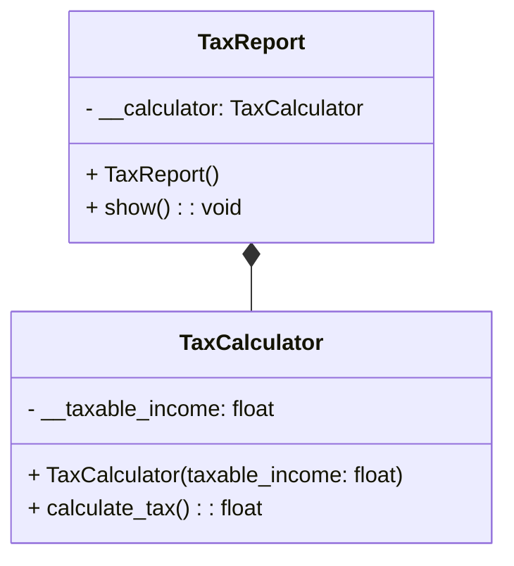

# Tight Coupling in Code: A Deep Dive 💡

This guide provides a comprehensive look into **tightly coupled code**, focusing on a `TaxCalculator` and `TaxReport` class example. We’ll break down the code line-by-line to understand why it’s tightly coupled, its implications, and potential drawbacks. Finally, we’ll explore how to refactor for **looser coupling** to improve flexibility and maintainability. 🛠️

## 📖 Table of Contents

- [Tight Coupling in Code: A Deep Dive 💡](#tight-coupling-in-code-a-deep-dive-)
  - [📖 Table of Contents](#-table-of-contents)
  - [🔍 Code Explanation](#-code-explanation)
    - [Class `TaxCalculator`](#class-taxcalculator)
    - [Class `TaxReport`](#class-taxreport)
    - [Creating and Using the Report](#creating-and-using-the-report)
  - [🔗 What is Tight Coupling?](#-what-is-tight-coupling)
  - [🚧 Drawbacks of Tight Coupling](#-drawbacks-of-tight-coupling)
  - [📜 Summary](#-summary)

## 🔗 What is Tight Coupling?

In object-oriented programming, **coupling** refers to the level of dependency between classes. **Tight coupling** occurs when one class depends heavily on another, making it hard to change one class without affecting the other.

## Diagraam


## Code
```python
class TaxCalculator:
    def __init__(self, taxable_income: float):
        self.__taxable_income = taxable_income

    def calculate_tax(self) -> float:
        return self.__taxable_income * 0.3

class TaxReport:
    def __init__(self):
        self.__calculator = TaxCalculator(1000000)

    def show(self):
        tax = self.__calculator.calculate_tax()
        print(tax)

# Create an instance of TaxReport and show the tax
report = TaxReport()
report.show()
```

## 🔍 Code Explanation

### Class `TaxCalculator`

The `TaxCalculator` class is responsible for calculating tax based on a given income.

1. **Initialization**:
   ```python
   class TaxCalculator:
       def __init__(self, taxable_income: float):
           self.__taxable_income = taxable_income
   ```
   - The `TaxCalculator` class’s constructor initializes the `taxable_income` attribute, which is stored as a private attribute (`self.__taxable_income`). Private attributes are prefixed with double underscores to restrict external access.

2. **Calculate Tax**:
   ```python
       def calculate_tax(self) -> float:
           return self.__taxable_income * 0.3
   ```
   - The `calculate_tax` method computes the tax by multiplying `taxable_income` by a fixed rate (30%).

### Class `TaxReport`

The `TaxReport` class is responsible for generating and showing tax reports. It depends on `TaxCalculator` for calculating the tax amount.

1. **Initialization**:
   ```python
   class TaxReport:
       def __init__(self):
           self.__calculator = TaxCalculator(1000000)
   ```
   - The `TaxReport` class’s constructor creates an instance of `TaxCalculator` with a fixed income of `1,000,000`. This calculator instance is stored as a private attribute (`self.__calculator`).

2. **Show Tax**:
   ```python
       def show(self):
           tax = self.__calculator.calculate_tax()
           print(tax)
   ```
   - The `show` method uses the `calculate_tax` method of `TaxCalculator` to compute the tax, then prints the calculated value.

### Creating and Using the Report

1. **Instance Creation and Showing Tax**:
   ```python
   report = TaxReport()
   report.show()
   ```
   - An instance of `TaxReport` is created, and `show` is called to display the calculated tax.

In this example:
- The `TaxReport` class is tightly coupled with `TaxCalculator` because it **directly creates an instance** of `TaxCalculator`.
- **Hardcoded dependency**: `TaxReport` requires a specific `TaxCalculator` class, and the `taxable_income` is set to a fixed value of `1,000,000` within the class itself.

This makes the `TaxReport` class inflexible and hard to extend, as it cannot use different tax calculators without modifying the existing code.

## 🚧 Drawbacks of Tight Coupling

1. **Limited Flexibility**:
   - Since `TaxReport` directly instantiates `TaxCalculator`, switching to a different tax calculation method requires changes in `TaxReport`.

2. **Reduced Testability**:
   - Testing `TaxReport` in isolation is challenging, as you need to involve `TaxCalculator`. This increases the scope of testing and makes unit tests less focused.

3. **Harder to Maintain**:
   - Changing the `TaxCalculator` implementation may break the `TaxReport` class, leading to frequent modifications in both classes.

4. **Difficulty in Extending**:
   - Adding new tax calculators (e.g., a different tax rate or method) would require modifying `TaxReport` each time.

## 📜 Summary

Tight coupling often leads to rigid and hard-to-maintain code, where changing one class necessitates changes in another. Through **Dependency Injection** and **Interface Abstraction**, we can refactor code to be **loosely coupled**, making it more flexible, extensible, and testable. This approach reduces dependencies, leading to more modular and maintainable code structures. 
