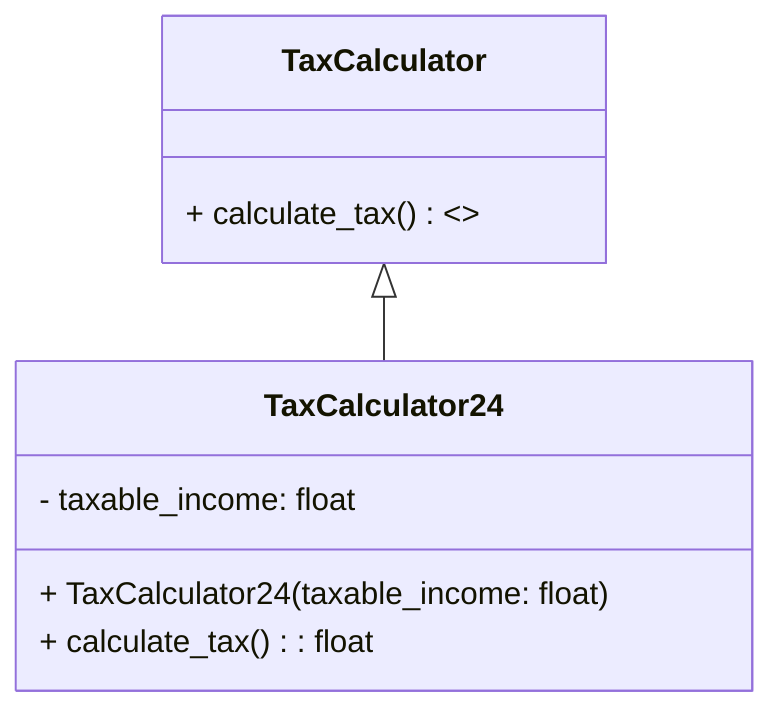

# 🌟 Creating Interfaces in Python

### Learn how to create and use interfaces in Python for more flexible, maintainable, and modular code! 🐍

## 📖 Table of Contents

- [🌟 Creating Interfaces in Python](#-creating-interfaces-in-python)
    - [Learn how to create and use interfaces in Python for more flexible, maintainable, and modular code! 🐍](#learn-how-to-create-and-use-interfaces-in-python-for-more-flexible-maintainable-and-modular-code-)
  - [📖 Table of Contents](#-table-of-contents)
  - [📝 What are Interfaces?](#-what-are-interfaces)
  - [🌟 Why Use Interfaces?](#-why-use-interfaces)
  - [🛠️ Creating an Interface in Python](#️-creating-an-interface-in-python)
    - [1️⃣ Define an Abstract Base Class (ABC)](#1️⃣-define-an-abstract-base-class-abc)
    - [2️⃣ Implement the Abstract Base Class](#2️⃣-implement-the-abstract-base-class)
  - [✨ Benefits of Using Interfaces](#-benefits-of-using-interfaces)
  - [📝 Full Example Code](#-full-example-code)
  - [🎯 Conclusion](#-conclusion)

## 📝 What are Interfaces?

An interface is a contract that specifies a set of methods a class must implement, but without defining how these methods should work. In Python, interfaces are created using abstract base classes (ABCs) and the `@abstractmethod` decorator.

For instance, if you want multiple tax calculators with different calculations, you could define a `TaxCalculator` interface that outlines a `calculate_tax` method. Each specific calculator then implements this method according to its own logic, making it easy to switch between different tax calculation behaviors.. 🌐

## 🌟 Why Use Interfaces?

Interfaces provide several key benefits for software design:

1. **Abstraction**: They help you separate the "what" from the "how."
2. **Multiple Inheritance**: Simulate multiple inheritance in languages that don't support it natively.
3. **Flexibility**: Add new implementations with minimal changes.
4. **Decoupling**: Reduce interdependencies between code components.
5. **Design Patterns**: They are integral to many design patterns for flexible coding structures.

## 🛠️ Creating an Interface in Python

### 1️⃣ Define an Abstract Base Class (ABC)

We’ll create an abstract class using the `ABC` module. This class will serve as our interface.

```python
from abc import ABC, abstractmethod

class TaxCalculator(ABC):
    @abstractmethod
    def calculate_tax(self) -> float:
        pass
```

### 2️⃣ Implement the Abstract Base Class

Next, let’s implement the interface with different classes representing various tax calculations.

```python
class TaxCalculator24(TaxCalculator):
    def __init__(self, taxable_income: float):
        self.taxable_income = taxable_income

    def calculate_tax(self) -> float:
        return self.taxable_income * 0.3
```

## ✨ Benefits of Using Interfaces

Interfaces help with:

- **Modularity**: Makes the codebase more organized.
- **Reusability**: Classes following the same interface can be reused more effectively.
- **Testability**: Easy to mock and test individual components.
- **Scalability**: New implementations can be added without disrupting existing code.

## 📝 Full Example Code

Here’s how to implement and use interfaces in a full Python example:

```python
from abc import ABC, abstractmethod

class TaxCalculator(ABC):
    @abstractmethod
    def calculate_tax(self) -> float:
        pass

class TaxCalculator24(TaxCalculator):
    def __init__(self, taxable_income: float):
        self.taxable_income = taxable_income

    def calculate_tax(self) -> float:
        return self.taxable_income * 0.3

def display_tax(calculator: TaxCalculator):
    print(f"Calculated Tax: {calculator.calculate_tax()}")

income = 100000
calculator_24 = TaxCalculator24(income)
display_tax(calculator_24)  # Output: Calculated Tax based on 30%
```

## Diagram:


## 🎯 Conclusion

Using interfaces enables flexible, modular, and reusable code. By defining abstract methods and creating multiple implementations, you can write code that’s both adaptable and easy to maintain! 🎉
