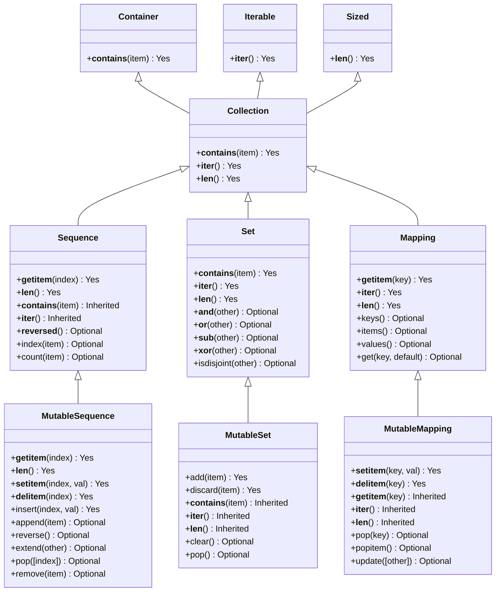

# 🅰️ Mastering Abstract Base Classes (ABCs) in Python 🎨

Welcome to this guide on **Abstract Base Classes (ABCs)** in Python! 🎉 Here, you’ll learn to create strong interfaces, enforce method implementation, and structure your code for consistency and maintainability. We’ll go over real-world examples, benefits, and best practices for leveraging ABCs in Python. Let’s jump in! 🚀

## 📚 Table of Contents

- [🅰️ Mastering Abstract Base Classes (ABCs) in Python 🎨](#️-mastering-abstract-base-classes-abcs-in-python-)
  - [📚 Table of Contents](#-table-of-contents)
  - [📖 Introduction](#-introduction)
  - [🛠️ What Are Abstract Base Classes (ABCs)?](#️-what-are-abstract-base-classes-abcs)
    - [Overview](#overview)
      - [🔑 Key Characteristics:](#-key-characteristics)
    - [🎯 Why Use ABCs?](#-why-use-abcs)
      - [Basic Syntax](#basic-syntax)
    - [📋 Collection ABCs and Their Methods](#-collection-abcs-and-their-methods)
  - [🔍 Real-World Examples](#-real-world-examples)
    - [1. Read-Only List 📜](#1-read-only-list-)
      - [Step 1: Subclass `collections.abc.Sequence`](#step-1-subclass-collectionsabcsequence)
      - [Explanation](#explanation)
      - [Step 2: Using `ReadOnlyList`](#step-2-using-readonlylist)
    - [2. Case-Insensitive Dictionary 📑](#2-case-insensitive-dictionary-)
      - [Step 1: Subclass `collections.abc.MutableMapping`](#step-1-subclass-collectionsabcmutablemapping)
      - [Explanation](#explanation-1)
      - [Step 2: Using `CaseInsensitiveDict`](#step-2-using-caseinsensitivedict)
    - [3. Logging Iterable 📝](#3-logging-iterable-)
      - [Step 1: Subclass `collections.abc.Iterable`](#step-1-subclass-collectionsabciterable)
      - [Explanation](#explanation-2)
      - [Step 2: Using `LoggingIterable`](#step-2-using-loggingiterable)
  - [🎯 Benefits of Using ABCs](#-benefits-of-using-abcs)
  - [⚠️ Important Consider](#️-important-consider)
  - [🏆 Best Practices](#-best-practices)
  - [🎯 Conclusion 🎯](#-conclusion-)
  - [🌈 Additional Resources](#-additional-resources)

---

## 📖 Introduction

**Abstract Base Classes (ABCs)** in Python act as templates or blueprints for other classes. They define a consistent interface across your code, enforcing subclasses to implement specific methods. With ABCs, you ensure reliable, reusable, and well-organized code, making it easier to maintain and scale projects. 🌟

ABCs can be incredibly useful when working on systems that require uniform structure across components, such as custom collections. Let’s explore how to use ABCs effectively with real-world examples and engaging explanations. 🔒

## 🛠️ What Are Abstract Base Classes (ABCs)?

### Overview

**ABCs** provide a way to enforce that certain methods and properties are present in subclasses. Think of ABCs as contracts: subclasses agree to implement specific methods to ensure consistent behavior.

#### 🔑 Key Characteristics:

- **Non-Instantiable**: ABCs serve as blueprints and cannot be directly instantiated.
- **Method Enforcer**: ABCs define abstract methods that subclasses **must** implement.
- **Supports Polymorphism**: Enables different classes to be treated the same based on a common ABC.
- **Allows Concrete Methods**: ABCs can include default methods shared across subclasses.

### 🎯 Why Use ABCs?

ABCs are valuable when creating multiple classes that follow a common pattern but differ in implementation. They encourage consistent interfaces, reduce duplicate code, and catch missing implementations early on. 🔍

#### Basic Syntax

Define an ABC using `ABC` from Python's `abc` module:

```python
from collections.abc import ABC, abstractmethod

class MyABC(ABC):
    @abstractmethod
    def my_method(self):
        pass
```

Here, `my_method` is an abstract method that any subclass of `MyABC` **must** implement.

### Collections ABCs Classes Diagram


### 📋 Collection ABCs and Their Methods

| **ABC Class**         | **Method**               | **Description**                                                                                                                                                       | **Required?** |
|-----------------------|--------------------------|-----------------------------------------------------------------------------------------------------------------------------------------------------------------------|---------------|
| **Container**         | `__contains__(item)`     | Checks if the collection contains a specific item.                                                                                                                    | Yes           |
| **Iterable**          | `__iter__()`             | Returns an iterator over the collection’s items.                                                                                                                      | Yes           |
| **Sized**             | `__len__()`              | Returns the number of items in the collection.                                                                                                                        | Yes           |
| **Collection**        | `__contains__(item)`     | Checks if a specific item is in the collection.                                                                                                                       | Yes           |
|                       | `__iter__()`             | Returns an iterator over the items in the collection.                                                                                                                 | Yes           |
|                       | `__len__()`              | Returns the count of items in the collection.                                                                                                                         | Yes           |
| **Sequence**          | `__getitem__(index)`     | Returns the item at a specified index or allows slicing.                                                                                                              | Yes           |
|                       | `__len__()`              | Returns the number of items in the sequence.                                                                                                                          | Yes           |
|                       | `__contains__(item)`     | Checks if the item exists in the sequence.                                                                                                                            | Inherited     |
|                       | `__iter__()`             | Returns an iterator over items.                                                                                                                                       | Inherited     |
|                       | `__reversed__()`         | Returns a reverse iterator over items.                                                                                                                                | Optional      |
|                       | `index(item)`            | Finds the index of a specified item.                                                                                                                                  | Optional      |
|                       | `count(item)`            | Counts occurrences of a specific item.                                                                                                                                | Optional      |
| **MutableSequence**   | `__getitem__(index)`     | Returns the item at the given index.                                                                                                                                  | Yes           |
|                       | `__len__()`              | Returns the sequence’s length.                                                                                                                                        | Yes           |
|                       | `__setitem__(index, val)`| Sets the value at a specified index.                                                                                                                                  | Yes           |
|                       | `__delitem__(index)`     | Deletes the item at a specified index.                                                                                                                                | Yes           |
|                       | `insert(index, val)`     | Inserts a value at a specified index.                                                                                                                                 | Yes           |
|                       | `append(item)`           | Appends an item to the end of the sequence.                                                                                                                           | Optional      |
|                       | `reverse()`              | Reverses items in place.                                                                                                                                              | Optional      |
|                       | `extend(other)`          | Extends the sequence by appending elements from another iterable.                                                                                                     | Optional      |
|                       | `pop([index])`           | Removes and returns the item at the specified index or last item if index is omitted.                                                                                 | Optional      |
|                       | `remove(item)`           | Removes the first occurrence of a specified item.                                                                                                                     | Optional      |
| **Set**               | `__contains__(item)`     | Checks if the item is in the set.                                                                                                                                     | Yes           |
|                       | `__iter__()`             | Returns an iterator over items.                                                                                                                                       | Yes           |
|                       | `__len__()`              | Returns the number of items.                                                                                                                                          | Yes           |
|                       | `__and__(other)`         | Returns the intersection of two sets.                                                                                                                                 | Optional      |
|                       | `__or__(other)`          | Returns the union of two sets.                                                                                                                                        | Optional      |
|                       | `__sub__(other)`         | Returns the difference between two sets.                                                                                                                              | Optional      |
|                       | `__xor__(other)`         | Returns the symmetric difference of two sets.                                                                                                                         | Optional      |
|                       | `isdisjoint(other)`      | Checks if the set is disjoint with another set.                                                                                                                       | Optional      |
| **MutableSet**        | `add(item)`              | Adds an item to the set.                                                                                                                                              | Yes           |
|                       | `discard(item)`          | Removes an item from the set if it exists.                                                                                                                            | Yes           |
|                       | `__contains__(item)`     | Checks for the item in the set.                                                                                                                                       | Inherited     |
|                       | `__iter__()`             | Returns an iterator over items.                                                                                                                                       | Inherited     |
|                       | `__len__()`              | Returns the count of items.                                                                                                                                           | Inherited     |
|                       | `clear()`                | Removes all items from the set.                                                                                                                                       | Optional      |
|                       | `pop()`                  | Removes and returns an arbitrary item from the set.                                                                                                                   | Optional      |
| **Mapping**           | `__getitem__(key)`       | Returns the value for a given key.                                                                                                                                    | Yes           |
|                       | `__iter__()`             | Returns an iterator over keys.                                                                                                                                        | Yes           |
|                       | `__len__()`              | Returns the number of key-value pairs.                                                                                                                                | Yes           |
|                       | `keys()`                 | Returns a view of the mapping’s keys.                                                                                                                                 | Optional      |
|                       | `items()`                | Returns a view of the mapping’s items (key-value pairs).                                                                                                              | Optional      |
|                       | `values()`               | Returns a view of the mapping’s values.                                                                                                                               | Optional      |
|                       | `get(key, default)`      | Returns the value for a key if found, else returns a default value.                                                                                                   | Optional      |
| **MutableMapping**    | `__setitem__(key, val)`  | Sets a key-value pair.                                                                                                                                                | Yes           |
|                       | `__delitem__(key)`       | Deletes a key-value pair by key.                                                                                                                                      | Yes           |
|                       | `__getitem__(key)`       | Gets a value for a key.                                                                                                                                               | Inherited     |
|                       | `__iter__()`             | Returns an iterator over keys.                                                                                                                                        | Inherited     |
|                       | `__len__()`              | Returns the count of items (key-value pairs).                                                                                                                         | Inherited     |
|                       | `pop(key)`               | Removes and returns the value for a key if it exists.                                                                                                                 | Optional      |
|                       | `popitem()`              | Removes and returns an arbitrary key-value pair.                                                                                                                      | Optional      |
|                       | `update([other])`        | Updates the mapping with items from another mapping or iterable of key-value pairs.                                                                                   | Optional      |

---


## 🔍 Real-World Examples

Let’s dive into three hands-on examples to demonstrate how to use ABCs effectively in Python.

### 1. Read-Only List 📜

Imagine needing a list that users can view but not modify—ideal for read-only configurations or static datasets.

#### Step 1: Subclass `collections.abc.Sequence`

The `Sequence` ABC enforces list-like behavior, such as indexing, length retrieval, and read-only access.

```python
import collections.abc
from typing import Any, Iterator

class ReadOnlyList(collections.abc.Sequence):
    def __init__(self, data: list[Any]):
        self._data = list(data)  # Make a copy to ensure immutability

    def __getitem__(self, index) -> Any:
        return self._data[index]

    def __len__(self) -> int:
        return len(self._data)

    def __repr__(self) -> str:
        return f"{self.__class__.__name__}({self._data})"
```

#### Explanation

- **`__init__`**: Initializes a copy of the provided data to prevent external modification.
- **`__getitem__`**: Enables read-only access to items by index.
- **`__len__`**: Returns the count of items.
- **`__repr__`**: Provides a human-readable string representation.

#### Step 2: Using `ReadOnlyList`

```python
original_list = [1, 2, 3, 4, 5]
read_only = ReadOnlyList(original_list)

print(read_only)          # Output: ReadOnlyList([1, 2, 3, 4, 5])
print(read_only[2])       # Output: 3
print(len(read_only))     # Output: 5

# Attempting to modify will raise an error
try:
    read_only.append(6)
except AttributeError as e:
    print(e)  # Output: 'ReadOnlyList' object has no attribute 'append'
```

**Benefits**:
- **Immutable Data**: The `ReadOnlyList` restricts modification after creation.
- **Standard Sequence Behavior**: Compatible with typical list-based operations in Python.

### 2. Case-Insensitive Dictionary 📑

For applications like HTTP headers, case-insensitive keys (e.g., `"Content-Type"` vs `"content-type"`) ensure consistency.

#### Step 1: Subclass `collections.abc.MutableMapping`

The `MutableMapping` ABC enforces standard dictionary-like methods, such as `__getitem__`, `__setitem__`, and `__delitem__`.

```python
import collections.abc
from typing import Any, Iterator

class CaseInsensitiveDict(collections.abc.MutableMapping):
    def __init__(self, data: dict[str, Any] = None):
        self._store = {}
        if data:
            for key, value in data.items():
                self[key] = value  # Store keys in lowercase

    def __setitem__(self, key: str, value: Any):
        self._store[key.lower()] = (key, value)  # Store with original case

    def __getitem__(self, key: str) -> Any:
        return self._store[key.lower()][1]

    def __delitem__(self, key: str):
        del self._store[key.lower()]

    def __iter__(self) -> Iterator[str]:
        return (original_key for original_key, _ in self._store.values())

    def __len__(self) -> int:
        return len(self._store)

    def __repr__(self) -> str:
        return f"{self.__class__.__name__}({{k: v for k, v in self.items()}})"
```

#### Explanation

- **`__setitem__`**: Stores keys in lowercase for case insensitivity.
- **`__getitem__`** & **`__delitem__`**: Retrieve or delete items using lowercase keys.
- **`__repr__`**: Displays keys with original case for clarity.

#### Step 2: Using `CaseInsensitiveDict`

```python
headers = CaseInsensitiveDict({"Content-Type": "application/json", "Accept": "application/json"})
print(headers["content-type"])  # Output: application/json
print(headers["ACCEPT"])        # Output: application/json
```

**Benefits**:
- **Case-Insensitive Access**: Treats keys the same regardless of case.
- **Original Key Preservation**: Keeps the original casing for display.

### 3. Logging Iterable 📝

This **Logging Iterable** logs each item as it’s accessed, useful for debugging or monitoring data pipelines.

#### Step 1: Subclass `collections.abc.Iterable`

The `Iterable` ABC defines `__iter__`, allowing for `for` loop usage.

```python
import collections.abc
from typing import Any, Iterator

class LoggingIterable(collections.abc.Iterable):
    def __init__(self, data: list[Any]):
        self._data = data

    def __iter__(self) -> Iterator[Any]:
        for item in self._data:
            self.log(item)
            yield item

    def log(self, item: Any):
        print(f"Logging item: {item}")
```

#### Explanation

- **`__init__`**: Stores data for iteration.
- **`__iter__`**: Iterates over items, logging each as it’s accessed.
- **`log`**: Simple method to print/log items (expandable to use Python's logging framework).

#### Step 2: Using `LoggingIterable`

```python
data = [10, 20, 30]
logging_iterable = LoggingIterable(data)

for number in logging_iterable:
    print(f"Processed number: {number}")
```

**Benefits**:
- **Real-Time Logging**: Automatically logs each item during iteration.
- **Seamless Integration**: Compatible with standard Python iteration.

## 🎯 Benefits of Using ABCs

1. **Consistent Interfaces**: Ensures subclasses implement required methods.
2. **Reusable Code**: Defines common behavior, reducing code duplication.
3. **Supports Polymorphism**: Different classes can share a common interface.
4. **Improved Organization**: Centralizes method requirements, making code easier to maintain.
5. **Static Verification**: Type checkers can catch missing implementations, minimizing runtime errors.

## ⚠️ Important Consider

ations

- **No Built-In Storage**: ABCs don’t manage data storage; that’s left to subclasses.
- **Implementation Requirement**: Missing abstract methods trigger `TypeError` at instantiation.
- **Potential Overhead**: Extra complexity may impact performance in critical applications.
- **Runtime Limitations**: ABCs enforce methods but don’t enforce data types at runtime.

## 🏆 Best Practices

1. **Define Consistent Interfaces** using ABCs for structured, predictable code.
2. **Combine with Generics** for type safety and flexibility.
3. **Document Thoroughly** to aid comprehension and correct usage.
4. **Keep Implementations Simple** for ease of understanding and debugging.
5. **Use Static Type Checking** to verify compliance and catch issues early.

## 🎯 Conclusion 🎯

ABCs offer a powerful, structured approach to Python programming, creating reliable, maintainable, and organized code. By using ABCs like **Read-Only Lists**, **Case-Insensitive Dictionaries**, and **Logging Iterables**, you enforce consistency, reduce duplication, and streamline development. 🌟 Embrace ABCs to enhance your Python projects and take your code quality to the next level! 🚀

## 🌈 Additional Resources

- [Python `collections.abc` Documentation](https://docs.python.org/3/library/collections.abc.html)
- [Python Abstract Base Classes Documentation](https://docs.python.org/3/library/abc.html)
- [Understanding Python’s Abstract Base Classes](https://realpython.com/python-abstract-base-classes/)
- [PEP 3119 – Abstract Base Classes](https://www.python.org/dev/peps/pep-3119/)
