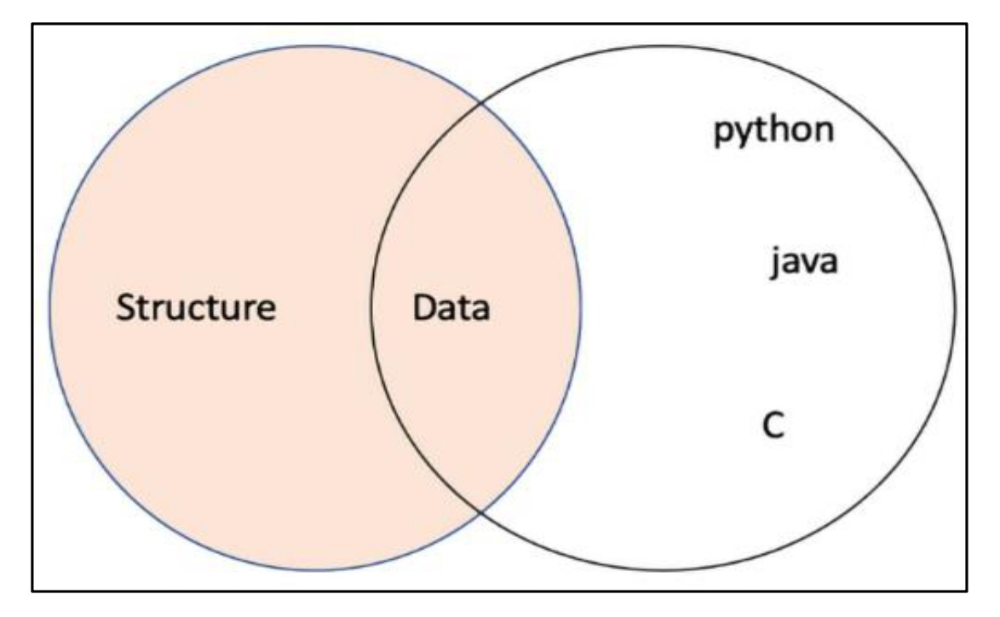

# **Overview of Data Types and Objects in Python** 📌

## 🔍 Introduction

When solving a problem using a computer program, we first design an **algorithm** —a **step-by-step** set of instructions that a computer follows to reach a solution. Algorithms are implemented in any ***programming languages***, and their efficiency heavily depends on how ***data is stored in memory***.

The way data is **structured and stored** impacts the performance and speed of a program. Choosing the right **data types** ensures that memory usage is optimized, and the program runs efficiently. In Python, variables act as **containers** that store different types of values.

---

## 🏗 Understanding Data Types in Python

Python is a **dynamically typed language**, meaning that variables **do not need explicit type declarations**. The interpreter assigns the data type **at runtime**.

### 🏷 What Are Data Types?

A **data type** defines the nature of the values that can be stored in a variable. Some common data types in Python include:

| Data Type | Description                                       |
| --------- | ------------------------------------------------- |
| `int`     | Stores integer values (whole numbers)             |
| `float`   | Stores real numbers (decimal values)              |
| `str`     | Stores sequences of characters (text)             |
| `complex` | Stores complex numbers (e.g., 3 + 4j)             |
| `bool`    | Stores Boolean values (`True` or `False`)         |
| `list`    | Stores an ordered collection of items (mutable)   |
| `tuple`   | Stores an ordered collection of items (immutable) |
| `dict`    | Stores key-value pairs                            |
| `set`     | Stores an unordered collection of unique items    |

---

## 🎯 Dynamic Typing in Python

Unlike other languages like C, C++, or Java, where **data types must be declared explicitly**, Python allows assigning values directly to variables without specifying their type. The **Python interpreter automatically infers** the data type.

### 🛠 Example: Checking Data Types

Let's see how Python dynamically assigns data types:

```python
p = "Hello World"
q = 10
r = 10.2

print(type(p))  # Output: <class 'str'>
print(type(q))  # Output: <class 'int'>
print(type(r))  # Output: <class 'float'>
print(type(12+31j))  # Output: <class 'complex'>
```

🔹 The `type()` function helps determine the type of a variable in Python.

---

## 🔄 Variable Reassignment in Python

Python allows **reassigning** variables with different data types.

### 🛠 Example: Changing Data Types

```python
var = 13.2  # Initially a float
print(var)
print(type(var))  # Output: <class 'float'>

var = "Now the type is string"  # Reassigned as a string
print(type(var))  # Output: <class 'str'>
```


<div align="center">
  

  **Figure 1.3**: Variable assignment

</div>


📌 Here, the same variable `var` initially holds a **float** value (`13.2`), but later, it is assigned a **string** value (`"Now the type is string"`). Python allows such **flexible variable reassignment** due to **dynamic typing**.

---

## 🔍 Understanding Objects in Python

In Python, **everything is an object**. When a variable is assigned a value, the interpreter creates an **object** of that data type and binds it to the variable.

### 🔄 How Python Handles Variable Assignment

1. The **Python interpreter creates an object** when a value is assigned to a variable.
2. The **variable acts as a reference** (or pointer) to that object.
3. If a variable is reassigned, it **points to a new object**, and the previous object may be discarded (garbage collected).

📌 Example:

```python
x = 42  # An integer object is created
x = 3.14  # Now, a float object is created and x points to it
```

🔹 Initially, `x` holds an **integer object** (`42`), but when reassigned to `3.14`, it now refers to a **float object** instead.

---


<div align="center">

# `New Section Basic Data Types`

</div>

# 📌 **Python Data Types**

## 📖 Introduction
Python is an **easy-to-learn, object-oriented** language with a rich set of built-in data types. These data types help developers store, manipulate, and process different kinds of data efficiently. Python's built-in types are categorized as follows:

### 🔹 Principal Built-in Data Types:
- **Numeric types**: `int`, `float`, `complex`
- **Boolean type**: `bool`
- **Sequence types**: `str` (string), `range`, `list`, `tuple`
- **Mapping type**: `dict` (dictionary)
- **Set types**: `set`, `frozenset`

To make things simpler, we will divide these into:
- **Basic Data Types**: Numeric, Boolean, and Sequence types
- **Complex Data Types**: Mapping and Set types

Each type will be explained in detail in subsequent sections. 🚀

---

## 🛠️ Basic Data Types
### 🔢 Numeric Data Types
Numeric data types store numerical values and include:

#### 1️⃣ Integer (`int`)
- Stores whole numbers, positive or negative, without a decimal point.
- Examples:
  ```python
  num1 = 45
  num2 = 1000
  num3 = -25
  print(type(num1))  # Output: <class 'int'>
  ```

#### 2️⃣ Float (`float`)
- Stores decimal numbers and floating-point values.
- Accurate up to **15 decimal places**.
- Examples:
  ```python
  pi = 3.14159
  price = 100.98
  print(type(pi))  # Output: <class 'float'>
  ```

#### 3️⃣ Complex (`complex`)
- Used to store **complex numbers** with a real and an imaginary part.
- The imaginary part is denoted by `j` (not `i` like in mathematics).
- Examples:
  ```python
  comp1 = 3.0 + 1.3j
  comp2 = 4.0j
  print(type(comp1))  # Output: <class 'complex'>
  ```

---

### 🔘 Boolean Data Type (`bool`)
The Boolean type represents **truth values**: `True` or `False`. It is used for decision-making and logic operations.

- Any **non-zero** value is `True`.
- `0` (zero) is `False`.
- Examples:
  ```python
  print(type(bool(22)))  # Output: <class 'bool'>
  print(type(True))      # Output: <class 'bool'>
  print(type(False))     # Output: <class 'bool'>
  ```

#### ✅ Using Boolean with Numeric Types
- The `bool()` function can be used to evaluate numeric values as `True` or `False`.
- Examples:
  ```python
  print(bool(False))  # Output: False
  val1 = 0
  print(bool(val1))   # Output: False
  val2 = 11
  print(bool(val2))   # Output: True
  val3 = -2.3
  print(bool(val3))   # Output: True
  ```

---

## 📌 Sequence Data Types
Sequence data types allow storing multiple values in an organized and efficient manner. Python provides four basic sequence types:
- **Strings (`str`)**
- **Range (`range`)**
- **Lists (`list`)**
- **Tuples (`tuple`)**

### 📜 Strings (`str`)
- A string is an **immutable** sequence of characters enclosed in single, double, or triple quotes.
- **Immutable** means that once a string is created, it **cannot** be changed.
- Triple-quoted strings allow multiline text.
- Examples:
  ```python
  str1 = 'Hello how are you'
  str2 = "Hello how are you"
  str3 = """multiline
  String"""
  print(str1)
  print(str2)
  print(str3)
  ```
  **Output:**
  ```
  Hello how are you
  Hello how are you
  multiline
  String
  ```
- **String Concatenation (`+`)**
  ```python
  f = 'data'
  s = 'structure'
  print(f + s)  # Output: datastructure
  print('Data ' + 'structure')  # Output: Data structure
  ```
- **String Repetition (`*`)**
  ```python
  st = 'data.'
  print(st * 3)  # Output: data.data.data.
  ```

---

### 🔢 Range (`range`)
- Represents an **immutable** sequence of numbers.
- Used primarily in loops.
- Syntax:
  ```python
  range(start, stop, step)
  ```
- Examples:
  ```python
  print(list(range(10)))  # [0, 1, 2, ..., 9]
  print(list(range(1, 10, 2)))  # [1, 3, 5, 7, 9]
  print(list(range(20, 10, -2)))  # [20, 18, 16, 14, 12]
  ```

---

### 📋 Lists (`list`)
- Stores multiple values, allowing duplicates and mixed data types.
- Lists are **mutable**, meaning elements can be modified.
- Syntax:
  ```python
  mylist = [10, "world", "world", 8]
  print(mylist[1])  # Output: world
  ```
- **Properties of Lists:**
  - **Ordered**: Elements maintain their defined order.
  - **Dynamic**: Can grow or shrink.
  - **Mixed Data Types**: Lists can contain numbers, strings, etc.
  - **Indexing & Slicing**: Supports positive and negative indexing.
  - **Mutable**: Elements can be modified.

#### 🔧 List Operations
- **Accessing Elements:**
  ```python
  a = ['data', 'structures', 'using', 'python']
  print(a[0])  # Output: data
  print(a[-1])  # Output: python
  print(a[1:3])  # Output: ['structures', 'using']
  ```
- **Modifying Elements:**
  ```python
  a[1] = 'and'
  print(a)  # Output: ['data', 'and', 'using', 'python']
  ```
- **List Operators:**
  ```python
  a = ['data', 'python']
  print(a + ['new', 'elements'])  # Concatenation
  print(a * 2)  # Replication
  print(len(a))  # Length
  ```

## 📊 Properties of Lists

| Property                  | Description                                                                                                  | Example                                                                             |
| ------------------------- | ------------------------------------------------------------------------------------------------------------ | ----------------------------------------------------------------------------------- |
| **Ordered** ✅             | Lists maintain the order in which elements are added. The order remains **fixed** unless explicitly changed. | `[10, 12, 31, 14] == [14, 10, 31, 12] → False`                                      |
| **Dynamic** 🔄            | Lists can **grow or shrink** dynamically by adding or removing elements.                                     | `b = ['data', 'and', 'book']; b += [32]; del b[0]`                                  |
| **Heterogeneous** 🎭      | Lists can contain multiple data types, including numbers, strings, and booleans.                             | `['python', 31, False, 2.2]`                                                        |
| **Indexing & Slicing** 🔍 | Supports zero-based indexing, negative indexing, and slicing for retrieving elements.                        | `a[0] → 'data'`, `a[-1] → 'learning'`, `a[1:4] → ['structures', 'using', 'python']` |
| **Mutable** ✏️            | List elements can be modified using indexing and slicing.                                                    | `a[1] = 'new_value'`, `a[2:4] = [1, 2, 3]`                                          |
| **Operators** 🛠️         | Lists support `in`, `+`, `*`, `len()`, `min()`, `max()` operations.                                          | `a + ['new']`, `len(a)`, `min(a)`                                                   |

# **Membership, identity, and logical operations** 📋
Python supports membership, identity, and logical operators. Several data types in Python support them. In order to understand how these operators work, we’ll discuss each of these operations in this section.

# **Membership Operators**  🚀

## Introduction 📌

Membership operators in Python are used to ***validate the membership*** of an item within a sequence. A sequence can be a ***string, list, or tuple***. These operators help us determine whether a given value exists in the specified sequence or not.

Python provides **two membership operators**:

1. `in` 👉 Returns `True` if the value exists in the sequence, otherwise returns `False`.
2. `not in` 👉 Returns `True` if the value **does not** exist in the sequence, otherwise returns `False`.

---

## 1️⃣ `in` Operator 🔍

The `in` operator checks if an element exists in a sequence. If found, it returns **`True`**, otherwise, it returns **`False`**.

### Example:

```python
# Python program to check if an item exists in another list
mylist1 = [100, 20, 30, 40]
mylist2 = [10, 50, 60, 90]

if mylist1[1] in mylist2:
    print("Elements are overlapping")
else:
    print("Elements are not overlapping")
```

### Output:

```
Elements are not overlapping
```

✅ Since `mylist1[1]` (which is `20`) is not present in `mylist2`, the output is **"Elements are not overlapping"**.

---

## 2️⃣ `not in` Operator ❌

The `not in` operator checks if an element **does not exist** in a sequence. If the element is absent, it returns **`True`**, otherwise, it returns **`False`**.

### Example:

```python
val = 104
mylist = [100, 210, 430, 840, 108]

if val not in mylist:
    print("Value is NOT present in mylist")
else:
    print("Value is present in mylist")
```

### Output:

```
Value is NOT present in mylist
```

✅ Since `104` is **not present** in `mylist`, the output is **"Value is NOT present in mylist"**.

---
# **Identity Operators in Python** 🆔

## Introduction 📌
Identity operators in Python are used to **compare objects** based on their memory location rather than their values. Python provides two identity operators:

1. **`is`** 👉 Checks if two variables refer to the **same object** in memory.
2. **`is not`** 👉 Checks if two variables refer to **different objects** in memory.

These operators are **different from the equality (`==`) operator**, which checks if the values of two variables are the same, not their memory locations.

---

## 1️⃣ `is` Operator 🔍
The `is` operator checks whether two variables point to the **same object** in memory. It returns **`True`** if both variables reference the same object; otherwise, it returns **`False`**.

### Example:
```python
Firstlist = []
Secondlist = []

if Firstlist == Secondlist:
    print("Both are equal")
else:
    print("Both are not equal")

if Firstlist is Secondlist:
    print("Both variables are pointing to the same object")
else:
    print("Both variables are not pointing to the same object")

thirdList = Firstlist
if thirdList is Secondlist:
    print("Both are pointing to the same object")
else:
    print("Both are not pointing to the same object")
```

### Output:
```
Both are equal
Both variables are not pointing to the same object
Both are not pointing to the same object
```
✅ Here, `Firstlist` and `Secondlist` have **equal values**, but they are **different objects** in memory. That’s why `is` returns `False`.

---

## 2️⃣ `is not` Operator ❌
The `is not` operator checks whether two variables **do not** refer to the same object in memory. If they refer to **different objects**, it returns **`True`**; otherwise, it returns **`False`**.

### Example:
```python
Firstlist = []
Secondlist = []

if Firstlist is not Secondlist:
    print("Both Firstlist and Secondlist variables are different objects")
else:
    print("Both Firstlist and Secondlist variables are the same object")
```

### Output:
```
Both Firstlist and Secondlist variables are different objects
```
✅ Here, `Firstlist` and `Secondlist` are two **different objects** in memory, so `is not` returns `True`.

---

## Visual Representation 🖼️
To understand `is` and `is not`, let's visualize memory allocation:

### **Memory Representation**
```md
Firstlist  --->  [ ]  (Memory Location: 0x1234)
Secondlist --->  [ ]  (Memory Location: 0x5678)
```
Since `Firstlist` and `Secondlist` are created separately, they occupy different memory locations. Hence, `Firstlist is not Secondlist` returns `True`.

### **Comparison Table**
| Expression                | Description                                      | Output |
|---------------------------|--------------------------------------------------|--------|
| `Firstlist == Secondlist` | Checks if values are equal                      | `True`  |
| `Firstlist is Secondlist` | Checks if objects are the same in memory        | `False` |
| `Firstlist is not Secondlist` | Checks if objects are different in memory | `True`  |

---

# **Logical Operators**&#x20;

## Introduction 📌

Logical operators in Python are used to **combine conditional statements** that evaluate to **True or False**. These operators help in decision-making by allowing multiple conditions to be checked within a single statement.

Python provides **three types** of logical operators:

1. **`and`** 👉 Returns `True` if **both conditions** are `True`, otherwise returns `False`.
2. **`or`** 👉 Returns `True` if **at least one condition** is `True`, otherwise returns `False`.
3. **`not`** 👉 Reverses the Boolean value of a condition.

---

## 1️⃣ Logical `and` Operator 🔗

The `and` operator returns `True` **only if both conditions are \*\*\*\*\*\*\*\*****`True`**. If any one condition is `False`, it returns `False`.

### Syntax:

```python
A and B
```

### Example:

```python
a = 32
b = 132

if a > 0 and b > 0:
    print("Both a and b are greater than zero")
else:
    print("At least one variable is less than 0")
```

### Output:

```
Both a and b are greater than zero
```

✅ Since **both ************`a`************ and ************`b`************ are greater than zero**, the condition evaluates to `True`.

---

## 2️⃣ Logical `or` Operator 🔀

The `or` operator returns `True` **if at least one condition is \*\*\*\*\*\*\*\*****`True`**. It returns `False` **only if both conditions are \*\*\*\*\*\*\*\*****`False`**.

### Syntax:

```python
A or B
```

### Example:

```python
a = 32
b = -32

if a > 0 or b > 0:
    print("At least one variable is greater than zero")
else:
    print("Both variables are less than 0")
```

### Output:

```
At least one variable is greater than zero
```

✅ Since **`a`**\*\* is greater than zero\*\*, the condition evaluates to `True`, even though `b` is negative.

---

## 3️⃣ Logical `not` Operator ❌

The `not` operator **reverses the Boolean value** of a condition. If a condition is `True`, `not` makes it `False`, and vice versa.

### Example:

```python
a = 32

if not a < 0:
    print("Boolean value of a is True")
else:
    print("Boolean value of a is False")
```

### Output:

```
Boolean value of a is True
```

✅ Here, `not a < 0` means **`a`**\*\* is not less than 0\*\*, which is `True`, so the statement prints correctly.

---

## Visual Representation 🖼️

To better understand logical operators, consider the following **truth table**:

### **Truth Table for ************`and`************, ************`or`************, and ************`not`************ Operators**

| A (Condition 1) | B (Condition 2) | `A and B` | `A or B` | `not A` |
| --------------- | --------------- | --------- | -------- | ------- |
| `True`          | `True`          | `True`    | `True`   | `False` |
| `True`          | `False`         | `False`   | `True`   | `False` |
| `False`         | `True`          | `False`   | `True`   | `True`  |
| `False`         | `False`         | `False`   | `False`  | `True`  |

# **Tuples** 📌

## Introduction 🚀

Tuples in Python are used to **store multiple items in a single variable**. Unlike lists, tuples are **immutable**, meaning their elements **cannot be changed, added, or removed** after assignment. They are particularly useful when dealing with **fixed collections of data** that should remain unchanged throughout the program.

### **Key Characteristics of Tuples**:

- ✅ **Ordered** (Uses zero-based indexing)
- 🚫 **Immutable** (Cannot be modified after creation)
- ✅ **Allows Duplicates**
- ✅ **Can contain different data types**
- ✅ \*\*Uses round brackets \*\***`()`**
- ✅ **Supports operations like concatenation, repetition, membership, and iteration**

**Syntax:**

```python
tuple_name = ("entry1", "entry2", "entry3")
```

Example:

```python
my_tuple = ("Shyam", 23, True, "male")
```

---

## 📊 Tuple Operations

| **Expression**                | **Result**             | **Description**                 |
| ----------------------------- | ---------------------- | ------------------------------- |
| `print(len((4,5, "hello")))`  | `3`                    | Returns the length of the tuple |
| `print((4,5)+(10,20))`        | `(4,5,10,20)`          | Concatenation of two tuples     |
| `print((2,1)*3)`              | `(2,1,2,1,2,1)`        | Repeats the tuple elements      |
| `print(3 in ('hi', 'xyz',3))` | `True`                 | Checks membership               |
| `for p in (6,7,8): print(p)`  | `6,7,8` (line by line) | Iteration over tuple elements   |

📌 **Tuples support concatenation (********`+`********), repetition (********`*`********), membership (********`in`********), and iteration.**

---

## 🔢 Tuple Indexing & Slicing

Tuples in Python support **zero-based indexing**, **negative indexing**, and **slicing**.

Example:

```python
x = ("hello", "world", "pakistan")
```

| **Expression** | **Result**           | **Description**                                               |
| -------------- | -------------------- | ------------------------------------------------------------- |
| `print(x[1])`  | `"world"`            | **Zero-based indexing** (index `1` refers to the second item) |
| `print(x[-2])` | `"world"`            | **Negative indexing** (counts from the right)                 |
| `print(x[1:])` | `("world", "pakistan")` | **Slicing** (fetches a section of the tuple)                  |

📌 **Tuples behave similarly to lists when it comes to accessing elements but remain immutable.**

---

# 📖 **Python Dictionaries - A Complete Guide**

## 🧐 What is a Dictionary in Python?

A **dictionary** in Python is an important data structure that allows you to store data in **unordered key-value pairs**. It is similar to a list but differs in how data is stored and accessed.

### 🔑 Key Characteristics of Dictionaries:

- Stores data in `{key: value}` pairs.
- The **key** must be **hashable** and **immutable** (e.g., strings, numbers, or tuples with immutable elements).
- The **value** can be any **arbitrary Python object** (strings, numbers, lists, other dictionaries, etc.).
- The dictionary itself is **mutable and dynamic**, meaning elements can be modified, added, or removed.
- Items are enclosed in \*\*curly braces \*\***`{}`** and separated by commas.
- **Keys are unique and case-sensitive**, but **values can be duplicated**.

## 📌 Syntax and Creating a Dictionary

A dictionary is defined using curly braces `{}` with key-value pairs:

```python
my_dict = {
    "1": "data",
    "2": "structure",
    "3": "python",
    "4": "programming",
    "5": "language"
}
```

### 📝 Explanation of the Code:

- Each **key** (e.g., "1", "2", "3", etc.) is mapped to a **value**.
- The values represent different words associated with programming.
- The dictionary follows the `{key: value}` format.
- The **keys must be unique**, while values can be repeated.

## 🔍 Accessing Values from a Dictionary

We can retrieve a value by referencing its **key**:

```python
print(my_dict["1"])  # Output: data
```

### 📝 Explanation:

- `my_dict["1"]` fetches the value associated with the key **"1"**, which is **"data"**.

## 🔄 Dictionary vs. List - Key Differences

| Feature           | Dictionary                                        | List                       |
| ----------------- | ------------------------------------------------- | -------------------------- |
| **Data Storage**  | Key-value pairs `{key: value}`                    | Ordered elements `[value]` |
| **Access Method** | Accessed using **keys**                           | Accessed using **index**   |
| **Order**         | Unordered (Python 3.7+ maintains insertion order) | Ordered                    |
| **Mutability**    | keys must be immutable                            | Mutable                    |
| **Duplicates**    | Keys must be unique, values can repeat            | Values can repeat          |

## 🎯 Additional Dictionary Features

### 1️⃣ Checking if a Key Exists

```python
if "3" in my_dict:
    print("Key exists!")
```

🔹 This checks whether the key **"3"** exists in `my_dict`.

### 2️⃣ Adding New Key-Value Pairs

```python
my_dict["6"] = "coding"
print(my_dict)
```

🔹 Adds a new key-value pair **"6": "coding"**.

### 3️⃣ Removing an Item

```python
del my_dict["2"]  # Removes key "2"
```

🔹 Deletes the key **"2"** and its associated value.

### 4️⃣ Iterating Over a Dictionary

```python
for key, value in my_dict.items():
    print(f"Key: {key}, Value: {value}")
```

🔹 Loops through all key-value pairs and prints them.

# 📖 Python Dictionaries - Advanced Guide

## 📝 Creating and Accessing Dictionary Elements
### 🔹 Example:
```python
person = {}
print(type(person))  # Output: <class 'dict'>

# Adding elements to the dictionary
person['name'] = 'ABC'
person['lastname'] = 'XYZ'
person['age'] = 31
person['address'] = ['Jaipur']

print(person)  # Output: {'name': 'ABC', 'lastname': 'XYZ', 'age': 31, 'address': ['Jaipur']}
print(person['name'])  # Output: ABC
```
### 📝 Explanation:
- A dictionary `person` is created using `{}`.
- Elements are added using key-value pairs.
- Accessing an element is done using `person['name']`, which retrieves the value **'ABC'**.

## 🔍 `in` and `not in` Operators
```python
print('name' in person)  # Output: True
print('fname' not in person)  # Output: True
```
### 📝 Explanation:
- `'name' in person` checks if the key **'name'** exists in the dictionary, returning `True`.
- `'fname' not in person` confirms that **'fname'** is not a key in `person`, returning `True`.

## 📏 Length of a Dictionary
```python
print(len(person))  # Output: 4
```
### 📝 Explanation:
- `len(person)` returns the number of key-value pairs in the dictionary.

## 🔧 **Dictionary Methods**

| Function            | Description                                                                 | Example |
|---------------------|-----------------------------------------------------------------------------|---------|
| `mydict.clear()`    | Removes all elements from a dictionary.                                   | ```python mydict = {'a': 1, 'b': 2, 'c': 3} print(mydict) mydict.clear() print(mydict)  # Output: {} ``` |
| `mydict.get(<key>)` | Searches for a key and returns the corresponding value; otherwise, returns `None`. | ```python mydict = {'a': 1, 'b': 2, 'c': 3} print(mydict.get('b'))  # Output: 2 print(mydict.get('z'))  # Output: None ``` |
| `mydict.items()`    | Returns a list of dictionary items as `(key, value)` pairs.               | ```python mydict = {'a': 1, 'b': 2, 'c': 3} print(list(mydict.items()))  # Output: [('a', 1), ('b', 2), ('c', 3)] ``` |
| `mydict.keys()`     | Returns a list of dictionary keys.                                        | ```python mydict = {'a': 1, 'b': 2, 'c': 3} print(list(mydict.keys()))  # Output: ['a', 'b', 'c'] ``` |
| `mydict.values()`   | Returns a list of dictionary values.                                      | ```python mydict = {'a': 1, 'b': 2, 'c': 3} print(list(mydict.values()))  # Output: [1, 2, 3] ``` |
| `mydict.pop(<key>)` | Removes a key and returns the associated value.                          | ```python mydict = {'a': 1, 'b': 2, 'c': 3} print(mydict.pop('b'))  # Output: 2 print(mydict)  # Output: {'a': 1, 'c': 3} ``` |
| `mydict.popitem()`  | Removes and returns the last inserted key-value pair.                    | ```python mydict = {'a': 1, 'b': 2, 'c': 3} print(mydict.popitem())  # Output: ('c', 3) print(mydict)  # Output: {'a': 1, 'b': 2} ``` |
| `mydict.update(<obj>)` | Merges two dictionaries, updating existing keys and adding new ones.     | ```python dict1 = {'a': 1, 'b': 2} dict2 = {'b': 3, 'c': 4} dict1.update(dict2) print(dict1)  # Output: {'a': 1, 'b': 3, 'c': 4} ``` |

---

# **Python Sets Overview** ✨

**Sets** are a powerful data structure in Python used to store **unordered collections** of **unique, hashable objects**. They are mutable, iterable, and perfect for performing mathematical operations such as union, intersection, difference, and symmetric difference. This guide provides detailed examples and explanations to help you understand sets in depth. 🎯🔍

---

## What is a Set? 🎲

- **Definition:**  
  A **set** is an unordered collection of unique, hashable objects.  
  - **Unordered:** The items do not follow any specific order. 🔄
  - **Unique Elements:** Duplicate items are automatically removed. 🚫➕
  - **Mutable:** You can add or remove items, but each element must be immutable. 🔧🛠️

- **Usage:**  
  Sets are ideal for:
  - Membership testing (`in`, `not in`) ✔️
  - Mathematical operations: intersection, union, difference, and symmetric difference ➕➖
  
- **Creation:**  
  Create a set using the built-in `set()` function or curly braces `{}`.

---

## Creating Sets with Examples 🛠️💡

### Example 1: Using the `set()` Function

```python
# Creating a set from a list using set()
x1 = set(['and', 'python', 'data', 'structure'])  # Converts list to set, removing duplicates if any 🌀
print(x1)  # Displays the set (order may vary) 🎲
print(type(x1))  # Confirms the type is <class 'set'> 🔍
```

**Line-by-Line Explanation:**
1. **`x1 = set(['and', 'python', 'data', 'structure'])`**  
   👉 This line converts a list of strings into a set, ensuring each element is unique.  
2. **`print(x1)`**  
   👉 Prints the set. Remember, the order is not defined because sets are unordered.  
3. **`print(type(x1))`**  
   👉 Verifies that `x1` is indeed a set.  

---

### Example 2: Using Curly Braces `{}`

```python
# Directly creating a set using curly braces
x2 = {'and', 'python', 'data', 'structure'}  # Direct set creation with unique elements 🔥
print(x2)  # Displays the set; the order might be different from the input order 🌀
```

**Line-by-Line Explanation:**
1. **`x2 = {'and', 'python', 'data', 'structure'}`**  
   👉 Directly defines a set with the given elements.  
2. **`print(x2)`**  
   👉 Prints the set. As with all sets, the output order is arbitrary.

**Expected Output:**
```plaintext
{'python', 'structure', 'data', 'and'}
<class 'set'>
{'python', 'structure', 'data', 'and'}
```

> **Note:** The output order may vary due to the unordered nature of sets. 🎲

---

## Membership Testing & Basic Operations 🔎✅

Sets allow you to easily test for membership and check their size using `len()`.

```python
# Define a set with four elements
x = {'data', 'structure', 'and', 'python'}
print(len(x))             # Outputs the number of elements (4) 🎯
print('structure' in x)   # Checks if 'structure' exists in the set; returns True 👍
```

**Line-by-Line Explanation:**
1. **`x = {'data', 'structure', 'and', 'python'}`**  
   👉 Initializes a set with four unique elements.
2. **`print(len(x))`**  
   👉 Prints the size of the set.  
3. **`print('structure' in x)`**  
   👉 Checks for membership; outputs `True` if the element is present.

**Expected Output:**
```plaintext
4
True
```

---

## Set Operations Explained ✨🔢

Python sets support several mathematical operations. Let's break them down with detailed examples and explanations.

### 1. Union ( ∪ ) ➕

Union combines all elements from two sets, eliminating duplicates.

```python
# Define two sets
x1 = {'data', 'structure'}
x2 = {'python', 'java', 'c', 'data'}
# Method 1: Using the | operator for union
x3 = x1 | x2  # Merges x1 and x2 into one set containing all unique items 🌐
print(x3)

# Method 2: Using the union() method
print(x1.union(x2))  # Achieves the same result with a method call 📞
```
<div align="center">
  

  **Figure 1.6**: Venn diagram of sets

</div>


**Line-by-Line Explanation:**
1. **`x1 = {'data', 'structure'}`**  
   👉 Creates the first set.
2. **`x2 = {'python', 'java', 'c', 'data'}`**  
   👉 Creates the second set (note: 'data' is common to both).  
3. **`x3 = x1 | x2`**  
   👉 Combines both sets using the union operator `|`.  
4. **`print(x3)`**  
   👉 Prints the result of the union operation.  
5. **`print(x1.union(x2))`**  
   👉 Prints the union result using the built-in method.

**Expected Output:**
```plaintext
{'structure', 'data', 'java', 'c', 'python'}
{'structure', 'data', 'java', 'c', 'python'}
```

---

### 2. Intersection ( ∩ ) 🔄

Intersection finds common elements between two sets.

```python
# Intersection using both methods
print(x1.intersection(x2))  # Returns elements common to both sets: {'data'} 💡
print(x1 & x2)              # Same result using the & operator 🔗
```

**Line-by-Line Explanation:**
1. **`print(x1.intersection(x2))`**  
   👉 Uses the `.intersection()` method to get common items between x1 and x2.
2. **`print(x1 & x2)`**  
   👉 Uses the `&` operator for the same purpose.

**Expected Output:**
```plaintext
{'data'}
{'data'}
```

---

### 3. Difference ( - ) ➖

Difference shows the elements in one set that are not in the other.

```python
# Difference using both methods
print(x1.difference(x2))  # Returns elements in x1 but not in x2: {'structure'} 🔍
print(x1 - x2)            # Same result using the subtraction operator ➖
```

**Line-by-Line Explanation:**
1. **`print(x1.difference(x2))`**  
   👉 Gets elements from x1 that are not in x2 using the method.  
2. **`print(x1 - x2)`**  
   👉 Achieves the same using the `-` operator.

**Expected Output:**
```plaintext
{'structure'}
{'structure'}
```

---

### 4. Symmetric Difference ( ^ ) 🔄❌

Symmetric difference returns elements that are in either set, but not in both.

```python
# Symmetric difference using both methods
print(x1.symmetric_difference(x2))  # Returns items in either x1 or x2 but not in both 🌟
print(x1 ^ x2)                      # Same result using the ^ operator 💥
```

**Line-by-Line Explanation:**
1. **`print(x1.symmetric_difference(x2))`**  
   👉 Uses the `.symmetric_difference()` method to find non-common elements.
2. **`print(x1 ^ x2)`**  
   👉 Uses the `^` operator to perform the symmetric difference.

**Expected Output:**
```plaintext
{'structure', 'python', 'c', 'java'}
{'structure', 'python', 'c', 'java'}
```

---

### 5. Subset Testing 🔍✅

Subset testing checks if all elements of one set are present in another.

```python
# Checking if x1 is a subset of x2 using two methods
print(x1.issubset(x2))  # Returns False if any element in x1 is missing in x2 ❌
print(x1 <= x2)         # Same check using the <= operator 🔍
```

**Line-by-Line Explanation:**
1. **`print(x1.issubset(x2))`**  
   👉 Checks whether every element of x1 exists in x2.
2. **`print(x1 <= x2)`**  
   👉 Performs the same subset test using the operator.

**Expected Output:**
```plaintext
False
False
```

---

## Summary Table of Set Operations 📊🌈

| **Operation**            | **Description**                                                                         | **Example Code**                                                                               | **Output**                                      |
|--------------------------|-----------------------------------------------------------------------------------------|------------------------------------------------------------------------------------------------|-------------------------------------------------|
| **Union**                | Combines two sets to include all unique elements.                                       | `x3 = x1 | x2` <br> `print(x1.union(x2))`                                                         | `{'structure', 'data', 'java', 'c', 'python'}`  |
| **Intersection**         | Retrieves elements common to both sets.                                                 | `print(x1.intersection(x2))` <br> `print(x1 & x2)`                                               | `{'data'}`                                      |
| **Difference**           | Elements in the first set not present in the second set.                                | `print(x1.difference(x2))` <br> `print(x1 - x2)`                                                 | `{'structure'}`                                 |
| **Symmetric Difference** | Elements in either set but not in both.                                                 | `print(x1.symmetric_difference(x2))` <br> `print(x1 ^ x2)`                                       | `{'structure', 'python', 'c', 'java'}`           |
| **Subset Test**          | Tests if one set is entirely contained within another.                                  | `print(x1.issubset(x2))` <br> `print(x1 <= x2)`                                                  | `False`                                         |

> **Note:** Due to the unordered nature of sets, the order of elements in the outputs may differ from what is shown above. 🎲

---

# **Immutable Sets in Python: Frozenset** ❄️🔒

Python offers a special type of set called a **frozenset**. A frozenset is very similar to a regular set, with one key difference: **it is immutable**. This means once you create a frozenset, you cannot change its content. Frozensets are ideal for situations where you need an immutable (unchangeable) collection that can be used as a dictionary key or stored in other sets. 🌟

---

## What is a Frozenset? ❄️

- **Definition:**  
  A **frozenset** is an immutable version of a set.  
  - **Immutable:** Once created, its elements cannot be modified. 🔒  
  - **Unordered:** Like sets, the order of elements in a frozenset is undefined. 🔄

- **Usage:**  
  Use frozensets when you need a constant collection of unique items that must be hashable, such as keys in dictionaries or elements within other sets. 📌

- **Creation:**  
  Create a frozenset using the built-in `frozenset()` function.

---

## What Does "Unhashable" Mean? 🔍❌

- **Hashable:**  
  An object is **hashable** if it has a hash value that never changes during its lifetime. This allows it to be used as a key in a dictionary or as an element in a set.
  
- **Unhashable:**  
  An object is **unhashable** if it is mutable (can be changed after creation) and does not have a fixed hash value.  
  - **Example:** A regular set is mutable, so it is unhashable, meaning you cannot use it as an element in another set or as a dictionary key. 🚫🔑  
  - **Implication:** Trying to use an unhashable object in a context that requires hashable items will raise a `TypeError`.

---

## Creating a Frozenset with Examples 🛠️💡

### Example 1: Basic Frozenset Creation

```python
# Creating a frozenset from a list
x = frozenset(['data', 'structure', 'and', 'python'])  # Converts list to an immutable frozenset ❄️
print(x)  # Displays the frozenset; order is not guaranteed 🚀
```

**Line-by-Line Explanation:**
1. **`x = frozenset(['data', 'structure', 'and', 'python'])`**  
   👉 This line creates a frozenset from a list of strings using the `frozenset()` function.
2. **`print(x)`**  
   👉 Prints the frozenset. The output shows its elements (order may vary because frozensets are unordered).

**Expected Output:**
```plaintext
frozenset({'python', 'structure', 'data', 'and'})
```

---

## Why Use Frozenset? 💭🔍

Frozensets are useful when you need to store a set in contexts that require hashable (immutable) objects. For instance, you cannot add a mutable set to another set because mutable sets are unhashable. Let's see what happens with mutable sets.

### Example 2: Error When Using Mutable Sets

```python
# Creating regular mutable sets
a11 = set(['data'])
a21 = set(['structure'])
a31 = set(['python'])

# Attempting to create a set of sets
x1 = {a11, a21, a31}  # ❌ This will raise an error because sets are unhashable
```

**Line-by-Line Explanation:**
1. **`a11 = set(['data'])`**  
   👉 Creates a mutable set containing the string `'data'`.
2. **`a21 = set(['structure'])`**  
   👉 Creates another mutable set containing `'structure'`.
3. **`a31 = set(['python'])`**  
   👉 Creates a mutable set containing `'python'`.
4. **`x1 = {a11, a21, a31}`**  
   👉 Attempts to create a set that contains the mutable sets. Since mutable sets are unhashable, this raises a `TypeError`.

**Error Output:**
```plaintext
TypeError: unhashable type: 'set'
```

---

## Using Frozenset to Create a Set of Immutable Sets 🎉✅

By converting sets to frozensets, you make them immutable and hashable, allowing you to store them within another set.

### Example 3: Creating a Set of Frozensets

```python
# Creating frozensets (immutable sets)
a1 = frozenset(['data'])         # Creates an immutable frozenset containing 'data' ❄️
a2 = frozenset(['structure'])    # Creates an immutable frozenset containing 'structure' 🔒
a3 = frozenset(['python'])       # Creates an immutable frozenset containing 'python' 🚀

# Creating a set that contains frozensets
x = {a1, a2, a3}  
print(x)  # Successfully prints a set of frozensets 🌈
```

**Line-by-Line Explanation:**
1. **`a1 = frozenset(['data'])`**  
   👉 Converts a list to a frozenset containing `'data'`, making it immutable.
2. **`a2 = frozenset(['structure'])`**  
   👉 Converts a list to a frozenset containing `'structure'`.
3. **`a3 = frozenset(['python'])`**  
   👉 Converts a list to a frozenset containing `'python'`.
4. **`x = {a1, a2, a3}`**  
   👉 Combines the frozensets into a new set. Since frozensets are hashable, this operation works correctly.
5. **`print(x)`**  
   👉 Prints the set of frozensets, demonstrating that immutable sets can be nested inside other sets.

**Expected Output:**
```plaintext
{frozenset({'structure'}), frozenset({'python'}), frozenset({'data'})}
```

