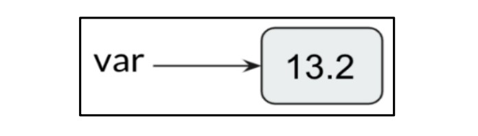

# **Overview of Data Types and Objects in Python** 📌

## 🔍 Introduction

When solving a problem using a computer program, we first design an **algorithm** —a **step-by-step** set of instructions that a computer follows to reach a solution. Algorithms are implemented in any ***programming languages***, and their efficiency heavily depends on how ***data is stored in memory***.

The way data is **structured and stored** impacts the performance and speed of a program. Choosing the right **data types** ensures that memory usage is optimized, and the program runs efficiently. In Python, variables act as **containers** that store different types of values.

---

## 🏗 Understanding Data Types in Python

Python is a **dynamically typed language**, meaning that variables **do not need explicit type declarations**. The interpreter assigns the data type **at runtime**.

### 🏷 What Are Data Types?

A **data type** defines the nature of the values that can be stored in a variable. Some common data types in Python include:

| Data Type | Description                                       |
| --------- | ------------------------------------------------- |
| `int`     | Stores integer values (whole numbers)             |
| `float`   | Stores real numbers (decimal values)              |
| `str`     | Stores sequences of characters (text)             |
| `complex` | Stores complex numbers (e.g., 3 + 4j)             |
| `bool`    | Stores Boolean values (`True` or `False`)         |
| `list`    | Stores an ordered collection of items (mutable)   |
| `tuple`   | Stores an ordered collection of items (immutable) |
| `dict`    | Stores key-value pairs                            |
| `set`     | Stores an unordered collection of unique items    |

---

## 🎯 Dynamic Typing in Python

Unlike other languages like C, C++, or Java, where **data types must be declared explicitly**, Python allows assigning values directly to variables without specifying their type. The **Python interpreter automatically infers** the data type.

### 🛠 Example: Checking Data Types

Let's see how Python dynamically assigns data types:

```python
p = "Hello World"
q = 10
r = 10.2

print(type(p))  # Output: <class 'str'>
print(type(q))  # Output: <class 'int'>
print(type(r))  # Output: <class 'float'>
print(type(12+31j))  # Output: <class 'complex'>
```

🔹 The `type()` function helps determine the type of a variable in Python.

---

## 🔄 Variable Reassignment in Python

Python allows **reassigning** variables with different data types.

### 🛠 Example: Changing Data Types

```python
var = 13.2  # Initially a float
print(var)
print(type(var))  # Output: <class 'float'>

var = "Now the type is string"  # Reassigned as a string
print(type(var))  # Output: <class 'str'>
```


<div align="center">
  

  **Figure 1.3**: Variable assignment

</div>


📌 Here, the same variable `var` initially holds a **float** value (`13.2`), but later, it is assigned a **string** value (`"Now the type is string"`). Python allows such **flexible variable reassignment** due to **dynamic typing**.

---

## 🔍 Understanding Objects in Python

In Python, **everything is an object**. When a variable is assigned a value, the interpreter creates an **object** of that data type and binds it to the variable.

### 🔄 How Python Handles Variable Assignment

1. The **Python interpreter creates an object** when a value is assigned to a variable.
2. The **variable acts as a reference** (or pointer) to that object.
3. If a variable is reassigned, it **points to a new object**, and the previous object may be discarded (garbage collected).

📌 Example:

```python
x = 42  # An integer object is created
x = 3.14  # Now, a float object is created and x points to it
```

🔹 Initially, `x` holds an **integer object** (`42`), but when reassigned to `3.14`, it now refers to a **float object** instead.

---


<div align="center">

# `New Section Starts here`

</div>