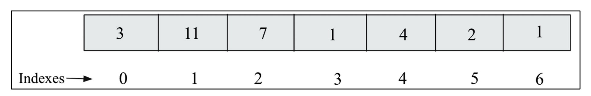

# **Arrays** 📚

## 📋 Table of Contents
- [**Arrays** 📚](#arrays-)
  - [📋 Table of Contents](#-table-of-contents)
  - [What is an Array? 🔸](#what-is-an-array-)
    - [⚡ Quick Comparison: Array vs Linked List](#-quick-comparison-array-vs-linked-list)
  - [🧠 How Array Works in Memory](#-how-array-works-in-memory)
  - [🔍 Visual Example: One-Dimensional Array](#-visual-example-one-dimensional-array)
  - [🚀 Performance Advantages](#-performance-advantages)
  - [⚠️ Limitations of Arrays](#️-limitations-of-arrays)
  - [✅ When to Use Arrays](#-when-to-use-arrays)
  - [💡 When to Use Linked Lists Instead?](#-when-to-use-linked-lists-instead)

##  What is an Array? 🔸

An **array** is a **collection of data items of the same type** stored at **contiguous memory locations**.

> This means all the elements in the array are stored side by side in memory.

### ⚡ Quick Comparison: Array vs Linked List

| Feature         | Array                            | Linked List                         |
| --------------- | -------------------------------- | ----------------------------------- |
| Data Type       | Same type                        | Same type                           |
| Memory Location | Contiguous (side by side)        | Scattered, connected via pointers   |
| Access          | Fast (random access using index) | Slow (sequential access)            |
| Insert/Delete   | Slow (due to shifting)           | Fast (insert/delete using pointers) |
| Size            | Static (fixed at creation)       | Dynamic (can grow or shrink easily) |

## 🧠 How Array Works in Memory

Arrays store data using a **base address** and **offset**.

* 🔹 **Base Address**: Address of the first element in memory (index 0).
* 🔹 **Offset**: Distance (in terms of number of elements) from the base to a specific element.

This allows **quick and efficient access** to any element by simply computing:
📌 `Address = Base Address + (Index × Size of Element)`

## 🔍 Visual Example: One-Dimensional Array

  

This is a **one-dimensional array** containing **7 integers**.

✅ **All values are stored sequentially in memory.**
✅ This layout helps in **quick lookups** using index numbers.

## 🚀 Performance Advantages

Arrays are great when you:

* Want **fast element access** using index (like `arr[3]`)
* Know the **exact number of elements** you need
* Perform **few insertions or deletions**

⏩ Access time = **O(1)** (very fast)
⏸ Insert/Delete time = **O(n)** (can be slow)

## ⚠️ Limitations of Arrays

1. ❌ **Static Size**

   * You must declare the size during creation.
   * Difficult to resize later.

2. ❌ **Inefficient Insert/Delete**

   * To insert at index `i`, all elements after `i` must be **shifted right**.
   * To delete, elements must be **shifted left** to fill the gap.

3. ❌ **Wasted Memory in Low-RAM Systems**

   * If the array is too large, and memory is fragmented, the system might **fail to allocate memory**, even if total free space is enough.

## ✅ When to Use Arrays

Choose arrays when:

* You need **fast access** to elements
* The number of elements is **known in advance**
* **Insertion and deletion** operations are rare

## 💡 When to Use Linked Lists Instead?

Linked Lists are better when:

* You frequently **insert/delete** elements
* The **size of the data structure keeps changing**
* **Memory is fragmented**, and you can’t allocate a large block at once

---
