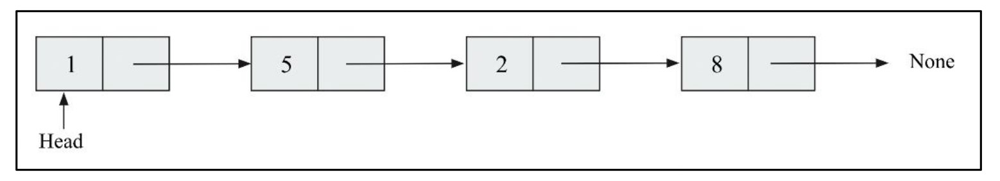
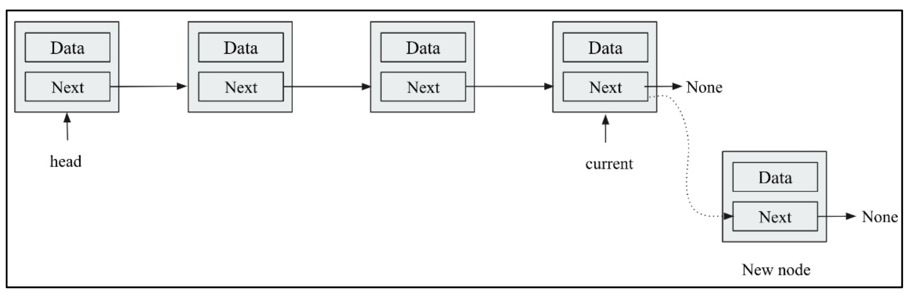
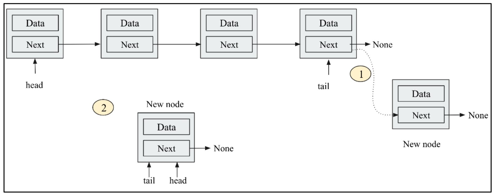
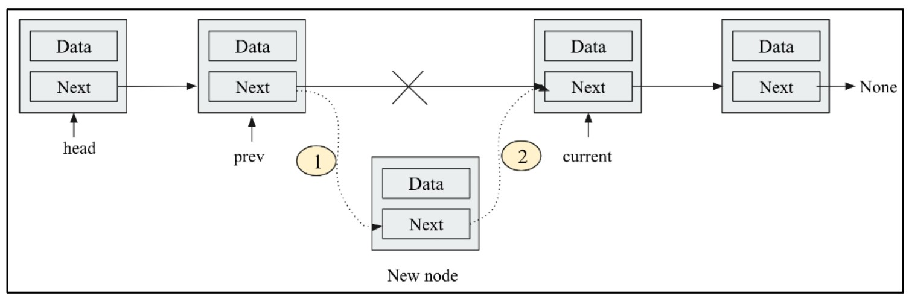
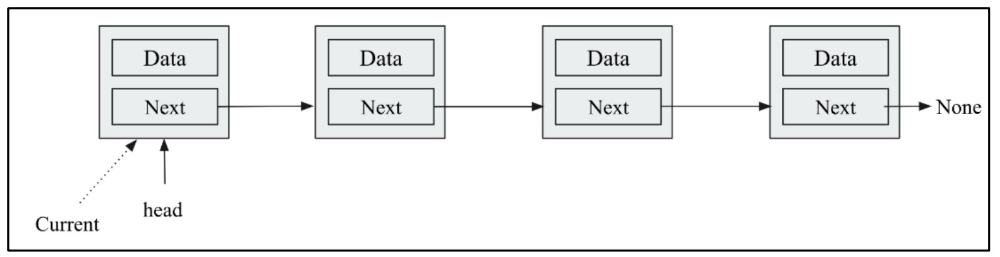
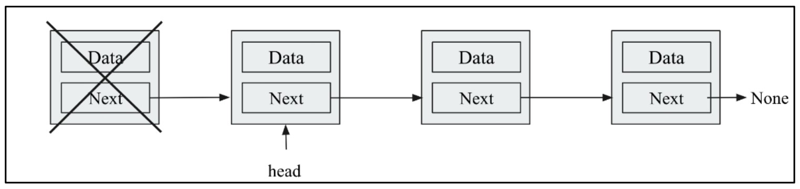
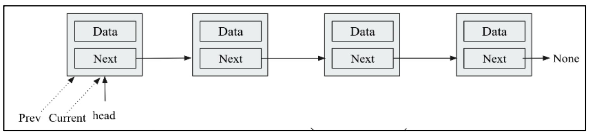
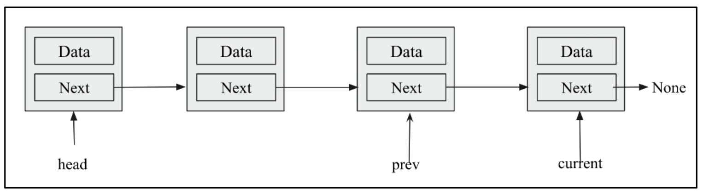
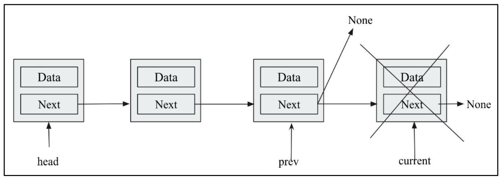

#  What is a Singly Linked List 🧱

A **singly linked list** is a linear data structure where:

* Each element is stored inside a **node**
* Every node points to the **next node**
* The **last node points to None** (signifying the end) ❌

## 🖼️ **Figure 4.6**: An Example of a Singly Linked List

<div align="center">
  
</div>

This figure illustrates a **singly linked list** that stores a sequence of integers:

```
1 → 5 → 2 → 8 → None
```

📌 The first node (`1`) is called the **head** of the list.
Each node:

* Stores a **data value**
* Points to the **next node** in the sequence
  The **last node (8)** points to `None`, marking the **end of the list**.

## 🛠️ Defining a Node in Python

```python
class Node:
    def __init__(self, data=None):
        self.data = data      # Stores the actual data
        self.next = None      # Reference to the next node
```

### 📌 Explanation:

* `data`: Stores the value (like `'eggs'`, `'ham'`, etc.)
* `next`: Initially set to `None`, meaning no link until we explicitly connect it


## 🧰 Creating a Singly Linked List

Let’s create a simple linked list using **three nodes**:

```python
n1 = Node('eggs')
n2 = Node('ham')
n3 = Node('spam')
```

Now link them together:

```python
n1.next = n2
n2.next = n3
# n3.next remains None (automatically set during initialization)
```

This results in the following list:

```
"eggs" → "ham" → "spam" → None
```

## 🚶 Traversing the Linked List

Traversal means going through **each node** from the head to the last.

### 🔁 Traversal Code:

```python
current = n1
while current:
    print(current.data)
    current = current.next
```

### 🖨️ Output:

```
eggs
ham
spam
```

### 🔎 How it works:

* `current` starts at `n1` (head)
* In each loop:

  * Print current node's data
  * Move to the next node using `current = current.next`
* Loop ends when `current` becomes `None` (end of list)


## ⚠️ Problems with This Basic Implementation

Although this structure works, it has some **major limitations**:

### ❌ Too Much Manual Work:

* You must **manually link every node**
* You manually manage node connections (`n1.next = n2`, etc.)

### ❌ Overexposure of Details:

* The inner mechanics (`.next` pointers) are exposed to the user
* Makes the code **error-prone** and **hard to manage** in large applications

There are, however, several problems with this simplistic list implementation:
- It requires too much manual work by the programmer
- Too much of the inner workings of the list is exposed to the programmer

---
 
#  **Improving Traversal** 🚀

In earlier examples, we **manually traversed** a linked list by directly accessing `.data` and `.next` from each node:

```python
while current:
    print(current.data)
    current = current.next
```

🔍 **Issue:**
This approach **exposes the inner structure** (`Node`) to the **user/client**, which is considered **bad practice** in software design.

### ⚠️ Why It's a Problem:

* Client code is too **dependent on implementation details**
* Harder to maintain or extend
* Not very elegant or Pythonic 😬

## ✅ The Solution: Encapsulation + Generators

We can **hide the internals** and make list traversal much more **user-friendly** by:

1. Defining an `iter()` method inside the Node class
2. Using the `yield` keyword to build a **generator** 🔄


### 🧪 Improved Traversal Code Using a Generator

```python
def iter(self):
    current = self
    while current:
        val = current.data
        current = current.next
        yield val
```

### 📌 Explanation:

* `yield` works like `return`, but **remembers** the current position/state of the function
* This function becomes a **generator**, meaning:

  * It produces a **sequence of values one at a time**
  * It doesn't return all values at once
  * It is **memory efficient** for large lists

## 🔁 Updated Usage — Cleaner & Safer Traversal

Now your client code is cleaner:

```python
for word in words.iter():
    print(word)
```

### 🎉 Benefits:

* No more direct use of `.data` or `.next`
* Cleaner, more elegant API
* Follows **encapsulation** principle


## 🧱 Complete Working Code

```python
class Node:
    def __init__(self, data=None):
        self.data = data
        self.next = None

    def iter(self):
        current = self
        while current:
            val = current.data
            current = current.next
            yield val

# Creating linked list nodes
n1: Node = Node('eggs')
n2: Node = Node('ham')
n3: Node = Node('spam')

# Linking the nodes
n1.next = n2
n2.next = n3

# Traversing using generator
for value in n1.iter():
    print(value)
```
---

#  **Singly Linked List Appending with append method** 📝

### 🖼️ **Figure 4.7**: Inserting a node at the end of a singly linked list

<div align="center">
  
</div>

## 🏗️ Building the `SinglyLinkedList` Class

We encapsulate all linked-list logic within a **single class** so that **clients never touch the `Node` class** directly.

```python
class SinglyLinkedList:
    def __init__(self):
        # The head of the list (first node). None means an empty list.
        self.head = None
        # Optional: track the number of nodes for O(1) size retrieval
        self.size = 0
```

* **`self.head`** points to the first node in the list (or `None` if empty)
* **`self.size`** keeps count of nodes (initially `0`) ✨


## ➕ Appending Items to the End

We hide the `Node` details by providing an **`append(data)`** method:

```python
class Node:
    def __init__(self, data=None):
        self.data = data
        self.next = None

class SinglyLinkedList:
    def __init__(self):
        self.head = None
        self.size = 0

    def append(self, data):
        # 1️⃣ Create a new Node to encapsulate the data
        node = Node(data)

        # 2️⃣ If the list is empty, new node becomes the head
        if self.head is None:
            self.head = node
        else:
            # 3️⃣ Otherwise, traverse to the end of the list
            current = self.head
            while current.next:
                current = current.next
            # 4️⃣ Link the last node to the new node
            current.next = node

        # 5️⃣ Update size counter
        self.size += 1
```

### 🔍 Step-by-Step Explanation

1. **Encapsulate**

   * Wrap the raw `data` in a `Node`, giving it a `.next` pointer.

2. **Empty List Check**

   * If `self.head` is `None`, the list has **no nodes**.
   * We set `self.head = node` to make our new node the **first element** 🥇.

3. **Traverse to Last Node**

   * Start at `self.head`.
   * Follow `.next` pointers until `current.next` is `None` (last node).

4. **Insert New Node**

   * Set `current.next = node`, linking the old last node to our new one ➡️.

5. **Maintain Size**

   * Increment `self.size` by 1 for quick length queries 📏.

## ⚙️ Using the `append()` Method

```python
words = SinglyLinkedList()
words.append('egg')   # List: egg → None
words.append('ham')   # List: egg → ham → None
words.append('spam')  # List: egg → ham → spam → None
```

* After three appends, `words.size == 3`
* The structure matches **Figure 4.7**

## 🔁 Traversing the List

You can traverse just like before (or use a generator if you implemented one):

```python
current = words.head
while current:
    print(current.data)
    current = current.next
```

**Output:**

```
egg
ham
spam
```

---

---

#  **Optimizing Append with a Tail Pointer** 🚀

### 🖼️ **Figure 4.8**: Inserting a Node at the End with a Tail Pointer

<div align="center">
  
</div>

## 🎯 Goal: O(1) Append Time

* **Problem**: Without a tail pointer, `append()` requires **O(n)** time to traverse to the end.
* **Solution**: Maintain both:

  * `self.head` → first node
  * `self.tail` → last node

With a tail pointer, we **directly link** the new node to the end in **constant time**.

## 🧱 Updated `SinglyLinkedList` Implementation

```python
class SinglyLinkedList:
    def __init__(self):
        self.head = None   # First node
        self.tail = None   # Last node
        self.size = 0      # Number of nodes

    def append(self, data):
        node = Node(data)  # 1️⃣ Wrap data in a new Node

        if self.tail:
            # 2️⃣ Link old tail to the new node
            self.tail.next = node
            # 3️⃣ Update tail to the new node
            self.tail = node
        else:
            # 📦 Empty list: both head & tail point to the new node
            self.head = node
            self.tail = node

        # 4️⃣ Increase size counter
        self.size += 1
```

### 🔍 Step-by-Step:

1. **Create** a new `Node(data)`.
2. **Non-empty list?**

   * **Yes**: Link `self.tail.next → node`, then update `self.tail = node`.
   * **No** (list empty): Set **both** `self.head` and `self.tail` to `node`.
3. **Increment** `self.size`.

## 🔄 Execution Flow (Figure 4.8)

1. **Step 1**: When list is **non-empty**,

   * `tail.next` jumps to the **new node**.
   * `tail` moves forward to that node.
2. **Step 2**: If the list is **empty**,

   * Both `head` and `tail` are initialized to the **first node**.


## ⚙️ Usage Example

```python
words = SinglyLinkedList()
words.append('eggs')
words.append('ham')
words.append('spam')

# Traverse & print
current = words.head
while current:
    print(current.data)
    current = current.next
```

**Output:**

```
eggs
ham
spam
```

* **Append** operations are now **O(1)** 🔥
* **Traverse** remains **O(n)**


## 🔑 Key Benefits

* **Efficiency**: Instant appends, no full-list traversal
* **Simplicity**: Client code still interacts only with `SinglyLinkedList`
* **Scalability**: Ideal for large, dynamic datasets

---

#  **Inserting at Any Position** 🌟

When you want to insert a new node into a singly-linked list at **any** position, there are five key scenarios to handle. Let’s walk through each, step by step, and then see the complete, clean Python implementation.

<div align="center">
  
</div>

## Add this python code to the `SinglyLinkedList` class:

```python
    def append_at_a_location(self, data, index):
        if index < 1:
            print("Index should be 1 or greater. ")
            return
        node = Node(data)
        # Case 1: Insert at the head
        if index == 1:
            node.next = self.head
            self.head = node
            return
        # For index > 1, walk the list looking for the insertion point
        current = self.head
        prev = None
        count = 1
        while current:
            if count == index:
                prev.next =node
                node.next = current
                return
            prev = current
            current = current.next
            count += 1
        # If we exit the loop with count < index, list was too short
        if count < index:
            print("The list has fewer than {} elements".format(index))
        else:
            # count == index here means we fell off exactly at tail,
            # so append at end:
            prev.next = node
```

## The following code snippet uses the append method to add a “new” data element at an indexposition of 2 in the existing linked list:

```python
words.append_at_a_location('new', 2)

current = words.head
while current:
    print(current.data)
    current = current.next
```

## Lets break down the `append_at_a_location` method step by step:

## 🛑 1. Invalid Index  
- **Condition:** `index < 1`  
- **What happens?** We immediately reject the request.  
- **Why?** Linked-list positions start at 1 (the head is position 1).  

```python
if index < 1:
    print("❌ Index should be 1 or greater")
    return
````

---

## 🏁 2. Insert at Head

* **Condition:** `index == 1`
* **What happens?**

  1. Create new node
  2. Point its `.next` to the **old** head
  3. Update `self.head` to the new node
* **Result:** New node becomes the first element.

```python
if index == 1:
    node.next = self.head
    self.head = node
    return
```

---

## 🔄 3. Insert in the Middle

* **Condition:** `1 < index ≤ length`
* **What happens?**

  1. Walk the list with `current` & `prev` pointers, counting positions.
  2. When `count == index`, splice the new node between `prev` and `current`.

```python
current = self.head
prev = None
count = 1

while current:
    if count == index:
        prev.next    = node
        node.next    = current
        return

    prev    = current
    current = current.next
    count  += 1
```

---

## ➕ 4. Insert at Tail

* **Condition:** `index == length + 1`
* **What happens?**

  * You walk off the list **exactly** when `count == index`, and `current` becomes `None`.
  * Simply link the last node’s `.next` to your new node.

```python
# after the loop:
if count == index:
    prev.next = node
    return
```

---

## ⚠️ 5. Index Too Large

* **Condition:** `index > length + 1`
* **What happens?**

  * You exit the loop with `count < index` and `current is None`.
  * The list is too short!

```python
if count < index:
    print(f"❌ The list has fewer than {index} elements")
```

---

#  **Insert before the First Matching Value** 🍳

Sometimes you don’t want to insert by index, but right **before** the first node whose `.data` equals your new value. The `append_with_same_data` method does exactly that. Let’s break it down:

## 🧱 The Method

```python
def append_with_same_data(self, data):
    current = self.head
    prev    = self.head
    node    = Node(data)

    while current:
        if current.data == data:
            node.next  = current
            prev.next  = node
        prev    = current
        current = current.next
````

## 🔍 Line-by-Line Explanation

1. **Setup pointers & new node**

   ```python
   current = self.head
   prev    = self.head
   node    = Node(data)
   ```

   * `current` traverses each node.
   * `prev` “lags behind” `current` by one step.
   * `node` is the brand-new node containing `data`.

2. **Walk through the list**

   ```python
   while current:
       …
       prev    = current
       current = current.next
   ```

   * Repeat until `current` becomes `None` (end of list).
   * Each iteration you’ll:

     1. Check if **this** is the node you want to insert **before**.
     2. Advance `prev` and `current`.

3. **Detect a data-match**

   ```python
   if current.data == data:
       node.next = current
       prev.next = node
   ```

   * **When** you find a node whose `.data` **equals** `data`, you:

     1. Point `node.next` to `current` (so it will come **before** the matched node).
     2. Point `prev.next` to `node` (splicing your new node into the chain).

---

## 🚶‍♂️ Dry-Run Scenarios

Assume our list is:

```
HEAD → [‘egg’] → [‘spam’] → [‘ham’] → [‘spam’] → None
```

We call:

```python
words.append_with_same_data('spam')
```

| Step | `current.data` |  `prev.data`  | Action                                                                | List After Action                          |
| :--: | :------------: | :-----------: | :-------------------------------------------------------------------- | :----------------------------------------- |
|   1  |     `'egg'`    |    `'egg'`    | No match; advance pointers                                            | `egg → spam → ham → spam`                  |
|   2  |    `'spam'`    |    `'egg'`    | **Match!**<br>- `node('spam').next = current`<br>- `prev.next = node` | `egg → spam(new) → spam(old) → ham → spam` |
|   3  |     `'ham'`    | `'spam'(old)` | No match; advance pointers                                            | *no change*                                |
|   4  |    `'spam'`    |    `'ham'`    | **Match again!**<br>- inserts another `'spam'` before second spam     | `… → ham → spam(new) → spam(old) → None`   |

*Final list ends up with **two** new `spam` nodes inserted, one before each old `spam`.*

---

## ⚠️ Edge-Cases & Gotchas

1. **Inserting before the very first node**

   * Because `prev` starts at `self.head`, if the head matches, you’ll do:

     ```python
     prev.next = node
     ```

     which actually links the head **to itself** unless you special-case it.
   * **Fix:** Initialize `prev = None`, and if you match at head (`prev is None`), you must update `self.head = node`.

2. **Multiple matches**

   * **Current code** will insert **before every** matching node.
   * If you only want **the first** insertion, add a `return` immediately after splicing in your new node.

3. **No match at all**

   * After the loop, if you never saw `current.data == data`, nothing happens.
   * You might want to inform the user:

     ```python
     print(f"No node contains the value {data!r}")
     ```

---

#  **Searching for an Element in a Singly Linked List** 🔍

To determine whether a **linked list** contains a specific value, we implement a **search** method that walks through each node until it either finds the target or reaches the end. Below is the **complete code**, followed by a **step-by-step dry-run** on an example list.

## 📜 The `search` Method

```python
class SinglyLinkedList:
    # … (other methods omitted for brevity)

    def search(self, data):
        current = self.head          # 1️⃣ Start at the head of the list
        while current:               # 2️⃣ Continue until no more nodes
            if current.data == data: # 3️⃣ Compare the node’s data
                return current       # 4️⃣ Found it → return this node
            current = current.next   # 5️⃣ Move to the next node
        return None                  # 6️⃣ Not found → return None
```

### 🔍 Explanation of Each Step

1. **Initialize Pointer**

   ```python
   current = self.head
   ```

   * Begin at the **first node** (`head`).
   * If the list is empty, `self.head` is `None` and the loop won’t run.

2. **Loop Through the List**

   ```python
   while current:
   ```

   * Keep iterating **while** `current` is not `None` (i.e., until end of list).

3. **Compare Node Data**

   ```python
   if current.data == data:
       return current
   ```

   * If the node’s data matches the **search key**, **immediately return** that node.

4. **Advance to Next Node**

   ```python
   current = current.next
   ```

   * Move pointer forward by following the `.next` link.

5. **Handle “Not Found”**

   ```python
   return None
   ```

   * If we've traversed the entire list with no match, return `None`.

---

## 🚶‍♂️ Dry-Run Example

Let’s **search** for `"ham"` in the list:

```plaintext
List: eggs → ham → spam → None
Search key: "ham"
```

| Iteration | `current` points to | Comparison (`current.data == "ham"`) | Action                                      |
| --------- | ------------------- | ------------------------------------ | ------------------------------------------- |
| **Start** | Node("eggs")        | —                                    | Initialize `current = head`                 |
| **1️⃣**   | `"eggs"`            | `"eggs" == "ham"` → False            | Move `current = current.next` (now `"ham"`) |
| **2️⃣**   | `"ham"`             | `"ham" == "ham"` → True              | **Return Node("ham")** → stop traversal     |

* We never visit `"spam"` because we found the match at the **second node**.
* The method returns the **node object** containing `"ham"`.

---

## ⚙️ Client Usage

```python
node = words.search('ham')

if node:
    print(f"✅ Found node with data: {node.data}")
else:
    print("❌ Node not found.")
```

**Output:**

```
✅ Found node with data: ham
```

---

## 📈 Complexity

* **Best case**: O(1) — match at head
* **Worst case**: O(n) — end of list or not present
* **Average case**: O(n)

---

#  **Deleting the First Node in a Singly Linked List** ❌
To remove the **first node** from a singly linked list, we need to update the `head` pointer to point to the **next node**. This operation is efficient and straightforward, taking O(1) time.
When you remove the first node from a linked list, you simply **re-point** the `head` to the **second node**, and let the original first node be garbage-collected. Below is the **complete code**, followed by a **step-by-step dry-run** and a **usage example**.


## 🧱 New Code in SinglyLinkedList Class

```python
    def iter(self):
        current = self.head
        while current:
            yield current.data
            current = current.next

    def delete_first_node(self):
        if self.head is None:
            print("List is empty. Nothing to delete.")
            return
        node_to_delete = self.head
        deleted_data = node_to_delete.data
        self.head = node_to_delete.next
        if self.head is None:
            self.tail = None
        self.size -= 1
        return deleted_data
```

## 🖼️ Visual Guide

### **Figure 4.10**: Before Deletion

<div align="center">
  
</div>

```
head → [eggs] → [ham] → [spam] → None
```

### **Figure 4.11**: After Deletion
<div align="center">
  
</div>

```
head → [ham] → [spam] → None
```

## 🚶 Step-by-Step Dry-Run

Starting list:

```
eggs → ham → spam → None
```

Call:

```python
deleted = words.delete_first_node()
```

| Step | Code                                 | Effect                        |
| ---- | ------------------------------------ | ----------------------------- |
| 1️⃣  | `if self.head is None:`              | List is not empty → proceed   |
| 2️⃣  | `node_to_delete = self.head`         | `node_to_delete` → `[eggs]`   |
|      | `deleted_data = node_to_delete.data` | `deleted_data` = `"eggs"`     |
| 3️⃣  | `self.head = node_to_delete.next`    | `head` now → `[ham]`          |
| 4️⃣  | `if self.head is None:`              | False (there are still nodes) |
| 5️⃣  | `self.size -= 1`                     | Decrement size                |
| 6️⃣  | `return deleted_data`                | Returns `"eggs"` to caller    |

Resulting list:

```
ham → spam → None
```

## ⚙️ Usage Example

```python
words = SinglyLinkedList()
words.append('eggs')
words.append('ham')
words.append('spam')

print("Before deletion:", list(words.iter()))
# → ['eggs', 'ham', 'spam']

deleted = words.delete_first_node()
print(f"Deleted: {deleted}")
# → 'eggs'

print("After deletion:", list(words.iter()))
# → ['ham', 'spam']
```
---

#  **Deleting the Last Node in a Singly Linked List** ❌

Removing the **tail** node requires traversing the list to locate both:

* **`current`** → the last node to be deleted
* **`prev`**    → the node immediately before `current`


## 🧱 New Code in SinglyLinkedList Class

```python
def delete_last_node(self):
    if self.head is None:
        print("List is empty. Nothing to delete.")
        return
    current = self.head
    prev = None
    # Single-node list? (Figure 4.12 step 2)
    if current.next is None:
        deleted_data = current.data
        self.head = None
        self.tail = None
        self.size -= 1
        return deleted_data

    # Traverse to the last node (Figure 4.13)
    #    Move 'current' forward until .next is None,
    #    keeping 'prev' one step behind.
    while current.next:
        prev = current          # prev follows behind
        current = current.next  # current moves forward

    # At this point:
    #    • current → last node  (Figure 4.13 end)
    #    • prev    → second-last node
    #
    #    Delete via:
    #      prev.next = None
    #      tail = prev
    deleted_data = current.data    # Save to return
    prev.next = None               # Unlink the last node  (Figure 4.14 step 3)
    self.tail = prev               # Update tail pointer
    self.size -= 1

    # 5️⃣ Return the deleted data
    return deleted_data
```
## 🖼️ Figure-Referenced Steps

1. **Figure 4.12: Initial Pointers**
<div align="center">
  
</div>

   * **`head`**, **`current`**, and **`prev`** all start at the **first node**.
   * **Check** if `head` is `None` → empty list error (handled).
   * **Check** if `current.next is None` → single-node list (handled).

2. **Figure 4.13: Traversal to Tail**
<div align="center">
  
</div>

   * **Loop**:

     * `while current.next:`

       * **`prev = current`**
       * **`current = current.next`**
   * **Ends** when `current.next` is `None`, so **`current`** is the **last node**, **`prev`** is the **second-last**.

3. **Figure 4.14: Deletion of Tail**
<div align="center">
  
</div>

   * **Unlink** the last node:

     ```python
     prev.next = None
     ```
   * **Update** tail pointer:

     ```python
     self.tail = prev
     ```
   * **Decrement** `self.size` and **return** the deleted data.

---

## ⚙️ Usage Example

```python
words = SinglyLinkedList()
words.append(1)
words.append(5)
words.append(2)
words.append(8)

print("Before:", list(words.iter()))
# → [1, 5, 2, 8]

deleted = words.delete_last_node()
print(f"Deleted: {deleted}")
# → 8

print("After:", list(words.iter()))
# → [1, 5, 2]
```

---

#  **Deleting an Intermediate Node in a Singly Linked List** ⚙️

To remove a node **in the middle** of a linked list (neither head nor tail), we must:

1. **Locate** the target node (`current`) and keep track of the **previous** node (`prev`).
2. **Re-link** `prev.next` to skip over `current` and point to `current.next`.
3. **Adjust** metadata (`size`, possibly `tail` if you delete the last node).

Below is the **visual walkthrough** (Figures 4.15–4.17), the **Python code**, and a **dry-run** example.

## 🖼️ Visual Guide

### **Figure 4.15**: Initial Pointers

<div align="center">
  
</div>

* **`head`**, **`current`**, and **`prev`** all start at the **first node**.

### **Figure 4.16**: Target Node Identified

<div align="center">
  
</div>

* We advance until **`current.data == target`**.
* **`prev`** sits one node behind **`current`**.

### **Figure 4.17**: After Deletion

<div align="center">
  
</div>

* We set **`prev.next = current.next`**, effectively **skipping** the deleted node.
* The list stitches back together without the removed node.


## 📝 Code Implementation

```python
class SinglyLinkedList:
    # … (append, iter, delete_first/last methods here) …

    def delete_at_a_location(self, data):
        current = self.head   # 1️⃣ Start at head
        prev = None

        # 2️⃣ Traverse to find the target node
        while current:
            if current.data == data:
                # 3️⃣ Deleting the head?
                if prev is None:
                    self.head = current.next
                else:
                    # 4️⃣ Bypass current node
                    prev.next = current.next

                # 5️⃣ If deleting tail, update tail pointer
                if current.next is None:
                    self.tail = prev

                # 6️⃣ Update size and return
                self.size -= 1
                return current

            # 7️⃣ Advance pointers
            prev = current
            current = current.next

        # 8️⃣ Not found
        return None
```

### 🔍 Explanation of Each Section

1. **Initialize**

   ```python
   current = self.head
   prev    = None
   ```

   * `current` scans each node; `prev` lags behind.

2. **Search Loop**

   ```python
   while current:
       if current.data == data:
           …
       prev, current = current, current.next
   ```

   * Continue until **match** or end of list.

3. **Delete Head Node**

   ```python
   if prev is None:
       self.head = current.next
   ```

   * If the node to delete **is** the head, simply move `head`.

4. **Delete Middle Node**

   ```python
   prev.next = current.next
   ```

   * Skips over `current`.

5. **Update Tail if Needed**

   ```python
   if current.next is None:
       self.tail = prev
   ```

   * If you removed the last node in this method, ensure `tail` remains correct.

6. **Size & Return**

   ```python
   self.size -= 1
   return current
   ```

7. **Advance Pointers**

   ```python
   prev = current
   current = current.next
   ```

8. **Not Found**

   ```python
   return None
   ```

   * Signal absence of the target.


## 🚶 Dry-Run Example

Starting list:

```
"eggs" → "ham" → "spam" → None
```

We call:

```python
deleted_node = words.delete_at_a_location('ham')
```

| Step | `prev`         | `current`    | Action / Notes                                                                           |
| ---- | -------------- | ------------ | ---------------------------------------------------------------------------------------- |
| 1️⃣  | `None`         | Node("eggs") | Check `"eggs" == "ham"` → **No** → advance                                               |
|      | → Node("eggs") | Node("ham")  | (after `prev=current`, `current=current.next`)                                           |
| 2️⃣  | Node("eggs")   | Node("ham")  | Check `"ham" == "ham"` → **Yes** → delete                                                |
| 3️⃣  | Node("eggs")   | Node("ham")  | Since `prev` is not `None`, do `prev.next = current.next` → Egg’s `.next` points to Spam |
| 4️⃣  | —              | —            | `current.next` is not `None`, so `tail` stays unchanged                                  |
| 5️⃣  | —              | —            | Decrement size; return the **deleted node**                                              |

Resulting list:

```
"eggs" → "spam" → None
```

* **Deleted data**: `"ham"`


## ⚙️ Usage Example

```python
words = SinglyLinkedList()
words.append('eggs')
words.append('ham')
words.append('spam')

print("Before:", list(words.iter()))
# → ['eggs', 'ham', 'spam']

deleted = words.delete_at_a_location('ham')
print("Deleted:", deleted.data if deleted else None)
# → 'ham'

print("After:", list(words.iter()))
# → ['eggs', 'spam']
```

---

