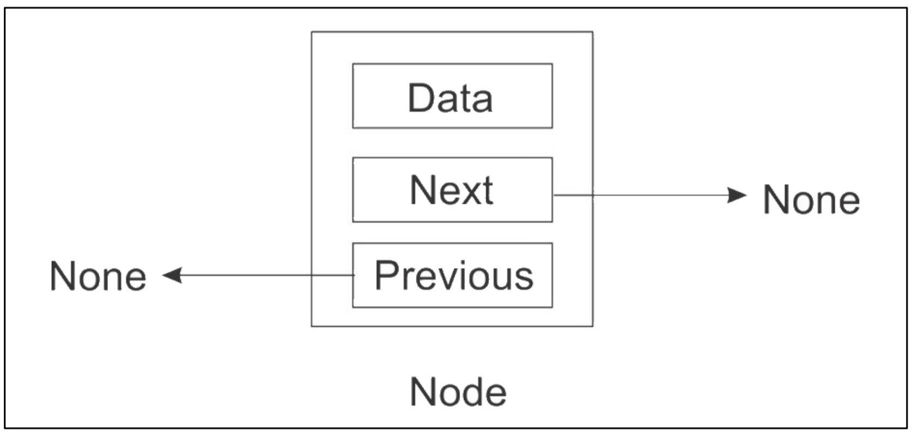
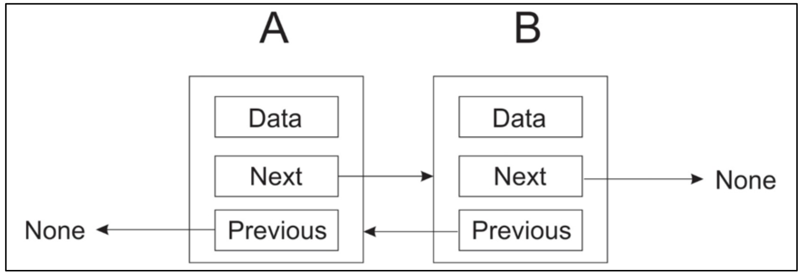
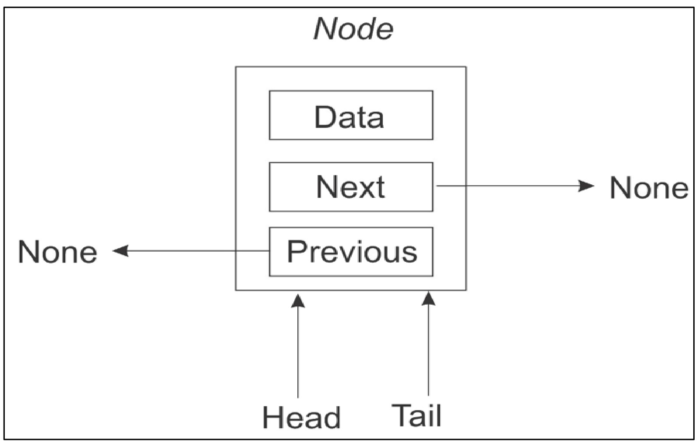
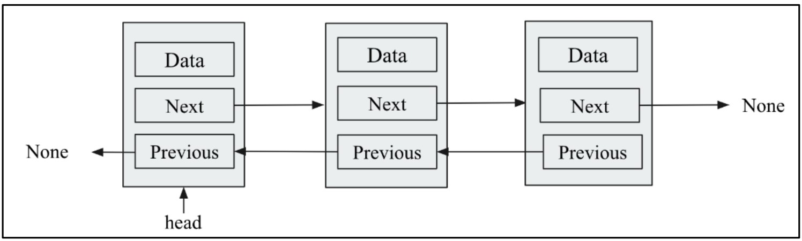
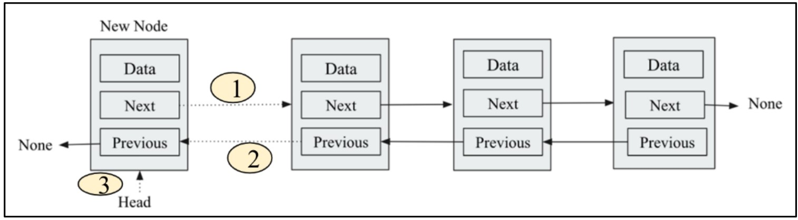
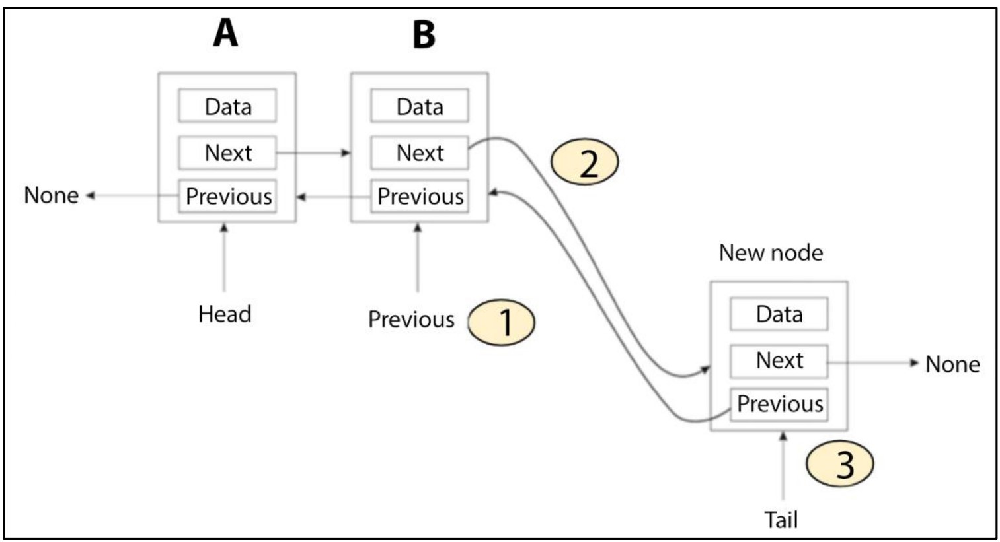
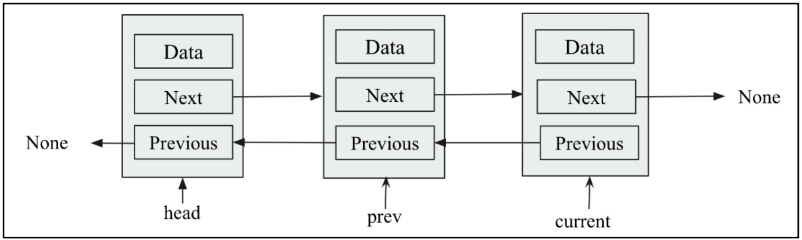
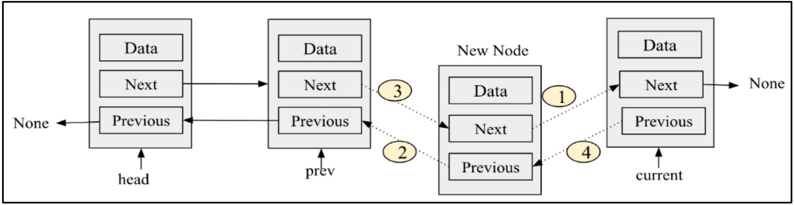

#  **Doubly Linked Lists** 🔁

A **doubly linked list** extends the concept of a singly linked list by allowing **two-way traversal**. Each node contains:

1. **Data**: The value stored in the node.
2. **Next pointer**: Reference to the **next** node in the sequence.
3. **Previous pointer**: Reference to the **previous** node in the sequence.

## 🖼️ Figure 4.18: A Single Node in a Doubly Linked List

<div align="center">
  
</div>

* **Data field** holds the node’s value.
* **Next** points forward to another node (here, `None` because no successor exists).
* **Previous** points backward to another node (here, `None` because no predecessor exists).

## 🖼️ Figure 4.19: Two Nodes in a Doubly Linked List

<div align="center">
  
</div>

* **Node A**:

  * `Next` → Node B
  * `Previous` → `None` (no node before A)
* **Node B**:

  * `Previous` → Node A
  * `Next` → `None` (no node after B)

## 📋 Key Differences from Singly Linked List

| Aspect                   | Singly Linked List                                               | Doubly Linked List                                                |
| ------------------------ | ---------------------------------------------------------------- | ----------------------------------------------------------------- |
| **Pointers per node**    | 1 (`next`)                                                       | 2 (`next` and `previous`)                                         |
| **Traversal**            | Only forward                                                     | Forward **and** backward                                          |
| **Ease of backtracking** | Requires extra work (e.g., stack or re-traverse)                 | Immediate via `previous` pointer                                  |
| **Insertion/Deletion**   | At head: O(1) without tail; At tail or middle: O(n) forward-only | At both ends or middle: can use `previous` to simplify operations |

## 🧠 Why Use a Doubly Linked List?

1. **Bidirectional Traversal**

   * You can start at the **head** and move forward via `.next`.
   * You can start at the **tail** and move backward via `.previous`.

---

# 🛠️ **Creating a Doubly Linked List Node in Python**

To build a **doubly linked list**, each node must know:

1. **Its data**
2. **Which node comes next**
3. **Which node came before**

Below is the **Python class** for a single doubly linked-list node, followed by a **detailed breakdown**.

```python
class Node:
    def __init__(self, data=None, next=None, prev=None):
        self.data = data    # 📦 Holds the node’s value
        self.next = next    # ➡️ Reference to the next node (or None)
        self.prev = prev    # ⬅️ Reference to the previous node (or None)
```

---

## 🔍 Detailed Explanation

* **`data`**

  * Stores **any value** you want to keep in this node (e.g., an integer, string, object).
  * **Default**: `None` (empty) if no data is provided.

* **`next`**

  * Points to the **next node** in the list (the one to the right in diagrams).
  * When you **create** a standalone node, it has **no successor**, so `next=None`.

* **`prev`**

  * Points to the **previous node** in the list (the one to the left in diagrams).
  * A brand-new node has **no predecessor**, so `prev=None`.

---

---

# ➕ **Doubly Linked List class**

In a **doubly linked list**, each node knows both its **next** and **previous** neighbor. To append (add to the end), we update:

1. The current **tail**’s `.next` → new node
2. The new node’s `.prev` → old tail
3. The list’s **tail** pointer → new node
4. Increase the **count**

---

## 📜 Code for `DoublyLinkedList class`

```python
class DoublyLinkedList:
    def __init__(self):
        self.head = None     # First node
        self.tail = None     # Last node
        self.count = 0       # Number of nodes

```

---

#  **Inserting a Node at the Beginning of a Doubly Linked List** 📌

When working with doubly linked lists, adding a new node at the start requires careful handling of pointers to maintain list integrity. This topic covers both scenarios—when the list is empty and when it already contains nodes—along with detailed, step-by-step explanations, illustrative figures, and a line-by-line code walkthrough. Enjoy the deep dive! 

## 📝 1. Overview

A **doubly linked list** consists of nodes where each node has:

* `data` — holds the value.
* `next` — pointer to the next node.
* `prev` — pointer to the previous node.

When inserting at the **beginning**, we must:

1. Handle the **empty list** case (no existing nodes).
2. Handle the **non-empty list** case (updating three pointers).
3. Update the **head** reference and increment the **node count**.

## 🔹 2. Insertion into an Empty List

> **Check**: Is `head` `None`?
> If **yes**, the list is empty.

* Create the new node.
* Point **both** `head` and `tail` to this node.
* No other pointers need updating.

## 🔹 3. Insertion into a Non-Empty List

> **Else** (`head` is not `None`): list has ≥ 1 node.

We must update **three links** (shown as dotted in Figure 4.22):

1. **New node’s `next` → old head**
2. **Old head’s `prev` → new node**
3. **Update `head` → new node**


## 🖼️ Figure 4.20: Inserting into an **Empty** Doubly Linked List

<div align="center">
  
</div>

1. **Single Node Structure**

   * **Data box** holds the payload.
   * **Next pointer** is `None` (→ no successor).
   * **Prev pointer** is `None` (← no predecessor).

2. **Head & Tail Arrows**

   * **Head →** The arrow from `Head` points at the new node.
   * **Tail →** The arrow from `Tail` also points at the same node.
   * This dual pointing shows the list has **one** element; it’s both start and end.

3. **Why Both Pointers?**

   * In a doubly linked list, `head` tracks the first element; `tail` tracks the last.
   * With only one node, “first” = “last,” so both references coincide.

---

## 🖼️ Figure 4.21: Inserting into a **Non-Empty** Doubly Linked List

<div align="center">
  
</div>

1. **Pre-Insertion State**

   * Three nodes are already linked:

     * Leftmost’s `prev` = `None` (it’s head).
     * Rightmost’s `next` = `None` (it’s tail).

2. **Visual Clues**

   * **Grey shading** on each node: shows existing list.
   * **New node** (unshaded in 4.22) not yet part of the list.

3. **Conceptual Action**

   * We plan to insert a brand-new node **in front** of that leftmost head.
   * We’ll update pointers so that this new node becomes the new head.

---

## 🖼️ Figure 4.22: Step-By-Step Insertion at the Beginning


<div align="center">
  
</div>

1. **Step ① – Link New → Old**

   * **Dotted arrow** from new node’s `next` box → old head.
   * This connects the new node **forward** into the list.

2. **Step ② – Link Old ← New**

   * **Dotted arrow** from old head’s `prev` box → new node.
   * This connects the old head **backward** to the new node.

3. **Step ③ – Update Head Reference**

   * **Solid arrow** labeled “Head” moves to point at the new node.
   * This officially makes the new node the list’s starting point.

4. **Why This Order?**

   * **First**, establish internal links (① & ②) so no pointer is left dangling.
   * **Then**, move the `head` reference (③) to finalize the new structure.
   * Ensures the list is never in an inconsistent state. ✅


## 💡 4. Step-by-Step Pointer Updates

| Step | Action                                                          |
| :--: | :-------------------------------------------------------------- |
|   ①  | `new_node.next = head` — link new node forward to the old head  |
|   ②  | `head.prev = new_node` — link old head backward to the new node |
|   ③  | `head = new_node` — make the new node the new head of the list  |

---

## 📚 5. Code Implementation

```python
class Node:
    def __init__(self, data, prev=None, next=None):
        self.data = data    # Value stored in the node
        self.prev = prev    # Pointer to the previous node
        self.next = next    # Pointer to the next node

class DoublyLinkedList:
    def __init__(self):
        self.head = None    # Start of the list
        self.tail = None    # End of the list
        self.count = 0      # Number of nodes

    def append_at_start(self, data):
        """Append an item at the beginning of the list."""
        new_node = Node(data)             # 🔹 Create new node with data
        if self.head is None:             # 🔍 Case 1: Empty list?
            self.head = new_node          # 📌 Head → new node
            self.tail = new_node          # 📌 Tail → new node
        else:                             # 🔍 Case 2: Non-empty list
            new_node.next = self.head     # ① Link new_node.next → old head
            self.head.prev = new_node     # ② Link old head.prev → new_node
            self.head = new_node          # ③ Update head → new_node
        self.count += 1                   # 🧮 Increment list size
```

---

## 🔍 6. Line-by-Line Explanation

1. **`new_node = Node(data)`**

   * Instantiates a `Node` object holding `data`.
   * By default, `prev` and `next` are `None`.

2. **`if self.head is None:`**

   * **Checks** if the list is empty.

3. **`self.head = new_node`**

   * Points `head` to the newly created node.

4. **`self.tail = new_node`**

   * Since it’s the only node, `tail` must also reference it.

5. **`else:`**

   * Handles the non-empty list scenario.

6. **`new_node.next = self.head`**

   * **Step ①**: New node’s `next` pointer → old head node.

7. **`self.head.prev = new_node`**

   * **Step ②**: Old head’s `prev` pointer → new node.

8. **`self.head = new_node`**

   * **Step ③**: Update `head` to the new node.

9. **`self.count += 1`**

   * **Increments** the total node count in the list.

---

## 🎯 7. Example Usage

```python
words = DoublyLinkedList()
words.append_at_start('book')
print(words.head.data)  # Output: 'book'
print(words.tail.data)  # Output: 'book'
print(words.count)      # Output: 1
```

* **First call:** list was empty → both `head` & `tail` = `'book'`.
* **Count** correctly reflects the single-node list.

---

#  **Appending a Node at the End of a Doubly Linked List** 🚀

Append (insert) a new node at the **end** of a doubly linked list in Python! We’ll cover:

## 🖼️ Figure 4.23 Explanation

Below is a detailed walkthrough of the visual steps shown in **Figure 4.23**:

<div align="center">
  
</div>

1. **🕹️ Current Tail (`1`)**  
   - The pointer labelled **Previous** (at node B) is our current **tail**.  
2. **🔀 Link Updates (`2`)**  
   - Two arrows show how:  
     - `new_node.prev` → old tail  
     - `old_tail.next` → new_node  
3. **🏷️ New Tail (`3`)**  
   - Finally, the **tail** pointer (at the bottom) is moved to reference the **new node**, whose `next` is `None`.  


## 📋 Step-by-Step Algorithm

To append a node containing `data`:

1. **Create** a new node with `data`, and both `next` and `prev` set to `None`.  
2. **Check** if the list is empty (`head is None`):  
   - If **yes**, make both `head` and `tail` point to the new node.  
3. **Otherwise** (list not empty):  
   1. Link the new node’s `prev` to the old `tail`.  
   2. Link the old `tail`’s `next` to the new node.  
   3. Update the `tail` pointer to the new node.  
4. **Increment** the node counter (`count += 1`).  

## 🛠️ Code Listing

```python
class Node:
    def __init__(self, data, next=None, prev=None):
        self.data = data
        self.next = next
        self.prev = prev

class DoublyLinkedList:
    def __init__(self):
        self.head = None
        self.tail = None
        self.count = 0

    def append(self, data):
        # 1️⃣ Create the new node
        new_node = Node(data, None, None)

        # 2️⃣ If list is empty, initialize head & tail
        if self.head is None:
            self.head = new_node
            self.tail = new_node
        else:
            # 3️⃣ Link new_node.prev to old tail
            new_node.prev = self.tail
            # 4️⃣ Link old tail.next to new_node
            self.tail.next = new_node
            # 5️⃣ Update tail pointer
            self.tail = new_node

        # 6️⃣ Increase node count
        self.count += 1
```

## 🔍 Line-by-Line Explanation & Dry Run

### Line-by-Line Breakdown

| Line | Code                                | Explanation                                                                   |
| :--: | ----------------------------------- | ----------------------------------------------------------------------------- |
|   1  | `new_node = Node(data, None, None)` | ✅ Allocate a node with `data`; both `next` & `prev` pointers start as `None`. |
|   2  | `if self.head is None:`             | 📝 Check if the list is empty.                                                |
|   3  |   `self.head = new_node`            | ➕ First element: make `head` point to `new_node`.                             |
|   4  |   `self.tail = new_node`            | ➕ Also make `tail` point to `new_node`.                                       |
|   5  | `else:`                             | 🔄 List has ≥1 node; we’ll link at the end.                                   |
|   6  |   `new_node.prev = self.tail`       | 🔗 Set `new_node.prev` → old tail node.                                       |
|   7  |   `self.tail.next = new_node`       | 🔗 Set old tail’s `next` → `new_node`.                                        |
|   8  |   `self.tail = new_node`            | 🏷️ Move the `tail` pointer to the new last node.                             |
|   9  | `self.count += 1`                   | 📈 Update the size counter.                                                   |

### 📊 Dry Run Example

```python
words = DouplyLinkedList()
words.append_at_start('book')
words.append('egg')

current = words.head
while current:
 print(current.data)
 current = current.next
```

We’ll append four strings in sequence: `"egg"`, `"ham"`, `"spam"`, `"book"`.

| Operation         | Head   | Tail    | Count | List Contents             |
| ----------------- | ------ | ------- | :---: | ------------------------- |
| **Initial state** | `None` | `None`  |   0   | *empty*                   |
| `append('egg')`   | `egg`✅ | `egg`✅  |   1   | `egg`                     |
| `append('ham')`   | `egg`  | `ham`✅  |   2   | `egg ↔ ham`               |
| `append('spam')`  | `egg`  | `spam`✅ |   3   | `egg ↔ ham ↔ spam`        |
| `append('book')`  | `egg`  | `book`✅ |   4   | `egg ↔ ham ↔ spam ↔ book` |

> **List notation:**
>
> * `↔` shows the two-way links between `prev` and `next`.
> * `head` always = `"egg"`; `tail` moves to each new item.

**Printed Output**:

```
Items in doubly linked list after adding element at end.
egg
ham
spam
book
```

## ⌛ Time Complexity

* **Append** with a maintained `tail` pointer is **O(1)** ✅.
  No traversal is needed—direct link updates suffice.

---


#  **Inserting a Node at an Intermediate Position in a Doubly Linked List** 🔄

In this topic, we’ll learn how to insert a new node **before** a target node anywhere in a doubly linked list.


## 🖼️ Figure 4.24: Pointer Setup Before Insertion

<div align="center">
  
</div>

- **head** → points to the first node.  
- **prev** → points to the node just **before** where we’ll insert.  
- **current** → points to the **target** node (whose data matches our search).  

## 🖼️ Figure 4.25: Links to Update for Insertion

<div align="center">
  
</div>

We must perform **four** pointer updates in this order:

1. **New → Current**  
```python
   new_node.next = current
```

2. **New ← Previous**

```python
   new_node.prev = prev
```
3. **Previous → New**

```python
   prev.next = new_node
 ```
4. **Current ← New**

```python
   current.prev = new_node
```

## 📋 Step-by-Step Algorithm

1. **Initialize Pointers**

   ```python
   current = self.head
   prev    = self.head
   new_node = Node(data, None, None)
   ```
2. **Traverse** the list:

   ```python
   while current:
       if current.data == data:
           # Found target!
           ...  # (perform insertion)
       prev    = current
       current = current.next
   ```
3. **Insert** when you find the match:

   1. `new_node.prev = prev`
   2. `new_node.next = current`
   3. `prev.next      = new_node`
   4. `current.prev   = new_node`
   5. `self.count   += 1`

---

## 🛠️ Code Listing

```python
class DoublyLinkedList:
    # … existing __init__ and Node class …

    def append_at_a_location(self, data):
        current  = self.head
        prev     = self.head
        new_node = Node(data, None, None)
        # Traverse until we find the matching data
        while current:
            if current.data == data:
                # 1️⃣ Link new_node.prev → prev
                new_node.prev = prev
                # 2️⃣ Link new_node.next → current
                new_node.next = current
                # 3️⃣ Link prev.next → new_node
                prev.next = new_node
                # 4️⃣ Link current.prev → new_node
                current.prev = new_node
                # 5️⃣ Increment node count
                self.count += 1
            # Advance pointers
            prev    = current
            current = current.next
```

## 🔍 Line-by-Line Explanation

| Line | Code                                | Explanation                                                             |
| :--: | ----------------------------------- | ----------------------------------------------------------------------- |
|   1  | `current = self.head`               | 🏁 Start at the list’s head.                                            |
|   2  | `prev = self.head`                  | 🔄 Initialize `prev` to also point at head.                             |
|   3  | `new_node = Node(data, None, None)` | ✨ Create a new node with given `data`; `next` & `prev` start as `None`. |
|   4  | `while current:`                    | 🔄 Loop until we run out of nodes.                                      |
|   5  | `if current.data == data:`          | 🔍 Check if this node’s data matches our target.                        |
|   6  | `new_node.prev = prev`              | 🔗 Link new node’s `prev` → the previous node.                          |
|   7  | `new_node.next = current`           | 🔗 Link new node’s `next` → the current (target) node.                  |
|   8  | `prev.next = new_node`              | 🔗 Update the previous node’s `next` to point to our new node.          |
|   9  | `current.prev = new_node`           | 🔗 Update the current node’s `prev` to point back at our new node.      |
|  10  | `self.count += 1`                   | 📈 Increase the size counter of the list.                               |
|  11  | `prev = current`                    | ⏩ Move `prev` forward for the next iteration.                           |
|  12  | `current = current.next`            | ⏩ Move `current` forward in the list.                                   |


## 📊 Dry Run Example

We start with:

```
egg ↔ ham ↔ spam
```

And call:

```python
words = DoublyLinkedList()
words.append('egg')
words.append('ham') 
words.append('spam')

words.append_at_a_location('ham')

print("Doubly linked list after adding an element after word \"ham\" inthe list.")

current = words.head
while current:
 print(current.data)
 current = current.next

```

This **duplicates** `"ham"` before the first `"ham"`, resulting in:

| Step                          | List Before        | Operation             | List After               |
| ----------------------------- | ------------------ | --------------------- | ------------------------ |
| **Initial**                   | `egg ↔ ham ↔ spam` |                       |                          |
| Insert `"ham"` before `"ham"` |                    | splice in new `"ham"` | `egg ↔ ham ↔ ham ↔ spam` |

**Printed Output**:

```
egg
ham
ham
spam
```

---

## ⌛ Time Complexity

* **Intermediate insertion** (with traversal): **O(n)** in the worst case.
* **Start/end insertion** (with `head`/`tail` pointers): **O(1)**.

---

