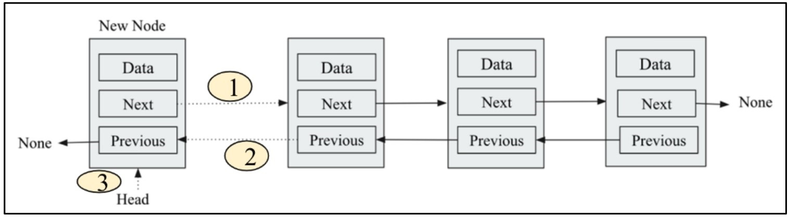

#  **Doubly Linked Lists** 🔁

A **doubly linked list** extends the concept of a singly linked list by allowing **two-way traversal**. Each node contains:

1. **Data**: The value stored in the node.
2. **Next pointer**: Reference to the **next** node in the sequence.
3. **Previous pointer**: Reference to the **previous** node in the sequence.

## 🖼️ Figure 4.18: A Single Node in a Doubly Linked List

<div align="center">
  
</div>

* **Data field** holds the node’s value.
* **Next** points forward to another node (here, `None` because no successor exists).
* **Previous** points backward to another node (here, `None` because no predecessor exists).

## 🖼️ Figure 4.19: Two Nodes in a Doubly Linked List

<div align="center">
  
</div>

* **Node A**:

  * `Next` → Node B
  * `Previous` → `None` (no node before A)
* **Node B**:

  * `Previous` → Node A
  * `Next` → `None` (no node after B)

## 📋 Key Differences from Singly Linked List

| Aspect                   | Singly Linked List                                               | Doubly Linked List                                                |
| ------------------------ | ---------------------------------------------------------------- | ----------------------------------------------------------------- |
| **Pointers per node**    | 1 (`next`)                                                       | 2 (`next` and `previous`)                                         |
| **Traversal**            | Only forward                                                     | Forward **and** backward                                          |
| **Ease of backtracking** | Requires extra work (e.g., stack or re-traverse)                 | Immediate via `previous` pointer                                  |
| **Insertion/Deletion**   | At head: O(1) without tail; At tail or middle: O(n) forward-only | At both ends or middle: can use `previous` to simplify operations |

## 🧠 Why Use a Doubly Linked List?

1. **Bidirectional Traversal**

   * You can start at the **head** and move forward via `.next`.
   * You can start at the **tail** and move backward via `.previous`.

---

# 🛠️ **Creating a Doubly Linked List Node in Python**

To build a **doubly linked list**, each node must know:

1. **Its data**
2. **Which node comes next**
3. **Which node came before**

Below is the **Python class** for a single doubly linked-list node, followed by a **detailed breakdown**.

```python
class Node:
    def __init__(self, data=None, next=None, prev=None):
        self.data = data    # 📦 Holds the node’s value
        self.next = next    # ➡️ Reference to the next node (or None)
        self.prev = prev    # ⬅️ Reference to the previous node (or None)
```

---

## 🔍 Detailed Explanation

* **`data`**

  * Stores **any value** you want to keep in this node (e.g., an integer, string, object).
  * **Default**: `None` (empty) if no data is provided.

* **`next`**

  * Points to the **next node** in the list (the one to the right in diagrams).
  * When you **create** a standalone node, it has **no successor**, so `next=None`.

* **`prev`**

  * Points to the **previous node** in the list (the one to the left in diagrams).
  * A brand-new node has **no predecessor**, so `prev=None`.

---

---

# ➕ **Doubly Linked List class**

In a **doubly linked list**, each node knows both its **next** and **previous** neighbor. To append (add to the end), we update:

1. The current **tail**’s `.next` → new node
2. The new node’s `.prev` → old tail
3. The list’s **tail** pointer → new node
4. Increase the **count**

---

## 📜 Code for `DoublyLinkedList class`

```python
class DoublyLinkedList:
    def __init__(self):
        self.head = None     # First node
        self.tail = None     # Last node
        self.count = 0       # Number of nodes

```
---

#  **Inserting a Node at the Beginning of a Doubly Linked List** ➕

In a **doubly linked list**, each node holds:

* **`data`**
* **`next`** pointer → next node
* **`prev`** pointer → previous node

We maintain two pointers in the list object:

* **`head`** → first node
* **`tail`** → last node
* **`count`** → number of nodes

Below, we’ll walk through **three key figures** illustrating insertion into an **empty list** and **non-empty list**, then present and explain the Python code, and finally show a usage example with output.

## 🖼️ Figures & Their Explanations

*(Carousel: Figures 4.20, 4.21, and 4.22)*

1. **Figure 4.20: Inserting into an *Empty* List**

<div align="center">
  
</div>

   * Both **`head`** and **`tail`** are `None` → list is empty.
   * When we create a single `new_node`, we set:

     ```plaintext
     head → new_node ← tail
     new_node.next = None
     new_node.prev = None
     ```
   * Now both pointers reference the same sole node.

1. **Figure 4.21: Inserting into a *Non-Empty* List**

<div align="center">
  
</div>

   * Initial list: A ⇄ B ⇄ C

     ```plaintext
     head → A ⇄ B ⇄ C ← tail
     ```
   * We’ll insert `new_node` before A (at the start).

1. **Figure 4.22: Step-by-Step Link Updates**
   The three dotted arrows show the order of pointer updates when inserting at the front:

<div align="center">
  
</div>

   1. **`new_node.next = head`**

      * Link the new node **forward** to the old head.
   2. **`head.prev = new_node`**

      * Link the old head **backward** to the new node.
   3. **`head = new_node`**

      * Update the list’s head pointer to the new node.

## 📝 Python Code: `append at end or append_at_start`

```python
class DoublyLinkedList:
    def __init__(self):
        self.head = None    # First node
        self.tail = None    # Last node
        self.count = 0      # Number of nodes

     def append(self, data):
        # Append an item at the end of the list.
        new_node = Node(data, None, None)
        if self.head is None:
            self.head = new_node
            self.tail = new_node
        else:
            new_node.prev = self.tail
            self.tail.next = new_node
            self.tail = new_node
        self.count += 1


    def append_at_start(self, data):
        """
        Insert a new node containing `data` at the beginning of the list.
        Runs in O(1) time.
        """
        # 1️⃣ Create the new standalone node
        new_node = Node(data, next=None, prev=None)

        # 2️⃣ Empty list? Initialize both head and tail.
        if self.head is None:
            self.head = new_node
            self.tail = new_node

        # 3️⃣ Non-empty list? Insert before current head.
        else:
            new_node.next = self.head       # ➡️ Link forward to old head
            self.head.prev = new_node       # ⬅️ Link old head backward to new_node
            self.head = new_node            # 🔄 Update head to new_node

        # 4️⃣ Maintain node count
        self.count += 1
```

# Doubly Linked List Operations

This document provides an in-depth guide to building and manipulating a **Doubly Linked List** in Python. We cover:

1. **Node Definition**
2. **Figures** illustrating insertion scenarios
3. **Append at Start** (Insert at Head) — detailed breakdown
4. **Append at End** (Insert at Tail) — detailed breakdown
5. **Usage Example**

## 1. Node Definition

Each node in a doubly linked list must store:

* **`data`**: The payload or value.
* **`next`**: A reference to the **next** node in the list (or `None`).
* **`prev`**: A reference to the **previous** node in the list (or `None`).

```python
class Node:
    def __init__(self, data=None, next=None, prev=None):
        self.data = data      # 🎁 Node’s stored value
        self.next = next      # ➡️ Pointer to the next node
        self.prev = prev      # ⬅️ Pointer to the previous node
```

When a node is created in isolation:

* `next` and `prev` both default to `None`, indicating no connections yet.


## 3. Append at Start (Insert at Head)

### Code

```python
class DoublyLinkedList:
    def __init__(self):
        self.head = None   # First node in the list
        self.tail = None   # Last node in the list
        self.count = 0     # Number of nodes

    def append_at_start(self, data):
        """
        Inserts a new node containing `data` at the beginning (head) of the list.
        Operates in O(1) time.
        """
        # 1️⃣ Create the new node with no connections
        new_node = Node(data)

        # 2️⃣ If the list is empty, both head and tail become new_node
        if self.head is None:
            self.head = new_node
            self.tail = new_node
        else:
            # 3️⃣ Link new_node → old head
            new_node.next = self.head      # Forward link
            # 4️⃣ Link old head ← new_node
            self.head.prev = new_node      # Backward link
            # 5️⃣ Update head to the new node
            self.head = new_node

        # 6️⃣ Update node count
        self.count += 1
```

### Detailed Explanation

1. **Node Creation**: `new_node = Node(data)` sets up a new node whose `.next` and `.prev` are `None`.
2. **Empty-List Case**:

   * If `self.head` is `None`, the list has no elements. Both `head` and `tail` are assigned to `new_node`.
3. **Non-Empty Case**:

   * **Forward Link**: `new_node.next = self.head` points the new node to the former head.
   * **Backward Link**: `self.head.prev = new_node` sets the old head’s previous pointer to the new node.
   * **Reassign Head**: `self.head = new_node` makes the new node the entry point of the list.
4. **Count Update**: Increments `self.count` to reflect the addition.

This method runs in **constant time** (O(1)) and ensures the list remains fully bidirectional.

## 4. Append at End (Insert at Tail)

### Code

```python
    def append(self, data):
        """
        Appends a new node containing `data` at the end (tail) of the list.
        Operates in O(1) time using the tail pointer.
        """
        # 1️⃣ Create the new node
        new_node = Node(data)

        # 2️⃣ If the list is empty, initialize head and tail
        if self.head is None:
            self.head = new_node
            self.tail = new_node
        else:
            # 3️⃣ Backward link: new_node.prev → old tail
            new_node.prev = self.tail
            # 4️⃣ Forward link: old tail.next → new_node
            self.tail.next = new_node
            # 5️⃣ Move tail pointer to new_node
            self.tail = new_node

        # 6️⃣ Update node count
        self.count += 1
```

### Detailed Explanation

1. **Node Creation**: `new_node = Node(data)`.
2. **Empty-List Case**:

   * Both `head` and `tail` are assigned to `new_node` when the list was empty.
3. **Non-Empty Case**:

   * **Backward Link**: `new_node.prev = self.tail` attaches the new node back to the old tail.
   * **Forward Link**: `self.tail.next = new_node` links the old tail to the new node.
   * **Reassign Tail**: `self.tail = new_node` updates the tail to the newly added node.
4. **Count Update**: `self.count += 1`.

Again, this method is **O(1)**, thanks to direct access via `self.tail`.

## 5. Usage Example

```python
# Initialize list and append elements
dll = DoublyLinkedList()
dll.append('egg')
dll.append('ham')
dll.append('spam')

# Before insertion at head
enumeration = []
node = dll.head
while node:
    enumeration.append(node.data)
    node = node.next
print("Before append_at_start:", enumeration)

# Insert at head
dll.append_at_start('book')

# After insertion at head
enumeration = []
node = dll.head
while node:
    enumeration.append(node.data)
    node = node.next
print("After append_at_start:", enumeration)
```

**Expected Output:**

```
Before append_at_start: ['egg', 'ham', 'spam']
After append_at_start: ['book', 'egg', 'ham', 'spam']
```
