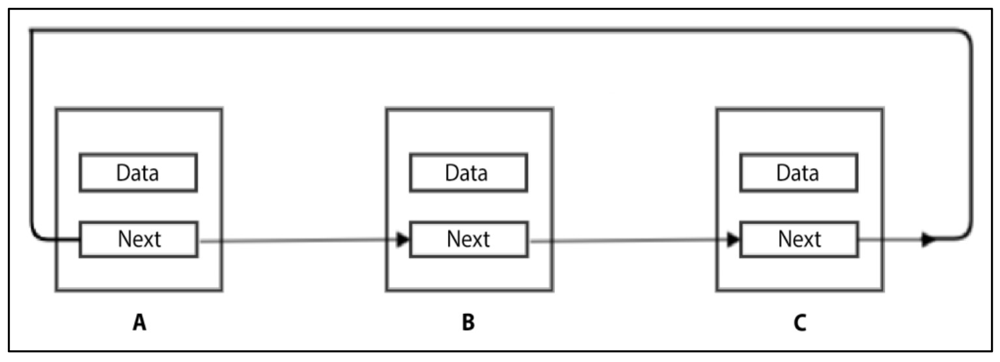
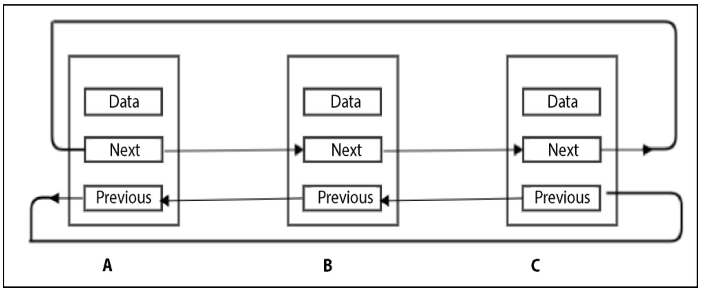
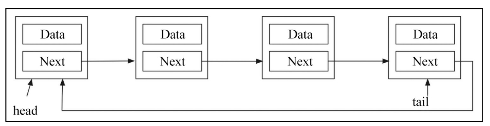
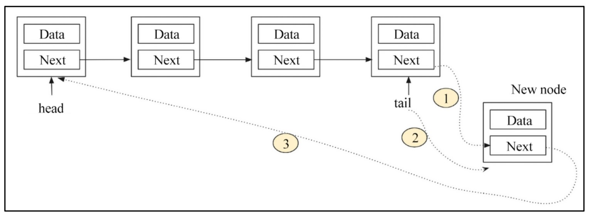
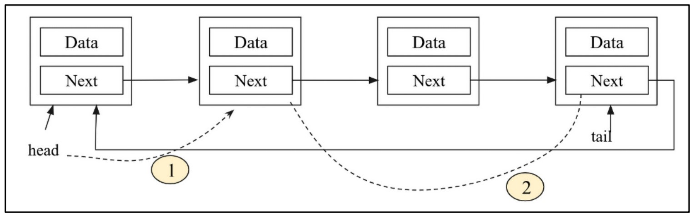
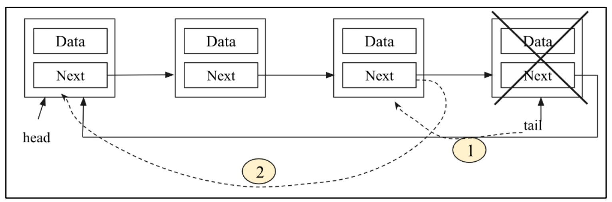
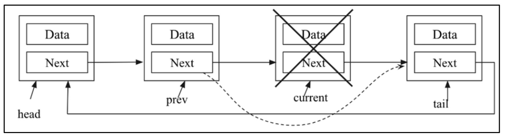

#  **Circular Linked Lists** 🔄

## 📋 Table of Contents
- [**Circular Linked Lists** 🔄](#circular-linked-lists-)
  - [📋 Table of Contents](#-table-of-contents)
  - [🌟 What is a Circular Linked List?](#-what-is-a-circular-linked-list)
  - [🔗 Types of Circular Linked Lists](#-types-of-circular-linked-lists)
    - [1. 🔁 Singly Circular Linked List](#1--singly-circular-linked-list)
    - [2. 🔄 Doubly Circular Linked List](#2--doubly-circular-linked-list)
  - [📝 Key Points](#-key-points)
  - [🚀 Implementation Note](#-implementation-note)
- [**Appending Nodes in a Circular Linked List** 🟢](#appending-nodes-in-a-circular-linked-list-)
  - [✨ Circular Linked List: Adding Node at the End](#-circular-linked-list-adding-node-at-the-end)
    - [📚 Creating and Traversing a Circular Linked List](#-creating-and-traversing-a-circular-linked-list)
    - [➕ Appending Items](#-appending-items)
    - [🪢 Steps to Add a Node at the End](#-steps-to-add-a-node-at-the-end)
    - [🧑‍💻 Implementation](#-implementation)
      - [How it works:](#how-it-works)
    - [🔄 Traversing the Circular List](#-traversing-the-circular-list)
    - [🏷️ Example: Creating \& Printing a Singly Circular Linked List](#️-example-creating--printing-a-singly-circular-linked-list)
      - [🖨️ Output:](#️-output)
  - [📝 Note](#-note)
  - [🔍 **Querying a Circular Linked List**](#-querying-a-circular-linked-list)
    - [🧑‍💻 Example: Traversing a Circular Linked List with a Counter](#-example-traversing-a-circular-linked-list-with-a-counter)
      - [📃 Explanation:](#-explanation)
- [**Deleting an Element in a Circular Linked List** 🗑️](#deleting-an-element-in-a-circular-linked-list-️)
  - [1️⃣ Deleting the Head Node](#1️⃣-deleting-the-head-node)
  - [2️⃣ Deleting the Tail (Last) Node](#2️⃣-deleting-the-tail-last-node)
  - [3️⃣ Deleting an Intermediate Node](#3️⃣-deleting-an-intermediate-node)
  - [🧑‍💻 Delete Operation: Python Implementation](#-delete-operation-python-implementation)
    - [⚡ **How it works:**](#-how-it-works)
  - [🏷️ Example: Using the Delete Operation](#️-example-using-the-delete-operation)
    - [🖨️ Output](#️-output-1)
  - [⏱️ Time Complexity](#️-time-complexity)
  - [⚖️ Which to Use?](#️-which-to-use)

---

Circular linked lists are a special case of linked lists where the endpoints are connected. In a circular linked list, the last node in the list points back to the first node, forming a loop.

## 🌟 What is a Circular Linked List?

A **circular linked list** connects the last node back to the first node.

* There is **no end node**; all nodes point to the next node (and also to the previous node in the case of a doubly linked list).
* **No node** will point to `None`.
  
## 🔗 Types of Circular Linked Lists

Circular linked lists can be based on both **singly** and **doubly** linked lists.

### 1. 🔁 Singly Circular Linked List

In a singly circular linked list, the `next` pointer of the last node points back to the first node, making a loop.

<div align="center">
  
</div>

*Figure 4.29: Example of a circular list based on a singly linked list*

---

### 2. 🔄 Doubly Circular Linked List

In a doubly circular linked list:

* The **first node** points to the last node with its `previous` pointer.
* The **last node** points back to the first node with its `next` pointer.

<div align="center">
  
</div>

*Figure 4.30: Example of a circular list based on a doubly linked list*


## 📝 Key Points

* In a **singly circular linked list**, the last node points back to the first node through the `next` pointer.
* In a **doubly circular linked list**, both the `next` and `previous` pointers connect the last and first nodes, creating a two-way loop.
* There is **no end node**; traversal can continue infinitely unless you set a stopping condition in your code.


## 🚀 Implementation Note

We will first look at the implementation of a **singly linked circular list**.
Once you understand the basics of singly and doubly linked lists, implementing a doubly linked circular list becomes very straightforward!

---

#  **Appending Nodes in a Circular Linked List** 🟢

Circular linked lists are mostly similar to singly linked lists, but you need to be careful when managing the link from the **last node back to the first node**.

## ✨ Circular Linked List: Adding Node at the End

* We can **reuse the Node class** and most of the `SinglyLinkedList` class.
* We will focus on the parts where the **circular list implementation differs** from a normal singly linked list.

### 📚 Creating and Traversing a Circular Linked List

```python
class CircularList:
    def __init__ (self):
        self.tail = None
        self.head = None
        self.size = 0
```

* `self.tail`: Points to the last node.
* `self.head`: Points to the first node.

### ➕ Appending Items

Here, we want to add a node at the **end** of a circular linked list, as shown in the figures below.

<div align="center">
  
</div>


*Figure 4.31: Example of a circular linked list for adding a node at the end*

<div align="center">
  
</div>

*Figure 4.32: Inserting a node at the end of the singly circular list*

---

### 🪢 Steps to Add a Node at the End

To add a node at the end, we **update three links**:

1. The `next` pointer of the last node to point to a new node.
2. The `next` pointer of the new node to point to the head node.
3. Update the `tail` pointer to point to the new node.

### 🧑‍💻 Implementation

```python
def append(self, data):
    node = Node(data)
    if self.tail:
        self.tail.next = node
        self.tail = node
        node.next = self.head
    else:
        self.head = node
        self.tail = node
        self.tail.next = self.tail
    self.size += 1
```

#### How it works:

* If the list is **empty**:

  * The new node becomes both the `head` and `tail`.
  * The `next` pointer of the new node points to itself (since it's the only node).
* If the list is **not empty**:

  * The current `tail.next` is set to the new node.
  * The `tail` pointer is updated to the new node.
  * The new node’s `next` points to the `head`.

### 🔄 Traversing the Circular List

You can use the `iter()` method to traverse all elements:

```python
def iter(self):
    current = self.head
    while current:
        val = current.data
        current = current.next
        yield val
```

### 🏷️ Example: Creating & Printing a Singly Circular Linked List

```python
words = CircularList()
words.append('eggs')
words.append('ham')
words.append('spam')
counter = 0
for word in words.iter():
    print(word)
    counter += 1
    if counter > 2:
        break
```

#### 🖨️ Output:

```
eggs
ham
spam
```

## 📝 Note

* Appending an element at any **intermediate position** in a circular list is exactly the same as its implementation in a singly linked list.

---

## 🔍 **Querying a Circular Linked List**

**Traversing a circular linked list is very convenient** because you don’t need to look for the starting point — you can start anywhere!
But you **must define a stopping condition**, otherwise your program will enter an infinite loop.

* The typical solution is to use a **counter variable** or another exit condition, depending on your requirements.

### 🧑‍💻 Example: Traversing a Circular Linked List with a Counter

```python
words = CircularList()
words.append('eggs')
words.append('ham')
words.append('spam')
counter = 0
for word in words.iter():
    print(word)
    counter += 1
    if counter > 100:
        break
```

#### 📃 Explanation:

* We **add three items** to the circular linked list: `'eggs'`, `'ham'`, `'spam'`.
* Then, we **iterate through the list**, printing each value.
* The **counter** ensures we only loop 100 times.
  (Without this, the traversal would run forever due to the circular nature of the list!)

> **Tip:**
> You can make the **exit condition** anything you like — such as stopping after printing a certain value, or after a set number of iterations.

---

#  **Deleting an Element in a Circular Linked List** 🗑️

Deleting a node in a circular list is similar to appending — but you must be careful to always keep the circle intact!
There are **three main scenarios** when deleting an item:

## 1️⃣ Deleting the Head Node

* **Step 1:** Make the second node the new head.
* **Step 2:** The last node's `next` pointer should point to the new head.


<div align="center">
  
</div> 

*(Figure 4.33)*

## 2️⃣ Deleting the Tail (Last) Node

* **Step 1:** Make the second-last node the new tail.
* **Step 2:** The new tail's `next` pointer should point back to the head node.

<div align="center">
  
</div> 

*(Figure 4.34)*

## 3️⃣ Deleting an Intermediate Node

* Simply link the previous node of the target to the next node of the target.

<div align="center">
  
</div>

*(Figure 4.35)*

## 🧑‍💻 Delete Operation: Python Implementation

```python
def delete(self, data):
    current = self.head
    prev = self.head
    flag = False
    while prev == current or prev != self.tail:
        if current.data == data:
            if current == self.head:
                # item to be deleted is head node
                self.head = current.next
                self.tail.next = self.head
            elif current == self.tail:
                # item to be deleted is tail node
                self.tail = prev
                prev.next = self.head
            else:
                # item to be deleted is an intermediate node
                prev.next = current.next
            self.size -= 1
            flag = True
            return
        prev = current
        current = current.next
    if flag is False:
        print("Item not present in the list")
```

### ⚡ **How it works:**

* Iterates over the elements to find the node with the desired data.
* Uses `prev` and `current` pointers to keep track of links.
* **Important:** There’s no `None` in a circular list, so we use the condition `prev == current or prev != self.tail` to ensure all nodes are checked.
* Handles all three deletion scenarios (head, tail, intermediate).
* Prints a message if the item is not found.

## 🏷️ Example: Using the Delete Operation

```python
words = CircularList()
words.append('eggs')
words.append('ham')
words.append('spam')
words.append('foo')
words.append('bar')

print("Let us try to delete something that isn't in the list.")
words.delete('socks')
counter = 0
for item in words.iter():
    print(item)
    counter += 1
    if counter > 4:
        break

print("Let us delete something that is there.")
words.delete('foo')
counter = 0
for item in words.iter():
    print(item)
    counter += 1
    if counter > 3:
        break
```
### 🖨️ Output

```
Let us try to delete something that isn't in the list.
Item not present in the list
eggs
ham
spam
foo
bar

Let us delete something that is there.
eggs
ham
spam
bar
```

## ⏱️ Time Complexity

* **Insert at first/last position:** O(1)
* **Insert or delete at a given location:** O(n) *(must traverse the list)*
* **Singly Linked List:** Saves memory, but only supports one-way traversal.
* **Doubly Linked List:** Uses more memory (two pointers), but allows searching/traversing in both directions.

## ⚖️ Which to Use?

* **Use singly linked lists** to save memory.
* **Use doubly linked lists** when you need efficient searching in both directions.
* **Use circular linked lists** for applications that need continuous iteration over the nodes.

---

