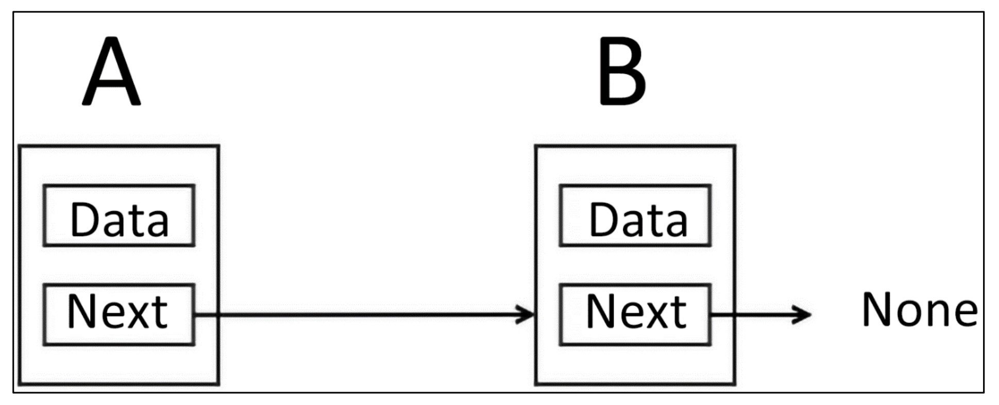
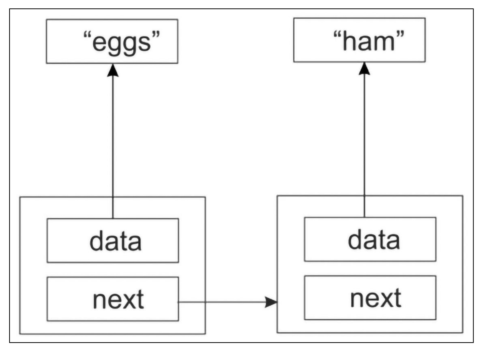
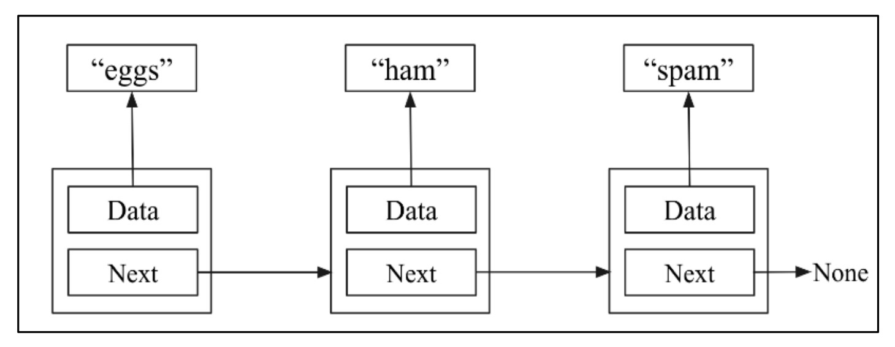

# **Introducing to Linked Lists** 🔗

A **linked list** is a fundamental and widely used data structure in computer science. It offers flexibility and efficiency in memory usage and is ideal when dealing with dynamic data.

## 🧠 Key Properties of Linked Lists

1. **Data Stored in Separate Memory Locations**
   Each data element (called a **node**) is stored in a separate location in memory. These nodes are connected through **pointers**.

   > 🔗 A **pointer** is a variable that stores the **memory address** of another variable.

2. **Linked via Pointers**
   Every node contains:

   * 🗃 **Data** — the actual value
   * 🧭 **Next** — a pointer that links to the next node in the list

3. **Dynamic Size**
   Unlike arrays, linked lists can **grow or shrink** during program execution. You don’t need to define the size in advance.


## 🔍 Breakdown of a Node

Each **node** in a linked list has the following structure:

```plaintext
┌───────────┐
│   Data    │
├───────────┤
│   Next →  │──→ Next Node or None
└───────────┘
```

* **Data** stores the actual value.
* **Next** is a pointer to the next node (or `None` if it is the last node).

## 🖼️ Diagram Explanation

<div align="center">
  
</div>

In the figure above:

* `A` and `B` are two nodes.
* Node `A` holds data and a pointer to node `B`.
* Node `B` holds data and a pointer to `None`, indicating it is the **last node**.

---

Here is your content professionally converted into **Markdown format** with **detailed English explanation**, **no skipping**, and **emojis** for clarity.

---

#  **Nodes and Pointers** 📌

A **node** is a key element used in many data structures — especially **linked lists**. Each node serves as a **container** that holds two essential parts:

* **Data**: The actual value we want to store (e.g., a string like `"eggs"`).
* **Pointer (Link)**: A reference that points to another node.

## 🔗 Two-Node Linked List

### 🖼️ **Figure 4.3**: A sample linked list of two nodes

<div align="center">
  
</div>

This figure demonstrates a simple **linked list with two nodes**:

1. **First Node**:

   * Contains the string `"eggs"` as its **data**.
   * Its **next pointer** links to the second node.

2. **Second Node**:

   * Contains the string `"ham"` as **data**.
   * Its **next pointer** does not point anywhere (i.e., it is `None` or `null` in most programming languages).

👉 The nodes **do not directly store the string data**. Instead, they store a **pointer (reference)** to the memory address where the string is located. This is why we say:

> “The string is not actually stored in the node, rather the address of the string is stored.”

## ➕ Adding a Third Node

We can easily **extend this list** by adding a new node.

### 🖼️ **Figure 4.4**: A sample linked list of three nodes

<div align="center">
  
</div>

Now we have:

1. 🥚 **"eggs" Node**
   → points to ➡️

2. 🍖 **"ham" Node**
   → points to ➡️

3. 🥫 **"spam" Node**
   → points to ➡️ **Nothing (`None`)**

---

## ✅ Final Understanding

* We have created **three nodes**, each storing:

  * `"eggs"` 🥚
  * `"ham"` 🍖
  * `"spam"` 🥫

* The **linking order** is:

  ```plaintext
  eggs → ham → spam → None
  ```

* The **last node (`spam`)** must explicitly point to `None` or `null` to indicate:

  > “This is the end of the linked list.”

💡 This is a crucial part of linked list design — it allows algorithms to **know when to stop traversing**.

---
