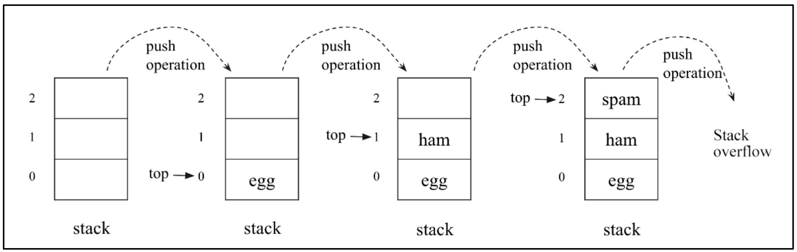
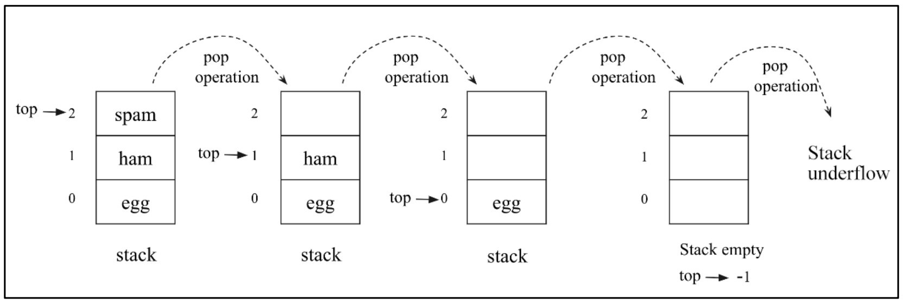
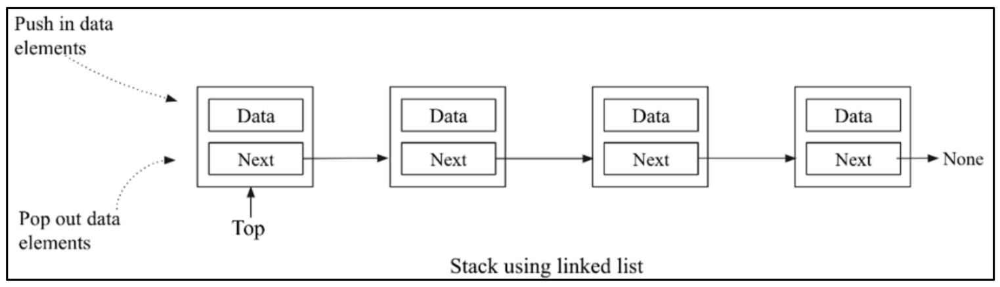
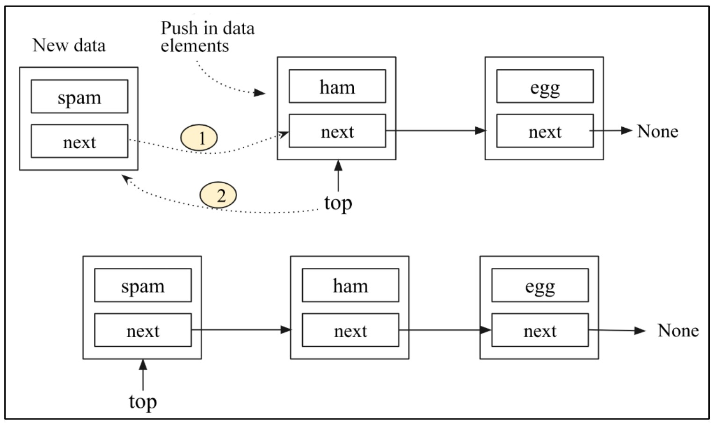
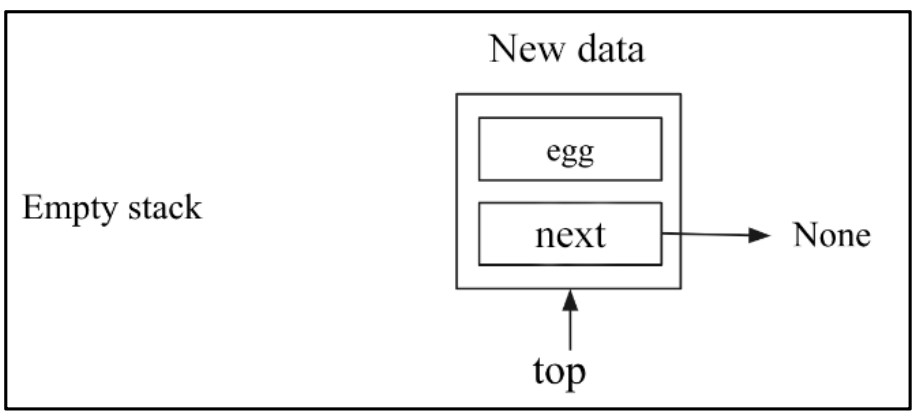
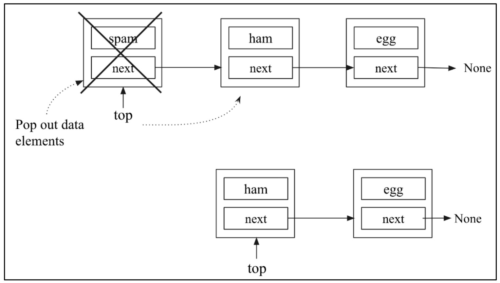
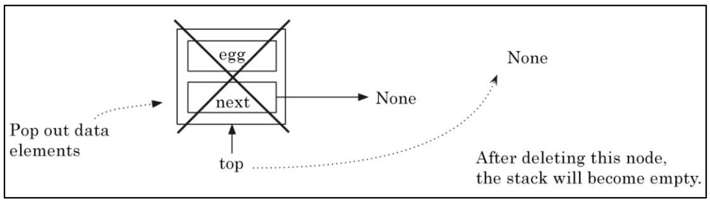

#  **All About Stack Data structure** 🥞

## � Table of Contents

- [**All About Stack Data structure** 🥞](#all-about-stack-data-structure-)
  - [� Table of Contents](#-table-of-contents)
  - [�📚 Introduction](#-introduction)
  - [🖼️ Figure 5.1: Example of a Stack](#️-figure-51-example-of-a-stack)
  - [🔍 How Stack Works](#-how-stack-works)
  - [🚦 Stack Constraints](#-stack-constraints)
  - [🛠️ Stack Operations](#️-stack-operations)
  - [🖼️ Figure 5.2: Demonstration of Push and Pop Operations](#️-figure-52-demonstration-of-push-and-pop-operations)
  - [📝 Table 5.1: Stack Operations Example](#-table-51-stack-operations-example)
  - [🎯 Where Are Stacks Used?](#-where-are-stacks-used)
  - [🧑‍💻 Function Call Example](#-function-call-example)
    - [👣 What Happens When We Run This?](#-what-happens-when-we-run-this)
  - [🖼️ Figure 5.3: Steps for a Sequence of Events During Function Calls](#️-figure-53-steps-for-a-sequence-of-events-during-function-calls)
    - [Step-by-Step Explanation:](#step-by-step-explanation)
    - [🖨️ Program Output](#️-program-output)
- [**Stack Implementation Using Arrays** 📦](#stack-implementation-using-arrays-)
    - [📋 Two Main Stack Implementations:](#-two-main-stack-implementations)
  - [🖼️ Figure 5.4: Push Operations in an Array-Based Stack](#️-figure-54-push-operations-in-an-array-based-stack)
    - [Step-by-Step Push Operation:](#step-by-step-push-operation)
  - [🐍 Python Code for Stack Push Operation](#-python-code-for-stack-push-operation)
    - [🧑‍💻 Example Usage](#-example-usage)
  - [🖼️ Figure 5.5: Pop Operations in an Array-Based Stack](#️-figure-55-pop-operations-in-an-array-based-stack)
    - [Step-by-Step Pop Operation:](#step-by-step-pop-operation)
  - [🐍 Python Code for Stack Pop Operation](#-python-code-for-stack-pop-operation)
    - [🧑‍💻 Example Usage](#-example-usage-1)
  - [👀 Python Code for Stack Peek Operation](#-python-code-for-stack-peek-operation)
- [**Stack Implementation Using Linked Lists** 🔗](#stack-implementation-using-linked-lists-)
  - [📚 Introduction](#-introduction-1)
  - [🖼️ Figure 5.6: Stack Representation Using a Linked List](#️-figure-56-stack-representation-using-a-linked-list)
    - [Figure Explanation:](#figure-explanation)
  - [🏗️ Node Class Implementation](#️-node-class-implementation)
  - [🏢 Stack Class Implementation](#-stack-class-implementation)
  - [💡 Key Points for Stack Using Linked List](#-key-points-for-stack-using-linked-list)
  - [**Stack Push Operation** 📝](#stack-push-operation-)
  - [🖼️ Figure 5.7: Workings of the Push Operation on the Stack](#️-figure-57-workings-of-the-push-operation-on-the-stack)
    - [Step-by-Step Explanation:](#step-by-step-explanation-1)
  - [🖼️ Figure 5.8: Inserting First Node into an Empty Stack](#️-figure-58-inserting-first-node-into-an-empty-stack)
  - [🔥 How the Push Operation Works](#-how-the-push-operation-works)
    - [If the stack **already has elements**:](#if-the-stack-already-has-elements)
    - [If the stack is **empty**:](#if-the-stack-is-empty)
  - [🐍 Python Code: Push Operation for Stack (Linked List)](#-python-code-push-operation-for-stack-linked-list)
  - [🧑‍💻 Example: Creating a Stack and Pushing Elements](#-example-creating-a-stack-and-pushing-elements)
  - [**Stack Pop Operation**  🔄](#stack-pop-operation--)
  - [🖼️ Figure 5.9: Workings of the Pop Operation on the Stack](#️-figure-59-workings-of-the-pop-operation-on-the-stack)
    - [Step-by-Step Explanation:](#step-by-step-explanation-2)
  - [🖼️ Figure 5.10: Pop on a Stack with One Element](#️-figure-510-pop-on-a-stack-with-one-element)
  - [🐍 Python Code: Pop Operation for Stack (Linked List)](#-python-code-pop-operation-for-stack-linked-list)
  - [🧑‍💻 Example: Popping from a Stack](#-example-popping-from-a-stack)
  - [after popping, the new stack is `"ham"`, `"egg"`.](#after-popping-the-new-stack-is-ham-egg)
  - [**Peek Operation in Stacks** 👀](#peek-operation-in-stacks-)
  - [📚 What is the Peek Operation?](#-what-is-the-peek-operation)
  - [🛠️ How Does Peek Work?](#️-how-does-peek-work)
  - [🐍 Python Code: Peek Operation (Stack Using Linked List)](#-python-code-peek-operation-stack-using-linked-list)
  - [🧑‍💻 Example Usage](#-example-usage-2)
  - [🚦 Key Point](#-key-point)
  - [🌍 Real-World Note](#-real-world-note)

---

## �📚 Introduction

A **stack** is a data structure that stores data, just like a stack of plates in a kitchen.
You can put a plate **on the top** of the stack, and when you need a plate, you always **take it from the top**.

## 🖼️ Figure 5.1: Example of a Stack

<div align="center">
  
</div>

<div align="center">

  **Figure 5.1: Example of a stack**

</div>

**Explanation:**

* Imagine a stack of plates 🍽️.
* You always add a new plate on the top.
* When you need a plate, you pick the one from the top.
* **The last plate added will always be the first to be removed.**

## 🔍 How Stack Works

* The above diagram shows a stack of plates.
* **Adding a plate:** You can only add a plate by placing it **on top** of the pile.
* **Removing a plate:** You can only remove the plate that's **on top**.

## 🚦 Stack Constraints

A **stack** stores data in a specific order (like arrays and linked lists), **but** with special rules:

* **Push:** Data can **only be inserted at the end (top)**.
* **Pop:** Data can **only be deleted from the end (top)**.
* **Peek:** You can **only read the last (top) data element**.

So, stacks are **Last In, First Out (LIFO)** structures.
That means **the last item added is always the first to be removed**.

## 🛠️ Stack Operations

There are **two main operations** on stacks:

1. **Push:** Add an element to the top of the stack.
2. **Pop:** Remove (and return) the top element of the stack.
3. **Peek:** See (but not remove) the top element.

All these operations use a pointer called **`top`**.

## 🖼️ Figure 5.2: Demonstration of Push and Pop Operations

<div align="center">
  
</div>

<div align="center">

*Figure 5.2: Demonstration of push and pop operations in a stack*

</div>


**Explanation of Figure 5.2:**

* **Push in data elements:** Adds new elements to the top.
* **Pop out data elements:** Removes elements from the top.
* **Peek:** Allows you to see the current top element without removing it.
* The stack grows and shrinks only at the **top**.

## 📝 Table 5.1: Stack Operations Example

| Stack Operation | Size | Contents         | Operation Results                                                                                  |
| --------------- | ---- | ---------------- | -------------------------------------------------------------------------------------------------- |
| `stack()`       | 0    | `[]`             | Stack object created, which is empty.                                                              |
| `push "egg"`    | 1    | `['egg']`        | One item "egg" is added to the stack.                                                              |
| `push "ham"`    | 2    | `['egg', 'ham']` | One more item, "ham", is added to the stack.                                                       |
| `peek()`        | 2    | `['egg', 'ham']` | The top element, "ham", is returned.                                                               |
| `pop()`         | 1    | `['egg']`        | The "ham" item is popped off and returned. (This item was added last, so it is removed first.)     |
| `pop()`         | 0    | `[]`             | The "egg" item is popped off and returned. (This is the first item added, so it is returned last.) |

---

## 🎯 Where Are Stacks Used?

Stacks are used in many places.
One of the most common uses is to **keep track of the return address during function calls**.

## 🧑‍💻 Function Call Example

Let's look at this simple program:

```python
def b():
    print('b')
def a():
    b()
a()
print("done")
```

### 👣 What Happens When We Run This?

When the program executes `a()`, a specific sequence of events happens.
Let’s visualize these steps!

## 🖼️ Figure 5.3: Steps for a Sequence of Events During Function Calls

<div align="center">
  
</div>

<div align="center">

*Figure 5.3: Steps for a sequence of events during function calls in our sample program*

</div>


### Step-by-Step Explanation:

1. **Push Current Instruction Address:**

   * The address of the current instruction is **pushed onto the stack**.
   * Execution jumps to the definition of `a()`.

2. **Call Function b():**

   * Inside function `a()`, function `b()` is called.

3. **Push Return Address of b():**

   * The return address of `b()` is **pushed onto the stack**.
   * Once everything in `b()` is done, the return address is **popped off the stack**, taking us back to `a()`.

4. **Complete Function a():**

   * After all instructions in `a()` are complete, the return address is **popped off the stack** again, bringing us back to the main program.

### 🖨️ Program Output

```
b
done
```

#  **Stack Implementation Using Arrays** 📦

A **stack** stores data in sequential order (like arrays and linked lists) with a key rule:
**Data can only be added or removed from one end** of the stack, always following the **Last In, First Out (LIFO)** principle.

### 📋 Two Main Stack Implementations:

* **Arrays:** Fixed length stack
* **Linked Lists:** Stack of variable length

**Array-based stacks** need careful checks:

* If you try to add to a full stack ➡️ **Overflow error**
* If you try to remove from an empty stack ➡️ **Underflow error**

## 🖼️ Figure 5.4: Push Operations in an Array-Based Stack

<div align="center">
  
</div>

<div align="center">

*Figure 5.4: Sequence of push operations in a stack implementation using an array*

</div>


### Step-by-Step Push Operation:

1. **Initial Stack:**

   * All positions are empty.
   * `top = -1` (Stack is empty)

2. **Push "egg":**

   * `top` is incremented to `0`
   * `"egg"` is placed at position 0

3. **Push "ham":**

   * `top` is incremented to `1`
   * `"ham"` is placed at position 1

4. **Push "spam":**

   * `top` is incremented to `2`
   * `"spam"` is placed at position 2

5. **Push (Stack Overflow):**

   * Attempt to push another element.
   * **Error:** Stack is full, cannot add more elements!
   * **Stack Overflow** occurs.

## 🐍 Python Code for Stack Push Operation

```python
size = 3
data = [0] * size   # Initialize the stack

top = -1
def push(x):
    global top
    if top >= size - 1:
        print("Stack Overflow")
    else:
        top = top + 1
        data[top] = x
```

* **Initialize:** `top = -1` means the stack is empty.
* **Check overflow:** If `top` is at the last index, cannot add new elements.
* **Push:** Increment `top` and add new value.

### 🧑‍💻 Example Usage

```python
push('egg')
push('ham')
push('spam')
print(data[0:top+1])   # Output: ['egg', 'ham', 'spam']
push('new')            # Stack Overflow
push('new2')           # Stack Overflow
```

**Output:**

```
['egg', 'ham', 'spam']
Stack Overflow
Stack Overflow
```

## 🖼️ Figure 5.5: Pop Operations in an Array-Based Stack

<div align="center">
  
</div>

<div align="center">

*Figure 5.5: Sequence of the pop operation in a stack implementation using an array*

</div>

### Step-by-Step Pop Operation:

1. **Initial Stack:**

   * Stack contains `["egg", "ham", "spam"]`
   * `top = 2`

2. **Pop "spam":**

   * Remove `"spam"` from position 2
   * `top` is decremented to `1`

3. **Pop "ham":**

   * Remove `"ham"` from position 1
   * `top` is decremented to `0`

4. **Pop "egg":**

   * Remove `"egg"` from position 0
   * `top` is decremented to `-1`
   * Stack is now empty

5. **Pop (Stack Underflow):**

   * Attempt to pop from empty stack
   * **Error:** Stack is empty, cannot remove elements!
   * **Stack Underflow** occurs

---

## 🐍 Python Code for Stack Pop Operation

```python
def pop():
    global top
    if top == -1:
        print("Stack Underflow")
        return None
    else:
        value = data[top]
        data[top] = None
        top -= 1
        return value
```

* **Check underflow:** If `top == -1`, stack is empty.
* **Pop:** Return the value at `top` and decrement `top`.

### 🧑‍💻 Example Usage

```python
print(pop())          # 'spam'
print(data[0:top+1])  # ['egg', 'ham']

print(pop())          # 'ham'
print(data[0:top+1])  # ['egg']

print(pop())          # 'egg'
print(data[0:top+1])  # []

print(pop())          # Stack Underflow
print(data[0:top+1])  # []
```

**Output:**

```
spam
['egg', 'ham']
ham
['egg']
egg
[]
Stack Underflow
[]
```

## 👀 Python Code for Stack Peek Operation

```python
def peek():
    global top
    if top == -1:
        print("Stack is empty")
    else:
        print(data[top])
```

* **Check if empty:** If `top == -1`, stack is empty.
* **Peek:** Print the value at the `top` position.


#  **Stack Implementation Using Linked Lists** 🔗

## 📚 Introduction

A **stack** can also be implemented using a **linked list**.
This approach is flexible and can grow or shrink as needed (unlike fixed-size array stacks).

## 🖼️ Figure 5.6: Stack Representation Using a Linked List

<div align="center">
  
</div>

<div align="center">

*Figure 5.6: Representation of the stack using a linked list*

</div>


### Figure Explanation:

* Each **node** contains two parts:

  1. **Data:** The value stored in the node
  2. **Next:** A reference to the next node
* The **top** points to the first node (the top of the stack)
* **Push:** Insert a new node at the top
* **Pop:** Remove the node from the top
* The stack ends when the `next` pointer of a node is `None`

## 🏗️ Node Class Implementation

To build a stack using a linked list, first define a **Node** class:

```python
class Node:
    def __init__(self, data=None):
        self.data = data      # Holds the value
        self.next = None      # Reference to the next node
```

* Each node holds data and a reference to the next node.

## 🏢 Stack Class Implementation

Next, define a **Stack** class.
This is similar to a singly linked list but with stack-specific constraints:

```python
class Stack:
    def __init__(self):
        self.top = None      # Pointer to the top node
        self.size = 0        # Number of elements in the stack
```

* **`top`:** Points to the node at the top of the stack (where push and pop happen)
* **`size`:** Tracks the current number of elements

## 💡 Key Points for Stack Using Linked List

1. **Track the Top Node:**
   To push or pop, always use the node pointed to by `top`.

2. **Maintain Stack Size:**
   Keep a variable (`size`) to quickly know how many elements are in the stack.

3. **Dynamic Size:**
   Unlike array-based stacks, linked list stacks can grow or shrink without a fixed limit.


##  **Stack Push Operation** 📝

The **push operation** is used to **add a new element to the top of the stack**.
For linked list-based stacks, there’s **no fixed size**—so you don’t need to check for overflow.


## 🖼️ Figure 5.7: Workings of the Push Operation on the Stack

<div align="center">
  
</div>

<div align="center">

*Figure 5.7: Workings of the push operation on the stack*

</div>


### Step-by-Step Explanation:

Suppose the stack contains `"egg"` and `"ham"`.

1. **Create a new node:**

   * New node contains data `"spam"`
2. **Update pointers:**

   * The `next` of the new node points to the current `top` (which is `"ham"`)
   * The stack’s `top` pointer now points to the new node (`"spam"`)

**Result:**

* The new node `"spam"` is now at the top.
* The stack from top to bottom is: `spam → ham → egg → None`


## 🖼️ Figure 5.8: Inserting First Node into an Empty Stack

<div align="center">
  
</div>

<div align="center">

*Figure 5.8: Insertion of the data element “egg” into an empty stack*

</div>


**Explanation:**

* If the stack is empty, just point `top` to the new node (`"egg"`), whose `next` is `None`.

## 🔥 How the Push Operation Works

### If the stack **already has elements**:

1. The new node’s `next` points to the node that was previously at the top.
2. The stack’s `top` pointer is updated to point to the new node.

### If the stack is **empty**:

* The new node becomes the top node (`top` points to this new node).

## 🐍 Python Code: Push Operation for Stack (Linked List)

```python
def push(self, data):
    # Create a new node
    node = Node(data)
    if self.top:
        node.next = self.top
        self.top = node
    else:
        self.top = node
    self.size += 1
```

* **Create a new node** with the given data.
* **If the stack is not empty:**

  * New node’s `next` points to the current `top`
  * Update `top` to the new node
* **If the stack is empty:**

  * `top` simply points to the new node
* **Increase stack size** by 1

## 🧑‍💻 Example: Creating a Stack and Pushing Elements

```python
words = Stack()
words.push('egg')
words.push('ham')
words.push('spam')
# Print the stack elements
current = words.top
while current:
    print(current.data)
    current = current.next
```

**Output:**

```
spam
ham
egg
```

**Explanation:**

* We pushed `"egg"`, `"ham"`, and `"spam"` to the stack.
* The last item pushed (`"spam"`) appears at the top, showing the **LIFO** nature.


##  **Stack Pop Operation**  🔄

The **pop operation** is used to **remove (and return) the top element of the stack**.
If the stack is empty, the pop operation returns `None` or prints an error message.


## 🖼️ Figure 5.9: Workings of the Pop Operation on the Stack

<div align="center">
  
</div>

<div align="center">

*Figure 5.9: Workings of the pop operation on the stack*

</div>


### Step-by-Step Explanation:

Suppose the stack contains `"spam"`, `"ham"`, and `"egg"`.

1. **Check if Stack is Empty:**

   * If not, continue. Otherwise, print an error.

2. **Pop Operation:**

   * The top node (`"spam"`) is removed (popped).
   * The stack’s `top` pointer now points to the next node (`"ham"`).

**Result:**

* `"ham"` is now at the top.
* The stack from top to bottom: `ham → egg → None`

## 🖼️ Figure 5.10: Pop on a Stack with One Element

<div align="center">
  
</div>

<div align="center">

*Figure 5.10: The pop operation on a stack with one element*

</div>


**Explanation:**

* When there’s only one element in the stack (e.g., `"egg"`):

  * The pop operation removes that node.
  * The `top` pointer is set to `None`.
  * The stack becomes **empty** after this operation.

## 🐍 Python Code: Pop Operation for Stack (Linked List)

```python
def pop(self):
    if self.top:
        data = self.top.data
        self.size -= 1
        if self.top.next:  # Check if there's more than one node
            self.top = self.top.next
        else:
            self.top = None
        return data
    else:
        print("Stack is empty")
```

* **If the stack is not empty:**

  * Save the top node’s data to return later.
  * Decrease the size by 1.
  * If there’s more than one node, update `top` to point to the next node.
  * If only one node, set `top` to `None` (stack becomes empty).
* **If the stack is empty:**

  * Print an error message.

## 🧑‍💻 Example: Popping from a Stack

```python
words.pop()
current = words.top
while current:
    print(current.data)
    current = current.next
```

**Output:**

```
ham
egg
```

**Explanation:**

* If the stack originally contained `"spam"`, `"ham"`, `"egg"`,
  after popping, the new stack is `"ham"`, `"egg"`.
-

##  **Peek Operation in Stacks** 👀

## 📚 What is the Peek Operation?

The **peek operation** returns the **top element** from the stack **without deleting it**.

* **Peek**: Just looks at the top element.
* **Pop**: Looks at **and removes** the top element.

> **Peek allows you to check what's on top without changing the stack!**

## 🛠️ How Does Peek Work?

* If there **is** a top element, return its value.
* If the stack is **empty**, print `"Stack is empty"`.

## 🐍 Python Code: Peek Operation (Stack Using Linked List)

```python
def peek(self):
    if self.top:
        return self.top.data
    else:
        print("Stack is empty")
```

* **Check if the stack is empty:**
  If `self.top` is `None`, print an error message.
* **If not empty:**
  Return the `data` value from the top node.


## 🧑‍💻 Example Usage

```python
words.peek()
```

**Output:**

```
spam
```

*If your stack contained "egg", "ham", and "spam" (with "spam" at the top), peek will return "spam".*


## 🚦 Key Point

* **peek** only shows the top element, **without changing** the stack’s contents.

## 🌍 Real-World Note

> **Stacks** are a crucial data structure with many real-world applications, such as:
>
> * Undo operations in text editors
> * Tracking function calls
> * Balancing symbols in code (parentheses, brackets, etc.)

