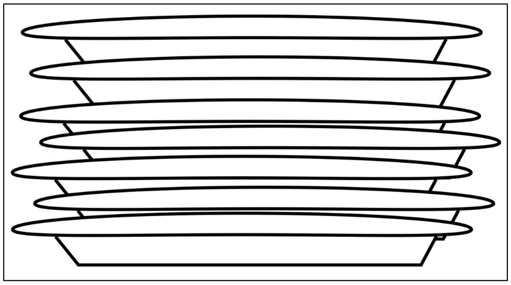
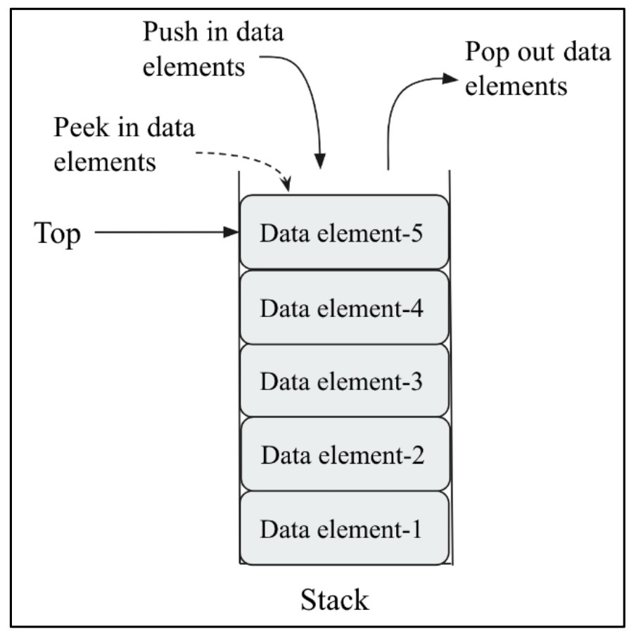
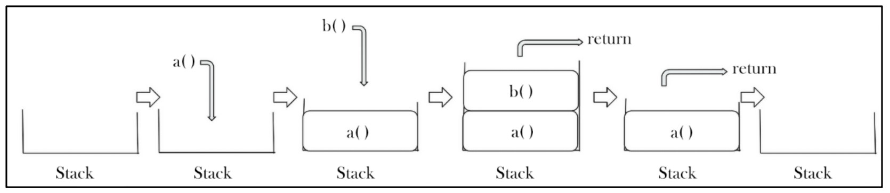

#  **Stacks** 🥞

## 📚 Introduction

A **stack** is a data structure that stores data, just like a stack of plates in a kitchen.
You can put a plate **on the top** of the stack, and when you need a plate, you always **take it from the top**.

## 🖼️ Figure 5.1: Example of a Stack

<div align="center">
  
</div>

<div align="center">

  **Figure 5.1: Example of a stack**

</div>

**Explanation:**

* Imagine a stack of plates 🍽️.
* You always add a new plate on the top.
* When you need a plate, you pick the one from the top.
* **The last plate added will always be the first to be removed.**

## 🔍 How Stack Works

* The above diagram shows a stack of plates.
* **Adding a plate:** You can only add a plate by placing it **on top** of the pile.
* **Removing a plate:** You can only remove the plate that's **on top**.

## 🚦 Stack Constraints

A **stack** stores data in a specific order (like arrays and linked lists), **but** with special rules:

* **Push:** Data can **only be inserted at the end (top)**.
* **Pop:** Data can **only be deleted from the end (top)**.
* **Peek:** You can **only read the last (top) data element**.

So, stacks are **Last In, First Out (LIFO)** structures.
That means **the last item added is always the first to be removed**.

## 🛠️ Stack Operations

There are **two main operations** on stacks:

1. **Push:** Add an element to the top of the stack.
2. **Pop:** Remove (and return) the top element of the stack.
3. **Peek:** See (but not remove) the top element.

All these operations use a pointer called **`top`**.

## 🖼️ Figure 5.2: Demonstration of Push and Pop Operations

<div align="center">
  
</div>

<div align="center">

*Figure 5.2: Demonstration of push and pop operations in a stack*

</div>


**Explanation of Figure 5.2:**

* **Push in data elements:** Adds new elements to the top.
* **Pop out data elements:** Removes elements from the top.
* **Peek:** Allows you to see the current top element without removing it.
* The stack grows and shrinks only at the **top**.

## 📝 Table 5.1: Stack Operations Example

| Stack Operation | Size | Contents         | Operation Results                                                                                  |
| --------------- | ---- | ---------------- | -------------------------------------------------------------------------------------------------- |
| `stack()`       | 0    | `[]`             | Stack object created, which is empty.                                                              |
| `push "egg"`    | 1    | `['egg']`        | One item "egg" is added to the stack.                                                              |
| `push "ham"`    | 2    | `['egg', 'ham']` | One more item, "ham", is added to the stack.                                                       |
| `peek()`        | 2    | `['egg', 'ham']` | The top element, "ham", is returned.                                                               |
| `pop()`         | 1    | `['egg']`        | The "ham" item is popped off and returned. (This item was added last, so it is removed first.)     |
| `pop()`         | 0    | `[]`             | The "egg" item is popped off and returned. (This is the first item added, so it is returned last.) |

---

## 🎯 Where Are Stacks Used?

Stacks are used in many places.
One of the most common uses is to **keep track of the return address during function calls**.

## 🧑‍💻 Function Call Example

Let's look at this simple program:

```python
def b():
    print('b')
def a():
    b()
a()
print("done")
```

### 👣 What Happens When We Run This?

When the program executes `a()`, a specific sequence of events happens.
Let’s visualize these steps!

## 🖼️ Figure 5.3: Steps for a Sequence of Events During Function Calls

<div align="center">
  
</div>

<div align="center">

*Figure 5.3: Steps for a sequence of events during function calls in our sample program*

</div>


### Step-by-Step Explanation:

1. **Push Current Instruction Address:**

   * The address of the current instruction is **pushed onto the stack**.
   * Execution jumps to the definition of `a()`.

2. **Call Function b():**

   * Inside function `a()`, function `b()` is called.

3. **Push Return Address of b():**

   * The return address of `b()` is **pushed onto the stack**.
   * Once everything in `b()` is done, the return address is **popped off the stack**, taking us back to `a()`.

4. **Complete Function a():**

   * After all instructions in `a()` are complete, the return address is **popped off the stack** again, bringing us back to the main program.

### 🖨️ Program Output

```
b
done
```

---

