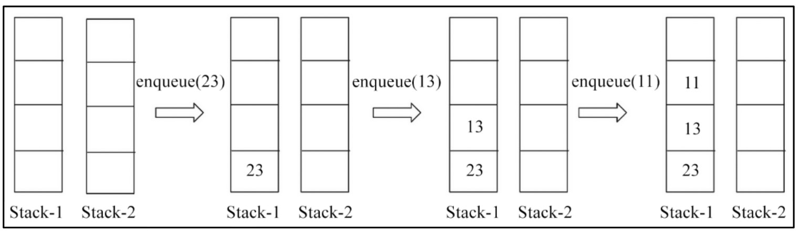
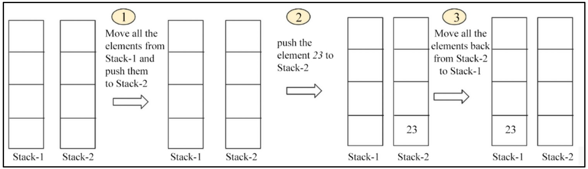
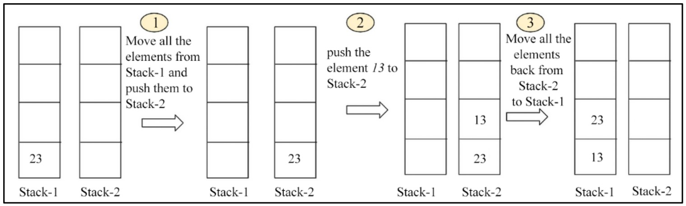
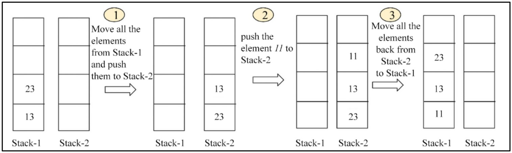
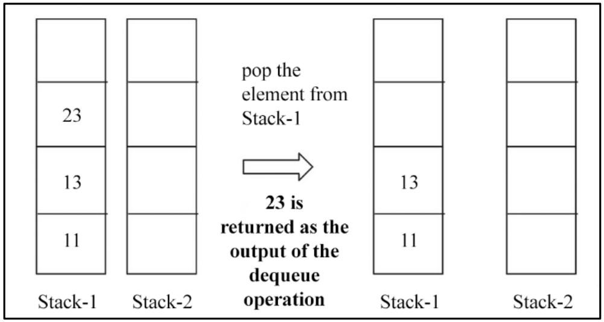
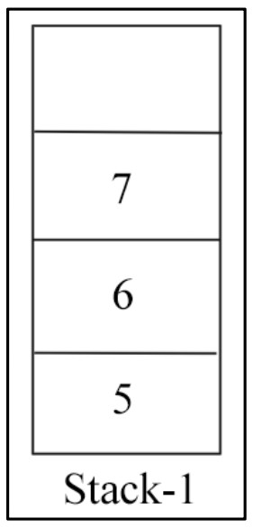
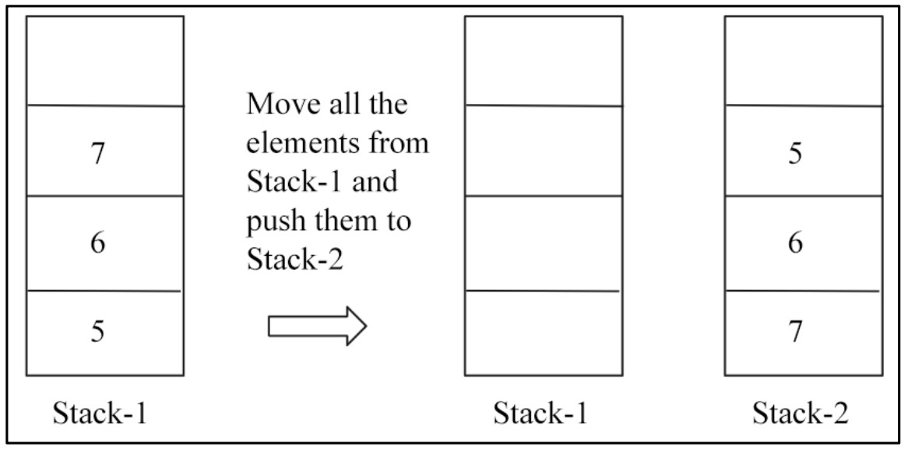

#  **Queues Data Structure** 🚶‍♂️

## 📚 What is a Queue?

A **queue** is a data structure used to store data with special rules for how data is added and removed.
It is very similar to a real-life line (queue) at a shop or bus stop.


## 🖼️ Figure 5.11: Illustration of a Queue

<div align="center">
  

 *Figure 5.11: Illustration of a queue*
</div>


### Explanation:

* Each person stands in line and waits for their turn to be served.
* **Rear/End:** Where new people join the queue.
* **Front:** Where people are served and leave the queue.
* **FIFO (First In, First Out):**
  The first person to join the queue is the first to be served.

## 🔄 Queue Operations

A **queue** works on the **FIFO** principle:

* **First In, First Out:** The element added first will be removed first.

### Key Rules:

1. **Enqueue:** Add new element at the **rear (tail)**.
2. **Dequeue:** Remove element from the **front (head)**.
3. **Peek:** Only the front element can be read (peeked) at any time.

## 🏗️ Queue Implementation (Doubly Linked List)

## 🖼️ Figure 5.12: Queue Using a Linked List

<div align="center">
  

*Figure 5.12: Queue implementation using the stack data structure*

</div>


### Explanation:

* Each node has **data**, a **next** pointer, and a **previous** pointer.
* **Elements are added (enqueued)** at the **tail/rear end**.
* **Elements are removed (dequeued)** from the **head/front end**.
* Only one end is used for enqueue, and the other for dequeue.

> **Good Practice:**
>
> * Always **enqueue** at the **rear end**
> * Always **dequeue** from the **front end**

## 📝 Table: Queue Operations Example

| Queue Operation         | Size | Contents                  | Operation Results                                                          |
| ----------------------- | ---- | ------------------------- | -------------------------------------------------------------------------- |
| `queue()`               | 0    | `[]`                      | Queue object created, which is empty.                                      |
| `enqueue("Muhammad")`      | 1    | `['Muhammad']`               | One item, `Muhammad`, is added to the queue.                                  |
| `enqueue("Hashim")` | 2    | `['Muhammad', 'Hashim']` | One more item, `Hashim`, is added to the queue.                        |
| `size()`                | 2    | `['Muhammad', 'Hashim']` | Returns number of items in queue, which is 2 in this example.              |
| `dequeue()`             | 1    | `['Hashim']`          | The `Muhammad` item is dequeued and returned (added first, removed first).    |
| `dequeue()`             | 0    | `[]`                      | The `Hashim` item is dequeued and returned (added last, removed last). |

*Table 5.2: Illustration of different operations on an example queue*

## ⚙️ How Can Queues Be Implemented in Python?

* Using **Python’s built-in list**
* Using **stacks**
* Using **node-based linked lists**
* Using **Python’s built-in `queue.Queue`**
* Using **`deque` class** from the `collections` module

---

#  **Python List-Based Queues** 📋

## 🖼️ Figure 5.13: Enqueue Operation on the Queue

<div align="center">
  

*Figure 5.13: Example of an enqueue operation on the queue*

</div>

### Step-by-Step (Enqueue):

1. **Start with an empty queue (array of size 6):**

   * `head/front` and `tail/rear` both point to index 0.

2. **Enqueue 3:**

   * Place `3` at index 0.
   * Move `tail/rear` to index 1.

3. **Enqueue 11:**

   * Place `11` at index 1.
   * Move `tail/rear` to index 2.

4. **Enqueue 7:**

   * Place `7` at index 2.
   * Move `tail/rear` to index 3.

**The queue now contains:** `[3, 11, 7]` (with `head` at index 0 and `tail` at index 3).

## 🖼️ Figure 5.14: Dequeue Operation on the Queue

<div align="center">
  

  
*Figure 5.14: Example of a dequeue operation on a queue*

</div>

### Step-by-Step (Dequeue):

1. **Start with a filled queue:**
   `[3, 11, 7, 1, 4, 2]`

   * `head/front` at index 0, `tail/rear` at index 5.

2. **Dequeue 3:**

   * Remove `3` from the front.
   * Move `head/front` to index 1.

3. **Dequeue 11:**

   * Remove `11` from the new front.
   * Move `head/front` to index 2.

4. **Dequeue 7:**

   * Remove `7`.
   * Move `head/front` to index 3.

**The queue now contains:** `[1, 4, 2]`


## 🐍 ListQueue: A Python List-Based Queue Class

Let's see how we implement a simple queue using Python's built-in list:

```python
class ListQueue:
    def __init__(self):
        self.items = []
        self.front = self.rear = 0
        self.size = 3  # Maximum capacity of the queue
```

* **`items`**: Holds the queue data.
* **`front` and `rear`**: Track the head and tail.
* **`size`**: Maximum number of items.

## ➕ Enqueue Operation

The `enqueue` operation adds an item at the **end (rear)** of the queue.

```python
def enqueue(self, data):
    if self.size == self.rear:
        print("\nQueue is full")
    else:
        self.items.append(data)
        self.rear += 1
```

* **Check if queue is full.**
* **If not**, add new data at the rear and move the `rear` pointer ahead.

### Example Usage

```python
q = ListQueue()
q.enqueue(20)
q.enqueue(30)
q.enqueue(40)
q.enqueue(50)     # Should show 'Queue is full'
print(q.items)
```

**Output:**

```
Queue is full
[20, 30, 40]
```

## ➖ Dequeue Operation

The `dequeue` operation removes and returns the item at the **front** of the queue.

```python
def dequeue(self):
    if self.front == self.rear:
        print("Queue is empty")
    else:
        data = self.items.pop(0)  # Remove from front
        self.rear -= 1
        return data
```

* **Check if queue is empty.**
* **If not**, remove the front item (`pop(0)`), move `rear` pointer backward, and return data.

### Example Usage

```python
data = q.dequeue()
print(data)
print(q.items)
```

**Output:**

```
20
[30, 40]
```

> The first element (20) is removed, showing the **FIFO** property.

## ⚠️ Limitation

* The **length of the queue is fixed** with this approach.
* Not suitable for all scenarios; for more flexibility, use linked list-based or dynamic structures.

---

#  **Linked List-Based Queues (DLL)** 🔗

## 📚 Introduction

A **queue** can also be implemented using a **singly or doubly linked list**.
This approach naturally supports the **FIFO** property (First-In, First-Out) of queues.

## 🖼️ Figure 5.15: Enqueuing in an Empty Queue

<div align="center">
  

*Figure 5.15: Illustration of enqueuing a new node in an empty queue*

</div>

**Explanation:**

* When the queue is empty and a new node (e.g., `"egg"`) is added:

  * The new node becomes **both the head (front) and tail (rear) of the queue**.
  * Its `next` and `previous` pointers are set to `None`.

## 🖼️ Figure 5.16: Enqueue Operation (Adding to Rear)

<div align="center">
  

*Figure 5.16: Illustration of links to be updated for an enqueue operation in a queue*

</div>


**Explanation:**

* When the queue is **not empty**, adding a new node involves **3 steps**:

  1. The **`previous`** pointer of the new node should point to the current tail.
  2. The **`next`** pointer of the current tail node should point to the new node.
  3. The **tail pointer** should be updated to the new node.

* After these steps, the new node is at the **rear (tail)** of the queue.


## 🖼️ Figure 5.17: Dequeue Operation (Removing from Front)

<div align="center">
  

*Figure 5.17: Illustration of the dequeue operation on a queue*
</div>

**Explanation:**

* **Remove the head (front) node** (`"egg"`) from the queue:

  1. Move the `head` pointer to the next node (`"ham"`).
  2. Set the `previous` pointer of the new head to `None`.
* If there was only **one node** (like `"egg"` alone), after dequeuing, both `head` and `tail` become `None` (queue becomes empty).

## 🏗️ Implementation: Node and Queue Classes

### Node Class

```python
class Node(object):
    def __init__(self, data=None, next=None, prev=None):
        self.data = data
        self.next = next
        self.prev = prev
```

* Each node holds data and links to both the next and previous nodes.

### Queue Class

```python
class Queue:
    def __init__(self):
        self.head = None
        self.tail = None
        self.count = 0
```

* `head`: Points to the **front** of the queue.
* `tail`: Points to the **rear** of the queue.
* `count`: Tracks the number of nodes.

## ➕ Enqueue Operation (Adding to Rear)

```python
def enqueue(self, data):
    new_node = Node(data, None, None)
    if self.head == None:  # If queue is empty
        self.head = new_node
        self.tail = self.head
    else:  # If queue is not empty
        new_node.prev = self.tail
        self.tail.next = new_node
        self.tail = new_node
    self.count += 1
```

* **If empty:** The new node is both head and tail.
* **If not empty:**

  * Update pointers as shown in Figure 5.16.
  * Tail is moved to the new node.
* **Time Complexity:** O(1)

## ➖ Dequeue Operation (Removing from Front)

```python
def dequeue(self):
    if self.count == 1:
        self.count -= 1
        self.head = None
        self.tail = None
    elif self.count > 1:
        self.head = self.head.next
        self.head.prev = None
        self.count -= 1
    elif self.count < 1:
        print("Queue is empty")
```

* **If only one node:** Set head and tail to `None`.
* **If more than one node:**

  * Move head to the next node.
  * Set new head's `prev` to `None`.
  * Decrement count.
* **If empty:** Print `"Queue is empty"`.
* **Time Complexity:** O(1)


## 📝 Key points

* **Linked list-based queues** allow for efficient enqueuing at the rear and dequeuing from the front, both in constant time.
* **Pointers must be updated carefully** to keep the structure intact.
* The code above supports **all standard queue operations**.

---

#  **Stack-Based Queues** 🔄

## 📚 Introduction

A **queue** is a linear data structure where:

* **Enqueue** (add) happens from one end.
* **Dequeue** (remove) happens from the other end.
* Follows **FIFO** (First In, First Out).

Queues can be **implemented using two stacks** (Python lists as stacks).

There are **two main approaches**:

1. When the **dequeue** operation is costly
2. When the **enqueue** operation is costly

## 1️⃣ Approach 1: Costly Dequeue Operation

### 🧩 Enqueue Operation

* **Simple:** Push the new element onto **Stack-1**.

#### 🖼️ Figure 5.18: Enqueue Example

<div align="center">
  

*Elements {23, 13, 11} are enqueued to the queue via Stack-1.*

</div>

### 🧩 Dequeue Operation

**Steps:**

1. Move all elements from **Stack-1** to **Stack-2**.
2. Pop the top of **Stack-2** and return it as output (this was the first enqueued).
3. Move all remaining items back to **Stack-1**.

#### 🖼️ Figure 5.19: Dequeue Example

<div align="center">
  

</div>

### ⏱️ Time Complexity

* **Enqueue:** O(1)
* **Dequeue:** O(n) (because all elements must be moved)

## 2️⃣ Approach 2: Costly Enqueue Operation

### 🧩 Enqueue Operation

**Steps:**

1. Move all elements from **Stack-1** to **Stack-2**.
2. Push the new element onto **Stack-2**.
3. Move all elements back to **Stack-1**.

#### 🖼️ Figure 5.20: Enqueue element 23 to empty queue

<div align="center">
  
</div>

#### 🖼️ Figure 5.21: Enqueue element 13

<div align="center">
  
</div>

#### 🖼️ Figure 5.22: Enqueue element 11

<div align="center">
  
</div>

### 🧩 Dequeue Operation

* Simply pop from the top of **Stack-1**.

#### 🖼️ Figure 5.23: Dequeue Example

<div align="center">
  
</div>

### ⏱️ Time Complexity

* **Enqueue:** O(n)
* **Dequeue:** O(1)

## 🏗️ Python Implementation (Approach 1)

```python
class Queue:
    def __init__(self):
        self.Stack1 = []
        self.Stack2 = []

    def enqueue(self, data):
        self.Stack1.append(data)

    def dequeue(self):
        if not self.Stack2:
            while self.Stack1:
                self.Stack2.append(self.Stack1.pop())
        if not self.Stack2:
            print("No element to dequeue")
            return
        return self.Stack2.pop()
```

---

## 🧑‍💻 Example Usage

```python
queue = Queue()
queue.enqueue(23)
queue.enqueue(13)
queue.enqueue(11)
print(queue.Stack1)      # Output: [23, 13, 11]
queue.dequeue()
print(queue.Stack2)      # Output: [13, 11]
```

---

## 🖼️ Stack Transfer Demo

#### 🖼️ Figure 5.24: Example Stack-1 in a queue

<div align="center">
  
</div>

#### 🖼️ Figure 5.25: Stack-1 and Stack-2 Transfer

<div align="center">
  
</div>

## ⚡ Comparison: Linked List vs Stack-Based Queues

* **Linked List Queue:** Both enqueue and dequeue are O(1). No size limitation.
* **Stack-Based Queue:** One operation (enqueue or dequeue) is always O(n).

##  key points 📝

* **Two stacks** can be used to implement a queue, but one operation becomes costly.
* **Costly dequeue (Approach 1):** Fast enqueue, slow dequeue.
* **Costly enqueue (Approach 2):** Slow enqueue, fast dequeue.
* **Linked list** is the most efficient for both enqueue and dequeue (both O(1)).

---