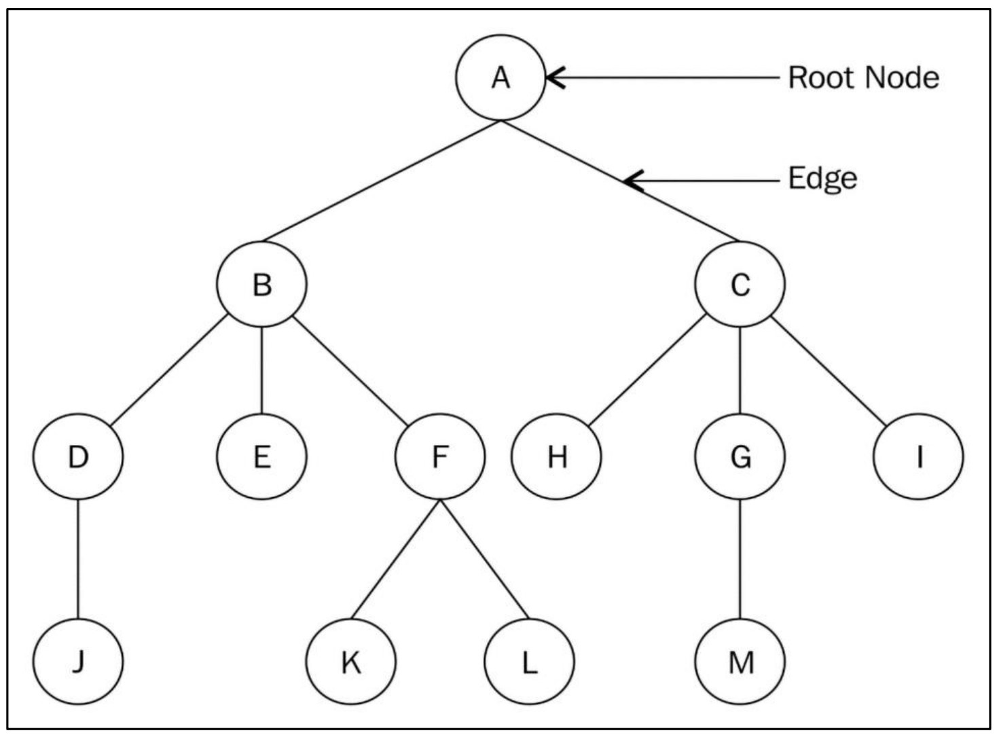

#  **Tree Terminology** 🌳

## 🖼️ Figure 6.1: Example Tree Data Structure

  

*Figure 6.1: Example tree data structure*

## 📚 Key Terms in Trees

Understanding trees starts with their key terms and structure:

* **Node:**
  Each circle (A to M) in the diagram is a node—a data structure that stores data.

* **Root Node:**
  The first node, with no parent.  
  👉 *In the example, node **A** is the root node.*

* **Subtree:**
  Any section of the tree that itself is a tree.  
  👉 *Nodes F, K, and L form a subtree.*

* **Degree:**
  The number of children a node has.

  * *A single-node tree has degree 0.*
  * *Node A has degree 2; B has 3; C has 3; G has 1.*

* **Leaf Node:**
  Nodes with **no children** (degree 0); terminal nodes.  
  👉 *J, E, K, L, H, M, and I are leaf nodes.*

* **Edge:**
  A connection between any two nodes (like a branch).
  * *A tree with N nodes has (N - 1) edges.*

* **Parent:**
  A node with subtrees is the parent of its children.  
  👉 *B is the parent of D, E, F; F is the parent of K and L.*

* **Child:**
  Any node directly connected under another node.  
  👉 *B and C are children of A; H, G, and I are children of C.*

* **Sibling:**
  Nodes with the **same parent**.  
  👉 *B and C are siblings; D, E, and F are siblings.*

* **Level:**

  * Root node: **Level 0**
  * Children of root: **Level 1**
  * Their children: **Level 2**, and so on.  
    👉 *A is at level 0, B and C at level 1, D, E, F, H, G, and I at level 2.*

* **Height of a Tree:**
  Number of nodes in the longest path from the root.  
  👉 *Height here is 4 (paths like A-B-D-J, A-C-G-M, or A-B-F-K).*

* **Depth:**
  Number of **edges** from root to a node.  
  👉 *Depth of node H is 2.*

## 📝 Notes on Trees vs Linear Data Structures

* **Linear:** Arrays, lists, stacks, and queues store data sequentially and can be traversed in one pass.
* **Non-linear:** Trees store data hierarchically. Nodes can be connected to multiple other nodes.

  * There must be **no cycles** in a tree.
  * An **empty tree** has no nodes.
  * **Parent-child** relationships form the structure.

---

