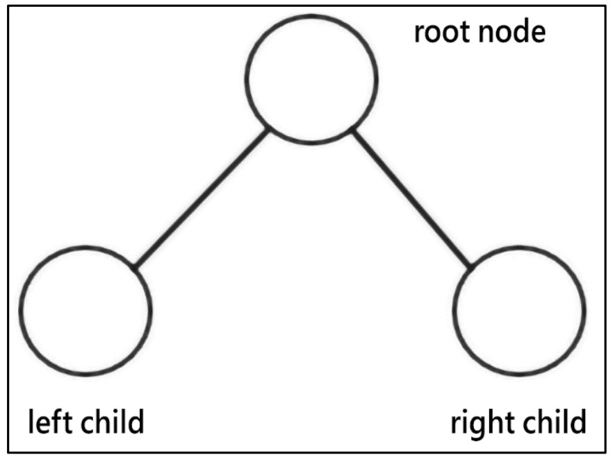
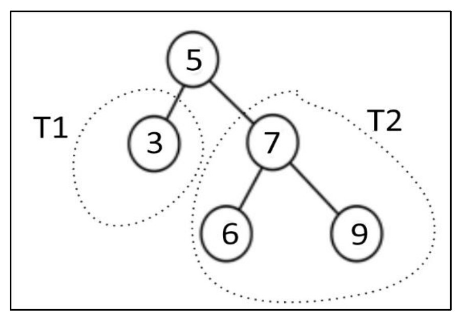
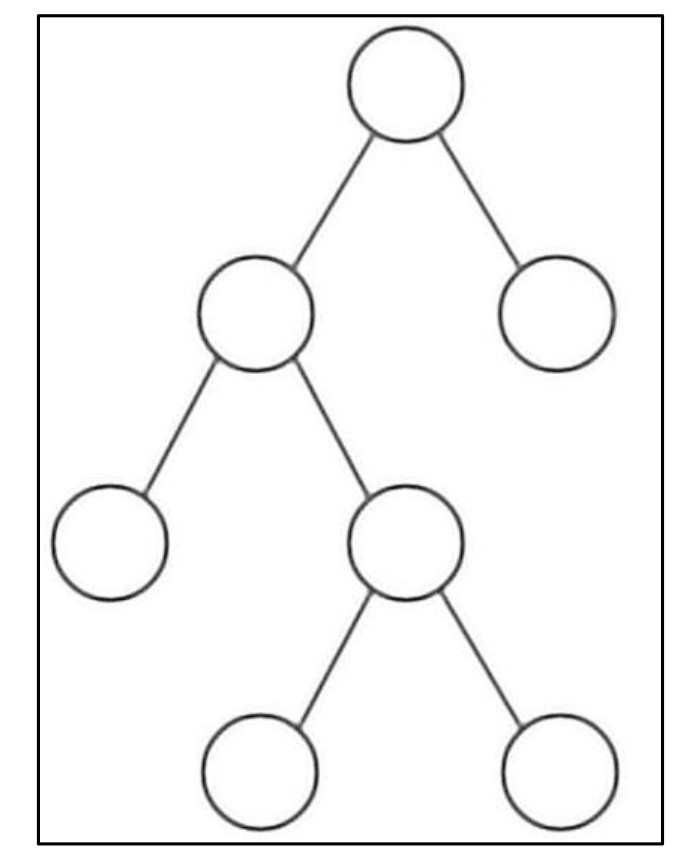
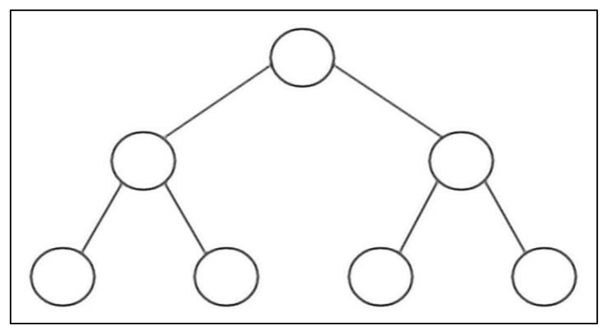
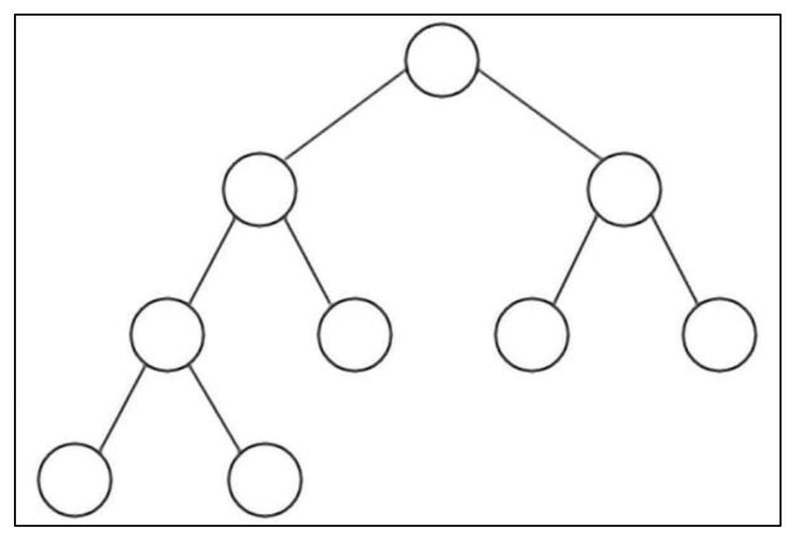
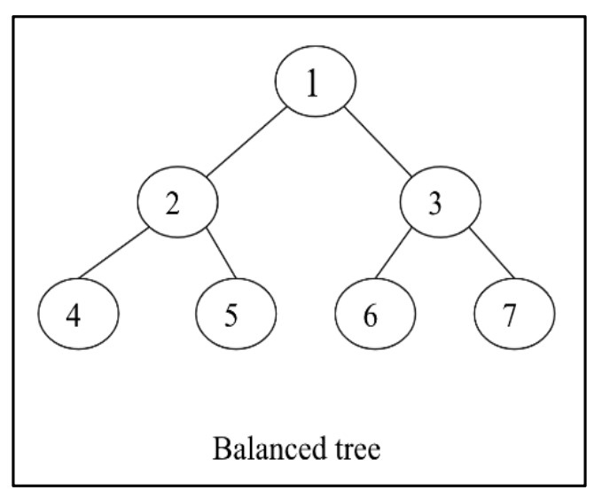
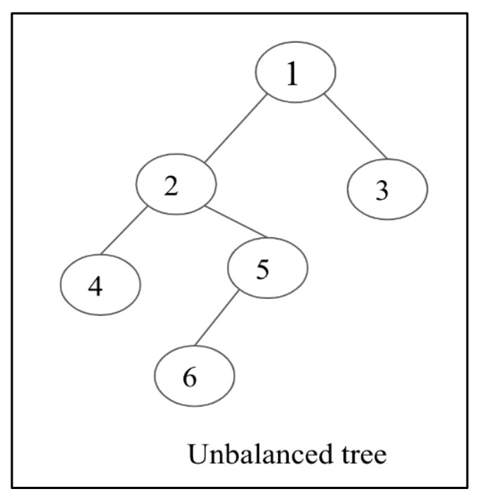
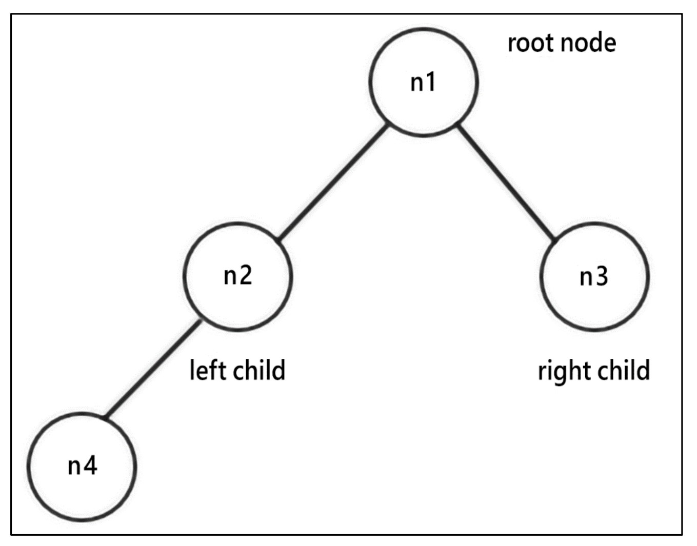
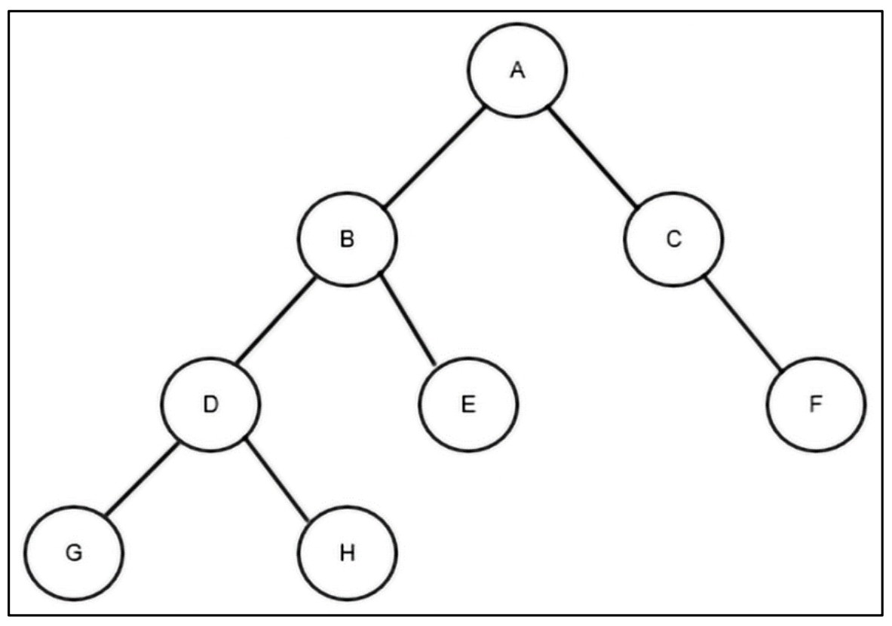
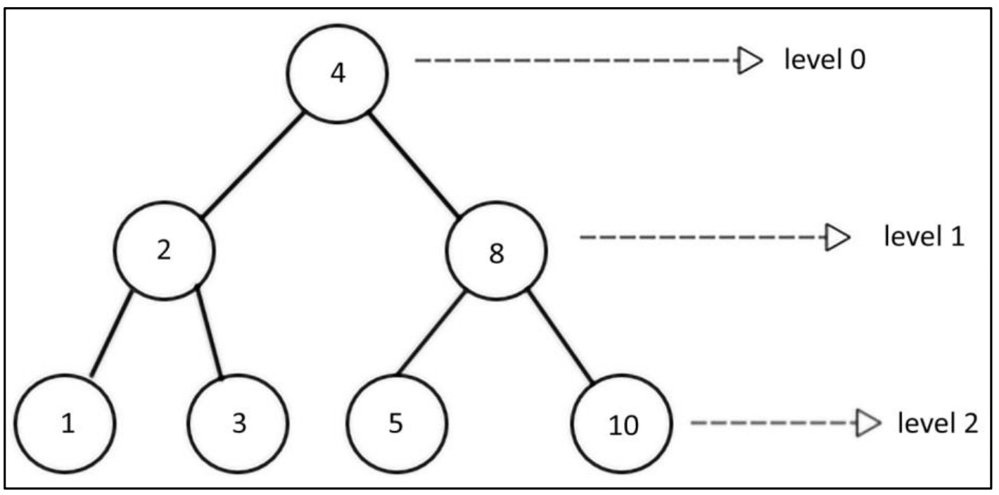

#  **Binary Trees** 🌳

## 📘 What is a Binary Tree?

A **binary tree** is a collection of nodes where:

* Each node can have **zero, one, or two** child nodes.
* These are commonly referred to as the **left child** and **right child**.

### 🖼️ Figure 6.2: Example of a Binary Tree

<div align="center">
  

*Each node has at most two children: left and right.*

</div>

## 🏗️ Binary Tree Structure Example

The binary tree is organized as **left subtree** and **right subtree**.
For example:

### 🖼️ Figure 6.3: An Example Binary Tree of Five Nodes

<div align="center">
  

*Root node, with two subtrees T1 (left) and T2 (right).*

</div>


## 🏷️ Types of Binary Trees

### 1. **Full Binary Tree**

A binary tree is **full** if **every node** has either 0 or 2 children (never exactly 1 child).
### 🖼️ Figure 6.4: Full Binary Tree


<div align="center">
  

*All nodes have 0 or 2 children.*

</div>

### 2. **Perfect Binary Tree**

A binary tree is **perfect** if:

* **All internal nodes** have **exactly 2 children**.
* **All leaf nodes** are at the same depth (level).

### 🖼️ Figure 6.5: Perfect Binary Tree


<div align="center">
  


*All levels are completely filled.*
</div>

### 3. **Complete Binary Tree**

A binary tree is **complete** if:

* All levels, except possibly the last, are completely filled.
* All nodes in the last level are as far left as possible.

### 🖼️ Figure 6.6: Complete Binary Tree


<div align="center">
  

</div>

### 4. **Balanced Binary Tree**

A binary tree is **balanced** if:

* For **every node**, the heights of left and right subtrees differ by at most **1**.

### 🖼️ Figure 6.7: Balanced Binary Tree


<div align="center">
  


*Both left and right subtrees' heights are almost equal at every node.*
</div>

### 5. **Unbalanced Binary Tree**

A tree is **unbalanced** if:

* There is a difference of more than **1** in the heights of the left and right subtrees for at least one node.

### 🖼️ Figure 6.8: Unbalanced Binary Tree


<div align="center">
  


*One subtree is much deeper than the other.*
</div>

---

#  **Implementation of Binary Tree Nodes** 🌳

## 🖼️ Figure 6.9: Example Binary Tree of Four Nodes

<div align="center">
  

*Figure 6.9: An example binary tree with nodes n1, n2, n3, and n4.*

</div>

## 📦 What is a Node?

* In all tree structures, a **node** is a container for:

  * Data (the value stored)
  * References (pointers) to other nodes

* In a **binary tree**, each node stores:

  * Data value
  * A reference to its **left child**
  * A reference to its **right child**

## 🧑‍💻 Python Code: Node Class for Binary Trees

```python
class Node:
    def __init__(self, data):
        self.data = data
        self.right_child = None
        self.left_child = None
```

* Each `Node` object:

  * Stores its value in `data`
  * Points to its `left_child` and `right_child` (which are also Node objects or `None`)

## 🛠️ Building the Example Tree (As Shown in Figure 6.9)

Let's construct the four-node tree step by step:

### 1. **Create Four Nodes**

```python
n1 = Node("root node")
n2 = Node("left child node")
n3 = Node("right child node")
n4 = Node("left grandchild node")
```

### 2. **Connect the Nodes**

```python
n1.left_child = n2       # n2 is the left child of n1
n1.right_child = n3      # n3 is the right child of n1
n2.left_child = n4       # n4 is the left child of n2
```

## 🌲 Resulting Tree Structure

* `n1` is the **root node**
* `n1` has:

  * `n2` as its **left child**
  * `n3` as its **right child**
* `n2` has:

  * `n4` as its **left child**

This matches exactly the structure shown in **Figure 6.9**.

---

Here is your detailed, beautifully formatted **Markdown README** covering **Tree Traversal** and specifically **In-order Traversal** (including the diagram, full explanation, and step-by-step Python code) with **nothing skipped** and **clear step-by-step logic**. 🌳🔍

---

#  **Tree Traversal** 🌳

## 📊 Figure 6.10: An Example Binary Tree for In-Order Traversal

<div align="center">
  

 *Figure 6.10: An example binary tree for in-order tree traversal*

</div>


## 🌲 What is Tree Traversal?

* **Tree traversal** is the method used to visit every node in a tree data structure.
* In **linear structures** (like lists, arrays), traversal is sequential and simple.
* In **non-linear structures** (like trees, graphs), we need special traversal algorithms to visit all nodes.

## 👣 Simple Left-Subtree Traversal Example

If you just want to visit the leftmost nodes:

```python
current = n1
while current:
    print(current.data)
    current = current.left_child
```

**Output:**

```
root node
left child node
left grandchild node
```

## 🛣️ Tree Traversal Approaches

### 1. **Depth-First Traversals** (visit root, then descend children):

* **In-order Traversal**
* **Pre-order Traversal**
* **Post-order Traversal**

### 2. **Breadth-First Traversal** (Level-order):

* Visit all nodes at each level before going deeper.

## 🌀 In-Order Traversal

**In-order traversal** visits nodes in this order:

1. Traverse the left subtree **recursively**
2. Visit the root node
3. Traverse the right subtree **recursively**

**Order:**
`Left Subtree → Root → Right Subtree`

## 📝 Step-by-Step Example (Based on Figure 6.10)

<div align="center">
  
</div>


1. Start at root node **A**.
2. Recursively traverse the **left subtree** of A (which has root B):

   * Recursively traverse the **left subtree** of B (root D):

     * Traverse the **left subtree** of D (**G**), print G.
     * Print **D**.
     * Traverse the **right subtree** of D (**H**), print H.
   * Print **B**.
   * Traverse the **right subtree** of B (**E**), print E.
3. Print **A**.
4. Traverse the **right subtree** of A (**C**):

   * Left of C is None.
   * Print **C**.
   * Right of C is **F**, print F.

**Final Output (In-Order):**
`G D H B E A C F`

## 🧑‍💻 Python Implementation

```python
def inorder(root_node):
    current = root_node
    if current is not None:
        inorder(current.left_child)
        print(current.data)
        inorder(current.right_child)
```

* **Base case:** If the current node is None, do nothing (function returns).
* **Recursive step:**

  1. Visit left child
  2. Print node's data
  3. Visit right child

## 🏗️ Constructing the Sample Tree in Python

```python
A = Node('A')
B = Node('B')
C = Node('C')
D = Node('D')
E = Node('E')
F = Node('F')
G = Node('G')
H = Node('H')

A.left_child = B
A.right_child = C
B.left_child = D
B.right_child = E
D.left_child = G
D.right_child = H
C.right_child = F
```

## 🔎 In-Order Traversal Output

**Running `inorder(A)` will print:**

```
G
D
H
B
E
A
C
F
```
---

#  **Pre-order Traversal** 🌲
**Definition:**
Pre-order traversal means **visit the root first**, then traverse the **left subtree**, and finally the **right subtree**.

## 📊 Figure 6.11 – Example Tree for Pre-order Traversal

<div align="center">
  

*An example binary tree to understand pre-order traversal*
</div>


---

## 🔄 Pre-order Algorithm (Step-by-Step)

1. **Visit** the root node.
2. Recursively **traverse the left subtree**.
3. Recursively **traverse the right subtree**.

---

## 🧩 Step-by-Step Example (Figure 6.11)

### **Tree Structure**

```
        A
       / \
      B   C
     / \    \
    D   E    F
   / \
  G   H
```

**Traversal Process:**

1. Visit `A` (root)
2. Go to left subtree → Visit `B`

   * Visit `D`

     * Visit `G`
     * Visit `H`
   * Visit `E`
3. Go to right subtree → Visit `C`

   * Left child is `null`
   * Visit `F`

---

## 📌 Final Pre-order Output:

```
A B D G H E C F
```

---

## 🧑‍💻 Python Implementation

```python
def preorder(root_node):
    current = root_node
    if current is None:
        return
    print(current.data)                # Visit root
    preorder(current.left_child)       # Traverse left
    preorder(current.right_child)      # Traverse right

preorder(n1)
```

---

## 📤 Example Output:

```
Pre-order Traversal:
A
B
D
G
H
E
C
F
```

---

## 🧠 Key Points

* **Time Complexity:** `O(n)` → each node visited once.
* **Space Complexity:** `O(h)` where `h` = height of tree (due to recursion stack).
* Visits **root first** → useful for:

  * **Expression Trees** (to reconstruct prefix notation).
  * **Copying trees** (since root-first ensures order).
  * **Serialization of Trees** (root-first representation).

---

#  **Post-Order Traversal** 📖

**Definition:**
In **post-order traversal**, the visiting order is:

1. **Left subtree** →
2. **Right subtree** →
3. **Root node**

This means **root nodes are visited last** after exploring both subtrees.

# 🔄 Post-Order Algorithm (Step-by-Step)

1. Traverse the **left subtree** recursively.
2. Traverse the **right subtree** recursively.
3. Visit (process) the **root node**.

## 🧩 Step-by-Step Example (Figure 6.12)

<div align="center">
  
</div>

### **Tree Structure Recap**

```
        A
       / \
      B   C
     / \    \
    D   E    F
   / \
  G   H
```

**Traversal Order:**

1. Start at **A** → go to **left subtree** (B)
2. From **B**, go to **left subtree** (D)
3. From **D**, go to **left subtree** (**G**) → visit **G**
4. From **D**, go to **right subtree** (**H**) → visit **H**
5. Visit **D**
6. From **B**, go to **right subtree** (**E**) → visit **E**
7. Visit **B**
8. From **A**, go to **right subtree** (C)
9. From **C**, left subtree is empty → go to right subtree (**F**) → visit **F**
10. Visit **C**
11. Visit **A**

---

## 📌 Final Post-Order Output:

```
G H D E B F C A
```

---

## 🧑‍💻 Python Implementation

```python
def postorder(root_node):
    current = root_node
    if current is None:
        return
    postorder(current.left_child)   # Visit left subtree
    postorder(current.right_child)  # Visit right subtree
    print(current.data)             # Visit root

# Example usage
postorder(n1)
```

---

## 📤 Example Output for Figure 6.12

```
G
H
D
E
B
F
C
A
```

---

Got it ✅
Here’s your **beautifully formatted Markdown README** for **Level-Order Traversal** (Breadth-First Search) based on **Figure 6.13** from your notes. 🌳📊

---

# **Level-Order Traversal** 📖 

**Definition:**
Level-order traversal visits nodes **level by level**, starting from the root, then all nodes on the next level, and so on.

It is **identical** to the **Breadth-First Search (BFS)** approach in graphs.

## 🔄 Level-Order Algorithm (Step-by-Step)

1. **Visit** the root node.
2. **Enqueue** the root node.
3. While the queue is not empty:

   * **Dequeue** the front node.
   * **Process** (visit) it.
   * **Enqueue** its left child (if exists).
   * **Enqueue** its right child (if exists).
4. Repeat until the queue is empty.

## 🧩 Step-by-Step Example (Figure 6.13)

<div align="center">
  
</div>

### **Tree Structure**

```
        4          <- Level 0
       / \
      2   8        <- Level 1
     / \  / \
    1  3 5  10     <- Level 2
```

**Traversal Process:**

1. **Visit** `4` → enqueue (2, 8)
2. **Visit** `2` → enqueue (1, 3)
3. **Visit** `8` → enqueue (5, 10)
4. **Visit** `1` → no children
5. **Visit** `3` → no children
6. **Visit** `5` → no children
7. **Visit** `10` → no children

## 📌 Final Level-Order Output:

```
4 2 8 1 3 5 10
```

## 🧑‍💻 Python Implementation

```python
from collections import deque

def level_order_traversal(root_node):
    list_of_nodes = []
    traversal_queue = deque([root_node])
    
    while len(traversal_queue) > 0:
        node = traversal_queue.popleft()  # Dequeue front node
        list_of_nodes.append(node.data)   # Visit node
        
        if node.left_child:               # Enqueue left child
            traversal_queue.append(node.left_child)
        if node.right_child:              # Enqueue right child
            traversal_queue.append(node.right_child)
    
    return list_of_nodes

print(level_order_traversal(n1))
```

## 📤 Example Output:

```
Level-order Traversal:
['4', '2', '8', '1', '3', '5', '10']
```

## 🎯 Applications of Binary Trees

1. **Expression Trees** – used in compilers.
2. **Huffman Coding** – for data compression.
3. **Binary Search Trees (BST)** – for efficient searching, insertion, deletion.
4. **Priority Queues** – for retrieving min/max efficiently.

---


