# 🌳 **Binary Search Trees (BST)**

A **Binary Search Tree (BST)** is a special type of binary tree that stores data in a structured way for **fast searching, insertion, and deletion**.

---

## 🧠 Definition

A **Binary Tree** is called a **Binary Search Tree** if:

* The value at any node is **greater** than (or equal to) all values in its **left subtree**.
* The value at any node is **less** than all values in its **right subtree**.

This property holds **recursively** for **every node** in the tree.

---

## 📍 Example 1 — Basic BST Condition

<div align="center">
  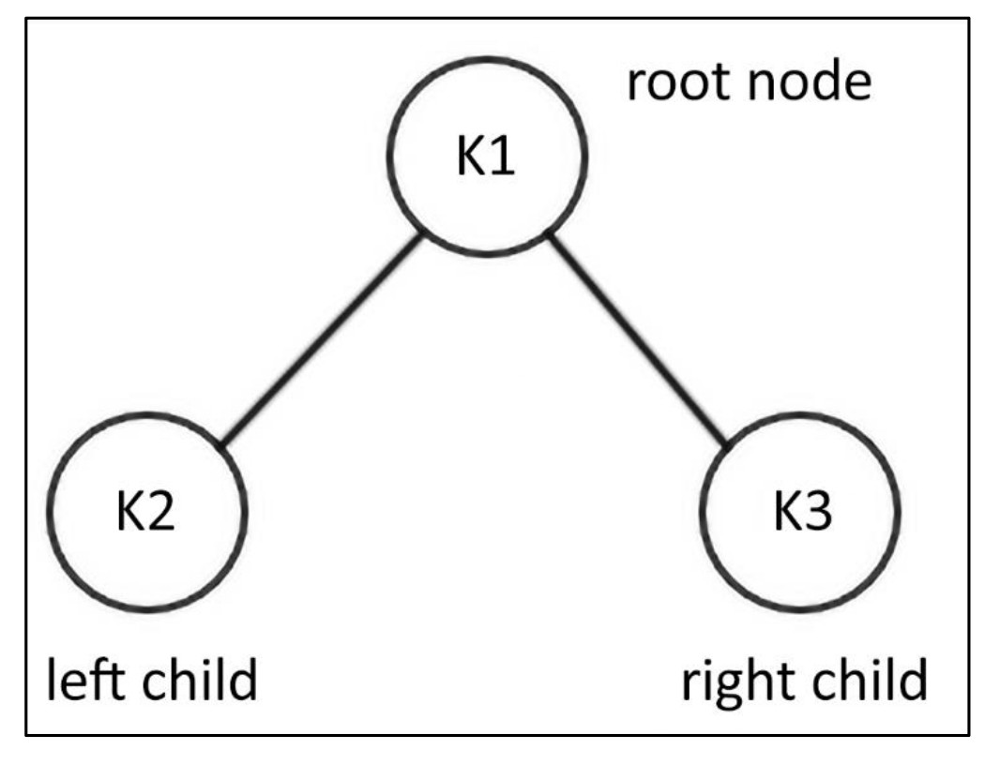

**Figure 6.22:** An example of a **binary search tree** with three nodes.
</div>


* Root = `K1`
* Left child = `K2` → satisfies `K2 <= K1`
* Right child = `K3` → satisfies `K3 > K1`

✅ This satisfies the BST property.

---

## 📍 Example 2 — Valid BST with Six Nodes

<div align="center">
  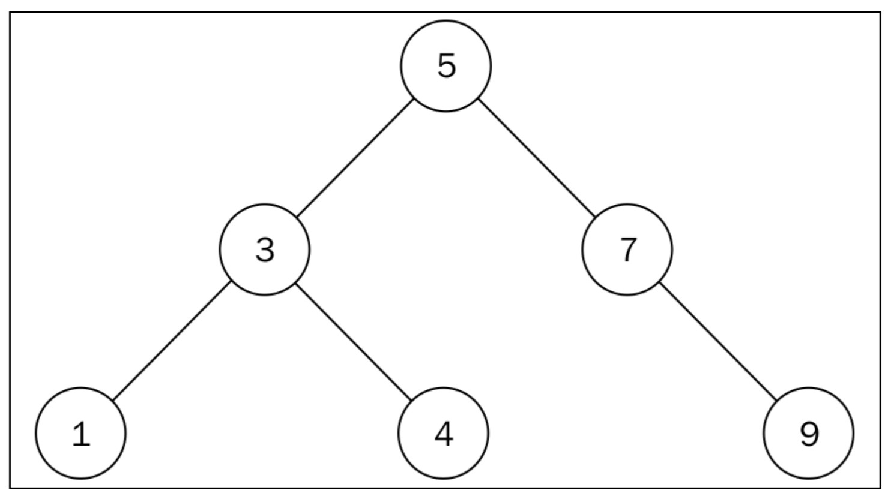

**Figure 6.23:** A **Binary Search Tree of six nodes**.
</div>

Structure:

```
        5
      /   \
     3     7
    / \      \
   1   4      9
```

* All nodes in the **left subtree** of `5` are `< 5`.
* All nodes in the **right subtree** of `5` are `> 5`.
* Node `3` → left = `1 (<3)`, right = `4 (>3)` ✅
* Node `7` → right = `9 (>7)` ✅

➡️ Every node satisfies BST rules → This is a **valid BST**.

---

## 📍 Example 3 — Not a BST ❌

<div align="center">
  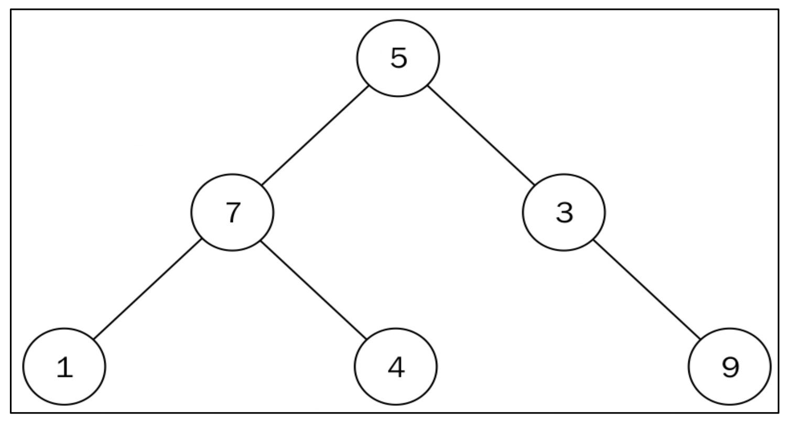

**Figure 6.24:** This is a **binary tree** but **not** a BST.
</div>


Structure:

```
        5
      /   \
     7     3
    / \      \
   1   4      9
```

Problems:

* Node `7` is in the **left subtree** of `5`, but `7 > 5` ❌
* Node `4` is in the **right subtree** of `7`, but `4 < 7` ❌

➡️ Both conditions **violate** BST rules → Not a BST.

---

We begin the implementation by creating a `Tree` class that maintains the **root node** of the tree:

```python
class Tree:
    def __init__(self):
        self.root_node = None
```

That’s all it takes to maintain the **state of a tree**.
Now, let’s examine the **main operations** used within the binary search tree.

---

## 🔑 **Binary Search Tree Operations**

The operations that can be performed on a BST are:

* ➕ Insert
* ❌ Delete
* 🔎 Search
* 🔽 Find Minimum
* 🔼 Find Maximum

We will start with the **Insert Operation**.

---

## 🌱 Inserting Nodes

To insert a new element, we must ensure that the **properties of a BST are not violated**:

* If the new value is **less than the root**, it goes into the **left subtree**.
* If the new value is **greater**, it goes into the **right subtree**.

We keep comparing until we reach a `None` position, where the node is inserted.

---

## 🛠 Example: Insert `5, 3, 7, 1`

### Step 1: Insert `5`

* Create a node with value `5`.
* Since it’s the **first node**, it becomes the **root**.

---

### Step 2: Insert `3`

* Compare `3` with root `5`.
* `3 < 5`, so it goes to the **left** of `5`.

<div align="center">
  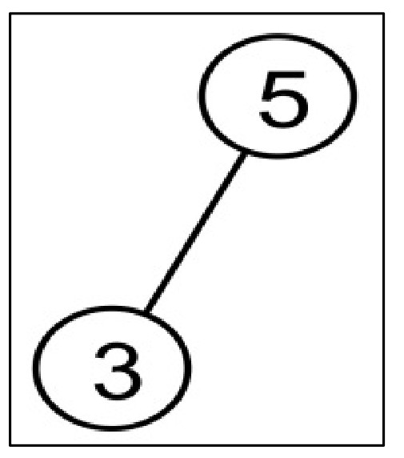

📷 *Figure 6.25*
</div>

👉 The BST property is satisfied.

---

### Step 3: Insert `7`

* Compare `7` with root `5`.
* `7 > 5`, so it goes to the **right** of `5`.

<div align="center">
  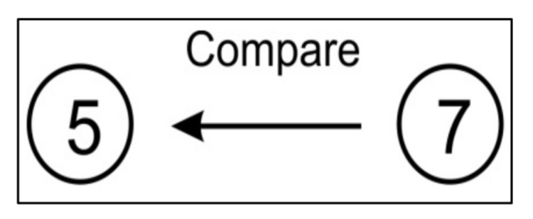

📷 *Figure 6.26*
</div>

---

### Step 4: Insert `1` (First Comparison)

* Compare `1` with root `5`.
* `1 < 5`, so we go left to node `3`.

<div align="center">
  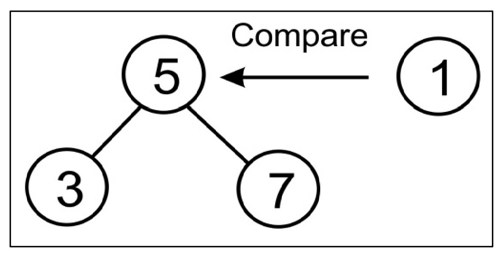

📷 *Figure 6.27*
</div>

---

### Step 5: Insert `1` (Second Comparison)

* Compare `1` with node `3`.
* `1 < 3`, so it goes to the **left of node 3**.

<div align="center">
  

📷 *Figure 6.28*
</div>

---

### ✅ Final Tree

Now we have the complete BST:

<div align="center">
  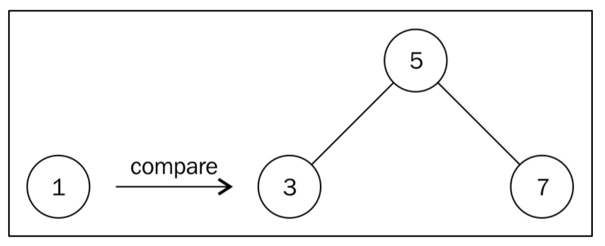

📷 *Figure 6.29*
</div>

---

## 💻 Python Implementation

```python
class Node:
    def __init__(self, data):
        self.data = data
        self.right_child = None
        self.left_child = None


class Tree:
    def __init__(self):
        self.root_node = None

    def insert(self, data):
        node = Node(data)
        if self.root_node is None:
            self.root_node = node
            return self.root_node
        else:
            current = self.root_node
            parent = None
            while True:
                parent = current
                if node.data < parent.data:
                    current = current.left_child
                    if current is None:
                        parent.left_child = node
                        return self.root_node
                else:
                    current = current.right_child
                    if current is None:
                        parent.right_child = node
                        return self.root_node
```

---

## 🔄 In-Order Traversal (to view inserted elements)

```python
def inorder(self, root_node):
    current = root_node
    if current is None:
        return
    self.inorder(current.left_child)
    print(current.data)
    self.inorder(current.right_child)
```

---

## 🧪 Example Usage

```python
tree = Tree()
r = tree.insert(5)
r = tree.insert(2)
r = tree.insert(7)
r = tree.insert(9)
r = tree.insert(1)

tree.inorder(r)
```

📌 **Output:**

```
1
2
5
7
9
```

---

## ⏱ Time Complexity

* Insertion of a node in a BST takes **O(h)**,
  where **h** is the height of the tree.

---

# 🌳 **BST Searching the Tree**

## 📌 Introduction

A **Binary Search Tree (BST)** is a tree data structure in which:

* All the nodes in the **left subtree** of a node have **lower key values**.
* All the nodes in the **right subtree** have **greater key values**.

This property makes **searching for an element very efficient** ⚡.

---

## 📖 Example BST

Below is an example binary search tree containing **seven nodes**:

<div align="center">
  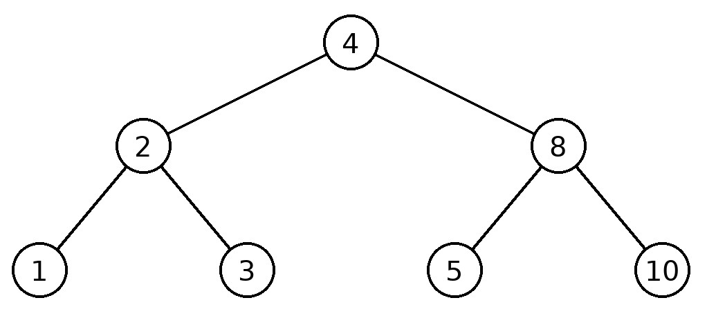

**Figure 6.30:** An example binary search tree with nodes **1, 2, 3, 4, 5, 8, 10**.
</div>


---

## 🔍 Searching in BST

➡️ Suppose we want to search for a node with the value **5**:

1. Start from the **root node** → `4`.
2. Compare `5` with `4`: since **5 > 4**, move to the **right subtree**.
3. In the right subtree, root is `8`. Compare `5` with `8`: since **5 < 8**, move to the **left subtree**.
4. The left child of `8` is `5`. Compare with required value `5`: ✅ **match found**.

📢 Output: `"Item found"` 🎉

---

## 💻 Implementation in Python

Here’s how searching can be implemented in the **Tree class**:

```python
def search(self, data):
    current = self.root_node
    while True:
        if current is None:
            print("Item not found")
            return None
        elif current.data is data:
            print("Item found", data)
            return data
        elif current.data > data:
            current = current.left_child
        else:
            current = current.right_child
```

### ⚙️ Working of the Algorithm:

* Start searching from the **root node**.
* If the data item **doesn’t exist**, return `None`.
* If found, return the **data value**.
* If `data < current node`, move **left**.
* If `data > current node`, move **right**.

---

## 🌱 Example Code — Insert & Search

```python
tree = Tree()
tree.insert(5)
tree.insert(2)
tree.insert(7)
tree.insert(9)
tree.insert(1)

tree.search(9)
```

---

## 🖥️ Output

```
Item found 9
```

✅ The program successfully finds items present in the tree.
❌ Values not present in the BST (within range `1–10`) return `"Item not found"`.

---

# 🌳 **Deleting Nodes in BST**

## 📌 Introduction

Another important operation in a Binary Search Tree (BST) is **deletion (removal) of nodes**.
There are **three possible scenarios** when deleting a node:

1. **Node with no children** 👶 → Directly remove it.
2. **Node with one child** 👨‍👧 → Replace the node with its child.
3. **Node with two children** 👨‍👩‍👧 → Replace the node with its in-order successor or predecessor.

---

## 🟢 Case 1: Node with No Children (Leaf Node)

If the node to be removed is a **leaf node**, we can directly delete it from its parent.

📊 Example:

<div align="center">
  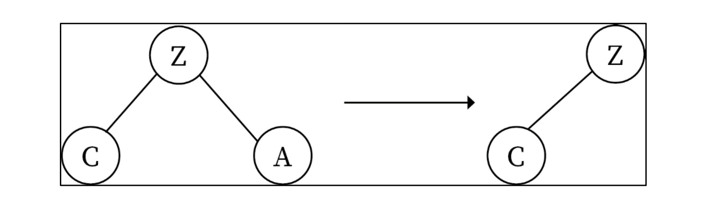

**Figure 6.31:** Deletion operation when deleting a node with no children.
</div>

Here, node **A** is deleted directly from parent **Z**.

---

## 🟡 Case 2: Node with One Child

If the node to be removed has **one child**, we make the parent of that node point directly to the child.

📊 Example:

<div align="center">
  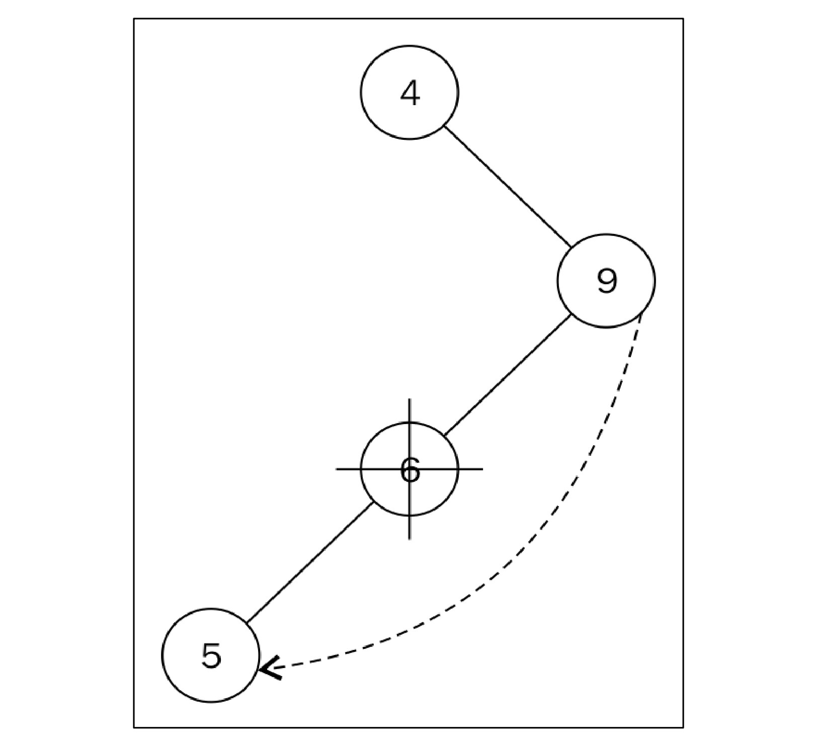

**Figure 6.32:** Deletion operation when deleting a node with one child.
</div>

* Node **6** has only one child → **5**.
* To delete node `6`, we connect parent node `9` directly to child `5`.

✅ This keeps BST properties intact.

---

## 🔴 Case 3: Node with Two Children

If the node has **two children**, we must:

1. Find the **in-order successor** (smallest node in the right subtree) OR predecessor.
2. Replace the node’s value with that successor/predecessor.
3. Delete the successor/predecessor node.

📊 Example:

<div align="center">
  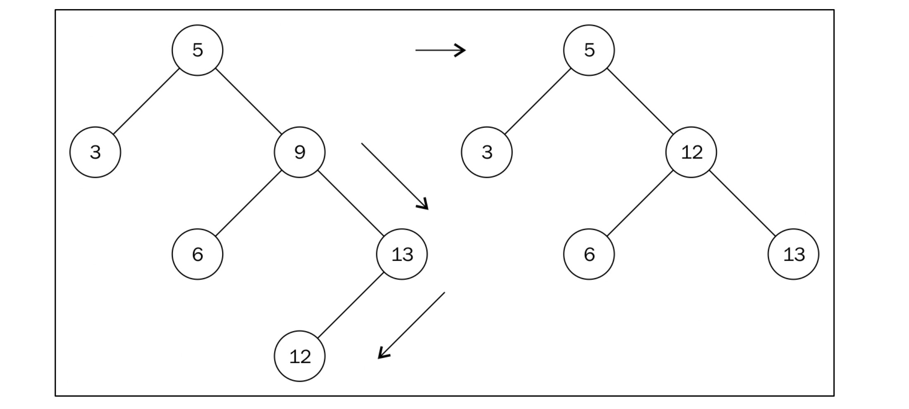

**Figure 6.33:** Deletion operation when deleting a node with two children.
</div>

* Suppose we delete node **9**.
* The **smallest node in its right subtree** = `12`.
* Replace `9` with `12` → then remove node `12`.
* Since `12` has no children, we apply **Case 1** to delete it.

---

## 💻 Python Implementation

### 🔎 Helper Method — Get Node with Parent

```python
def get_node_with_parent(self, data):
    parent = None
    current = self.root_node
    while current is not None:
        if current.data == data:
            return (parent, current)
        parent = current
        if data < current.data:
            current = current.left_child
        else:
            current = current.right_child
    return (parent, None)
```

### 🧠 What this does

* Finds the **target node** and its **parent**.
* Needed because in our `Node` class we don’t keep a reference to the parent.
* Without knowing the parent, we can’t update pointers when deleting.

### Step by step

* `parent = None`: Initially, there’s no parent (root has no parent).
* Start from the root.
* While `current` is not `None`:

  * If `current.data == data`: return `(parent, current)` → target found.
  * Else, before moving further, update `parent = current`.
  * If `data < current.data`: go left.
  * Else: go right.
* If not found → `(parent, None)`.

👉 This method returns both the **node** and its **parent**.

---

### 🗑️ Remove Method — Handling All 3 Cases

```python
def remove(self, data):
    parent, node = self.get_node_with_parent(data)
    if node is None:
        print("Not found:", data)
        return False

    # Count children
    left = node.left_child
    right = node.right_child
    if left and right:
        children_count = 2
    elif left is None and right is None:
        children_count = 0
    else:
        children_count = 1

    # Case 0: Leaf Node
    if children_count == 0:
        if parent is None:
            self.root_node = None
        else:
            if parent.left_child is node:
                parent.left_child = None
            else:
                parent.right_child = None
        return True

    # Case 1: One Child
    if children_count == 1:
        next_node = left if left else right
        if parent is None:
            self.root_node = next_node
        else:
            if parent.left_child is node:
                parent.left_child = next_node
            else:
                parent.right_child = next_node
        return True

    # Case 2: Two Children
    parent_of_leftmost = node
    leftmost = node.right_child
    while leftmost.left_child:
        parent_of_leftmost = leftmost
        leftmost = leftmost.left_child

    # Copy value into node
    node.data = leftmost.data

    # Remove the leftmost from its original place
    if parent_of_leftmost.left_child is leftmost:
        parent_of_leftmost.left_child = leftmost.right_child
    else:
        parent_of_leftmost.right_child = leftmost.right_child

    return True
```
### 🧠 What this does

* First, it finds the **node to delete** and its **parent**.
* Then, it checks how many children the node has (0, 1, or 2).
* Based on that, it applies different deletion rules.

---

### Step by step breakdown

#### A) 🎯 Find target

* `parent, node = self.get_node_with_parent(data)` → get both references.
* If `node is None`: the element doesn’t exist → return `False`.

#### B) 👶 Count children

* Store `left` and `right`.
* If both exist → `children_count = 2`.
* If none → `children_count = 0`.
* Otherwise → `children_count = 1`.

#### C) ✅ Case 0 — Leaf node (no children)

* If node has **no children**:

  * If node is the root → `root = None`.
  * Otherwise, update the parent’s left or right pointer to `None`.

#### D) ✅ Case 1 — Node with one child

* Find the child → `next_node = left if left else right`.
* If node is root → root = that child.
* Else, update the parent’s left or right pointer to this child.

#### E) ✅ Case 2 — Node with two children

* Find the **in-order successor** (smallest value in the right subtree).

  * Start from `node.right_child`.
  * Keep moving left until no left child exists.
* Copy the successor’s value into the current node (`node.data = leftmost.data`).
* Now remove the original successor node:

  * It can only have a right child (not a left, since it’s leftmost).
  * Update the parent pointer (`parent_of_leftmost.left_child` or `.right_child`) to successor’s right child.

---

## 🧪 Dry Run — Deleting `9` (Two Children)

Initial tree:

```
      5
     / \
    3   9
       / \
      6   13
         /
        12
```

1. Target = `9`. Parent = `5`.
2. Node `9` has two children (`6` and `13`).
3. Find successor → go right (`13`), then left → `12`.
4. Copy successor value into node `9`:

   ```
       5
      / \
     3   12
        /  \
       6    13
            /
           12  (temporary duplicate)
   ```
5. Remove original `12` from under `13`.
6. Final tree:

   ```
       5
      / \
     3   12
        /  \
       6    13
   ```

✅ BST property preserved.

---

## ⏱️ Complexity

* Worst case: **O(h)** where `h` is the height of the tree.
* Balanced BST → `O(log n)`.
* Skewed BST → `O(n)`.


---

## 🌱 Example Code — Inserting & Deleting

```python
tree = Tree()
tree.insert(5)
tree.insert(2)
tree.insert(7)
tree.insert(9)
tree.insert(1)

tree.search(9)    # Before deletion
tree.remove(9)    # Delete node 9
tree.search(9)    # After deletion
```

---

## 🖥️ Output

```
Item found 9
Item not found
```

✅ Before deletion, node `9` is found.
❌ After deletion, node `9` no longer exists.

---

## 🎯 Complexity

* The worst-case complexity of **remove operation** is **O(h)**,
  where `h` = height of the tree.

---

Got it ✅
Here’s your text beautifully converted into a **Markdown README style file** with full explanation, figures, code blocks, and emojis:

---

# 🌳 **Minimum and Maximum Nodes in BST** 
 
In a **Binary Search Tree (BST)**, the structure itself makes it very easy to find the **minimum** or **maximum** node.

---

## 🔍 Concept

* 👉 To find the **minimum value node**, we always move **left** from the root until we reach the **last left node**.
* 👉 To find the **maximum value node**, we always move **right** from the root until we reach the **last right node**.

---

## 📊 Example Visualization

<div align="center">
  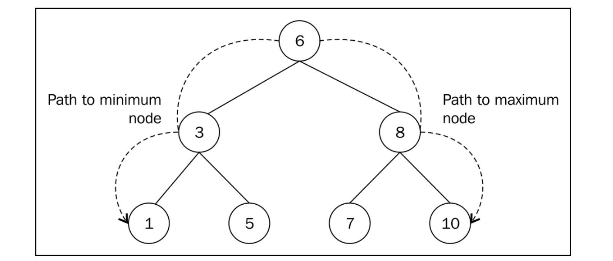

**Figure 6 .34**: *Finding the minimum and maximum nodes in a binary search tree*
</div>

* **Path to Minimum Node**: `6 → 3 → 1`
* **Path to Maximum Node**: `6 → 8 → 10`

---

## 📝 Step-by-Step Example

1. **Finding Minimum**
   Start at root `6` → move left to `3` → move left to `1` → ✅ Found **minimum = 1**

2. **Finding Maximum**
   Start at root `6` → move right to `8` → move right to `10` → ✅ Found **maximum = 10**

---

## 💻 Python Implementation

### 🔹 Find Minimum Node

```python
def find_min(self):
    current = self.root_node
    while current.left_child:
        current = current.left_child
    return current.data
```

👉 This method keeps moving left until it reaches the last left node (`None`).

---

### 🔹 Find Maximum Node

```python
def find_max(self):
    current = self.root_node
    while current.right_child:
        current = current.right_child
    return current.data
```

👉 This method keeps moving right until it reaches the last right node (`None`).

---

## ⚡ Usage Example

```python
tree = Tree()
tree.insert(5)
tree.insert(2)
tree.insert(7)
tree.insert(9)
tree.insert(1)

print(tree.find_min())  # Output: 1
print(tree.find_max())  # Output: 9
```

---

## 🖥️ Output

```
1
9
```

* ✅ Minimum Value = **1**
* ✅ Maximum Value = **9**

---

## ⏱️ Time Complexity

* **Finding Minimum** → O(h)
* **Finding Maximum** → O(h)

where **h = height of the tree**.

---


