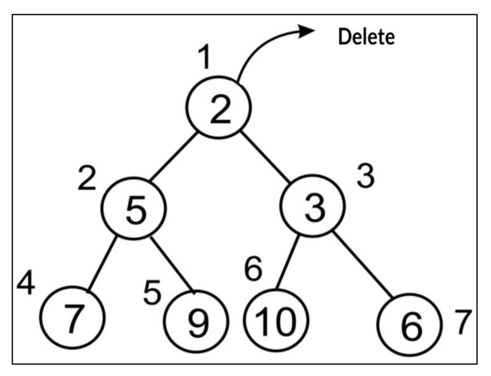
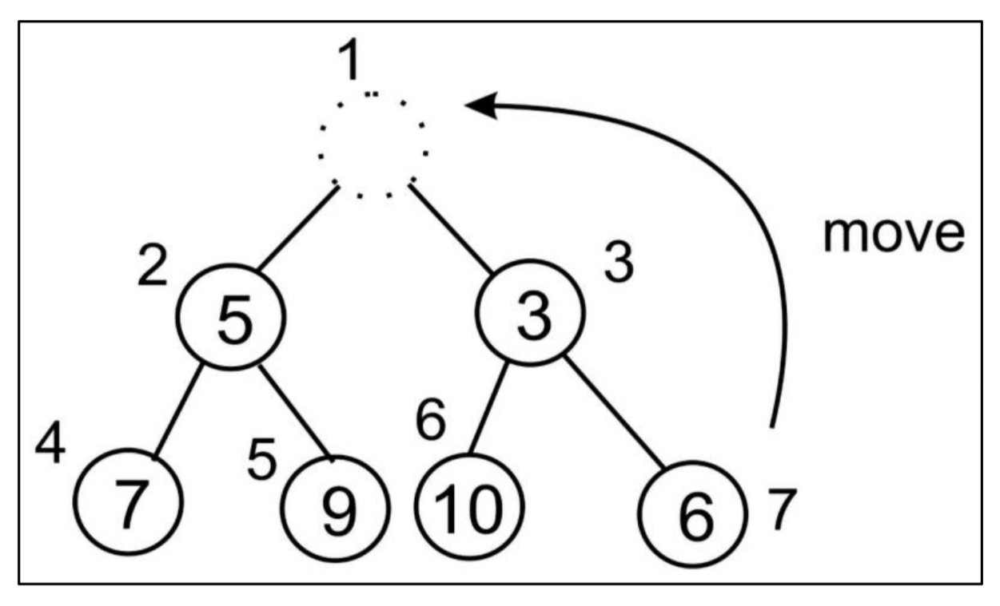
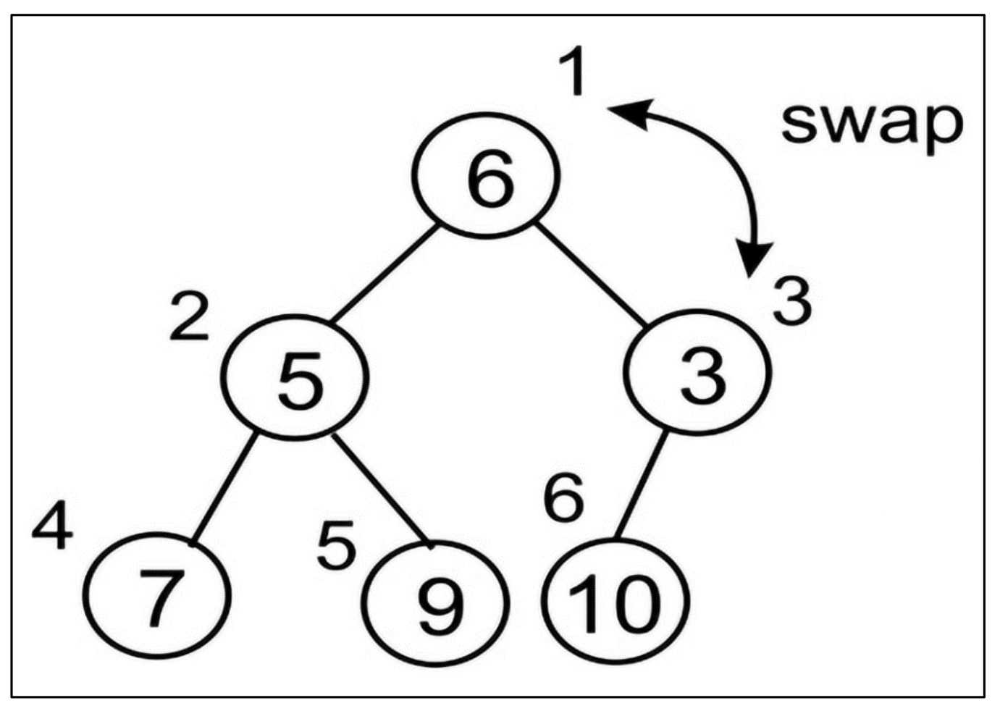
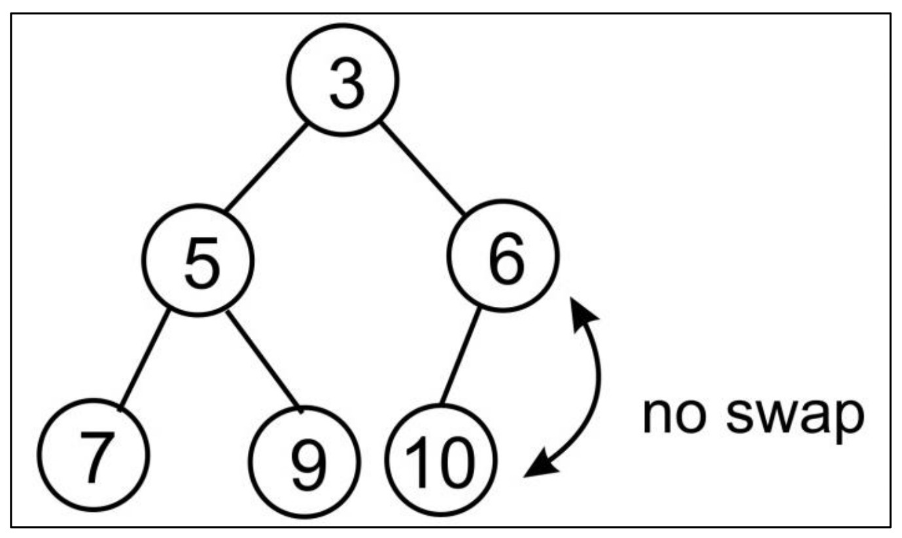

# 🌳 Heaps

A **heap** is a specialized **tree-based data structure** where nodes are arranged following a specific rule known as the **heap property**.

👉 **Heap Property**:
There must be a certain relationship between a **parent node** and its **child nodes**.

---

## 🔼 Max Heap

* Each **parent node value** is **greater than or equal** to its children.
* The **root node** is always the **largest element**.

📌 **Example (Max Heap):**
<div align="center">
  

*Figure 7.1: An example of a max heap*
</div>

---

## 🔽 Min Heap

* Each **parent node value** is **less than or equal** to its children.
* The **root node** is always the **smallest element**.

📌 **Example (Min Heap):**
<div align="center">
  

*Figure 7.2: An example of a min heap*
</div>

---

## ⚡ Importance of Heaps

Heaps are powerful because of their applications in:

* 📊 **Heap Sort Algorithms**
* 🛠️ **Priority Queues**

The most common type is the **Binary Heap**, where:

* Each node has **at most two children**.
* If a binary heap has `n` nodes → it has a **minimum height of log₂n**.

---

## 🌲 Complete Binary Tree

A **complete binary tree** is one where **each row must be completely filled** before filling the next row.

📌 **Example:**
<div align="center">
  

*Figure 7.3: An example of a complete binary tree*
</div>

---

## 🧮 Heap Implementation using Indexing

We can represent heaps efficiently using **arrays**. The relationship between indices is:

* **Left Child of node at index `n`** → located at `2n`
* **Right Child of node at index `n`** → located at `2n + 1`
* **Parent of node at index `i`** → located at `⌊i/2⌋`

👉 **Important Rule**: Indexing starts at **1**. A dummy element is placed at **index 0** in the array.

📌 **Example:**

<div align="center">
  

*Figure 7.4: Binary tree and index positions of all the nodes*
</div>

---

# 🌳 **Insertion Operation**

## 📌 Introduction

Insertion in a **Min Heap** works in two main steps:

1. ➕ **Insert the new element** at the end of the list (bottom-most position of the tree).
2. 🔄 **Heapify (arrange)** – Compare the newly added element with its parent and swap if needed until the heap property is restored.

👉 Heap property for **Min Heap**:

* Parent value must always be **less than or equal** to its children.
* The **smallest element** is always at the **root**.

---

## 🖼️ Step-by-Step Figures

### 1️⃣ Insert new node `2` into the heap

<div align="center">
  

*Figure 7.5: Insertion of a new node `2` in the existing heap*
</div>

---

### 2️⃣ Swap nodes `2` and `6`

<div align="center">
  

*Figure 7.6: Swapping nodes `2` and `6` to maintain the heap property*
</div>

---

### 3️⃣ Swap nodes `2` and `3`

<div align="center">
  

*Figure 7.7: Swapping nodes `2` and `3` to maintain the heap property*
</div>

---

### 4️⃣ Final Heap

<div align="center">
  

*Figure 7.8: Final heap after insertion of new node `2`*
</div>

---

## 🔢 Example: Constructing a Heap from Scratch

We now insert elements `{4, 8, 7, 2, 9, 10, 5, 1, 3, 6}` step by step.

---

### 🪜 Steps 1 to 6

<div align="center">
  

*Figure 7.9: Step-by-step procedure to create a heap (Insert 4, 8, 7, 2, 9, 10)*
</div>

---

### 🪜 Steps 7 to 9

<div align="center">
  

*Figure 7.10: Steps 7 to 9 in creating the heap (Insert 5, 1, 3)*
</div>

---

### 🪜 Step 10 (Final Insertion)

<div align="center">
  

*Figure 7.11: Last step and construction of the final heap (Insert 6)*
</div>

---

## 🧑‍💻 Implementation in Python

We use two methods:

### ⚙️ `arrange()` (Heapify Up)

```python
def arrange(self, k):
    while k // 2 > 0:   # loop until root
        if self.heap[k] < self.heap[k // 2]:  # if child < parent
            self.heap[k], self.heap[k // 2] = self.heap[k // 2], self.heap[k]  # swap
        k //= 2  # move up to parent
```

🔎 Explanation:

* `while k // 2 > 0:` → Continue until reaching the root.
* `if self.heap[k] < self.heap[k // 2]:` → If child is smaller, swap with parent.
* `k //= 2` → Move up one level.

---

### ⚙️ `insert()` Method

```python
def insert(self, item):
    self.heap.append(item)   # add item at the end
    self.size += 1           # increase heap size
    self.arrange(self.size)  # heapify (restore property)
```

---

## 🏗️ Building the Heap

```python
h = MinHeap()
for i in (4, 8, 7, 2, 9, 10, 5, 1, 3, 6):
    h.insert(i)

print(h.heap)
```

---

## 🖨️ Output

```text
[0, 1, 2, 5, 3, 6, 10, 7, 8, 4, 9]
```

---

## ✅ Final Observation

* The output matches the structure shown in **Figure 7.11** 🎯
* The **root element is the smallest (1)**, and all parents are smaller than their children, maintaining **Min Heap property**.

---

# 🗑️ **Delete Operation** (Percolate-Down)

## 🔍 What is the **Delete** operation?

The delete operation removes an element from the heap. Most commonly we **delete the root** because:

* In a **min-heap**, the root is the **minimum** element.
* In a **max-heap**, the root is the **maximum** element.

**Important:** After removing the root, we **move the last element** of the heap to the root position. This **violates** the heap property, so we must **reorganize** the nodes so that *every parent ≤ its children* (min-heap).
This reorganization from **top to bottom** is called **heapify** or **percolate down** (also “sink”).

---

## 🪜 Algorithm (Min-Heap) — Step-by-Step

1. ✅ **Delete the root** (which holds the minimum value).
2. ⬆️ **Move the last element** to the **root** position.
3. 🔄 **Heapify (percolate down / sink)** from the root:

   * Compare the current node with **both children**.
   * **Pick the smaller child** (for min-heap).
   * If `current > smaller_child`, **swap** and continue **downwards**.
   * Stop when the heap property is satisfied or you reach a leaf.

---

## 🖼️ Figures (Full sequence)

### 1) Delete the current root (= 2)

<div align="center">
  

*Figure 7.12: Deletion of a node with value `2` at the root in the existing heap.*
</div>

---

### 2) Move the **last element** (here `6`) to the **root**

<div align="center">
  

*Figure 7.13: Moving the last element (node `6`) to the root position.*
</div>

---

### 3) Compare root (`6`) with its children (`5` and `3`) → **swap with smaller child `3`**

<div align="center">
  

*Figure 7.14: Swapping root `6` with node `3`.*
</div>

---

### 4) Continue percolating `6` down — here **no swap** with `10`

<div align="center">
  

*Figure 7.15: Comparing `6` with child `10` → already satisfies min-heap (no swap).*
</div>

> ✅ After this last comparison, the heap again satisfies the **min-heap** property.

---

## 🧑‍💻 Helper & Core Methods (Python)

> Below methods are defined inside a `MinHeap` class that uses **1-based indexing** with a **sentinel** at index `0` (that is why you’ll see arrays start with `0`).

### 🔎 `minchild(k)` — pick the **smaller** child’s index

```python
def minchild(self, k):
    if k * 2 + 1 > self.size:
        return k * 2
    elif self.heap[k * 2] < self.heap[k * 2 + 1]:
        return k * 2
    else:
        return k * 2 + 1
```

* 👇 **Explanation**

  * `if k * 2 + 1 > self.size:` → There is **no right child**, so return **left** child index.
  * Else, return the index of the **smaller** of the two children.

> ℹ️ In one narrative line you may see “`minindex()`” mentioned—this is just a naming slip. The actual helper is **`minchild()`**.

---

### ⬇️ `sink(k)` — **percolate down** from index `k`

```python
def sink(self, k):
    while k * 2 <= self.size:
        mc = self.minchild(k)
        if self.heap[k] > self.heap[mc]:
            self.heap[k], self.heap[mc] = self.heap[mc], self.heap[k]
        k = mc
```

* 🔁 Loop while `k` has at least a **left child**.
* 🎯 Find the **smaller child** `mc = minchild(k)`.
* 🔄 If `parent > child`, **swap** and continue sinking.

---

### 🗑️ `delete_at_root()` — remove and return the **min (root)**

```python
def delete_at_root(self):
    item = self.heap[1]                 # save root (min)
    self.heap[1] = self.heap[self.size] # move last -> root
    self.size -= 1                      # shrink size
    self.heap.pop()                     # drop last slot
    self.sink(1)                        # restore heap property
    return item
```

* 🧠 Copy the **root value** to return later.
* ⬆️ Move the **last element** to the root position.
* ➖ Decrease **size** and remove the old last element.
* ⛏️ **Sink** from the root to restore heap order.

---

## 🧪 Full Example (Insert → Delete Root)

We will first insert the items `{2, 3, 5, 7, 9, 10, 6}` into a min-heap and then delete the root.

```python
h = MinHeap()
for i in (2, 3, 5, 7, 9, 10, 6):
    h.insert(i)
print(h.heap)

n = h.delete_at_root()
print(n)
print(h.heap)
```

### 🖨️ Output

```text
[0, 2, 3, 5, 7, 9, 10, 6]
2
[0, 3, 6, 5, 7, 9, 10]
```

* The first line is the internal **array** for the heap, using 1-based indexing with a leading `0`.
* The second line shows the **deleted root** (`2`), which is the **minimum** in a min-heap.
* The third line is the **reorganized heap** after percolating down: `[0, 3, 6, 5, 7, 9, 10]`.

> 🔎 **Note about figures vs array layout:**
> The figures (7.12–7.15) illustrate one valid min-heap configuration of these keys. Your array trace also shows a valid min-heap but with the left/right subtrees swapped compared to the figure. Both obey the min-heap rule; heap **shape** depends on the exact insertion sequence and how ties/positions are handled during insert.

---

## 🧩 Dry-Run of the **Percolate-Down** (matches the printed arrays)

Initial array (before delete):
`[0, 2, 3, 5, 7, 9, 10, 6]`

1. **Delete root `2`** and move last element `6` to root:
   `[0, 6, 3, 5, 7, 9, 10]`  ← (size reduced by 1)

2. At index `1` (value `6`), children are `3` (idx 2) and `5` (idx 3).
   **Smaller child = 3** → `6 > 3` ⇒ **swap**
   `[0, 3, 6, 5, 7, 9, 10]`

3. Now at index `2` (value `6`), children are `7` (idx 4) and `9` (idx 5).
   **Smaller child = 7** and `6 ≤ 7` ⇒ **stop**.

✅ Final heap matches the output:
`[0, 3, 6, 5, 7, 9, 10]`

> The text mentions *“indexes of the nodes can \[be] checked as shown in **Figure 7.16**”*. That statement simply refers to validating the final **level-order** array ↔ **tree** mapping.

---

## ⏱️ Time Complexity

* **Delete root** (with percolate-down): **O(log n)**
  (Height of a complete binary tree is `⌊log₂ n⌋`, and we swap down at most that many levels.)

* **Space**: **O(1)** extra (in-place within the heap array).

---
