# 🌳 Heaps

A **heap** is a specialized **tree-based data structure** where nodes are arranged following a specific rule known as the **heap property**.

👉 **Heap Property**:
There must be a certain relationship between a **parent node** and its **child nodes**.

---

## 🔼 Max Heap

* Each **parent node value** is **greater than or equal** to its children.
* The **root node** is always the **largest element**.

📌 **Example (Max Heap):**
<div align="center">
  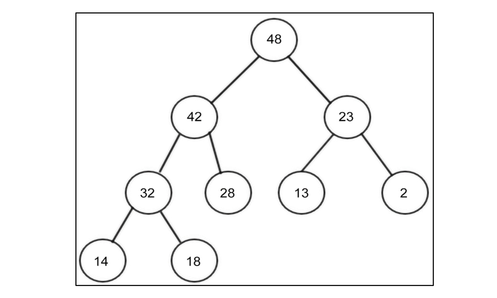

*Figure 7.1: An example of a max heap*
</div>

---

## 🔽 Min Heap

* Each **parent node value** is **less than or equal** to its children.
* The **root node** is always the **smallest element**.

📌 **Example (Min Heap):**
<div align="center">
  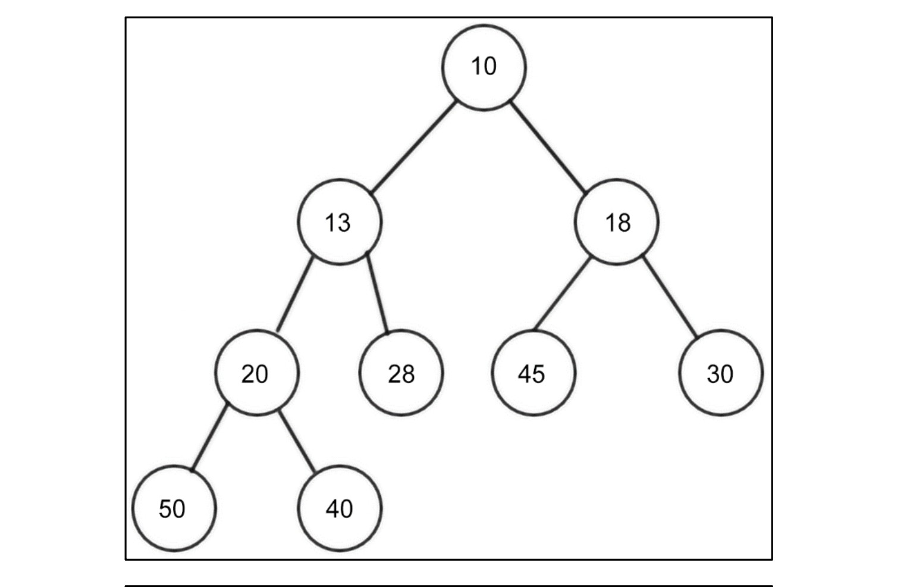

*Figure 7.2: An example of a min heap*
</div>

---

## ⚡ Importance of Heaps

Heaps are powerful because of their applications in:

* 📊 **Heap Sort Algorithms**
* 🛠️ **Priority Queues**

The most common type is the **Binary Heap**, where:

* Each node has **at most two children**.
* If a binary heap has `n` nodes → it has a **minimum height of log₂n**.

---

## 🌲 Complete Binary Tree

A **complete binary tree** is one where **each row must be completely filled** before filling the next row.

📌 **Example:**
<div align="center">
  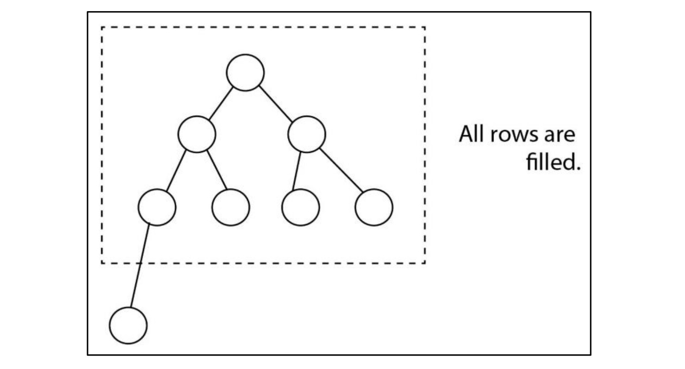

*Figure 7.3: An example of a complete binary tree*
</div>

---

## 🧮 Heap Implementation using Indexing

We can represent heaps efficiently using **arrays**. The relationship between indices is:

* **Left Child of node at index `n`** → located at `2n`
* **Right Child of node at index `n`** → located at `2n + 1`
* **Parent of node at index `i`** → located at `⌊i/2⌋`

👉 **Important Rule**: Indexing starts at **1**. A dummy element is placed at **index 0** in the array.

📌 **Example:**

<div align="center">
  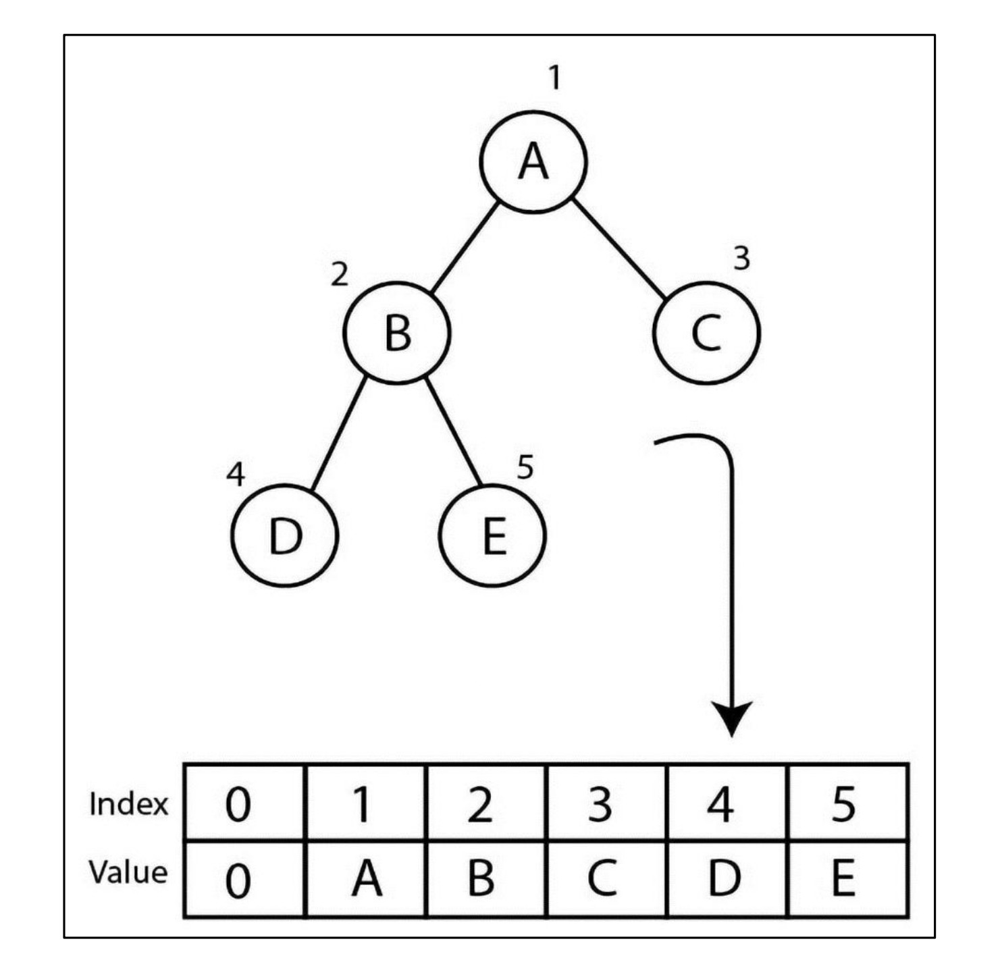

*Figure 7.4: Binary tree and index positions of all the nodes*
</div>

---

# 🌳 **Insertion Operation**

## 📌 Introduction

Insertion in a **Min Heap** works in two main steps:

1. ➕ **Insert the new element** at the end of the list (bottom-most position of the tree).
2. 🔄 **Heapify (arrange)** – Compare the newly added element with its parent and swap if needed until the heap property is restored.

👉 Heap property for **Min Heap**:

* Parent value must always be **less than or equal** to its children.
* The **smallest element** is always at the **root**.

---

## 🖼️ Step-by-Step Figures

### 1️⃣ Insert new node `2` into the heap

<div align="center">
  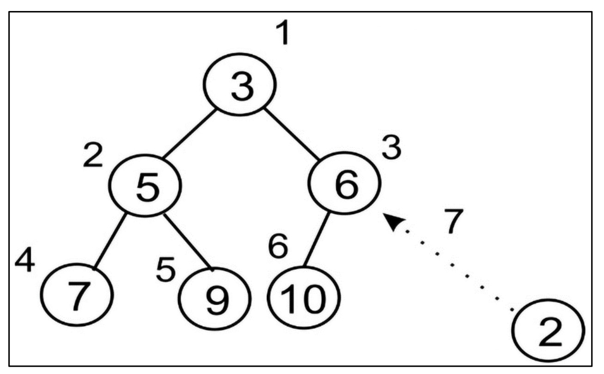

*Figure 7.5: Insertion of a new node `2` in the existing heap*
</div>

---

### 2️⃣ Swap nodes `2` and `6`

<div align="center">
  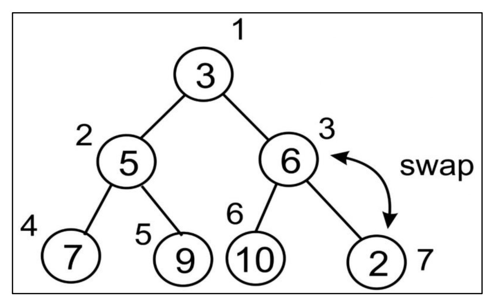

*Figure 7.6: Swapping nodes `2` and `6` to maintain the heap property*
</div>

---

### 3️⃣ Swap nodes `2` and `3`

<div align="center">
  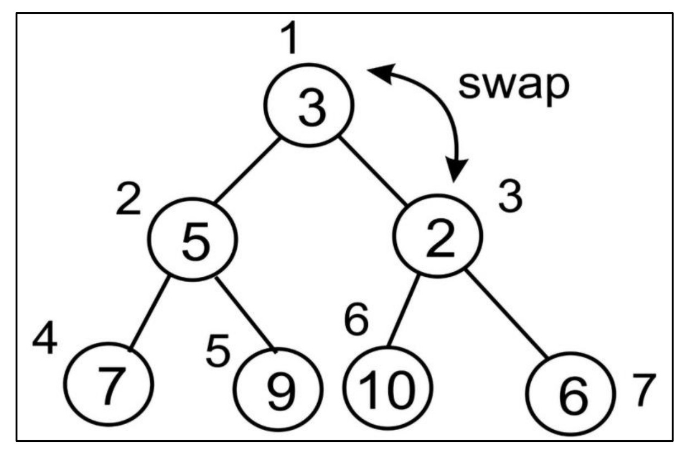

*Figure 7.7: Swapping nodes `2` and `3` to maintain the heap property*
</div>

---

### 4️⃣ Final Heap

<div align="center">
  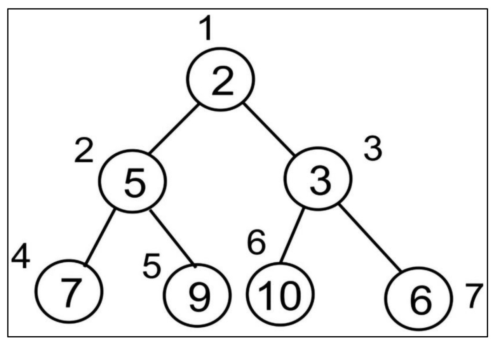

*Figure 7.8: Final heap after insertion of new node `2`*
</div>

---

## 🔢 Example: Constructing a Heap from Scratch

We now insert elements `{4, 8, 7, 2, 9, 10, 5, 1, 3, 6}` step by step.

---

### 🪜 Steps 1 to 6

<div align="center">
  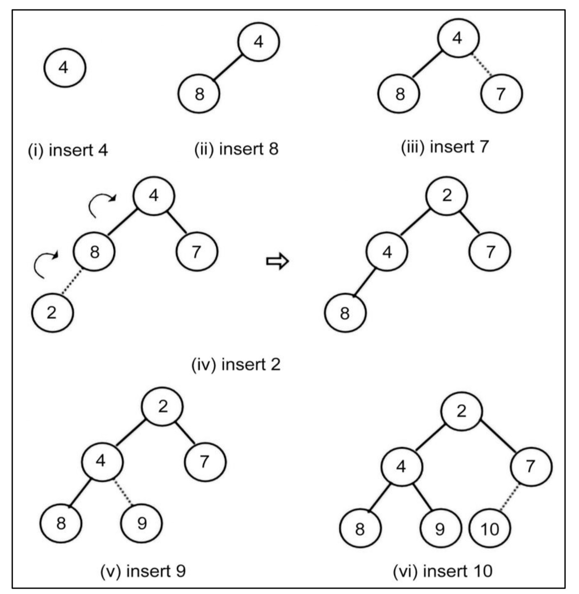

*Figure 7.9: Step-by-step procedure to create a heap (Insert 4, 8, 7, 2, 9, 10)*
</div>

---

### 🪜 Steps 7 to 9

<div align="center">
  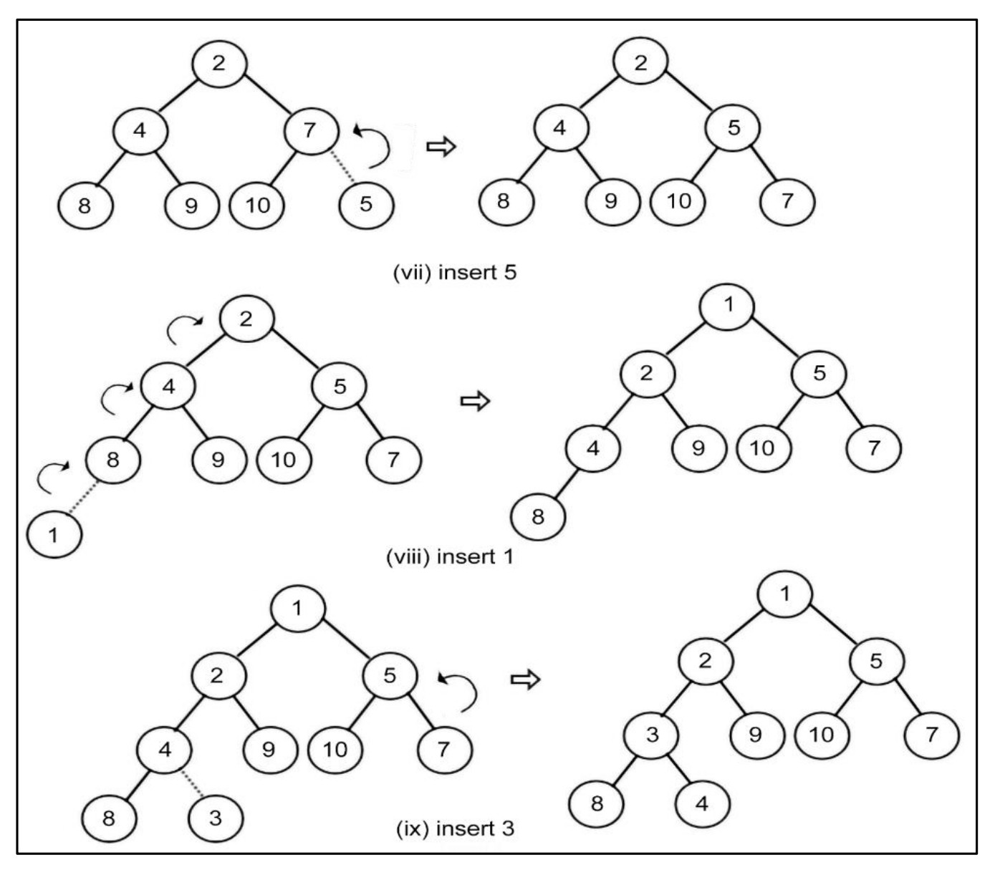

*Figure 7.10: Steps 7 to 9 in creating the heap (Insert 5, 1, 3)*
</div>

---

### 🪜 Step 10 (Final Insertion)

<div align="center">
  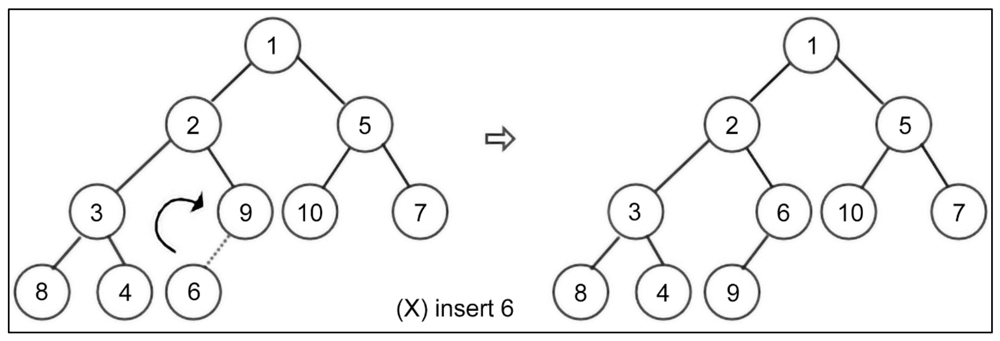
  
*Figure 7.11: Last step and construction of the final heap (Insert 6)*
</div>

---

## 🧑‍💻 Implementation in Python

We use two methods:

### ⚙️ `arrange()` (Heapify Up)

```python
def arrange(self, k):
    while k // 2 > 0:   # loop until root
        if self.heap[k] < self.heap[k // 2]:  # if child < parent
            self.heap[k], self.heap[k // 2] = self.heap[k // 2], self.heap[k]  # swap
        k //= 2  # move up to parent
```

🔎 Explanation:

* `while k // 2 > 0:` → Continue until reaching the root.
* `if self.heap[k] < self.heap[k // 2]:` → If child is smaller, swap with parent.
* `k //= 2` → Move up one level.

---

### ⚙️ `insert()` Method

```python
def insert(self, item):
    self.heap.append(item)   # add item at the end
    self.size += 1           # increase heap size
    self.arrange(self.size)  # heapify (restore property)
```

---

## 🏗️ Building the Heap

```python
h = MinHeap()
for i in (4, 8, 7, 2, 9, 10, 5, 1, 3, 6):
    h.insert(i)

print(h.heap)
```

---

## 🖨️ Output

```text
[0, 1, 2, 5, 3, 6, 10, 7, 8, 4, 9]
```

---

## ✅ Final Observation

* The output matches the structure shown in **Figure 7.11** 🎯
* The **root element is the smallest (1)**, and all parents are smaller than their children, maintaining **Min Heap property**.

---

