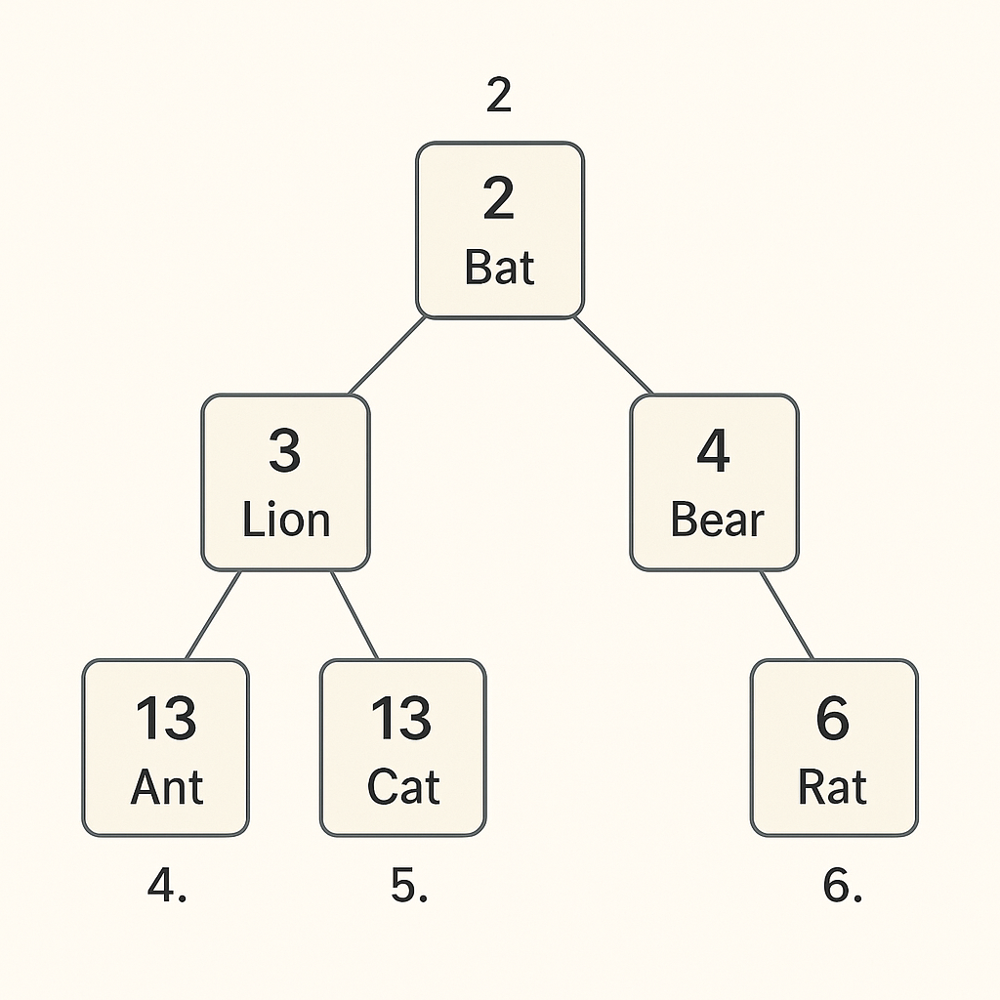

<div align="left">
    <h1>➡️ <b>Priority Queues</b></h1>
</div>

<details>
<summary><strong>📑 Table of Contents</strong></summary>

| # | Section | Link |
|---|---|---|
| 1 | 🔑 Key Points | [Key Points](#-key-points) |
| 2 | 📖 Figure 7.19 – Demonstration | [Figure 7.19 – Demonstration of a Priority Queue](#-figure-719--demonstration-of-a-priority-queue) |
| 3 | 📖 Figure 7.20 – Step-by-Step | [Figure 7.20 – Step-by-Step Procedure to Create a Priority Queue](#-figure-720--step-by-step-procedure-to-create-a-priority-queue) |
| 4 | ⚙️ Python Implementation | [Python Implementation of Priority Queue](#-python-implementation-of-priority-queue) |
| 5 | 🧩 Node Class | [Node Class](#-node-class) |
| 6 | 🏗 Priority Queue Class | [Priority Queue Class](#-priority-queue-class) |
| 7 | ➕ Insert Operation | [Insert Operation](#-insert-operation) |
| 8 | ❌ Delete Operation | [Delete Operation](#-delete-operation) |
| 9 | 👀 Show Method | [Show Method](#-show-method) |
| 10 | 🐍 Example Usage | [Example Usage](#-example-usage) |
| 11 | ⚡ Priority Queue using Heap | [Priority Queue using Heap](#-priority-queue-using-heap) |
| 12 | 🏗 PriorityQueueHeap Class | [PriorityQueueHeap Class](#-priorityqueueheap-class) |
| 13 | 🔹 arrange() – Heapify Up | [arrange() – Heapify Up (Percolate Up)](#-arrange--heapify-up-percolate-up) |
| 14 | 🔹 insert() – Add New Element | [insert() – Add New Element](#-insert--add-new-element) |
| 15 | 🔹 sink() – Heapify Down | [sink() – Heapify Down (Percolate Down)](#-sink--heapify-down-percolate-down) |
| 16 | 🔹 minchild() – Get Index | [minchild() – Get Index of Smaller Child](#-minchild--get-index-of-smaller-child) |
| 17 | 🔹 delete_at_root() | [delete_at_root() – Remove Highest Priority Element](#-delete_at_root--remove-highest-priority-element) |
| 18 | 🐍 Heap Example Usage | [Example Usage](#-example-usage-1) |
| 19 | 🔄 Deletion Example | [Deletion Example](#-deletion-example) |

</details>

<br/>

## Priority Queue

A **priority queue** is a data structure similar to a normal queue in which data is retrieved based on the **First In, First Out (FIFO)** policy.
👉 However, in a **priority queue**, **priority** is attached with each data element.

* Data elements with **higher priority** are retrieved **before** the lower priority elements.
* If two elements have the **same priority**, they are retrieved according to the **FIFO** policy.

---

## 🔑 Key Points

* We can assign the **priority** of the data depending upon the application.
* Widely used in:

  * **CPU Scheduling**
  * **Dijkstra’s shortest-path**
  * **A Search Algorithm**
  * **Huffman Coding** (Data compression)

➡️ In simple terms: The item with the **highest priority** is always served **first**.

---

## 📖 Figure 7.19 – Demonstration of a Priority Queue

<div align="center">
  
</div>

* The queue stores data according to **priority**.
* When inserting (`enqueue`) a new item, it is placed in the **correct position** based on its priority.
* In this figure:

  * Item `5` is **enqueued** into the correct position.
  * Item `1` is **dequeued** (removed from the front since it has highest priority).

---

## 📖 Figure 7.20 – Step-by-Step Procedure to Create a Priority Queue

<div align="center">
  
</div>

Step-by-step explanation:

1. Initially, the queue is empty. Insert **3** → Queue = `[3]`
2. Insert **8** → Since `8 > 3`, it goes in front → `[8, 3]`
3. Insert **2** → Goes after 3 → `[8, 3, 2]`
4. Insert **6** → Placed between 8 and 3 → `[8, 6, 3, 2]`
5. Insert **10** → Highest value, added at the start → `[10, 8, 6, 3, 2]`

👉 When **dequeue** is applied, the **highest-priority element** (here, `10`) will be removed first.

---

## ⚙️ Python Implementation of Priority Queue

### 🧩 Node Class

A `Node` contains both **data** and its **priority**:

```python
# class for Node with data and priority
class Node:
    def __init__(self, info, priority):
        self.info = info
        self.priority = priority
```

---

### 🏗 Priority Queue Class

We define the main queue structure:

```python
# class for Priority Queue
class PriorityQueue:
    def __init__(self):
        self.queue = []
```

---

### ➕ Insert Operation

We insert a new node into the queue based on priority.
💡 Here, **smaller priority value = higher priority**.

```python
def insert(self, node):
    if len(self.queue) == 0:
        # add the new node
        self.queue.append(node)
    else:
        # traverse the queue to find the right place
        for x in range(0, len(self.queue)):
            if node.priority >= self.queue[x].priority:
                if x == (len(self.queue) - 1):
                    self.queue.insert(x + 1, node)
                else:
                    continue
            else:
                self.queue.insert(x, node)
                return True
```

---

### ❌ Delete Operation

Removes and returns the **highest-priority element**:

```python
def delete(self):
    # remove the first node
    x = self.queue.pop(0)
    print("Deleted data with the given priority-", x.info, x.priority)
    return x
```

---

### 👀 Show Method

Displays all elements in the queue:

```python
def show(self):
    for x in self.queue:
        print(str(x.info) + " - " + str(x.priority))
```

---

## 🐍 Example Usage

```python
p = PriorityQueue()
p.insert(Node("Cat", 13))
p.insert(Node("Bat", 2))
p.insert(Node("Rat", 1))
p.insert(Node("Ant", 26))
p.insert(Node("Lion", 25))

p.show()
p.delete()
```

### ✅ Output:

```
Rat – 1
Bat – 2
Cat – 13
Lion – 25
Ant – 26
Deleted data with the given priority- Rat 1
```

---

# **⚡ Priority Queue using Heap**

Earlier, we saw how **Priority Queues** can be implemented using a **array base list**.
But in real-world, **heaps** are the most efficient choice because:

* ✅ **Insertion**: `O(log n)`
* ✅ **Deletion**: `O(log n)`
* ✅ Maintains **min-heap / max-heap property**

👉 Here, we use a **Min-Heap** where **smaller priority value = higher priority**.

---

<div align="center">
  
</div>

---

## 🏗 Python Implementation

### 🔹 PriorityQueueHeap Class

```python
class PriorityQueueHeap:
    def __init__(self):
        self.heap = [()]   # heap initialized with empty tuple at index 0
        self.size = 0      # to keep track of heap size
```

📌 **Explanation**:

* Heap is stored in a **list** (`self.heap`).
* Index `0` is unused (dummy placeholder), making it easier to do parent-child calculations.

---

### 🔹 arrange() – Heapify Up (Percolate Up)

```python
def arrange(self, k):
    while k // 2 > 0:   # until we reach the root
        if self.heap[k][0] < self.heap[k//2][0]:
            # swap child with parent if priority is smaller
            self.heap[k], self.heap[k//2] = self.heap[k//2], self.heap[k]
        k //= 2   # move up
```

📌 **Explanation**:

* After inserting a node, we **compare it with its parent**.
* If the child has **smaller priority**, we swap it.
* Repeat until heap property is satisfied.

---

### 🔹 insert() – Add New Element

```python
def insert(self, priority, item):
    self.heap.append((priority, item))  # add new (priority, item) tuple
    self.size += 1                      # increase size
    self.arrange(self.size)             # fix heap property
```

📌 **Explanation**:

* A new tuple `(priority, item)` is added to the end.
* Then `arrange()` is called to **maintain min-heap property**.

---

### 🔹 sink() – Heapify Down (Percolate Down)

```python
def sink(self, k):
    while k * 2 <= self.size:  # while it has children
        mc = self.minchild(k)  # get min child index
        if self.heap[k][0] > self.heap[mc][0]:
            # swap with smaller child
            self.heap[k], self.heap[mc] = self.heap[mc], self.heap[k]
        k = mc   # move down
```

📌 **Explanation**:

* After deleting the root, last element moves to root.
* Now root might **violate heap property**.
* So we **push it down** until property is restored.

---

### 🔹 minchild() – Get Index of Smaller Child

```python
def minchild(self, k):
    if k * 2 + 1 > self.size:  # only one child exists
        return k * 2
    elif self.heap[k*2][0] < self.heap[k*2+1][0]:
        return k * 2
    else:
        return k * 2 + 1
```

📌 **Explanation**:

* If only **left child** exists, return it.
* If both exist, return the child with **smaller priority value**.

---

### 🔹 delete\_at\_root() – Remove Highest Priority Element

```python
def delete_at_root(self):
    item = self.heap[1][1]             # root’s data item
    self.heap[1] = self.heap[self.size] # replace root with last element
    self.size -= 1
    self.heap.pop()                     # remove last element
    self.sink(1)                        # restore heap property
    return item
```

📌 **Explanation**:

* Always removes the **root element** (highest priority).
* Last element replaces root.
* Then `sink()` is used to re-balance heap.

---

## 🐍 Example Usage

```python
h = PriorityQueueHeap()
h.insert(2, "Bat")
h.insert(13,"Cat")
h.insert(18, "Rat")
h.insert(26, "Ant")
h.insert(3, "Lion")
h.insert(4, "Bear")

print(h.heap)
```

### ✅ Output:

```
[(), (2, 'Bat'), (3, 'Lion'), (4, 'Bear'), (26, 'Ant'), (13, 'Cat'), (18, 'Rat')]
```

📌 **Explanation**:

* The heap structure internally maintains **min-heap order**.
* Notice how smallest priority `2` (Bat) is at the root.

---

## 🔄 Deletion Example

```python
for i in range(h.size):
    n = h.delete_at_root()
    print(n)
    print(h.heap)
```

### ✅ Output:

```
Bat
[(), (3, 'Lion'), (13, 'Cat'), (4, 'Bear'), (26, 'Ant'), (18, 'Rat')]

Lion
[(), (4, 'Bear'), (13, 'Cat'), (18, 'Rat'), (26, 'Ant')]

Bear
[(), (13, 'Cat'), (26, 'Ant'), (18, 'Rat')]

Cat
[(), (18, 'Rat'), (26, 'Ant')]

Rat
[(), (26, 'Ant')]

Ant
[()]
```

📌 **Explanation**:

* Each time, the **root element** (highest priority) is removed.
* Heap property is restored after every deletion.
* Final heap becomes empty.

---
