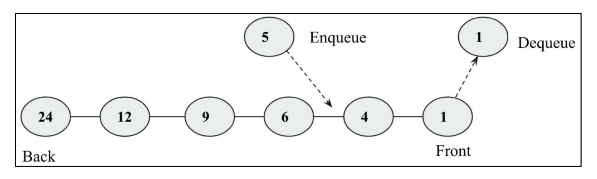

# ➡️ **Priority Queues**

A **priority queue** is a data structure similar to a normal queue in which data is retrieved based on the **First In, First Out (FIFO)** policy.
👉 However, in a **priority queue**, **priority** is attached with each data element.

* Data elements with **higher priority** are retrieved **before** the lower priority elements.
* If two elements have the **same priority**, they are retrieved according to the **FIFO** policy.

---

## 🔑 Key Points

* We can assign the **priority** of the data depending upon the application.
* Widely used in:

  * **CPU Scheduling**
  * **Dijkstra’s shortest-path**
  * **A Search Algorithm**
  * **Huffman Coding** (Data compression)

➡️ In simple terms: The item with the **highest priority** is always served **first**.

---

## 📖 Figure 7.19 – Demonstration of a Priority Queue

<div align="center">
  
</div>

* The queue stores data according to **priority**.
* When inserting (`enqueue`) a new item, it is placed in the **correct position** based on its priority.
* In this figure:

  * Item `5` is **enqueued** into the correct position.
  * Item `1` is **dequeued** (removed from the front since it has highest priority).

---

## 📖 Figure 7.20 – Step-by-Step Procedure to Create a Priority Queue

<div align="center">
  
</div>

Step-by-step explanation:

1. Initially, the queue is empty. Insert **3** → Queue = `[3]`
2. Insert **8** → Since `8 > 3`, it goes in front → `[8, 3]`
3. Insert **2** → Goes after 3 → `[8, 3, 2]`
4. Insert **6** → Placed between 8 and 3 → `[8, 6, 3, 2]`
5. Insert **10** → Highest value, added at the start → `[10, 8, 6, 3, 2]`

👉 When **dequeue** is applied, the **highest-priority element** (here, `10`) will be removed first.

---

## ⚙️ Python Implementation of Priority Queue

### 🧩 Node Class

A `Node` contains both **data** and its **priority**:

```python
# class for Node with data and priority
class Node:
    def __init__(self, info, priority):
        self.info = info
        self.priority = priority
```

---

### 🏗 Priority Queue Class

We define the main queue structure:

```python
# class for Priority Queue
class PriorityQueue:
    def __init__(self):
        self.queue = []
```

---

### ➕ Insert Operation

We insert a new node into the queue based on priority.
💡 Here, **smaller priority value = higher priority**.

```python
def insert(self, node):
    if len(self.queue) == 0:
        # add the new node
        self.queue.append(node)
    else:
        # traverse the queue to find the right place
        for x in range(0, len(self.queue)):
            if node.priority >= self.queue[x].priority:
                if x == (len(self.queue) - 1):
                    self.queue.insert(x + 1, node)
                else:
                    continue
            else:
                self.queue.insert(x, node)
                return True
```

---

### ❌ Delete Operation

Removes and returns the **highest-priority element**:

```python
def delete(self):
    # remove the first node
    x = self.queue.pop(0)
    print("Deleted data with the given priority-", x.info, x.priority)
    return x
```

---

### 👀 Show Method

Displays all elements in the queue:

```python
def show(self):
    for x in self.queue:
        print(str(x.info) + " - " + str(x.priority))
```

---

## 🐍 Example Usage

```python
p = PriorityQueue()
p.insert(Node("Cat", 13))
p.insert(Node("Bat", 2))
p.insert(Node("Rat", 1))
p.insert(Node("Ant", 26))
p.insert(Node("Lion", 25))

p.show()
p.delete()
```

### ✅ Output:

```
Rat – 1
Bat – 2
Cat – 13
Lion – 25
Ant – 26
Deleted data with the given priority- Rat 1
```

---
