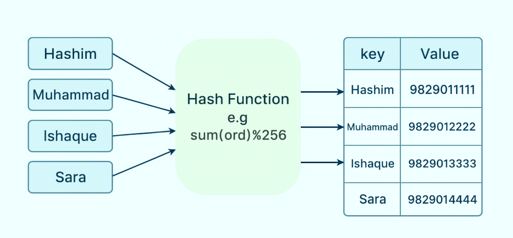
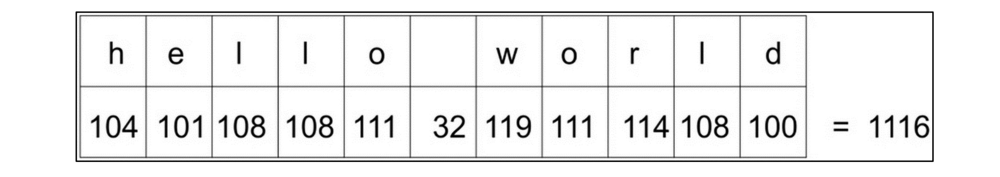
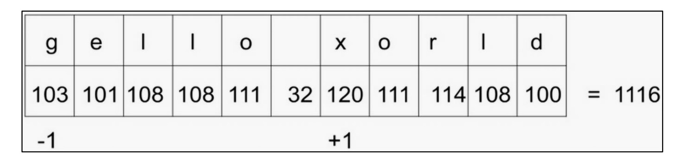
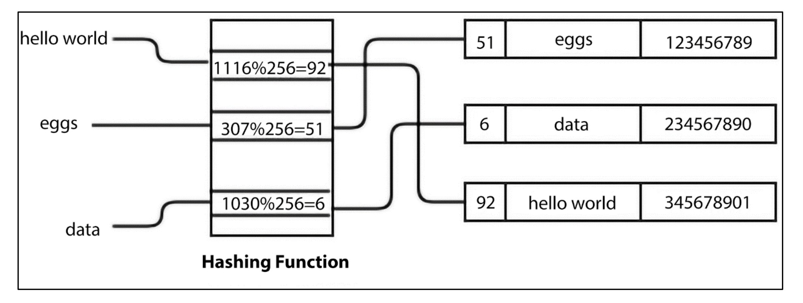
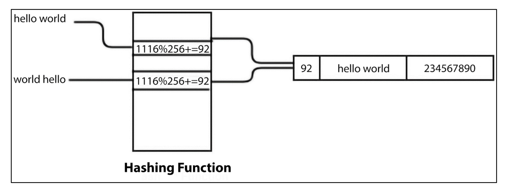

# 📑 **Introducing Hash Tables**

As we know, **arrays** and **lists** store the data elements in **sequence**.
In an array, the data items are accessed by an **index number**.

✔️ Accessing array elements using index numbers is **fast**.
❌ However, they are **inconvenient** when we cannot remember the index number.

👉 Example:
If we wish to extract the **phone number** of a person from the address book at **index 56**, there is **nothing linking a contact to number 56**.
It becomes **difficult to retrieve** an entry from the list using only the index value.

---

## 🔑 Why Hash Tables?

Hash tables are a **data structure** better suited for this kind of problem.

* A **hash table** stores elements in **key–value pairs**.
* Unlike arrays/lists, elements are accessed by a **keyword** (not by index).
* It uses a **hash function** to compute the index position where an element should be stored or retrieved.
* This provides **fast lookups** ⚡, since the index corresponds to the **hash value** of the key.

---

## 🖼️ Visual Representation

Below is an overview of how a **hash table** stores data.

<div align="center">
  

**Figure 8.1:** An example of a hash table
</div>

Here:

* Keys like `Hashim`, `Muhammad`, `Ishaque`, `Sara` are passed into a **hash function**.
* Example hash function:

```python
sum(ord(c) for c in key) % 256
```

* This function computes a **hash value (index)**.
* Each **key** is then mapped to its corresponding **value** (e.g., phone numbers).

---

## 📘 Dictionaries (Real-World Example)

Dictionaries in Python are widely used and are often built using **hash tables**.

* A dictionary stores data in **(key, value)** pairs.
* Instead of accessing the contact with an **index**, we use the **key**.

### 🐍 Python Example

```python
my_dict = {
    "Hashim": "9229012345",
    "Muhammad": "9229012346",
    "Ishaque": "9229012347",
    "Sara": "9229012348"
}

print("All keys and values")
for x, y in my_dict.items():
    print(x, ":", y)  # prints keys and values

print(my_dict["Hashim"])
```

---

### 📤 Output

```
All keys and values
Hashim: 9229012345
Muhammad: 9229012346
Ishaque: 9229012347
Sara: 9229012348
9229012345
```

---

## ⚡ Efficiency of Hash Tables

* Hash tables store data in a way that makes retrieval **extremely fast**.
* They are based on the concept of **hashing**, which converts keys into index values.

👉 This makes them a fundamental structure for applications like **dictionaries, symbol tables, caching, and databases**.

---

# 🔑 **Hashing Functions**

Hashing is a technique in which, when we provide **data of arbitrary size** to a function, we get a **small, simplified value**.

This function is called a **hash function**.

👉 Hashing uses a hash function to **map the keys** to another range of data in a way that the new range of keys can be used as an index in the hash table.

In other words:
**Hashing = Convert the key values into integer values (indices) for the hash table**.

---

## 📝 Example: Hashing Strings

We are using **hashing to convert strings into integers**.

➡️ Example: Hash the string `"hello world"` so that we get a numeric value corresponding to this string which can be used as an index in the hash table.

---

### 📌 `ord()` Function in Python

In Python, the **`ord()` function** returns a unique integer value (ordinal value) mapped to a character in the **Unicode encoding system**.

✔️ Unicode is a **superset of ASCII**. <br/>
✔️ Example:

```python
ord('f')
```

Output:

```
102
```

---

### 🧮 Simple Hash with `sum(map(ord, s))`

We can sum the ordinal numbers of each character in a string to get a hash:

```python
sum(map(ord, "hello world"))
```

✅ Output:

```
1116
```

---

### 📊 Visual Representation

#### Figure 8.2

Ordinal values of each character for the `"hello world"` string:

<div align="center">
  
</div>

---

## ⚠️ Problem: Collisions

The approach above is not perfect — **different strings can yield the same hash**.

Example:

```python
sum(map(ord, "world hello"))
```

✅ Output:

```
1116
```

And even:

```python
sum(map(ord, "gello xorld"))
```

✅ Output:

```
1116
```

#### Figure 8.3

Ordinal values of each character for `"gello xorld"`:

<div align="center">
  
</div>

---

## 🎯 Perfect Hashing Functions

A **perfect hash function** gives a **unique hash value** for each input string.

👉 But designing one that is **fast, efficient, and collision-free** is very difficult.
👉 Usually, we prefer **fast hash functions** and then handle collisions separately.

---

## 🚀 Improved Hashing Strategy

To reduce collisions:
✔️ Multiply each character’s ordinal value by a continuously increasing multiplier. <br/>
✔️ Add all results to get the final hash.

---

### 📊 Visual Representation

#### Figure 8.4

Ordinal values multiplied by numeric values for each character of `"hello world"`:

<div align="center">
  
</div>

Final value = **6736**

---

## 🐍 Python Implementation

```python
def myhash(s):
    mult = 1
    hv = 0
    for ch in s:
        hv += mult * ord(ch)
        mult += 1
    return hv
```

---

### 🔎 Testing the Function

```python
for item in ("hello world", "world hello", "gello xorld"):
    print("{}: {}".format(item, myhash(item)))
```

✅ Output:

```
hello world: 6736
world hello: 6616
gello xorld: 6742
```

---

### ⚠️ Still Not Perfect

Trying with `"ad"` and `"ga"`:

```python
for item in ("ad", "ga"):
    print("{}: {}".format(item, myhash(item)))
```

✅ Output:

```
ad: 297
ga: 297
```

⚡ Even here we see **collisions still exist** → which means we must use **collision resolution techniques** in practice.

---

# 🔑 **Resolving Collisions** in Hash Tables

A **hash table** is a data structure where each position is called a **slot** or **bucket** that can store an element.
Each data item is stored as a **(key, value)** pair at a position determined by the **hash value of the key**.

---

## 📝 Example Hash Function

1. First, compute the hash value by summing up the **ordinal values of all characters**.
2. Then, compute the **final hash value (index position)** by taking the total ordinal values **mod 256**.
3. Here, we assume **256 slots/buckets** for the hash table.

   * The number of slots can vary depending on how many records we want to store.

---

## 📊 Sample Hash Table (Figure 8.5)

<div align="center">
  

**Figure 8.5: A sample hash table**
</div>

👉 In this figure:

* Key `"eggs"` maps to the value **123456789**.
* Key `"data"` maps to the value **234567890**.
* Key `"hello world"` maps to the value **345678901**.

For example:

* `"hello world"` → Hash value **92** → Slot **92**.
* `"eggs"` → Hash value **51** → Slot **51**.
* `"data"` → Hash value **6** → Slot **6**.

---

## 🚨 Collision Example (Figure 8.6)

Once we know the hash value of the key, it is used to find the slot where the element should be stored.

* If the slot is **empty** → Insert the item there.
* If the slot is **not empty** → A **collision** occurs.

  * This means the **hash value** is the same as another item already stored.
  * We need a strategy to handle this conflict.

<div align="center">
  

**Figure 8.6: Hash values of two strings are the same**
</div>

👉 In this figure:

* `"hello world"` already exists at slot **92**.
* A new key `"world hello"` also maps to the hash value **92**.
* This results in a **collision**.

---

## ⚒️ Collision Resolution Strategy

One way of resolving collisions is **Open Addressing**:

* Start at the slot of the collision.
* Search for another **free slot** to place the new item.
* Continue until an empty position is found.

---

Here’s your provided text beautifully formatted into a **README.md** file with full detail, emojis, code, and figures exactly included 👇

---

# 🔑 Open Addressing in Hash Tables

**Open addressing** is a **collision resolution technique** used in hash tables.

* In this method, **key values are stored directly** in the hash table.
* If a collision occurs, it is resolved using the **probing technique**.
* **Probing** = searching for an alternate position until a free slot is found.

---

## ⚒️ Approaches of Open Addressing

There are three popular approaches to open addressing:

1. 🔹 **Linear Probing**
2. 🔹 **Quadratic Probing**
3. 🔹 **Double Hashing**

---

## 📌 Linear Probing

* A systematic way of visiting slots to resolve collisions.
* If the target slot is **occupied**, look for the **next free slot** by **adding 1** to the previous hash value.
* Formula:

  ```math
  New_Hash = (Old_Hash + 1) % Table_Size
  ```

---

### 🖼 Example of Linear Probing

<div align="center">
  

**Figure 8.7: An example of collision resolution**
</div>


👉 Steps:

1. Compute the hash of key `"egg"`:

   ```
   307 % 256 = 51
   ```
2. Slot **51** is already occupied with `"data"`.
3. Apply **linear probing**:

   ```
   (307 + 1) % 256 = 52
   ```
4. Store `"egg"` at slot **52** (which is free). ✅

---

## ⚠️ Drawback of Linear Probing

* Since the increment is **fixed**, all new items go to the **next available slot**.
* This creates **clusters of consecutive occupied slots**.
* Result:

  * One part of the hash table becomes dense.
  * Another part may remain empty.

👉 To solve this, other strategies like **quadratic probing** or **double hashing** are preferred.

---

# 🛠 Implementing Hash Tables in Python

To implement a hash table:

---

## 📦 Step 1: Hash Item Class

Each item stores a **key-value pair**:

```python
class HashItem:
    def __init__(self, key, value):
        self.key = key
        self.value = value
```

---

## 📦 Step 2: Hash Table Class

Initialize hash table with **256 slots**:

```python
class HashTable:
    def __init__(self):
        self.size = 256
        self.slots = [None for i in range(self.size)]
        self.count = 0
```

* **size** → total number of slots (capacity).
* **count** → number of filled slots (actual key-value pairs).
* **slots** → stores the items.

---

## 📦 Step 3: Hash Function

We use a **custom hash function** that:

1. Computes the sum of **ordinal values** of characters.
2. Uses multiplication weight for each character.
3. Returns the value **modulo table size** (0–255).

```python
def _hash(self, key): 
    mult = 1
    hv = 0
    for ch in key:
        hv += mult * ord(ch)
        mult += 1
    return hv % self.size
```

👉 Notes:

* The function is **internal** (hence `_hash`).
* Keys assumed as **strings**.
* Returns an integer between `0` and `255`.

---

## 📦 Storing Elements in a Hash Table

To **store elements** in a hash table:

* We use the **`put()`** function to **add** a key-value pair.
* We use the **`get()`** function to **retrieve** values.

---

## 🔑 Step 1: Updating `HashItem` Class

The `HashItem` class already holds a **key** and a **value**.
When storing new elements, these will be wrapped inside a `HashItem` object.

---

## 🔑 Step 2: Implementing `put()` Function

The **`put()`** function goes inside the `HashTable` class.

```python
def put(self, key, value):
    item = HashItem(key, value)   # Create a new item
    h = self._hash(key)           # Compute hash value for key
    
    # Step 1: Collision check using linear probing
    while self.slots[h] != None:
        if self.slots[h].key == key:  
            # If key already exists, update value (overwrite)
            break
        h = (h + 1) % self.size   # Move to the next slot (linear probing)
    
    # Step 2: Insert item in free slot
    if self.slots[h] == None:
        self.count += 1           # Increase count of elements
        self.slots[h] = item      # Place item in slot
    
    # Step 3: Check table growth
    self.check_growth()
```

---

## 🌀 Step-by-Step Explanation

1. **Compute Hash Value**

   * Generate the hash index using `_hash(key)`.
   * Example: `"egg"` → `307 % 256 = 51`.

2. **Check for Collisions**

   * If the slot is already occupied, use **linear probing**:

     ```python
     while self.slots[h] != None:
         if self.slots[h].key == key:
             break
         h = (h + 1) % self.size
     ```
   * Move sequentially until a **free slot** is found.

3. **Insert New Element**

   * If the slot is empty (`None`), increase `count` and insert the new item:

     ```python
     if self.slots[h] == None:
         self.count += 1
         self.slots[h] = item
     ```

4. **Growth Check**

   * Finally, call **`self.check_growth()`** to see if the table needs resizing.

---

## 📌 Key Notes

* The **linear probing technique** ensures that even if collisions happen, data is placed in the **next available free slot**.
* **`count`** tracks how many slots are filled.
* **`check_growth()`** is a method to **expand the table** when it becomes nearly full (to maintain efficiency).

---
