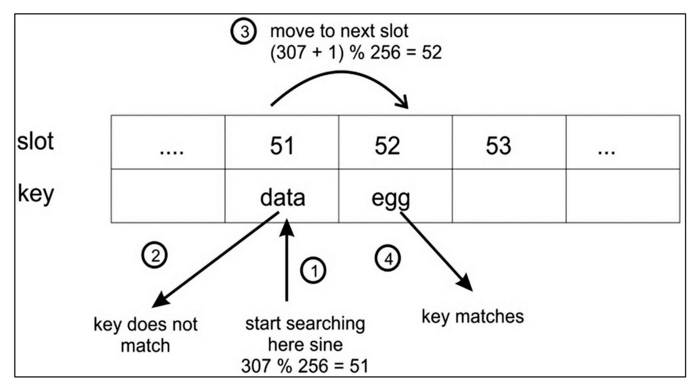
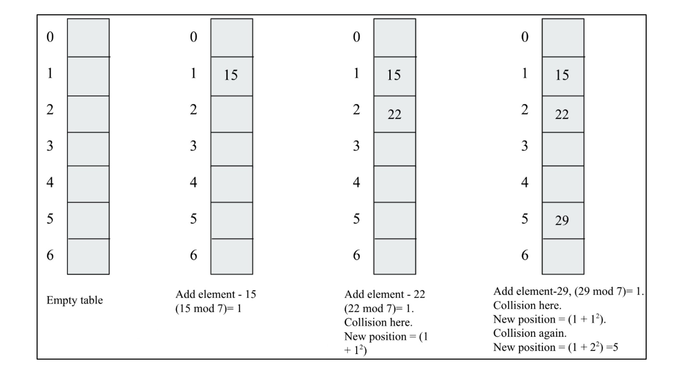
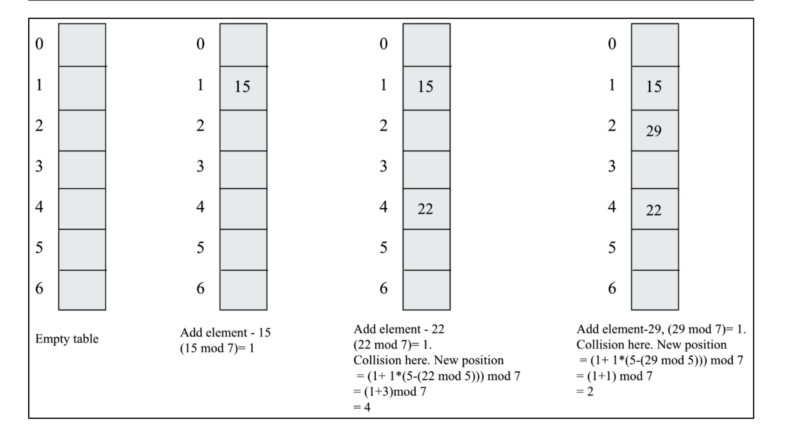
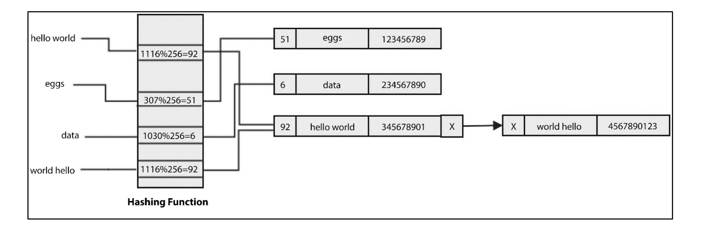
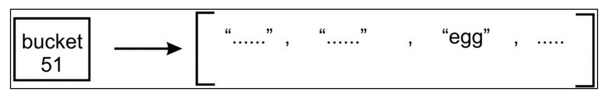
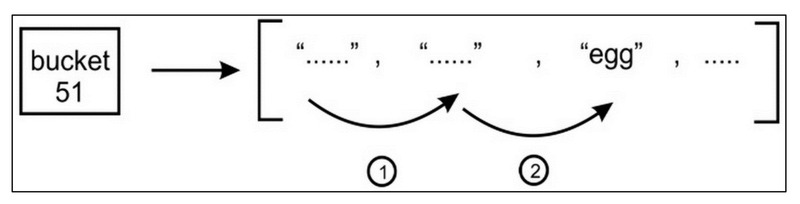
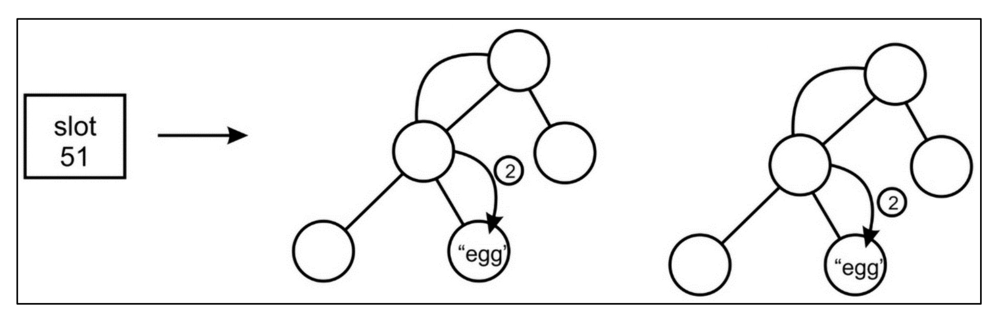

# 📑 **Introducing Hash Tables**

As we know, **arrays** and **lists** store the data elements in **sequence**.
In an array, the data items are accessed by an **index number**.

✔️ Accessing array elements using index numbers is **fast**.
❌ However, they are **inconvenient** when we cannot remember the index number.

👉 Example:
If we wish to extract the **phone number** of a person from the address book at **index 56**, there is **nothing linking a contact to number 56**.
It becomes **difficult to retrieve** an entry from the list using only the index value.

---

## 🔑 Why Hash Tables?

Hash tables are a **data structure** better suited for this kind of problem.

* A **hash table** stores elements in **key–value pairs**.
* Unlike arrays/lists, elements are accessed by a **keyword** (not by index).
* It uses a **hash function** to compute the index position where an element should be stored or retrieved.
* This provides **fast lookups** ⚡, since the index corresponds to the **hash value** of the key.

---

## 🖼️ Visual Representation

Below is an overview of how a **hash table** stores data.

<div align="center">
  

**Figure 8.1:** An example of a hash table
</div>

Here:

* Keys like `Hashim`, `Muhammad`, `Ishaque`, `Sara` are passed into a **hash function**.
* Example hash function:

```python
sum(ord(c) for c in key) % 256
```

* This function computes a **hash value (index)**.
* Each **key** is then mapped to its corresponding **value** (e.g., phone numbers).

---

## 📘 Dictionaries (Real-World Example)

Dictionaries in Python are widely used and are often built using **hash tables**.

* A dictionary stores data in **(key, value)** pairs.
* Instead of accessing the contact with an **index**, we use the **key**.

### 🐍 Python Example

```python
my_dict = {
    "Hashim": "9229012345",
    "Muhammad": "9229012346",
    "Ishaque": "9229012347",
    "Sara": "9229012348"
}

print("All keys and values")
for x, y in my_dict.items():
    print(x, ":", y)  # prints keys and values

print(my_dict["Hashim"])
```

---

### 📤 Output

```
All keys and values
Hashim: 9229012345
Muhammad: 9229012346
Ishaque: 9229012347
Sara: 9229012348
9229012345
```

---

## ⚡ Efficiency of Hash Tables

* Hash tables store data in a way that makes retrieval **extremely fast**.
* They are based on the concept of **hashing**, which converts keys into index values.

👉 This makes them a fundamental structure for applications like **dictionaries, symbol tables, caching, and databases**.

---

# 🔑 **Hashing Functions**

Hashing is a technique in which, when we provide **data of arbitrary size** to a function, we get a **small, simplified value**.

This function is called a **hash function**.

👉 Hashing uses a hash function to **map the keys** to another range of data in a way that the new range of keys can be used as an index in the hash table.

In other words:
**Hashing = Convert the key values into integer values (indices) for the hash table**.

---

## 📝 Example: Hashing Strings

We are using **hashing to convert strings into integers**.

➡️ Example: Hash the string `"hello world"` so that we get a numeric value corresponding to this string which can be used as an index in the hash table.

---

### 📌 `ord()` Function in Python

In Python, the **`ord()` function** returns a unique integer value (ordinal value) mapped to a character in the **Unicode encoding system**.

✔️ Unicode is a **superset of ASCII**. <br/>
✔️ Example:

```python
ord('f')
```

Output:

```
102
```

---

### 🧮 Simple Hash with `sum(map(ord, s))`

We can sum the ordinal numbers of each character in a string to get a hash:

```python
sum(map(ord, "hello world"))
```

✅ Output:

```
1116
```

---

### 📊 Visual Representation

#### Figure 8.2

Ordinal values of each character for the `"hello world"` string:

<div align="center">
  
</div>

---

## ⚠️ Problem: Collisions

The approach above is not perfect — **different strings can yield the same hash**.

Example:

```python
sum(map(ord, "world hello"))
```

✅ Output:

```
1116
```

And even:

```python
sum(map(ord, "gello xorld"))
```

✅ Output:

```
1116
```

#### Figure 8.3

Ordinal values of each character for `"gello xorld"`:

<div align="center">
  
</div>

---

## 🎯 Perfect Hashing Functions

A **perfect hash function** gives a **unique hash value** for each input string.

👉 But designing one that is **fast, efficient, and collision-free** is very difficult.
👉 Usually, we prefer **fast hash functions** and then handle collisions separately.

---

## 🚀 Improved Hashing Strategy

To reduce collisions:
✔️ Multiply each character’s ordinal value by a continuously increasing multiplier. <br/>
✔️ Add all results to get the final hash.

---

### 📊 Visual Representation

#### Figure 8.4

Ordinal values multiplied by numeric values for each character of `"hello world"`:

<div align="center">
  
</div>

Final value = **6736**

---

## 🐍 Python Implementation

```python
def myhash(s):
    mult = 1
    hv = 0
    for ch in s:
        hv += mult * ord(ch)
        mult += 1
    return hv
```

---

### 🔎 Testing the Function

```python
for item in ("hello world", "world hello", "gello xorld"):
    print("{}: {}".format(item, myhash(item)))
```

✅ Output:

```
hello world: 6736
world hello: 6616
gello xorld: 6742
```

---

### ⚠️ Still Not Perfect

Trying with `"ad"` and `"ga"`:

```python
for item in ("ad", "ga"):
    print("{}: {}".format(item, myhash(item)))
```

✅ Output:

```
ad: 297
ga: 297
```

⚡ Even here we see **collisions still exist** → which means we must use **collision resolution techniques** in practice.

---

# 🔑 **Resolving Collisions** in Hash Tables

A **hash table** is a data structure where each position is called a **slot** or **bucket** that can store an element.
Each data item is stored as a **(key, value)** pair at a position determined by the **hash value of the key**.

---

## 📝 Example Hash Function

1. First, compute the hash value by summing up the **ordinal values of all characters**.
2. Then, compute the **final hash value (index position)** by taking the total ordinal values **mod 256**.
3. Here, we assume **256 slots/buckets** for the hash table.

   * The number of slots can vary depending on how many records we want to store.

---

## 📊 Sample Hash Table (Figure 8.5)

<div align="center">
  

**Figure 8.5: A sample hash table**
</div>

👉 In this figure:

* Key `"eggs"` maps to the value **123456789**.
* Key `"data"` maps to the value **234567890**.
* Key `"hello world"` maps to the value **345678901**.

For example:

* `"hello world"` → Hash value **92** → Slot **92**.
* `"eggs"` → Hash value **51** → Slot **51**.
* `"data"` → Hash value **6** → Slot **6**.

---

## 🚨 Collision Example (Figure 8.6)

Once we know the hash value of the key, it is used to find the slot where the element should be stored.

* If the slot is **empty** → Insert the item there.
* If the slot is **not empty** → A **collision** occurs.

  * This means the **hash value** is the same as another item already stored.
  * We need a strategy to handle this conflict.

<div align="center">
  

**Figure 8.6: Hash values of two strings are the same**
</div>

👉 In this figure:

* `"hello world"` already exists at slot **92**.
* A new key `"world hello"` also maps to the hash value **92**.
* This results in a **collision**.

---

## ⚒️ Collision Resolution Strategy

One way of resolving collisions is **Open Addressing**:

* Start at the slot of the collision.
* Search for another **free slot** to place the new item.
* Continue until an empty position is found.

---

Here’s your provided text beautifully formatted into a **README.md** file with full detail, emojis, code, and figures exactly included 👇

---

# 🔑 Open Addressing in Hash Tables

**Open addressing** is a **collision resolution technique** used in hash tables.

* In this method, **key values are stored directly** in the hash table.
* If a collision occurs, it is resolved using the **probing technique**.
* **Probing** = searching for an alternate position until a free slot is found.

---

## ⚒️ Approaches of Open Addressing

There are three popular approaches to open addressing:

1. 🔹 **Linear Probing**
2. 🔹 **Quadratic Probing**
3. 🔹 **Double Hashing**

---

## 📌 Linear Probing

* A systematic way of visiting slots to resolve collisions.
* If the target slot is **occupied**, look for the **next free slot** by **adding 1** to the previous hash value.
* Formula:

  ```math
  New_Hash = (Old_Hash + 1) % Table_Size
  ```

---

### 🖼 Example of Linear Probing

<div align="center">
  

**Figure 8.7: An example of collision resolution**
</div>


👉 Steps:

1. Compute the hash of key `"egg"`:

   ```
   307 % 256 = 51
   ```
2. Slot **51** is already occupied with `"data"`.
3. Apply **linear probing**:

   ```
   (307 + 1) % 256 = 52
   ```
4. Store `"egg"` at slot **52** (which is free). ✅

---

## ⚠️ Drawback of Linear Probing

* Since the increment is **fixed**, all new items go to the **next available slot**.
* This creates **clusters of consecutive occupied slots**.
* Result:

  * One part of the hash table becomes dense.
  * Another part may remain empty.

👉 To solve this, other strategies like **quadratic probing** or **double hashing** are preferred.

---

# 🛠 Implementing Hash Tables in Python

To implement a hash table:

---

## 📦 Step 1: Hash Item Class

Each item stores a **key-value pair**:

```python
class HashItem:
    def __init__(self, key, value):
        self.key = key
        self.value = value
```

---

## 📦 Step 2: Hash Table Class

Initialize hash table with **256 slots**:

```python
class HashTable:
    def __init__(self):
        self.size = 256
        self.slots = [None for i in range(self.size)]
        self.count = 0
```

* **size** → total number of slots (capacity).
* **count** → number of filled slots (actual key-value pairs).
* **slots** → stores the items.

---

## 📦 Step 3: Hash Function

We use a **custom hash function** that:

1. Computes the sum of **ordinal values** of characters.
2. Uses multiplication weight for each character.
3. Returns the value **modulo table size** (0–255).

```python
def _hash(self, key): 
    mult = 1
    hv = 0
    for ch in key:
        hv += mult * ord(ch)
        mult += 1
    return hv % self.size
```

👉 Notes:

* The function is **internal** (hence `_hash`).
* Keys assumed as **strings**.
* Returns an integer between `0` and `255`.

---

## 📦 Storing Elements in a Hash Table

To **store elements** in a hash table:

* We use the **`put()`** function to **add** a key-value pair.
* We use the **`get()`** function to **retrieve** values.

---

## 🔑 Step 1: Updating `HashItem` Class

The `HashItem` class already holds a **key** and a **value**.
When storing new elements, these will be wrapped inside a `HashItem` object.

---

## 🔑 Step 2: Implementing `put()` Function

The **`put()`** function goes inside the `HashTable` class.

```python
def put(self, key, value):
    item = HashItem(key, value)   # Create a new item
    h = self._hash(key)           # Compute hash value for key
    
    # Step 1: Collision check using linear probing
    while self.slots[h] != None:
        if self.slots[h].key == key:  
            # If key already exists, update value (overwrite)
            break
        h = (h + 1) % self.size   # Move to the next slot (linear probing)
    
    # Step 2: Insert item in free slot
    if self.slots[h] == None:
        self.count += 1           # Increase count of elements
        self.slots[h] = item      # Place item in slot
    
    # Step 3: Check table growth
    self.check_growth()
```

---

## 🌀 Step-by-Step Explanation

1. **Compute Hash Value**

   * Generate the hash index using `_hash(key)`.
   * Example: `"egg"` → `307 % 256 = 51`.

2. **Check for Collisions**

   * If the slot is already occupied, use **linear probing**:

     ```python
     while self.slots[h] != None:
         if self.slots[h].key == key:
             break
         h = (h + 1) % self.size
     ```
   * Move sequentially until a **free slot** is found.

3. **Insert New Element**

   * If the slot is empty (`None`), increase `count` and insert the new item:

     ```python
     if self.slots[h] == None:
         self.count += 1
         self.slots[h] = item
     ```

4. **Growth Check**

   * Finally, call **`self.check_growth()`** to see if the table needs resizing.

---

## 📌 Key Notes

* The **linear probing technique** ensures that even if collisions happen, data is placed in the **next available free slot**.
* **`count`** tracks how many slots are filled.
* **`check_growth()`** is a method to **expand the table** when it becomes nearly full (to maintain efficiency).

---

## 📈 **Growing a Hash Table**

In our earlier example, the hash table size was fixed at **256 slots**.

⚠️ **Problem**:

* As more elements are inserted, the table fills up.
* At some point, all slots are occupied → table becomes full.
* In such a case, inserting a new element is **impossible without growth**.

👉 **Solution**:
We **dynamically grow the table** when it starts to get full.

---

## 📊 Load Factor (How Full the Table Is)

The **load factor** gives us a measure of how many slots are in use compared to the total capacity:

$$
\text{Load Factor} = \frac{n}{k}
$$

* **n** → Number of used slots (occupied positions).
* **k** → Total number of slots (size of the table).

### 🔎 Observations:

* As the load factor → **1.0**, the table is nearly full.
* Searching and inserting will take longer because of more collisions.
* To avoid performance loss, we **grow the table before it is too full**.

📌 A commonly used threshold is `0.75`.
📌 In this implementation, we use `0.65` (65%).

---

## 🌀 Why Grow the Table?

1. **Collisions increase** as the table fills up.
2. **Linear probing slows down** since it has to check multiple slots before finding an empty one.
3. The hash table can form **clusters** (continuous filled slots), making searching slower.
4. To reduce collisions, we expand the table size → **fewer elements per slot density**.

👉 The usual strategy: **double the size** of the table when the load factor passes the threshold.

---

## 🛠 Implementation Details

### Step 1: Extend the `HashTable` Class

We introduce a new variable **`MAXLOADFACTOR`** to store the threshold limit:

```python
class HashTable:
    def __init__(self):
        self.size = 256
        self.slots = [None for i in range(self.size)]
        self.count = 0
        self.MAXLOADFACTOR = 0.65
```

* **`size`** → total slots available (capacity).
* **`slots`** → list initialized with `None`, representing empty slots.
* **`count`** → how many slots are currently filled.
* **`MAXLOADFACTOR`** → threshold value to trigger growth (here 0.65).

---

### Step 2: `check_growth()` Method

We calculate the load factor every time a new element is inserted.

```python
def check_growth(self):
    loadfactor = self.count / self.size
    if loadfactor > self.MAXLOADFACTOR:
        print("Load factor before growing the hash table", self.count / self.size)
        self.growth()
        print("Load factor after growing the hash table", self.count / self.size)
```

* **Step 1:** Compute `loadfactor = count / size`.
* **Step 2:** If the load factor exceeds `MAXLOADFACTOR`:

  * Print the load factor before growing.
  * Call `growth()` method to resize.
  * Print the new load factor after growth.

👉 This ensures the table grows **just before performance drops**.

---

### Step 3: `growth()` Method

This method **doubles the table size** and rehashes all existing elements.

```python
def growth(self):
    New_Hash_Table = HashTable()
    New_Hash_Table.size = 2 * self.size
    New_Hash_Table.slots = [None for i in range(New_Hash_Table.size)]

    # Rehash all existing elements
    for i in range(self.size):
        if self.slots[i] != None:
            New_Hash_Table.put(self.slots[i].key, self.slots[i].value)

    # Replace old table with new one
    self.size = New_Hash_Table.size
    self.slots = New_Hash_Table.slots
```

### 🖥 Step-by-Step Explanation:

1. **Create new table** → Double the size of the current one.

   ```python
   New_Hash_Table.size = 2 * self.size
   ```

2. **Initialize slots** → Fill with `None` (empty).

   ```python
   New_Hash_Table.slots = [None for i in range(New_Hash_Table.size)]
   ```

3. **Rehash all existing elements**:

   * Loop through all old slots.
   * If a slot has data, re-insert it into the new table using `put()`.
   * This ensures elements are distributed according to the new size.

4. **Replace old table with new one**:

   * Update `self.size` and `self.slots` to point to the new expanded table.

---

## 📌 Example: Growing the Hash Table

Let’s create a small hash table with **10 slots** and a **65% threshold**.

```python
ht = HashTable()
ht.size = 10     # Overriding default size for demo
ht.MAXLOADFACTOR = 0.65

ht.put("good", "eggs")
ht.put("better", "ham")
ht.put("best", "spam")
ht.put("ad", "do not")
ht.put("ga", "collide")
ht.put("awd", "do not")
ht.put("add", "do not")   # 7th record triggers growth

ht.check_growth()
```

---

## 🖥 Output

```
Load factor before growing the hash table 0.7
Load factor after growing the hash table 0.35
```

### 🔎 Explanation:

1. Table size = 10, after inserting 7 records:

   * `7 / 10 = 0.7` → greater than 0.65 (threshold).

2. Growth triggered → New size = 20.

3. Reinserted 7 elements into new table:

   * `7 / 20 = 0.35`.

✅ The load factor dropped, improving efficiency.

---

# 📦 **Retrieving Elements from the Hash Table**

To **retrieve elements** from a hash table, the value stored corresponding to the key is returned.
The retrieval method is implemented using the **`get()`** method.

---

## 🔑 How Retrieval Works

1. **Compute the hash** of the given key.
2. **Check the slot** at that hash position.

   * If the key matches → return the value.
   * If the key does not match → compute a new hash (using the same collision resolution technique as insertion).
3. **Repeat searching** until:

   * The key element is found ✅
   * OR all slots have been checked ❌

> ℹ️ Note: The **same collision resolution technique** used for storing (linear probing, quadratic probing, or double hashing) must be used during retrieval.

---

## 📊 Example (Figure 8.8)

<div align="center">
  
</div>

**Steps for retrieving the key `"egg"`:**

1️⃣ Compute the hash value of `"egg"` → `307 % 256 = 51`
👉 Start searching at **slot 51**.

2️⃣ Slot 51 contains `"data"` ❌ (key does not match).

3️⃣ Apply **linear probing**:
$(307 + 1) % 256 = 52$
👉 Move to **slot 52**.

4️⃣ Slot 52 contains `"egg"` ✅ (key matches).
👉 Return the value stored with `"egg"`.

---

## 🖥️ Code Implementation – `get()` Method

```python
def get(self, key):
    h = self._hash(key)  # computed hash for the given key
    while self.slots[h] != None:
        if self.slots[h].key == key:
            return self.slots[h].value
        h = (h + 1) % self.size
    return None
```

### 🔎 Step-by-Step Explanation

* **`h = self._hash(key)`**
  Computes the hash value of the given key.

* **`while self.slots[h] != None:`**
  Keep checking until we find an empty slot.

* **`if self.slots[h].key == key:`**
  If the key matches the stored key → return its value.

* **`h = (h + 1) % self.size`**
  Linear probing: move to the next slot if no match.

* **`return None`**
  If no key is found after searching all slots, return `None`.

---

## 🧪 Testing the Hash Table

```python
ht = HashTable()
ht.put("good", "eggs")
ht.put("better", "ham")
ht.put("best", "spam")
ht.put("ad", "do not")
ht.put("ga", "collide")

for key in ("good", "better", "best", "worst", "ad", "ga"):
    v = ht.get(key)
    print(f'"{key}": "{v}"')
```

---

## 📤 Output

```
"good": "eggs"
"better": "ham"
"best": "spam"
"worst": "None"
"ad": "do not"
"ga": "collide"
```

✔️ Keys `"good"`, `"better"`, `"best"`, `"ad"`, and `"ga"` were found.
❌ Key `"worst"` was not found in the hash table.

---

# 📚 Implementing a Hash Table as a Dictionary

Using the `put()` and `get()` methods to store and retrieve elements in a hash table may feel a little **inconvenient**.

👉 For example:

* To get a value, we would normally call:

  ```python
  ht.get("good")
  ```
* But it would be **easier and more natural** if we could write:

  ```python
  ht["good"]
  ```

This style makes the hash table behave like a **Python dictionary** 🗂️

---

## ⚡ Special Methods in Python

Python allows us to override special methods to change how objects behave with operators like `[]`.

* `__setitem__(self, key, value)` → Used when we assign a value to a key (e.g., `ht["key"] = value`)
* `__getitem__(self, key)` → Used when we retrieve a value by key (e.g., `ht["key"]`)

By defining these two methods inside our `HashTable` class, we can directly use the **dictionary-like syntax**.

---

## 📝 Code Implementation

```python
def __setitem__(self, key, value):
    self.put(key, value)

def __getitem__(self, key):
    return self.get(key)
```

### 🔎 Explanation (line by line)

1. **`def __setitem__(self, key, value):`**

   * This special method is called when you assign something like:

     ```python
     ht["good"] = "eggs"
     ```
   * Here, `key = "good"` and `value = "eggs"`.

2. **`self.put(key, value)`**

   * Instead of directly storing, we reuse the already written `put()` method of our `HashTable` class.

3. **`def __getitem__(self, key):`**

   * This special method is called when you retrieve something like:

     ```python
     v = ht["good"]
     ```

4. **`return self.get(key)`**

   * We reuse the `get()` method of our `HashTable` to fetch the value of the given key.

---

## 🧪 Test Code

```python
ht = HashTable()

ht["good"] = "eggs"
ht["better"] = "ham"
ht["best"] = "spam"
ht["ad"] = "do not"
ht["ga"] = "collide"

for key in ("good", "better", "best", "worst", "ad", "ga"):
    v = ht[key]
    print(v)

print("The number of elements is: {}".format(ht.count))
```

---

## 🔎 Step-by-Step Execution

1. **Creating the HashTable instance**

   ```python
   ht = HashTable()
   ```

   * A new hash table object is created.

2. **Adding items using dictionary-style syntax**

   ```python
   ht["good"] = "eggs"
   ht["better"] = "ham"
   ht["best"] = "spam"
   ht["ad"] = "do not"
   ht["ga"] = "collide"
   ```

   * Each assignment internally calls `__setitem__()` which then calls the `put()` method.

3. **Iterating through keys**

   ```python
   for key in ("good", "better", "best", "worst", "ad", "ga"):
       v = ht[key]
       print(v)
   ```

   * Each `ht[key]` internally calls `__getitem__()`, which then uses `get()` to fetch the value.
   * Note: `"worst"` is not in the table, so it returns `None`.

4. **Printing the number of elements**

   ```python
   print("The number of elements is: {}".format(ht.count))
   ```

   * `ht.count` gives the total number of **stored elements** in the hash table.

---

## 📤 Output

```
eggs
ham
spam
none
do not
collide
The number of elements is: 5
```

---

## 🌟 Key Takeaway

* With `__getitem__()` and `__setitem__()`, our **HashTable class behaves like a dictionary** 🗝️
* It’s just a more **convenient and Pythonic way** of interacting with the hash table.

---

# 🔄 **Quadratic Probing in Hash Tables**

Quadratic probing is an **open addressing scheme** used for **resolving collisions** in hash tables.

👉 Instead of moving linearly to the next slot (as in linear probing), it uses a **quadratic polynomial** to calculate the next available slot.

---

## 🧮 Formula

If a collision occurs, the next slots are checked at positions:

```
h + 1², h + 2², h + 3², h + 4² ...
```

So,

```
new-hash(key) = (old-hash-value + i²) % table_size
```

Where:

* `old-hash-value = key mod table_size`
* `i` is the step number (1, 2, 3 …).

---

## 🖼️ Visual Example

<div align="center">
  
</div>


We have a hash table of **7 slots** with hash function:

```
h(key) = key mod 7
```

### Step 1️⃣ – Insert 15

* Compute: `15 mod 7 = 1`
* Index = `1` (slot is free ✅)
* Store `15` at index 1.

---

### Step 2️⃣ – Insert 22

* Compute: `22 mod 7 = 1`
* Index = `1` (collision ❌ because 15 is already there).
* Apply quadratic probing:

  * New position = `1 + 1² = 2`
* Index = `2` (slot is free ✅)
* Store `22` at index 2.

---

### Step 3️⃣ – Insert 29

* Compute: `29 mod 7 = 1`
* Index = `1` (collision ❌).
* Quadratic probing:

  * First attempt → `1 + 1² = 2` (collision again ❌ because 22 is already there).
  * Second attempt → `1 + 2² = 5` (slot is free ✅).
* Store `29` at index 5.

---

### 📊 Final Hash Table

| Index | Value |
| ----- | ----- |
| 0     | -     |
| 1     | 15    |
| 2     | 22    |
| 3     | -     |
| 4     | -     |
| 5     | 29    |
| 6     | -     |

---

## 📝 Python Implementation

```python
def get_quadratic(self, key):
    h = self._hash(key)      # Compute initial hash
    j = 1
    while self.slots[h] != None:   # Keep checking until empty
        if self.slots[h].key == key:
            return self.slots[h].value
        h = (h + j*j) % self.size  # Quadratic probing formula
        j = j + 1
    return None

def put_quadratic(self, key, value):
    item = HashItem(key, value)
    h = self._hash(key)
    j = 1
    while self.slots[h] != None:   # Find free slot
        if self.slots[h].key == key:
            break
        h = (h + j*j) % self.size  # Quadratic probing formula
        j = j+1
    if self.slots[h] == None:
        self.count += 1
        self.slots[h] = item
        self.check_growth()
```

---

## 🔎 Code Explanation (line by line)

### `get_quadratic(self, key)`

1. **`h = self._hash(key)`**

   * Compute the base hash value using the hash function.

2. **`while self.slots[h] != None:`**

   * As long as the slot is not empty, keep checking.

3. **`if self.slots[h].key == key:`**

   * If the key matches, return its value.

4. **`h = (h + j*j) % self.size`**

   * Collision? → Move to the next index using quadratic probing.

5. **`j = j + 1`**

   * Increase step counter for the next quadratic jump.

6. **Return `None`** if the key is not found.

---

### `put_quadratic(self, key, value)`

1. **`item = HashItem(key, value)`**

   * Wrap key-value pair into a hash item.

2. **`h = self._hash(key)`**

   * Compute initial hash value.

3. **`while self.slots[h] != None:`**

   * Keep checking until an empty slot is found.

4. **`if self.slots[h].key == key:`**

   * If the key already exists, update/replace it.

5. **`h = (h + j*j) % self.size`**

   * If collision, use quadratic probing to find next free slot.

6. **Insert the item and increment count.**

---

## 🧪 Test Code

```python
ht = HashTable()

ht.put_quadratic("good", "eggs")
ht.put_quadratic("ad", "packt")
ht.put_quadratic("ga", "books")

v = ht.get_quadratic("ga")
print(v)
```

---

## 📤 Output

```
books
```

👉 This confirms that key `"ga"` correctly maps to `"books"`.

---

## 🌟 Key Insight

* **Quadratic probing** reduces clustering compared to linear probing 🚀
* Helps spread out elements across the hash table ⚡
* Still efficient and works with both string-based and numeric keys 🔑

---

# 🔐 **Double Hashing in Hash Tables**

## 📖 Introduction

**Double Hashing** is a **collision resolution technique** in hash tables where **two hashing functions** are used.

* First, the **primary hash function** computes the initial index.
* If a **collision** occurs (slot already filled), the **secondary hash function** determines the next index.
* Unlike linear or quadratic probing, double hashing **avoids clustering** because the probing interval depends on the **key data itself**.

👉 Formula for probing sequence:

```math
(h₁(key) + i × h₂(key)) mod table_size
```

Where:

* **h1(key) = key mod table\_size**
* **h2(key) = prime\_number - (key mod prime\_number)**

⚡ Note:

* `prime_number` should be **less than the table size**.
* `h2(key)` should never evaluate to **0** and must differ from `h1`.

---

## 🖼 Visual Example (Figure 8.10)

We have a hash table with **7 slots** and elements `{15, 22, 29}`.

<div align="center">
  
</div>

### 1️⃣ Empty Table

```
[ 0 | 1 | 2 | 3 | 4 | 5 | 6 ]
```

✔️ Initially, all slots are empty.

---

### 2️⃣ Insert Element → 15

* **h1(15) = 15 mod 7 = 1**
* Slot `1` is empty → insert **15** there.

```
Index: 0  1   2   3   4   5   6
Value: -  15  -   -   -   -   -
```

---

### 3️⃣ Insert Element → 22

* **h1(22) = 22 mod 7 = 1**
* Collision! Slot `1` already contains **15**.
* Use **secondary hash function**:

  $$
  h2(22) = 5 - (22 \mod 5) = 5 - 2 = 3
  $$
* New index:

  $$
  (1 + 1 * 3) \mod 7 = 4
  $$
* Insert **22** at index `4`.

```
Index: 0  1   2   3   4   5   6
Value: -  15  -   -   22  -   -
```

---

### 4️⃣ Insert Element → 29

* **h1(29) = 29 mod 7 = 1**
* Collision! Slot `1` already contains **15**.
* Use **secondary hash function**:

  $$
  h2(29) = 5 - (29 \mod 5) = 5 - 4 = 1
  $$
* New index:

  $$
  (1 + 1 * 1) \mod 7 = 2
  $$
* Insert **29** at index `2`.

```
Index: 0  1   2   3   4   5   6
Value: -  15  29  -   22  -   -
```

✔️ All elements placed without forming clusters! 🎉

---

## ⚙️ Implementation in Python

### 🔑 Secondary Hash Function

```python
def h2(self, key):
    mult = 1
    hv = 0
    for ch in key:
        hv += mult * ord(ch)
        mult += 1
    return hv
```

📝 **Explanation**:

* `ord(ch)` → converts each character into its ASCII code.
* `mult` increases step by step (1, 2, 3…) → ensures weighted sum.
* This produces a **unique secondary hash value**.

---

### 🏗 HashTable Class (with Double Hashing)

```python
class HashTable:
    def __init__(self):
        self.size = 256
        self.slots = [None for i in range(self.size)]
        self.count = 0
        self.MAXLOADFACTOR = 0.65
        self.prime_num = 5
```

📝 **Explanation**:

* `size = 256` → total slots in table.
* `slots = [None...]` → initializes empty table.
* `prime_num = 5` → used in secondary hash function.

---

### 🚀 Insert with Double Hashing

```python
def put_double_hashing(self, key, value):
    item = HashItem(key, value)
    h = self._hash(key)
    j = 1
    while self.slots[h] != None:
        if self.slots[h].key == key:
            break
        h = (h + j * (self.prime_num - (self.h2(key) % self.prime_num))) % self.size
        j = j + 1
    if self.slots[h] == None:
        self.count += 1
        self.slots[h] = item
        self.check_growth()
```

📝 **Explanation (Step by Step)**:

1. Compute **primary hash** `h`.
2. If slot is occupied → check if same key (update case).
3. If collision → calculate new index using **double hashing formula**.
4. Repeat until empty slot found.
5. Insert element and update count.

---

### 🔍 Search with Double Hashing

```python
def get_double_hashing(self, key):
    h = self._hash(key)
    j = 1
    while self.slots[h] != None:
        if self.slots[h].key == key:
            return self.slots[h].value
        h = (h + j * (self.prime_num - (self.h2(key) % self.prime_num))) % self.size
        j = j + 1
    return None
```

📝 **Explanation**:

* Start at primary hash index.
* If key not found → move using double hashing step.
* If empty slot encountered → key not present (return `None`).

---

### 🧪 Example Run

```python
ht = HashTable()
ht.put_doubleHashing("good", "eggs")
ht.put_doubleHashing("better", "spam")
ht.put_doubleHashing("best", "cool")
ht.put_doubleHashing("ad", "donot")
ht.put_doubleHashing("ga", "collide")
ht.put_doubleHashing("awd", "hello")
ht.put_doubleHashing("addition", "ok")

for key in ("good", "better", "best", "worst", "ad", "ga"):
    v = ht.get_doubleHashing(key)
    print(v)

print("The number of elements is: {}".format(ht.count))
```

### 🖨 Output

```
eggs
spam
cool
None
donot
collide
The number of elements is: 7
```

✔️ **Observation**:

* `"worst"` not present → returns `None`.
* Total **7 elements** inserted successfully.

---

## 📊 Comparison with Other Techniques

* **Linear Probing** → causes **primary clustering**.
* **Quadratic Probing** → reduces primary clustering but can cause **secondary clustering**.
* **Double Hashing** ✅ → avoids both, gives **uniform distribution**.

---

# 📚 **Separate Chaining in Hash Tables**  

## 🔑 What is Separate Chaining?  
Separate chaining is a method to handle the **problem of collision** in hash tables.  
👉 It allows each slot in the hash table to store **multiple items** at the position of a collision.  
👉 Each slot is initialized with an **empty list**, and whenever a new element is inserted, it is **appended to the list** corresponding to that element’s hash value.  

This way, collisions don’t overwrite values but store them in a chain (linked list or other structure).  

---

## 📊 Example of Collision Resolution using Chaining  

<div align="center">
  

**Figure 8.11:** Example of collision resolution using chaining.  
</div>  


➡️ Here, keys `"hello world"` and `"world hello"` both map to index `92`.  
➡️ Instead of overwriting, they are **chained together** using a list (or linked structure).  

---

## 🪣 Multiple Elements in a Single Bucket  

<div align="center">
  

**Figure 8.12:** More than one element having the same hash value stored in a list.  
</div>


➡️ Example: If many data elements have a hash value of **51**, all are stored in the **same bucket (slot 51)**.  

---

## 🔎 Searching in Chaining (Linear Search)  

<div align="center">
  

**Figure 8.13:** Demonstration of a linear search for hash value `51`.  
</div>

➡️ If a bucket has multiple elements, we **traverse linearly** until we find the correct key.  
➡️ This can become slow (worst-case **O(n)** time complexity).  

---

## 🌳 Optimizing Chaining with BSTs  

<div align="center">
  

**Figure 8.14:** BST for a bucket for the hash value of `51`.  
</div>  


➡️ Instead of using a **list**, each bucket can use a **Binary Search Tree (BST)** for faster searching.  
➡️ However, BSTs can also degrade into linked lists if unbalanced.  
➡️ To solve this, a **self-balancing BST** (like AVL or Red-Black Tree) can be used.  

---

## ⚡ Code Implementation – Separate Chaining  

We can implement separate chaining using a **Linked List** for each bucket.

### 🧱 Step 1: Node Class  
```python
class Node:
    def __init__(self, key=None, value=None):
        self.key = key
        self.value = value
        self.next = None
```

🔎 **Explanation:**

* `key`: Stores the element’s key.
* `value`: Stores the data associated with the key.
* `next`: Pointer to the next node (for chaining).

---

### 🧱 Step 2: Singly Linked List Class

```python
class SinglyLinkedList:
    def __init__(self):
        self.tail = None
        self.head = None

    def append(self, key, value):
        node = Node(key, value)
        if self.tail:
            self.tail.next = node
            self.tail = node
        else:
            self.head = node
            self.tail = node
```

🔎 **Explanation:**

* `head`: First node in the chain.
* `tail`: Last node in the chain.
* `append()`: Adds a new key-value pair at the **end of the list**.

---

### 🧱 Step 3: Traverse Method

```python
def traverse(self):
    current = self.head
    while current:
        print("\"", current.key, "--", current.value, "\"")
        current = current.next
```

🔎 **Explanation:**

* Starts from `head` and moves forward using `.next`.
* Prints all key-value pairs in the chain.

---

### 🧱 Step 4: Search Method

```python
def search(self, key):
    current = self.head
    while current:
        if current.key == key:
            print("\"Record found:", current.key, "-", current.value, "\"")
            return True
        current = current.next
    return False
```

🔎 **Explanation:**

* Loops through the chain.
* If `key` matches, prints and returns `True`.
* If not found, returns `False`.

---

### 🧱 Step 5: Hash Table with Separate Chaining

```python
class HashTableChaining:
    def __init__(self):
        self.size = 6
        self.slots = [None for i in range(self.size)]
        for x in range(self.size):
            self.slots[x] = SinglyLinkedList()
```

🔎 **Explanation:**

* `size`: Number of slots in the table.
* `slots`: Each slot stores a **linked list** (initially empty).

---

### 🧱 Step 6: Hash Function

```python
def _hash(self, key):
    mult = 1
    hv = 0
    for ch in key:
        hv += mult * ord(ch)
        mult += 1
    return hv % self.size
```

🔎 **Explanation:**

* Uses ASCII values of characters.
* Applies modulus (`% self.size`) to fit values inside slots.

---

### 🧱 Step 7: Insert Method

```python
def put(self, key, value):
    node = Node(key, value)
    h = self._hash(key)
    self.slots[h].append(key, value)
```

🔎 **Explanation:**

* Computes index `h` using hash function.
* Appends `(key, value)` into the linked list at slot `h`.

---

### 🧱 Step 8: Get/Search Method

```python
def get(self, key):
    h = self._hash(key)
    v = self.slots[h].search(key)
```

🔎 **Explanation:**

* Finds slot using `_hash(key)`.
* Searches the chain at that slot.

---

### 🧱 Step 9: Print Hash Table

```python
def printHashTable(self):
    print("Hash table is :- \n")
    print("Index \t\tValues\n")
    for x in range(self.size):
        print(x, end="\t\n")
        self.slots[x].traverse()
```

🔎 **Explanation:**

* Iterates over all slots.
* Prints index and all records stored in the chain.

---

## ⏱️ Complexity Analysis

* **Average Case Search/Insert/Delete:** `O(1)` (if chains are short)
* **Worst Case Search/Insert/Delete:** `O(n)` (if all items go to one slot)

✅ **Advantage:** No clustering problem like open addressing.<br/>
⚠️ **Disadvantage:** If many elements go into one bucket, performance drops.

---


