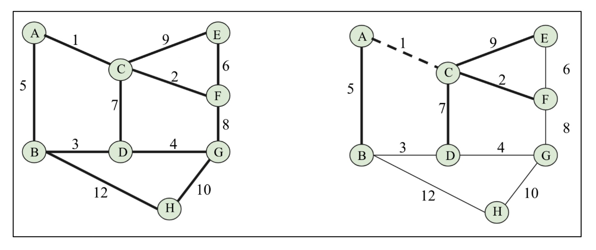
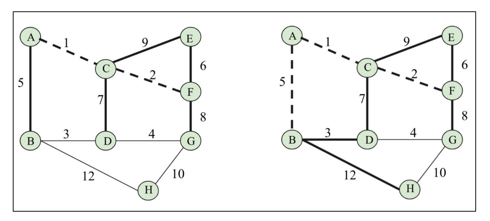
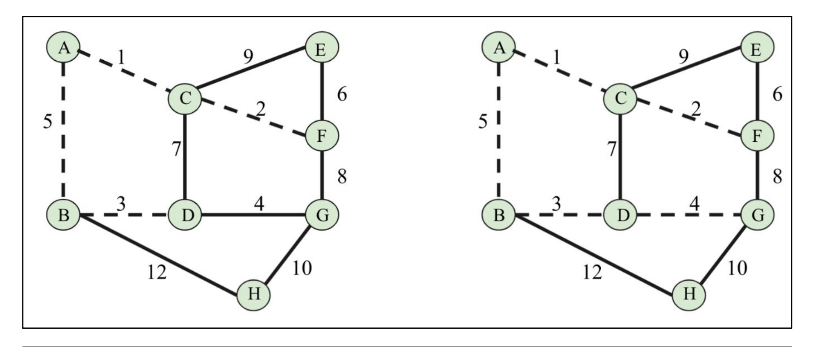
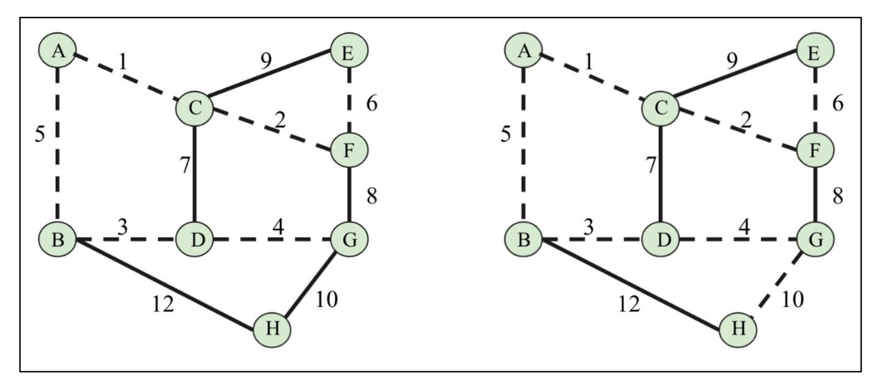
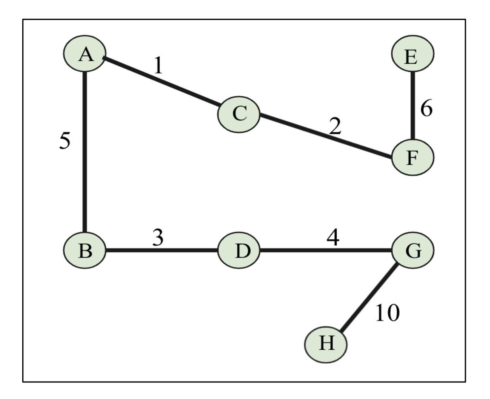

# 📊 **Graphs**

<details>
<summary>📋 Table of Contents</summary>

- [📊 **Graphs**](#-graphs)
  - [🖼️ Example of a Graph](#️-example-of-a-graph)
  - [📘 Important Definitions in Graphs](#-important-definitions-in-graphs)
    - [🔹 Node or Vertex](#-node-or-vertex)
    - [🔹 Edge](#-edge)
    - [🔹 Loop](#-loop)
    - [🔹 Degree of a Vertex](#-degree-of-a-vertex)
    - [🔹 Adjacency](#-adjacency)
    - [🔹 Path](#-path)
    - [🔹 Leaf Vertex (Pendant Vertex)](#-leaf-vertex-pendant-vertex)
- [🔄 **Directed and Undirected Graphs**](#-directed-and-undirected-graphs)
  - [📍 Undirected Graph](#-undirected-graph)
  - [📍 Directed Graph](#-directed-graph)
  - [📘 Important Terms in Directed Graphs](#-important-terms-in-directed-graphs)
    - [🔹 Indegree](#-indegree)
    - [🔹 Outdegree](#-outdegree)
    - [🔹 Isolated Vertex](#-isolated-vertex)
    - [🔹 Source Vertex](#-source-vertex)
    - [🔹 Sink Vertex](#-sink-vertex)
- [🎯 Directed Acyclic Graphs (DAGs)](#-directed-acyclic-graphs-dags)
- [⚖️ Weighted Graphs](#️-weighted-graphs)
    - [🔹 Possible Paths:](#-possible-paths)
    - [✅ Best Path:](#-best-path)
- [🔗 Bipartite Graphs](#-bipartite-graphs)
  - [📘 Key Property of Bipartite Graphs](#-key-property-of-bipartite-graphs)
  - [🏗️ Applications of Bipartite Graphs](#️-applications-of-bipartite-graphs)
- [🗂️ **Graph Representations**](#️-graph-representations)
  - [📋 Adjacency List Representation](#-adjacency-list-representation)
  - [🧮 Adjacency Matrix Representation](#-adjacency-matrix-representation)
  - [⚖️ Choosing Between Them](#️-choosing-between-them)
- [📋 **Adjacency Lists**](#-adjacency-lists)
  - [🔗 Adjacency List Representation](#-adjacency-list-representation-1)
    - [🖥️ Python Dictionary Implementation](#️-python-dictionary-implementation)
    - [🔎 Explanation (Line by Line)](#-explanation-line-by-line)
  - [✅ Advantages of Adjacency List](#-advantages-of-adjacency-list)
  - [⚠️ Disadvantage](#️-disadvantage)
- [🧮 **Adjacency Matrix**](#-adjacency-matrix)
  - [📍 Example](#-example)
  - [🖥️ Python Implementation](#️-python-implementation)
    - [1️⃣ Step 1: Graph Representation (Adjacency List in Dictionary Form)](#1️⃣-step-1-graph-representation-adjacency-list-in-dictionary-form)
    - [2️⃣ Step 2: Extract Vertices](#2️⃣-step-2-extract-vertices)
    - [3️⃣ Step 3: Initialize Empty Matrix](#3️⃣-step-3-initialize-empty-matrix)
    - [4️⃣ Step 4: Build Edge List](#4️⃣-step-4-build-edge-list)
    - [5️⃣ Step 5: Fill the Adjacency Matrix](#5️⃣-step-5-fill-the-adjacency-matrix)
    - [6️⃣ Final Output Matrix](#6️⃣-final-output-matrix)
  - [✅ Advantages of Adjacency Matrix](#-advantages-of-adjacency-matrix)
  - [⚠️ Disadvantages](#️-disadvantages)
- [📊 **Graph Traversals**](#-graph-traversals)
  - [🔎 What is Graph Traversal?](#-what-is-graph-traversal)
  - [🌳 Graph Traversal vs Tree Traversal](#-graph-traversal-vs-tree-traversal)
  - [🛤️ Common Strategy of Graph Traversal](#️-common-strategy-of-graph-traversal)
  - [🎯 Importance of Graph Traversal Algorithms](#-importance-of-graph-traversal-algorithms)
  - [🧮 Types of Graph Traversal Algorithms](#-types-of-graph-traversal-algorithms)
- [🌐 **Breadth-First Traversal (BFS)**](#-breadth-first-traversal-bfs)
  - [📌 Introduction](#-introduction)
  - [🏗️ How BFS Works](#️-how-bfs-works)
  - [🖼️ Example Graph](#️-example-graph)
  - [🔵 Step 1: Start with Node A](#-step-1-start-with-node-a)
  - [🔵 Step 2: Visit Node B](#-step-2-visit-node-b)
  - [🔵 Step 3: Visit Node C](#-step-3-visit-node-c)
  - [🔵 Step 4: Visit Node E](#-step-4-visit-node-e)
  - [🔵 Step 5: Visit Node D](#-step-5-visit-node-d)
  - [📍 Final BFS Traversal Order](#-final-bfs-traversal-order)
- [🌐 Breadth-First Search Example (BFS)](#-breadth-first-search-example-bfs)
  - [🖼️ Figure 9.16 — Undirected Sample Graph](#️-figure-916--undirected-sample-graph)
  - [🗂️ Adjacency List (as given)](#️-adjacency-list-as-given)
  - [🔁 BFS Algorithm (as given)](#-bfs-algorithm-as-given)
  - [🧠 Line-by-Line Explanation (with concepts)](#-line-by-line-explanation-with-concepts)
  - [▶️ Dry Run (exactly as described) from **A**](#️-dry-run-exactly-as-described-from-a)
    - [🟦 Initial state (enqueue A, mark A visited)](#-initial-state-enqueue-a-mark-a-visited)
    - [🖼️ Figure 9.17 — Visit A; enqueue B, D, G (alphabetical order)](#️-figure-917--visit-a-enqueue-b-d-g-alphabetical-order)
    - [🖼️ Figure 9.18 — Visit B; enqueue E, F](#️-figure-918--visit-b-enqueue-e-f)
    - [🧭 Process D, G (no new nodes), then…](#-process-d-g-no-new-nodes-then)
    - [🖼️ Figure 9.19 — Visit E (no new nodes)](#️-figure-919--visit-e-no-new-nodes)
    - [🖼️ Figure 9.20 — Visit F; enqueue C](#️-figure-920--visit-f-enqueue-c)
    - [🖼️ Figure 9.21 — Visit C; enqueue H; then visit H (done)](#️-figure-921--visit-c-enqueue-h-then-visit-h-done)
  - [✅ Output Sequence (as you stated)](#-output-sequence-as-you-stated)
  - [🧩 Why the Order Can Differ](#-why-the-order-can-differ)
  - [⏱️ Time Complexity (as given, with reasoning)](#️-time-complexity-as-given-with-reasoning)
  - [🌍 Real-World Applications of BFS (as provided)](#-real-world-applications-of-bfs-as-provided)
  - [🧪 Minimal Reproducible Script (complete)](#-minimal-reproducible-script-complete)
- [🌊 **Depth-First Search (DFS)**](#-depth-first-search-dfs)
  - [🔎 What is DFS?](#-what-is-dfs)
  - [🧩 Example Graph (Figure 9.22)](#-example-graph-figure-922)
  - [🐾 Step-by-Step Traversal (Figures 9.23 → 9.27)](#-step-by-step-traversal-figures-923--927)
    - [▶️ Figure 9.23 — Visit **A**, then **B**](#️-figure-923--visit-a-then-b)
    - [▶️ Figure 9.24 — Visit **S**, then **C**](#️-figure-924--visit-s-then-c)
    - [▶️ Figure 9.25 — Visit **D**, then **E**](#️-figure-925--visit-d-then-e)
    - [▶️ Figure 9.26 — Visit **H**, then **G**](#️-figure-926--visit-h-then-g)
    - [▶️ Figure 9.27 — Finally visit **F**](#️-figure-927--finally-visit-f)
  - [🧭 Adjacency List (Graph Representation)](#-adjacency-list-graph-representation)
  - [🧑‍💻 DFS Implementation in Python](#-dfs-implementation-in-python)
  - [🧠 Line-by-Line Explanation](#-line-by-line-explanation)
  - [🧪 Dry-Run of the Code (Alphabetical Neighbors)](#-dry-run-of-the-code-alphabetical-neighbors)
  - [⏱️ Time Complexity](#️-time-complexity)
  - [🧰 Applications of DFS](#-applications-of-dfs)
- [🌳 **Minimum Spanning Tree (MST) and Graph Methods**](#-minimum-spanning-tree-mst-and-graph-methods)
  - [📌 Other Useful Graph Methods](#-other-useful-graph-methods)
  - [🌳 Minimum Spanning Tree (MST)](#-minimum-spanning-tree-mst)
    - [📖 Definition](#-definition)
  - [🖼️ Example (Figure 9.28)](#️-example-figure-928)
  - [⚙️ Algorithm Used: Kruskal’s Algorithm](#️-algorithm-used-kruskals-algorithm)
    - [🔑 Rules](#-rules)
  - [📊 Left Side Graph Details](#-left-side-graph-details)
  - [🪜 Steps to Build MST (Using Kruskal’s Algorithm)](#-steps-to-build-mst-using-kruskals-algorithm)
  - [✅ Final MST Edges](#-final-mst-edges)
  - [🌍 Real-World Applications of MST](#-real-world-applications-of-mst)
- [🌉 **Kruskal’s Minimum Spanning Tree (MST)**](#-kruskals-minimum-spanning-tree-mst)
  - [📖 Introduction](#-introduction-1)
  - [🖼️ Visual Walkthrough of Example](#️-visual-walkthrough-of-example)
    - [**Step 1 → Figure 9.29**](#step-1--figure-929)
    - [**Step 2 → Figure 9.30**](#step-2--figure-930)
    - [**Step 3 → Figure 9.31**](#step-3--figure-931)
    - [**Step 4 → Figure 9.32**](#step-4--figure-932)
    - [**Step 5 → Figure 9.33**](#step-5--figure-933)
  - [🪜 Algorithm Steps (Formal)](#-algorithm-steps-formal)
  - [🌳 Kruskal’s Algorithm Implementation](#-kruskals-algorithm-implementation)
    - [📘 Code Implementation](#-code-implementation)
  - [📝 Line-by-Line Explanation](#-line-by-line-explanation-1)
    - [**Disjoint Set (Union-Find)**](#disjoint-set-union-find)
    - [**Kruskal’s Algorithm**](#kruskals-algorithm)
  - [📊 Graph Representation](#-graph-representation)
  - [✅ Expected Output](#-expected-output)
- [🌳 **Prim’s Minimum Spanning Tree Algorithm**](#-prims-minimum-spanning-tree-algorithm)
    - [Algorithm Steps 📝](#algorithm-steps-)
    - [Example Walkthrough 🚶‍♂️](#example-walkthrough-️)
    - [The Final Spanning Tree ✨](#the-final-spanning-tree-)
    - [Applications and Comparison 🌐](#applications-and-comparison-)
      - [Kruskal’s vs. Prim’s Algorithm](#kruskals-vs-prims-algorithm)
    - [💻 **Python Implementation of Prim's Algorithm**](#-python-implementation-of-prims-algorithm)
    - [Code Explanation 🧑‍🏫](#code-explanation-)

</details>

---

A **graph** is a set of a finite number of **vertices** (also called **nodes**) and **edges**, where the edges are the **links between vertices**.
Each edge in a graph connects two distinct nodes.

In mathematics, a graph is a formal representation of a **network**.
Formally:

<pre align="center">
G = (V, E)
</pre>

where:

* **V** = set of vertices
* **E** = set of edges

---

## 🖼️ Example of a Graph

<div align="center">
  

*Figure 9.1: An example of a graph*
</div>

The graph $G = (V, E)$ in **Figure 9.1** can be described as:

* **Vertices (V):**

<pre align="center">
V = {A, B, C, D, E}
</pre>

* **Edges (E):**

<pre align="center">
E = {{A, B}, {A, C}, {B, C}, {B, D}, {C, D}, {D, D}, {B, E}, {D, E}}
</pre>

So,

<pre align="center">
G = (V, E)
</pre>

---

## 📘 Important Definitions in Graphs

### 🔹 Node or Vertex

A **point or node** in a graph is called a **vertex**.<br/>
👉 In the diagram above, vertices are **A, B, C, D, and E** (represented as dots).

---

### 🔹 Edge

A **connection between two vertices**.<br/>
👉 Example: the line connecting **A** and **B**.

---

### 🔹 Loop

An **edge that starts and ends on the same vertex**.<br/>
👉 Example: at **D**, the edge returns to itself.

---

### 🔹 Degree of a Vertex

The **degree** of a vertex is the **total number of edges** incident on it.<br/>
👉 Example: Vertex **B** has a **degree of 4** in the figure.

---

### 🔹 Adjacency

Two vertices are **adjacent** if there is an edge between them.<br/>
👉 Example: **C** is adjacent to **A** (since there is an edge {A, C}).

---

### 🔹 Path

A **sequence of vertices and edges** connecting two nodes.<br/>
👉 Example: Path **C → A → B → E** represents a path from **C** to **E**.

---

### 🔹 Leaf Vertex (Pendant Vertex)

A **vertex with degree = 1**.<br/>
👉 Example: If a vertex has only one edge connected, it is a **leaf vertex**.

---

# 🔄 **Directed and Undirected Graphs**

Graphs are represented by the **edges** between the **nodes**.
👉 These connecting edges can be either **directed** or **undirected**.

---

## 📍 Undirected Graph

* If the connecting edges are **undirected**, then the graph is called an **undirected graph**.
* An **undirected graph** simply represents edges as **lines between the nodes**.
* There is no extra information about the relationship between nodes other than the fact that they are connected.

🖼️ Example:

<div align="center">
  

*Figure 9.2: An example of an undirected graph*
</div>

👉 In Figure 9.2, we demonstrate an undirected graph of four nodes:

```
V = {A, B, C, D}
```

These nodes are connected using undirected edges.

---

## 📍 Directed Graph

* If the connecting edges are **directed**, then the graph is called a **directed graph**.
* In a **directed graph**, edges provide information about the **direction** of connection.
* An edge **(A, B)** is **not equal** to edge **(B, A)**.
* Directed edges are drawn as **lines with arrows**, showing the direction of flow.

🖼️ Example:

<div align="center">
  

*Figure 9.3: An example of a directed graph*
</div>

👉 In Figure 9.3, many nodes are connected using **directed edges**.

* For instance, you can move from **A → B**, but not from **B → A**.

---

## 📘 Important Terms in Directed Graphs

### 🔹 Indegree

The total number of **edges that come into a vertex**.<br/>
👉 Example: Node **E** has **indegree = 1**, due to edge **C → E**.

---

### 🔹 Outdegree

The total number of **edges that go out from a vertex**.<br/>
👉 Example: Node **E** has **outdegree = 2**, because of edges **E → F** and **E → D**.

---

### 🔹 Isolated Vertex

A vertex with **degree = 0** (no incoming or outgoing edges).<br/>
👉 Example: Node **G** in Figure 9.3.

---

### 🔹 Source Vertex

A vertex with **indegree = 0**.<br/>
👉 Example: Node **A** in Figure 9.3.

---

### 🔹 Sink Vertex

A vertex with **outdegree = 0**.<br/>
👉 Example: Node **F** in Figure 9.3.

---

# 🎯 Directed Acyclic Graphs (DAGs)

A **Directed Acyclic Graph (DAG)** is a **directed graph** that contains **no cycles**.

* All edges are directed from one node to another.
* The sequence of edges never forms a **closed loop**.
* A **cycle** in a graph is formed when the starting node of the first edge is equal to the ending node of the last edge.

🖼️ Example:

<div align="center">
  

*Figure 9.4: An example of a directed acyclic graph*
</div>

👉 In this DAG:

* All edges are directed.
* There is **no cycle** (no path that starts and ends at the same node).

📌 **Key property:**
If we start on any path from a given node, we will **never end up on the same node again**.

✨ **Applications of DAGs:**

* Job scheduling 🗓️
* Citation graphs 📚
* Data compression 📦

---

# ⚖️ Weighted Graphs

A **Weighted Graph** is a graph in which each edge has a **numeric weight** associated with it.

* Can be **directed** or **undirected**.
* Weight may represent **distance**, **cost**, or **any metric** depending on the problem.

🖼️ Example:

<div align="center">
  

*Figure 9.5: An example of a weighted graph*
</div>

👉 In this weighted graph:

* **Edge weights** represent distances between nodes.
* We want to travel from **A → D**.

### 🔹 Possible Paths:

1. **Direct path:**

   * $A \to D$
   * Cost = **40**

2. **Via B and C:**

   * $A \to B \to C \to D$
   * Cost = $5 + 10 + 10 = 25$

### ✅ Best Path:

* Path **A → B → C → D** is **better**, since **25 < 40**.
* Hence, the shortest path is chosen using weights.

---

# 🔗 Bipartite Graphs

A **Bipartite Graph** (also called a **Bigraph**) is a **special type of graph** in which:

* All the nodes can be divided into **two disjoint sets**.
* Every edge **always connects a node from one set to a node in the other set**.
* No edge exists **between nodes of the same set**.

🖼️ Example:

<div align="center">
  
  
*Figure 9.6: An example of a bipartite graph*
</div>

👉 In this graph:

* The vertices are divided into **two sets**:

  * **Set U = {A, B, C, D}**
  * **Set V = {E, F, G, H}**
* Each edge has **one vertex in U** and **the other vertex in V**.

---

## 📘 Key Property of Bipartite Graphs

* **No edge** connects vertices **within the same set**.
* All edges **must connect across the two sets**.

---

## 🏗️ Applications of Bipartite Graphs

1. **Applicants and Jobs** 💼

   * One set = Applicants
   * Other set = Jobs
   * An edge shows which applicant is eligible for which job.

2. **Football Players and Clubs** ⚽

   * One set = Players
   * Other set = Clubs
   * An edge shows if a player has played for a particular club.

---

# 🗂️ **Graph Representations**

Graph representation techniques define **how we store a graph in memory**.
This includes storing:

* **Vertices (nodes)** 🟢
* **Edges (connections)** 🔗
* **Weights (if weighted graph)** ⚖️

There are **two common methods** to represent a graph:

1. **Adjacency List** 📋
2. **Adjacency Matrix** 🧮

---

## 📋 Adjacency List Representation

* Based on a **linked list**.
* For every vertex, we maintain a **list of its neighbors** (adjacent nodes).
* Efficient when the graph is **sparse** (few edges compared to vertices).

👉 Example:

* If a graph has **200 nodes** but only **100 edges**, then adjacency list is best.
* Saves space because we only store existing edges, not unnecessary zeros.

---

## 🧮 Adjacency Matrix Representation

* Based on a **matrix (2D array)**.
* Each **row and column** represent vertices.
* A cell value indicates whether an edge exists between two nodes.

👉 Example:

* For a graph with **200 nodes**, the matrix will be **200 × 200**.
* Most cells may be **0** if the graph is sparse.

✅ **Best used when graph is dense** (many edges).
✅ **Faster lookups** – checking if an edge exists between two vertices is **O(1)**.

---

## ⚖️ Choosing Between Them

| Representation       | Best For 🏆               | Space Usage 📦                         | Lookup Speed ⏱️ |
| -------------------- | ------------------------- | -------------------------------------- | --------------- |
| **Adjacency List**   | Sparse graphs (few edges) | Less space (only store existing edges) | Slower lookup   |
| **Adjacency Matrix** | Dense graphs (many edges) | More space (matrix always stored)      | Fast lookup     |

---

# 📋 **Adjacency Lists**

In an **Adjacency List representation**:

* All the nodes **directly connected** to a node $x$ are listed in its adjacency list.
* The graph is represented by showing the **adjacent list of every vertex**.

👉 Example Graph:

<div align="center">
  

*Figure 9.7: A sample graph of five nodes*
</div>

Here:

* **A** is adjacent to **B** and **C**.
* **B** is adjacent to **E, C, A**, etc.

---

## 🔗 Adjacency List Representation

A **linked list** can be used to implement adjacency lists.

* We need as many **linked lists** as there are **nodes**.
* At each index, we store the **adjacent vertices** of that node.

👉 Example Adjacency List for Figure 9.7:

<div align="center">
  

*Figure 9.8 : Adjacency list for the graph shown in Figure 9.7*
</div>

---

### 🖥️ Python Dictionary Implementation

In Python, instead of linked lists, we often use **dictionaries** to represent adjacency lists (since they allow easy key–value storage).

```python
# Graph represented as adjacency list using dictionary
graph = dict()

graph['A'] = ['B', 'C']
graph['B'] = ['E', 'C', 'A']
graph['C'] = ['A', 'B', 'E', 'F']
graph['E'] = ['B', 'C']
graph['F'] = ['C']
```

---

### 🔎 Explanation (Line by Line)

1. `graph = dict()`

   * Creates an empty dictionary called **graph**.
   * Each key will represent a **vertex**.
   * Each value will be a **list of adjacent vertices**.

2. `graph['A'] = ['B', 'C']`

   * Vertex **A** has neighbors **B** and **C**.

3. `graph['B'] = ['E', 'C', 'A']`

   * Vertex **B** has neighbors **E, C, and A**.

4. `graph['C'] = ['A', 'B', 'E', 'F']`

   * Vertex **C** has neighbors **A, B, E, and F**.

5. `graph['E'] = ['B', 'C']`

   * Vertex **E** has neighbors **B and C**.

6. `graph['F'] = ['C']`

   * Vertex **F** has only one neighbor: **C**.

---

## ✅ Advantages of Adjacency List

* Saves space when the graph is **sparse**.
* Easy to **add or delete nodes/edges**.

## ⚠️ Disadvantage

* Checking if a particular edge exists can be **slow** compared to adjacency matrix.

---

# 🧮 **Adjacency Matrix**

Another approach to represent a graph is by using an **Adjacency Matrix**.

* The graph is represented using a **matrix (V × V)**, where **V = number of vertices**.
* Each cell in the matrix shows whether there is an **edge** between two vertices:

  * `1` → edge exists
  * `0` → edge does not exist
* The adjacency matrix is essentially a **2D array**.

---

## 📍 Example
<div align="center">
  

*Figure 9.9: A sample graph and its adjacency matrix*
</div>

👉 The graph has **vertices**: A, B, C, E, F

👉 The corresponding adjacency matrix is:

|       | A | B | C | E | F |
| ----- | - | - | - | - | - |
| **A** | 0 | 1 | 1 | 0 | 0 |
| **B** | 1 | 0 | 0 | 1 | 0 |
| **C** | 1 | 1 | 0 | 1 | 1 |
| **E** | 0 | 1 | 1 | 0 | 0 |
| **F** | 0 | 0 | 1 | 0 | 0 |

---

## 🖥️ Python Implementation

We will now implement the adjacency matrix step by step using Python.

### 1️⃣ Step 1: Graph Representation (Adjacency List in Dictionary Form)

```python
# Graph represented as adjacency list
graph = dict()
graph['A'] = ['B', 'C']
graph['B'] = ['E', 'C', 'A']
graph['C'] = ['A', 'B', 'E', 'F']
graph['E'] = ['B', 'C']
graph['F'] = ['C']
```

✔️ Here, the **keys** represent vertices (A, B, C, E, F).<br/>
✔️ The **values** are lists of adjacent vertices.

---

### 2️⃣ Step 2: Extract Vertices

```python
# Extract vertices and sort them
matrix_elements = sorted(graph.keys())
cols = rows = len(matrix_elements)
```

✔️ `matrix_elements` = `['A', 'B', 'C', 'E', 'F']`<br/>
✔️ Number of rows = columns = `5` (since 5 vertices).

---

### 3️⃣ Step 3: Initialize Empty Matrix

```python
# Create empty adjacency matrix (filled with 0s)
adjacency_matrix = [[0 for x in range(rows)] for y in range(cols)]
edges_list = []
```

✔️ `adjacency_matrix` will be a 5×5 matrix filled with zeros initially.<br/>
✔️ Example:

```
[0, 0, 0, 0, 0]
[0, 0, 0, 0, 0]
[0, 0, 0, 0, 0]
[0, 0, 0, 0, 0]
[0, 0, 0, 0, 0]
```

✔️ `edges_list` will store edges like `('A', 'B')`.

---

### 4️⃣ Step 4: Build Edge List

```python
for key in matrix_elements:
    for neighbor in graph[key]:
        edges_list.append((key, neighbor))
print(edges_list)
```

✔️ This creates a list of all edges.<br/>
✔️ Output:

```
[('A', 'B'), ('A', 'C'), 
 ('B', 'E'), ('B', 'C'), ('B', 'A'), 
 ('C', 'A'), ('C', 'B'), ('C', 'E'), ('C', 'F'), 
 ('E', 'B'), ('E', 'C'), 
 ('F', 'C')]
```

---

### 5️⃣ Step 5: Fill the Adjacency Matrix

```python
for edge in edges_list:
    index_of_first_vertex = matrix_elements.index(edge[0])
    index_of_second_vertex = matrix_elements.index(edge[1])
    adjacency_matrix[index_of_first_vertex][index_of_second_vertex] = 1
```

✔️ For each edge `(u, v)`, we find their **indices** in `matrix_elements` and set the matrix cell to `1`.

---

### 6️⃣ Final Output Matrix

```python
print(adjacency_matrix)
```

✔️ Output:

```
[0, 1, 1, 0, 0]
[1, 0, 0, 1, 0]
[1, 1, 0, 1, 1]
[0, 1, 1, 0, 0]
[0, 0, 1, 0, 0]
```

This corresponds exactly to the adjacency matrix shown in Figure 9.9 ✅

---

## ✅ Advantages of Adjacency Matrix

* Very **fast lookup** for checking if an edge exists (`O(1)` time).
* Useful in **dense graphs** (many edges).
* Widely used in **routing tables, navigation systems, transport networks**.

## ⚠️ Disadvantages

* **Consumes more space** (O(V²)), even if graph is sparse.
* **Adding/deleting vertices** is difficult compared to adjacency list.

---

# 📊 **Graph Traversals**

## 🔎 What is Graph Traversal?

A **graph traversal** means to **visit all the vertices (nodes)** of the graph while keeping track of:

* ✅ Which vertices have already been **visited**
* ❌ Which vertices have **not been visited yet**

👉 A graph traversal algorithm is considered **efficient** if it can traverse all the nodes of the graph in the **minimum possible time**.

---

## 🌳 Graph Traversal vs Tree Traversal

Graph traversal is also called a **graph search algorithm**. It is quite similar to **tree traversal algorithms** such as:

* Preorder traversal
* Inorder traversal
* Postorder traversal
* Level order traversal

📌 Just like tree traversal, in a graph traversal we:

1. Start from a **specific node**
2. Traverse through **edges** to reach all other nodes

---

## 🛤️ Common Strategy of Graph Traversal

The main strategy is:

1. **Follow a path** until a **dead end** is reached
2. **Backtrack** (move back) until we find an **alternative path**
3. Continue the process until all nodes are visited

Alternatively, we can **iteratively move** from one node to another until the **whole graph (or part of it)** is traversed.

---

## 🎯 Importance of Graph Traversal Algorithms

Graph traversal algorithms are very important for solving **fundamental problems** such as:

* 🚶 Determining how to get from **one vertex to another**
* 📍 Comparing **different paths** from **Node A to Node B**
* 🛣️ Finding the **shortest route** from one city to another in a **network of cities**

---

## 🧮 Types of Graph Traversal Algorithms

There are **two important graph traversal algorithms**:

1. **Breadth-First Search (BFS)** 🔄

   * Traverses the graph **level by level**
   * Uses a **queue** data structure

2. **Depth-First Search (DFS)** 🔂

   * Traverses the graph by going **deep into one path first**
   * Uses a **stack** (or recursion)

---

# 🌐 **Breadth-First Traversal (BFS)**

## 📌 Introduction

Breadth-First Search (BFS) works very similarly to a **level-order traversal algorithm** in a tree data structure.

* 🔹 It visits **level by level**
* 🔹 Starts at the **root node** (level 0)
* 🔹 Then visits all nodes at **level 1** (directly connected to root)
* 🔹 Moves to **level 2** and so on

👉 This ensures traversal of the graph **breadthwise**.

📌 To manage the traversal order, BFS uses a **Queue (FIFO structure)**.

---

## 🏗️ How BFS Works

1. Begin with the **starting node**
2. Visit the node and mark it as **visited**
3. Look at all its **neighbors** (adjacent vertices)
4. Add these neighbors into the **queue**
5. Repeatedly visit the **next node from the queue**
6. Add its unvisited neighbors into the queue
7. Continue until all nodes are visited

✅ Each node is visited **only once**.

---

## 🖼️ Example Graph

<div align="center">
  

**Figure 9.10: A sample graph with Queue & Visited array**
</div>

* Graph has **5 nodes**: `A, B, C, D, E`
* On the right side, we have:

  * **Visited Array** → keeps track of visited nodes
  * **Queue** → helps manage BFS order

---

## 🔵 Step 1: Start with Node A

<div align="center">
  

**Figure 9.11: Node A is visited in BFS**
</div>

* Start at **A**
* Mark **A** as visited → `Visited = [A]`
* Add all adjacent nodes of A → `B, C, E` into the **Queue**

👉 Queue = `[B, C, E]`

---

## 🔵 Step 2: Visit Node B

<div align="center">
  

**Figure 9.12: Node B is visited in BFS**
</div>

* Dequeue first element → **B**
* Mark **B** as visited → `Visited = [A, B]`
* Add B’s unvisited neighbor → **D**

👉 Queue = `[C, E, D]`

---

## 🔵 Step 3: Visit Node C

<div align="center">
  

**Figure 9.13: Node C is visited in BFS**
</div>

* Dequeue → **C**
* Mark **C** as visited → `Visited = [A, B, C]`
* Neighbors of C are already visited or in queue → nothing new added

👉 Queue = `[E, D]`

---

## 🔵 Step 4: Visit Node E

<div align="center">
  

**Figure 9.14: Node E is visited in BFS**
</div>

* Dequeue → **E**
* Mark **E** as visited → `Visited = [A, B, C, E]`
* Neighbors of E are already in visited list → nothing added

👉 Queue = `[D]`

---

## 🔵 Step 5: Visit Node D

<div align="center">
  

**Figure 9.15: Node D is visited in BFS**
</div>

* Dequeue → **D**
* Mark **D** as visited → `Visited = [A, B, C, E, D]`
* No new neighbors left

👉 Queue = `[]` (empty → traversal complete ✅)

---

## 📍 Final BFS Traversal Order

👉 The BFS visits nodes in the order:

```
A → B → C → E → D
```

⚠️ Note: The order can vary depending on **how neighbors are enqueued**.
For example: BCE, CEB, CBE, BEC, or ECB are all valid.
In this example, we used **alphabetical order**.

---


# 🌐 Breadth-First Search Example (BFS) 

## 🖼️ Figure 9.16 — Undirected Sample Graph

<div align="center">
  
</div>

* Vertices: **A, B, C, D, E, F, G, H**
* Undirected edges (from the drawing):

  * A connects to **B, D, G**
  * B connects to **A, F, E**
  * C connects to **F, H**
  * D connects to **F, A**
  * E connects to **B, G**
  * F connects to **B, D, C**
  * G connects to **A, E**
  * H connects to **C**

This matches the **adjacency list** you provided (shown next).

---

## 🗂️ Adjacency List (as given)

```python
graph = dict()
graph['A'] = ['B', 'G', 'D']

graph['B'] = ['A', 'F', 'E']
graph['C'] = ['F', 'H']
graph['D'] = ['F', 'A']
graph['E'] = ['B', 'G']
graph['F'] = ['B', 'D', 'C']
graph['G'] = ['A', 'E']
graph['H'] = ['C']
```

* This stores the undirected graph in a **dictionary of lists** where each key is a vertex and the list contains its neighbors.

---

## 🔁 BFS Algorithm (as given)

```python
from collections import deque
def breadth_first_search(graph, root):
    visited_vertices = list()
    graph_queue = deque([root])
    visited_vertices.append(root)
    node = root
    while len(graph_queue) > 0:
        node = graph_queue.popleft()
        adj_nodes = graph[node]
        remaining_elements = set(adj_nodes).difference(set(visited_vertices))
        if len(remaining_elements) > 0:
            for elem in sorted(remaining_elements):
                visited_vertices.append(elem)
                graph_queue.append(elem)
    return visited_vertices
```
---

## 🧠 Line-by-Line Explanation (with concepts)

* `from collections import deque`
  Imports **deque**, a double-ended queue with **O(1)** appends and pops from either end (perfect for BFS queue).

* `def breadth_first_search(graph, root):`
  Defines BFS function that takes a graph (adjacency list) and a **start/root** node.

* `visited_vertices = []`
  Keeps the **order** of visited nodes. Using a list allows us to return the traversal sequence.

* `graph_queue = deque([root])`
  Initializes the BFS **queue** with the starting node. Queue enforces **FIFO** behavior.

* `visited_vertices.append(root)`
  Marks the root as **visited** immediately (so we don’t re-enqueue it later).

* `while len(graph_queue) > 0:`
  Process nodes **until the queue empties** (i.e., no frontier left).

* `node = graph_queue.popleft()`
  **Dequeue** the next node to visit (FIFO). This is the current node being expanded.

* `adj_nodes = graph[node]`
  Get all **neighbors** (adjacent vertices) of the current node.

* `remaining_elements = set(adj_nodes).difference(set(visited_vertices))`
  Compute **unvisited neighbors only**.

  * `set(adj_nodes)` = candidates to consider
  * `set(visited_vertices)` = already seen
  * **difference** = neighbors we haven’t visited yet

* `if len(remaining_elements) > 0:`
  Only act if there is at least one unvisited neighbor.

* `for elem in sorted(remaining_elements):`
  Enqueue neighbors in **alphabetical order** (your text explicitly chooses this to keep a consistent traversal).

* `visited_vertices.append(elem)`
  Mark neighbor as visited **at enqueue time** (this version does it here to avoid enqueuing duplicates later).

* `graph_queue.append(elem)`
  Put neighbor into the queue for future expansion.

* `return visited_vertices`
  Return the **BFS traversal order**.

> 💡 This strategy guarantees each node is **enqueued once** and **dequeued once**, avoiding duplicates and cycles.

---

## ▶️ Dry Run (exactly as described) from **A**

We’ll follow your rule to add neighbors in **alphabetical order**.

### 🟦 Initial state (enqueue A, mark A visited)

* **Visited:** `[A]`
* **Queue:** `deque([A])`

---

### 🖼️ Figure 9.17 — Visit A; enqueue B, D, G (alphabetical order)

<div align="center">
  
</div>

* Dequeue **A**
* A’s neighbors: **B, G, D** → unvisited → sort → **B, D, G**
* Enqueue **B, D, G** and mark them visited

**Visited:** `[A, B, D, G]`
**Queue:** `deque([B, D, G])`

---

### 🖼️ Figure 9.18 — Visit B; enqueue E, F

<div align="center">
  
</div>

* Dequeue **B**
* B’s neighbors: **A, F, E**

  * A already visited
  * **E, F** are unvisited → alphabetical → **E, F**
* Enqueue **E, F** and mark them visited

**Visited:** `[A, B, D, G, E, F]`
**Queue:** `deque([D, G, E, F])`

---

### 🧭 Process D, G (no new nodes), then…

* **Dequeue D** → neighbors **F, A** (both already visited) → nothing new
  **Queue:** `deque([G, E, F])`
* **Dequeue G** → neighbors **A, E** (A visited, E already in visited) → nothing new
  **Queue:** `deque([E, F])`

---

### 🖼️ Figure 9.19 — Visit E (no new nodes)

<div align="center">
  
</div>

* **Dequeue E** → neighbors **B, G** (both already visited) → nothing new

**Visited:** `[A, B, D, G, E, F]`
**Queue:** `deque([F])`

---

### 🖼️ Figure 9.20 — Visit F; enqueue C

<div align="center">
  
</div>

* **Dequeue F** → neighbors **B, D, C**

  * B and D visited
  * **C** unvisited → enqueue **C**, mark visited

**Visited:** `[A, B, D, G, E, F, C]`
**Queue:** `deque([C])`

---

### 🖼️ Figure 9.21 — Visit C; enqueue H; then visit H (done)

<div align="center">
  
</div>

* **Dequeue C** → neighbors **F, H**

  * F visited
  * **H** unvisited → enqueue **H**, mark visited
    **Queue:** `deque([H])`
* **Dequeue H** → neighbor **C** (already visited) → nothing new
  **Queue:** `deque([])` → **empty ⇒ traversal complete**

---

## ✅ Output Sequence (as you stated)

When we run:

```python
print(breadth_first_search(graph, 'A'))
```

We get:

```python
['A', 'B', 'D', 'G', 'E', 'F', 'C', 'H']
```

This exactly matches the order illustrated across Figures **9.17 → 9.21**.

---

## 🧩 Why the Order Can Differ

BFS guarantees **level-by-level** visitation, but **within the same level**, the order depends on **how neighbors are enqueued**.

* Here, we purposely **sort** neighbors (alphabetical) to keep the order deterministic.
* If you changed the neighbor ordering (e.g., inserted as they appear in the adjacency list), the order might differ but would **still be a valid BFS**.

---

## ⏱️ Time Complexity (as given, with reasoning)

* Every vertex is **enqueued once** and **dequeued once** → total queue operations cost **O(|V|)** because each enqueue/dequeue is **O(1)** with `deque`.
* For each vertex, we **scan its adjacency list** exactly once overall → total is **O(|E|)** across all vertices.
* **Total time:** **O(|V| + |E|)**
* **Space:** O(|V|) for `visited_vertices` and up to O(|V|) for the queue in the worst case.

---

## 🌍 Real-World Applications of BFS (as provided)

* **Shortest path in unweighted graphs**: Finds minimal number of edges from a source to any node.
* **Web crawling**: Crawl pages **level by level** from a seed page, maintaining **indexed layers** and a **closed list** of visited URLs.
* **Navigation systems**: Quickly fetch **neighboring locations** from a graph of places/roads to explore reachable areas level-wise.

---

## 🧪 Minimal Reproducible Script (complete)

> This is a single, runnable snippet that includes your graph, the BFS, and the print call—using the corrected identifier `visited_vertices`:

```python
from collections import deque

graph = dict()
graph['A'] = ['B', 'G', 'D']

graph['B'] = ['A', 'F', 'E']
graph['C'] = ['F', 'H']
graph['D'] = ['F', 'A']
graph['E'] = ['B', 'G']
graph['F'] = ['B', 'D', 'C']
graph['G'] = ['A', 'E']
graph['H'] = ['C']

def breadth_first_search(graph, root):
    visited_vertices = []
    graph_queue = deque([root])
    visited_vertices.append(root)
    while len(graph_queue) > 0:
        node = graph_queue.popleft()
        adj_nodes = graph[node]
        remaining_elements = set(adj_nodes).difference(set(visited_vertices))
        if len(remaining_elements) > 0:
            for elem in sorted(remaining_elements):
                visited_vertices.append(elem)
                graph_queue.append(elem)
    return visited_vertices

print(breadth_first_search(graph, 'A'))
# Expected: ['A', 'B', 'D', 'G', 'E', 'F', 'C', 'H']
```

---


# 🌊 **Depth-First Search (DFS)**

## 🔎 What is DFS?

**Depth-First Search (DFS)** (also called depth-first traversal) traverses a graph similar to **preorder traversal** in trees:

* **Child nodes are visited before sibling nodes.**
* We **start with the root node** → visit it → then explore its **adjacent neighbors**.
* If the neighbor is **unvisited**, go deeper along that path.
* If the neighbor is **already visited**, **backtrack** to the previous node using a stack.
* Once all neighbors are visited and the stack is empty, the traversal ends.

---

## 🧩 Example Graph (Figure 9.22)

<div align="center">
  

**Figure 9.22:** *An example graph for understanding the DFS algorithm.*
</div>

We start from **A** and explore neighbors in **alphabetical order**.

---

## 🐾 Step-by-Step Traversal (Figures 9.23 → 9.27)

> Notation: **Visited** = nodes visited so far; **Stack (top ↑)** = current backtracking helper.

---

### ▶️ Figure 9.23 — Visit **A**, then **B**

<div align="center">
  
</div>


* Start at **A** → mark it visited.

  * **Visited:** `A`
  * **Stack (top ↑):** `B` (first neighbor of A is chosen → **B**)

* Visit **B**. Its only neighbor is **A**, which is already visited → backtrack.

  * Back at **A**, the next unvisited neighbor is **S**.

---

### ▶️ Figure 9.24 — Visit **S**, then **C**

<div align="center">
  
</div>

* Visit **S**. Neighbors of S: **C, G** → choose **C** (alphabetical).
* Visit **C**.

  * **Visited:** `A, B, S, C`
  * **Stack top:** `D` (next deeper path).

---

### ▶️ Figure 9.25 — Visit **D**, then **E**

<div align="center">
  
</div>

* Visit **D**. It has no new unvisited neighbors → backtrack to **C**.
* Visit **E** next from C’s neighbors.

  * **Visited:** `A, B, S, C, D, E`
  * **Stack top:** `H`.

---

### ▶️ Figure 9.26 — Visit **H**, then **G**

<div align="center">
  
</div>

* From **E**, visit **H**.
* From **H**, visit **G**.

  * **Visited:** `A, B, S, C, D, E, H, G`
  * **Stack top:** `F`.

---

### ▶️ Figure 9.27 — Finally visit **F**

<div align="center">
  
</div>

* From **G**, visit **F**.
* All neighbors are visited now.
* Stack becomes empty → traversal ends.

**✅ Final Traversal Order:** `A-B-S-C-D-E-H-G-F`

---

## 🧭 Adjacency List (Graph Representation)

```python
graph = dict()
graph['A'] = ['B', 'S']
graph['B'] = ['A']
graph['S'] = ['A','G','C']
graph['D'] = ['C']
graph['G'] = ['S','F','H']
graph['H'] = ['G','E']
graph['E'] = ['C','H']
graph['F'] = ['C','G']
graph['C'] = ['D','S','E','F']
```

---

## 🧑‍💻 DFS Implementation in Python

```python
def depth_first_search(graph, root):
    visited_vertices = list()
    graph_stack = list()
    graph_stack.append(root)
    node = root
    while graph_stack:
        if node not in visited_vertices:
            visited_vertices.append(node)
        adj_nodes = graph[node]
        if set(adj_nodes).issubset(set(visited_vertices)):
            graph_stack.pop()
            if len(graph_stack) > 0:
                node = graph_stack[-1]
            continue
        else:
            remaining_elements = set(adj_nodes).difference(set(visited_vertices))
            first_adj_node = sorted(remaining_elements)[0]
            graph_stack.append(first_adj_node)
            node = first_adj_node
    return visited_vertices
```

---

## 🧠 Line-by-Line Explanation

1. **Function Definition**

   ```python
   def depth_first_search(graph, root):
   ```

   Define DFS function with an adjacency list `graph` and a starting node `root`.

2. **Visited List & Stack Initialization**

   ```python
   visited_vertices = list()
   graph_stack = list()
   graph_stack.append(root)
   node = root
   ```

   * `visited_vertices`: stores visited nodes in order.
   * `graph_stack`: simulates the call stack.
   * Push `root` to stack.
   * Set current `node` to root.

3. **Traversal Loop**

   ```python
   while graph_stack:
   ```

   Continue while stack is not empty.

4. **Visit Node if New**

   ```python
   if node not in visited_vertices:
       visited_vertices.append(node)
   ```

   If the node is not already visited → mark it visited.

5. **Check Neighbors**

   ```python
   adj_nodes = graph[node]
   if set(adj_nodes).issubset(set(visited_vertices)):
   ```

   If **all neighbors** are already visited → dead end.

6. **Backtrack**

   ```python
   graph_stack.pop()
   if len(graph_stack) > 0:
       node = graph_stack[-1]
   continue
   ```

   Pop the stack and move back to the previous node.

7. **Otherwise Go Deeper**

   ```python
   remaining_elements = set(adj_nodes).difference(set(visited_vertices))
   first_adj_node = sorted(remaining_elements)[0]
   graph_stack.append(first_adj_node)
   node = first_adj_node
   ```

   * Compute unvisited neighbors.
   * Pick the alphabetically smallest one.
   * Push it onto the stack and make it the new current node.

8. **End**

   ```python
   return visited_vertices
   ```

   When stack empties, return the complete traversal order.

---

## 🧪 Dry-Run of the Code (Alphabetical Neighbors)

| Step | Action                          | Visited                   | Stack               |
| ---- | ------------------------------- | ------------------------- | ------------------- |
| 1    | Start at **A**                  | A                         | A                   |
| 2    | Visit **B**                     | A, B                      | A, B                |
| 3    | Backtrack to **A**, go to **S** | A, B, S                   | A, S                |
| 4    | Visit **C**                     | A, B, S, C                | A, S, C             |
| 5    | Visit **D**                     | A, B, S, C, D             | A, S, C, D          |
| 6    | Backtrack to C → Visit **E**    | A, B, S, C, D, E          | A, S, C, E          |
| 7    | Visit **H**                     | A, B, S, C, D, E, H       | A, S, C, E, H       |
| 8    | Visit **G**                     | A, B, S, C, D, E, H, G    | A, S, C, E, H, G    |
| 9    | Visit **F**                     | A, B, S, C, D, E, H, G, F | A, S, C, E, H, G, F |
| 10   | Backtrack until stack is empty  | Done                      | ∅                   |

**Final Output:** `A-B-S-C-D-E-H-G-F`

---

## ⏱️ Time Complexity

* **Adjacency List:** `O(V + E)`
  Each vertex and edge is processed once.
* **Adjacency Matrix:** `O(V²)`
  Neighbor lookups are slower since the entire row must be scanned.

---

## 🧰 Applications of DFS

* 🧩 Solving **mazes**
* 🔗 Finding **connected components** in graphs
* ♻️ Detecting **cycles** in graphs
* 🌉 Identifying **bridges** (critical connections)
* 📊 Advanced algorithms (topological order, discovery times)

---

# 🌳 **Minimum Spanning Tree (MST) and Graph Methods**

## 📌 Other Useful Graph Methods

Graphs are widely used when we need to **find paths between two nodes**. Depending on the situation:

* 🔹 Sometimes we need to find **all possible paths**.
* 🔹 Sometimes we only need the **shortest path**.
* 🔹 In **routing applications**, we usually determine the shortest path between source and destination.
<br/>

👉 For **unweighted graphs**, the shortest path = the path with the **least number of edges**.<br/>
👉 For **weighted graphs**, the shortest path = the path with the **lowest total weight**.

In some cases, we may also need to find the **longest path** or the **shortest path** using different algorithms such as the **Minimum Spanning Tree (MST)**.

---

## 🌳 Minimum Spanning Tree (MST)

### 📖 Definition

A **Minimum Spanning Tree (MST)** is:

* A **subset of edges** from a connected weighted graph.
* Connects **all nodes** of the graph.
* Has the **lowest possible total edge weight**.
* ❌ No cycle is allowed.

Formally:
Given a connected graph **G = (V, E)** with real-valued edge weights,
an MST is a subgraph with a subset of edges **T** such that:

* The **sum of edge weights** is minimum.
* The graph has **no cycles**.

🔹 There may be multiple spanning trees, but the **Minimum Spanning Tree** has the **least total cost**.

---

<div align="center">
  

*Figure 9.28: A sample graph with the corresponding Minimum Spanning Tree*
</div>


## 🖼️ Example (Figure 9.28)

On the **left side**, we have a weighted graph.
On the **right side**, we see its MST.

* All nodes are connected.
* Only a subset of edges are chosen.
* The **total weight = 1 + 4 + 2 + 4 + 5 = 16** (minimum possible).

---

## ⚙️ Algorithm Used: Kruskal’s Algorithm

Kruskal’s Algorithm is one of the most common ways to construct an MST.

### 🔑 Rules

1. Start with the edge with the **smallest weight**.
2. If adding it does **not create a cycle**, include it.
3. Repeat until **all nodes are connected**.

---

## 📊 Left Side Graph Details

* **Nodes**: A, B, C, E, F, H
* **Edge Weights**:

  * B–F = 1
  * A–F = 2
  * B–A = 3
  * B–E = 4
  * E–A = 4
  * A–C = 4
  * C–H = 5
  * A–H = 7

---

## 🪜 Steps to Build MST (Using Kruskal’s Algorithm)

1. **Smallest edge**: B–F = 1 → ✅ Take it (no cycle).
2. Next: A–F = 2 → ✅ Take it (B–F–A are now connected).
3. Next: B–A = 3 → ❌ Skip (forms cycle B–F–A–B).
4. Next: B–E = 4 → ✅ Take it (E is now connected).
5. Next: E–A = 4 → ❌ Skip (forms cycle B–E–A–F–B).
6. Next: A–C = 4 → ✅ Take it (C is now connected).
7. Next: C–H = 5 → ✅ Take it (H is now connected).
8. Last: A–H = 7 → ❌ Skip (all nodes are already connected).

---

## ✅ Final MST Edges

* B–F (1)
* A–F (2)
* B–E (4)
* A–C (4)
* C–H (5)

👉 These exactly match the edges shown in the right-side MST diagram.

---

## 🌍 Real-World Applications of MST

MST is widely used in:

* 🛣️ Road network design (minimizing road congestion)
* ⚡ Electric cable distribution networks
* 💧 Water/hydraulic pipe networks
* 📡 Communication networks
* 📊 Cluster analysis in data science

---

# 🌉 **Kruskal’s Minimum Spanning Tree (MST)**

## 📖 Introduction
Kruskal’s algorithm is a **greedy approach** for finding a **Minimum Spanning Tree (MST)** in a **connected, weighted, undirected graph**.  

- It starts with **all vertices separate** (like each one is its own small tree).  
- Then, it repeatedly adds the **smallest edge** that **does not form a cycle**.  
- The process continues until **all vertices are connected** into one tree with the minimum total weight.  

⏱️ **Time Complexity**: `O(E log E)` (or equivalently `O(E log V)`), because sorting the edges dominates the runtime.

---

## 🖼️ Visual Walkthrough of Example

### **Step 1 → Figure 9.29**
<div align="center">
  

  **Figure 9.29**
</div>
 
We begin by selecting the **smallest edge** in the graph.  
- Smallest edge weight = **1**.  
- This edge is included in MST ✅ (no cycle possible).  

---

### **Step 2 → Figure 9.30**
<div align="center">
  

  **Figure 9.30**
</div>

Next smallest edges are **2** and **3**.  
- Edge (weight 2) → added ✅ (no cycle).  
- Edge (weight 3) → added ✅ (no cycle).  

Now MST has edges {1, 2, 3}.  

---

### **Step 3 → Figure 9.31**
<div align="center">
  

  **Figure 9.31**
</div>
 
Next smallest edges are **4** and **5**.  
- Edge (weight 4) → added ✅.  
- Edge (weight 5) → added ✅.  

MST now contains {1, 2, 3, 4, 5}.  

---

### **Step 4 → Figure 9.32**
<div align="center">
  

  **Figure 9.32**
</div>

Next smallest edge is **6**.  
- Adding weight 6 → ✅ valid (no cycle).  

Now MST = {1, 2, 3, 4, 5, 6}.  

👉 The next edges are **7, 8, 9**, but all would **form a cycle**, so ❌ we skip them.  

- Finally, we add edge **10** → ✅ valid.  

Now MST = {1, 2, 3, 4, 5, 6, 10}.  

---

### **Step 5 → Figure 9.33**
<div align="center">
  

  **Figure 9.33**
</div>

This is the **final MST** created by Kruskal’s algorithm.  

✅ MST edges: {1, 2, 3, 4, 5, 6, 10}  
✅ MST weight = 1 + 2 + 3 + 4 + 5 + 6 + 10 = **31**  

---

## 🪜 Algorithm Steps (Formal)

1. Initialize an empty MST **M = ∅**.  
2. Sort all edges by weight.  
3. For each edge `(u,v,w)` in sorted order:  
   - If `u` and `v` are in **different sets**, add `(u,v,w)` to MST.  
   - If they’re in the **same set**, skip (to avoid cycles).  
4. Stop when MST has **V−1 edges** (where V = number of vertices).  

---

## 🌳 Kruskal’s Algorithm Implementation

### 📘 Code Implementation

```python
# Disjoint Set (Union-Find) Data Structure
class DisjointSet:
    def __init__(self, vertices):
        # Each vertex is its own parent initially
        self.parent = {v: v for v in vertices}
        # Rank is used to keep trees balanced
        self.rank = {v: 0 for v in vertices}

    def find(self, u):
        # Path compression optimization
        if self.parent[u] != u:
            self.parent[u] = self.find(self.parent[u])
        return self.parent[u]

    def union(self, u, v):
        # Union by rank optimization
        root_u = self.find(u)
        root_v = self.find(v)

        if root_u != root_v:
            if self.rank[root_u] < self.rank[root_v]:
                self.parent[root_u] = root_v
            elif self.rank[root_u] > self.rank[root_v]:
                self.parent[root_v] = root_u
            else:
                self.parent[root_v] = root_u
                self.rank[root_u] += 1


# Kruskal’s Algorithm
def kruskal(vertices, edges):
    # Sort edges by weight
    edges.sort(key=lambda x: x[2])

    ds = DisjointSet(vertices)
    mst = []  # Minimum Spanning Tree edges

    for u, v, w in edges:
        if ds.find(u) != ds.find(v):  # Avoid cycles
            ds.union(u, v)
            mst.append((u, v, w))
    return mst


# Define vertices
vertices = ['A', 'B', 'C', 'E', 'F', 'H']

# Define edges (u, v, weight)
edges = [
    ('B', 'F', 1),
    ('A', 'F', 2),
    ('B', 'A', 3),
    ('B', 'E', 4),
    ('F', 'A', 4),
    ('A', 'C', 4),
    ('C', 'H', 5),
    ('A', 'H', 7)
]

# Run Kruskal’s algorithm
mst = kruskal(vertices, edges)

print("Edges in Minimum Spanning Tree:")
for u, v, w in mst:
    print(f"{u} -- {v} == {w}")
```

---

## 📝 Line-by-Line Explanation

### **Disjoint Set (Union-Find)**

1. `self.parent = {v: v for v in vertices}`
   → Every vertex starts as its own parent. Example: `{A:A, B:B, C:C ...}`

2. `self.rank = {v: 0 for v in vertices}`
   → Ranks keep track of tree height to attach smaller trees under bigger ones.

3. `find(self, u)`
   → Finds the ultimate parent (root) of `u`.
   → Uses **path compression** to speed up future lookups.

4. `union(self, u, v)`
   → Connects two different sets.
   → Uses **union by rank** (attach smaller tree under larger one).

---

### **Kruskal’s Algorithm**

1. `edges.sort(key=lambda x: x[2])`
   → Sort edges by weight (lowest first).

2. For each edge `(u, v, w)` in sorted edges:

   * If `u` and `v` are in **different sets**, add this edge to MST.
   * If they are in the same set → skip (would form a cycle).

3. `mst.append((u, v, w))`
   → Add the edge to our MST result list.

---

## 📊 Graph Representation

We map graph edges directly with **letters**:

* `('B', 'F', 1)` → Edge between **B and F** with weight 1.
* `('A', 'F', 2)` → Edge between **A and F** with weight 2.
* … and so on.

---

## ✅ Expected Output

When you run the code, the result will be:

```
Edges in Minimum Spanning Tree:
B -- F == 1
A -- F == 2
B -- A == 3
B -- E == 4
A -- C == 4
C -- H == 5
```

---

# 🌳 **Prim’s Minimum Spanning Tree Algorithm**

Prim’s algorithm uses a **greedy approach** to find the minimum cost spanning tree for a weighted, undirected graph. It's quite similar to Dijkstra's algorithm for finding the shortest path.

The main idea is to start from an arbitrary node and "grow" the tree. At each step, you add the cheapest edge that connects a vertex in the growing tree to a vertex outside the tree, ensuring no cycles are formed. The terms **cost** and **weight** are used interchangeably to refer to the value of an edge.

### Algorithm Steps 📝

1.  Create a dictionary that stores all the edges and their corresponding weights.
2.  Start with a single vertex and progressively add the cheapest edges from the dictionary to grow the tree, making sure that no cycles are created.
3.  Repeat step 2 until all the vertices have been visited and are part of the spanning tree.

-----

### Example Walkthrough 🚶‍♂️

Let's walk through an example to see how Prim's algorithm works. We'll arbitrarily select node **A** as our starting point.

First, we look at all the outgoing edges from node A. We have two choices: edge **AB** (weight 5) and edge **AC** (weight 1). Since **AC** has the lower weight, we select it.

<div align="center">
  
</div>

> **Figure 9.34:** This figure shows the first step. The graph on the left is the original graph. The graph on the right shows the edge **AC** being selected (represented by a solid line), as it's the cheapest edge connected to our starting node **A**. The dashed line for AC indicates it has been considered and chosen.

-----

Next, from the current tree (which consists of nodes A and C), we look for the cheapest edge connecting it to a node not yet in the tree. The available edges are AB (5), CD (7), CE (9), and CF (2). The edge **CF** has the lowest weight (2), so we select it. Following that, we continue to grow the tree and select the next lowest weighted edge, which is **AB** (weight 5).

<div align="center">
  
</div>

> **Figure 9.35:** This figure illustrates the selection of edge **AB**. The graph on the left shows the state after adding AC and CF (indicated by dashed lines). The graph on the right shows the edge **AB** now being considered and added to the tree (indicated by a solid line). The dashed lines for AC, CF, and AB show the edges that have been included in our spanning tree so far.

-----

Afterward, we select edge **BD**, which has a weight of 3. Then, the next lowest weight edge connecting our tree to a new node is **DG**, which has a weight of 4.

<div align="center">
  
</div>

> **Figure 9.36:** This figure depicts two more edges being added. The graph on the left shows the selection of edge **BD** (solid line). The graph on the right shows the subsequent selection of edge **DG** (solid line). The dashed lines represent all the edges that have been selected for the tree up to this point.

-----

Next, we select edges **FE** with a weight of 6 and **GH** with a weight of 10, respectively.

<div align="center">
  
</div>

> **Figure 9.37:** This figure shows the final two edges being selected. The left graph highlights the addition of edge **FE**. The right graph highlights the addition of edge **GH**. At this stage, all vertices are now connected.

-----

### The Final Spanning Tree ✨

At this point, if we try to add any more edges, it would create a cycle (for example, adding edge CD would create the cycle C-A-B-D-C). Therefore, we stop. The resulting minimum spanning tree is shown below.

<div align="center">
  
</div>

> **Figure 9.38:** This is the final minimum spanning tree constructed using Prim's algorithm. It connects all the vertices (A, B, C, D, E, F, G, H) with the minimum possible total edge weight, which is 31 (1+5+3+4+2+6+10).

-----

### Applications and Comparison 🌐

Prim's algorithm has many real-world applications. It can be used for any problem that can be modeled as finding a minimum spanning tree, such as designing networks (like roads, cables, or pipes) and in game development. 🎮

#### Kruskal’s vs. Prim’s Algorithm

So, when should you use Prim's algorithm versus Kruskal's algorithm? It generally depends on the structure of the graph.

  * **Time Complexity:** For a graph with `V` vertices and `E` edges:

      * Kruskal’s algorithm has a worst-case time complexity of $O(E \log V)$.
      * Prim’s algorithm has a time complexity of $O(E + V \log V)$.

  * **Conclusion:**

      * Prim’s algorithm is generally faster for **dense graphs** (graphs with many edges).
      * Kruskal’s algorithm is often better for **sparse graphs** (graphs with fewer edges).

---

### 💻 **Python Implementation of Prim's Algorithm**

This code finds the Minimum Spanning Tree (MST) using a **priority queue** (min-heap) to efficiently select the next cheapest edge.

```python
import heapq

def prims_algorithm(graph, start_node):
    """
    Finds the Minimum Spanning Tree (MST) using Prim's algorithm.
    
    Args:
        graph (dict): A dictionary representing the graph's adjacency list.
                      Example: {'A': [('B', 5), ('C', 1)], ...}
        start_node (str): The node to start the algorithm from.

    Returns:
        tuple: A tuple containing the total cost of the MST and a list of its edges.
    """
    # Priority queue to store edges to visit: (weight, from_node, to_node)
    min_heap = []
    
    # Set to keep track of vertices already in the MST
    visited = set()
    
    # List to store the edges of the final MST
    mst_edges = []
    
    # Total cost of the MST
    total_cost = 0

    # Function to add all edges from a node to the priority queue
    def add_edges(node):
        visited.add(node)
        for neighbor, weight in graph.get(node, []):
            if neighbor not in visited:
                heapq.heappush(min_heap, (weight, node, neighbor))

    # Start the algorithm from the given start_node
    add_edges(start_node)

    # Loop until the heap is empty or we've visited all nodes
    while min_heap and len(visited) < len(graph):
        # Get the edge with the smallest weight
        weight, from_node, to_node = heapq.heappop(min_heap)

        # If the destination node is already visited, this edge would form a cycle.
        # So, we skip it.
        if to_node not in visited:
            # Add the new node and its edges to our MST
            total_cost += weight
            mst_edges.append((from_node, to_node, weight))
            add_edges(to_node)
            
    return total_cost, mst_edges

# --- Example Usage ---
# Let's use the same graph from the previous example
example_graph = {
    'A': [('B', 5), ('C', 1)],
    'B': [('A', 5), ('C', 5), ('D', 3)],
    'C': [('A', 1), ('B', 5), ('D', 7), ('E', 9), ('F', 2)],
    'D': [('B', 3), ('C', 7), ('G', 4)],
    'E': [('C', 9), ('F', 6)],
    'F': [('C', 2), ('E', 6), ('G', 8)],
    'G': [('D', 4), ('F', 8), ('H', 10)],
    'H': [('B', 12), ('G', 10)]
}

# Run the algorithm starting from node 'A'
cost, edges = prims_algorithm(example_graph, 'A')

# Print the results
print(f"Total cost of the Minimum Spanning Tree: {cost} 💰")
print("Edges in the MST:")
for edge in edges:
    print(f"  {edge[0]} --({edge[2]})-- {edge[1]}")

```

### Code Explanation 🧑‍🏫

1.  **`import heapq`**

      * We import the `heapq` library, which provides an efficient implementation of a **min-heap** (also known as a priority queue) in Python. This is perfect for always keeping track of the edge with the minimum weight.

2.  **`prims_algorithm(graph, start_node)` function**

      * This function takes two arguments: `graph` (represented as an adjacency list dictionary) and `start_node` (the vertex where we begin building the tree).

3.  **Initialization**

      * `min_heap = []`: An empty list that will be used as our priority queue to store potential edges. `heapq` will treat this list as a min-heap.
      * `visited = set()`: A set to keep track of the vertices that are already included in our MST. Using a set gives us very fast (average O(1)) checks to see if a vertex has been visited.
      * `mst_edges = []`: A list to store the edges `(from, to, weight)` that form our final tree.
      * `total_cost = 0`: A variable to sum up the weights of the edges in the MST.

4.  **`add_edges(node)` helper function**

      * This small, nested function helps keep the code clean. Its job is to take a `node`, mark it as visited, and then add all of its outgoing edges to the `min_heap`.
      * `visited.add(node)`: Adds the current node to the `visited` set.
      * `for neighbor, weight in graph.get(node, []):`: It iterates through all neighbors of the given `node`.
      * `if neighbor not in visited:`: This is a crucial check. We only add an edge to the heap if its destination `neighbor` is **not** already in our tree. This prevents cycles.
      * `heapq.heappush(min_heap, (weight, node, neighbor))`: This adds the edge to our `min_heap`. The tuple is structured as `(weight, from_node, to_node)`. Since the weight is the first item, `heapq` will automatically sort the edges by their weight.

5.  **Main Loop**

      * `add_edges(start_node)`: We kick off the algorithm by adding the edges from our chosen `start_node`.
      * `while min_heap and len(visited) < len(graph):`: The loop continues as long as there are edges in our priority queue and we haven't yet connected all the vertices in the graph.
      * `weight, from_node, to_node = heapq.heappop(min_heap)`: This line retrieves and removes the edge with the **smallest weight** from the heap.
      * `if to_node not in visited:`: This is the main greedy decision. If the destination node of this cheapest edge is not yet in our tree, we add it\! If it's already visited, we do nothing and the loop continues to the next cheapest edge.
      * `total_cost += weight`: We add the edge's weight to our total cost.
      * `mst_edges.append(...)`: We record this edge as being part of our final MST.
      * `add_edges(to_node)`: We now add all the outgoing edges from our newly added node (`to_node`) to the priority queue so they can be considered in future steps.

6.  **Return Value**

      * `return total_cost, mst_edges`: The function returns the final calculated cost and the list of edges that make up the tree.

7.  **Example Usage**

      * `example_graph`: We define the graph from your images as a Python dictionary. The keys are the nodes, and the values are lists of `(neighbor, weight)` tuples.
      * The rest of the code calls the function and prints the results in a readable format.