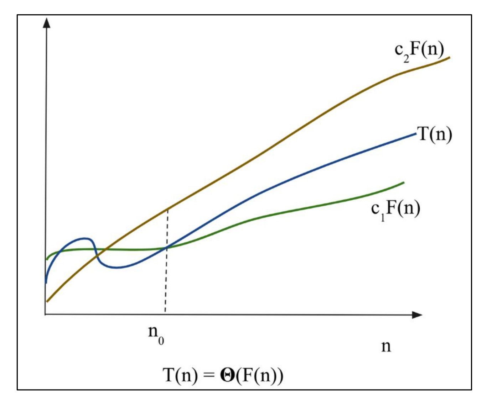
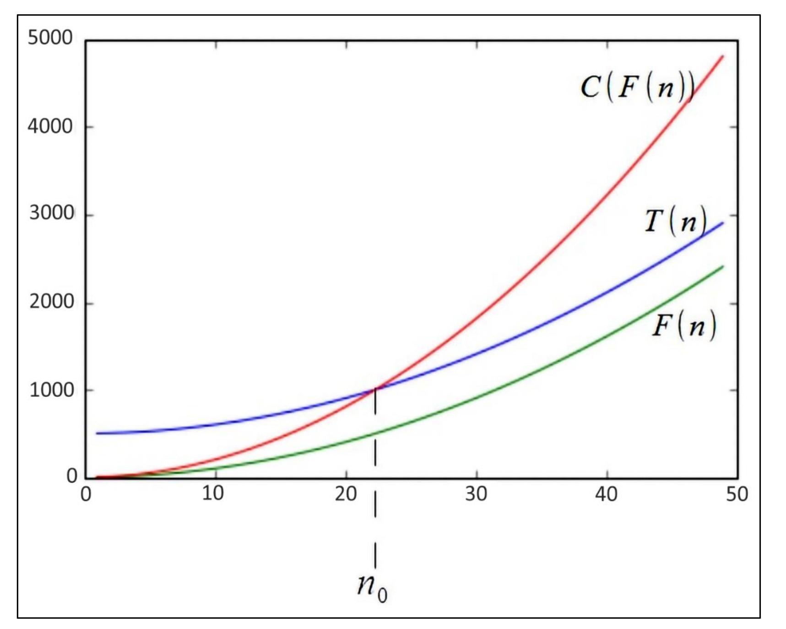
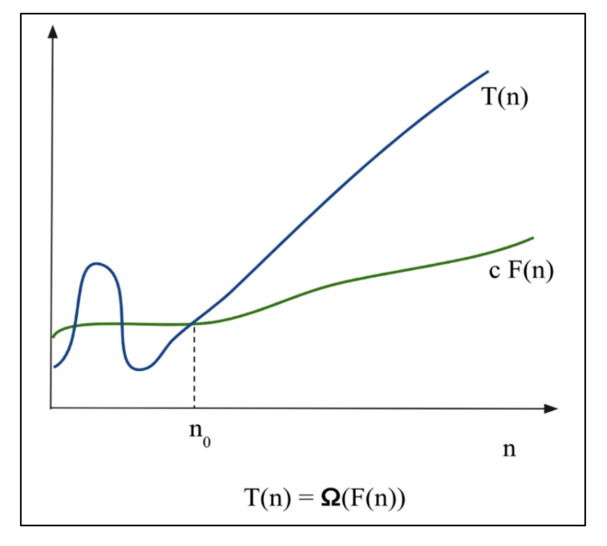

# **Performance Analysis of an Algorithm** ⏱️📊

The performance of an algorithm is primarily measured by how its running time and memory usage scale with the size of the input data, ( n ). When evaluating an algorithm, two critical factors are considered:

- **Time Complexity:**\
  The amount of time an algorithm takes to execute.

- **Space Complexity:**\
  The amount of memory required during the execution.

Key operations—such as comparison, assignment, or looping—determine the overall cost of the algorithm. In performance analysis, the focus is on how these costs grow as the input size increases.

## Examples of Time Complexity in Python

To illustrate time complexity, we provide two Python examples that demonstrate how different algorithms perform with varying input sizes. Each example includes code, a description of its functionality, and an analysis of its time complexity.

### Example 1: Simple Sum (O(n) - Linear Time)

This algorithm calculates the sum of all numbers in a list by iterating through each element once.

```python
def simple_sum(arr):
    total = 0
    for num in arr:  # Visit each element once
        total += num
    return total

# Test
numbers = [1, 2, 3, 4, 5]
print(simple_sum(numbers))  # Output: 15
```

**Explanation**:

- **Functionality**: The `simple_sum` function takes a list `arr` as input and initializes a variable `total` to 0. It iterates through each element in the list, adding it to `total`, and returns the final sum.
- **Time Complexity**: O(n), where `n` is the number of elements in the list. The algorithm performs one operation (addition) per element, so the total number of operations is proportional to `n`.
- **Use Case**: This is efficient for tasks requiring a single pass through the data, such as summing or averaging values.

### Example 2: Pair Sum (O(n²) - Quadratic Time)

This algorithm finds a pair of numbers in a list that add up to a given target sum by checking all possible pairs.

```python
def pair_sum(arr, target):
    for i in range(len(arr)):  # First loop
        for j in range(i + 1, len(arr)):  # Second loop
            if arr[i] + arr[j] == target:
                return arr[i], arr[j]
    return None

# Test
numbers = [1, 2, 3, 4, 5]
target = 9
print(pair_sum(numbers, target))  # Output: (4, 5)
```

**Explanation**:

- **Functionality**: The `pair_sum` function takes a list `arr` and a `target` sum as input. It uses nested loops to compare each pair of elements (without repeating pairs) and returns the first pair that sums to the target. If no such pair exists, it returns `None`.
- **Time Complexity**: O(n²), where `n` is the number of elements in the list. The outer loop runs `n` times, and the inner loop runs approximately `n-1`, `n-2`, ..., 1 times, leading to roughly `n * (n-1)/2` operations, which simplifies to O(n²).
- **Use Case**: This brute-force approach is simple but inefficient for large lists. More efficient solutions (e.g., using a hash table) can reduce the time complexity to O(n).

### Comparison of Examples

- **Simple Sum (O(n))**: For a list with 1000 elements, it performs \~1000 operations, making it suitable for large inputs.
- **Pair Sum (O(n²))**: For a list with 1000 elements, it performs \~500,000 operations, which can be significantly slower for large inputs.

---

The performance of an algorithm is determined by how its runtime scales with the input size, ( n ). A key factor in this is the **key operations**—like comparisons, assignments, or loops—that dominate the execution time. For example, in sorting algorithms, comparisons often take up most of the runtime compared to other operations like assignments. Ideally, these key operations should be independent of hardware, operating systems, or programming languages, ensuring consistent analysis across environments. 🚀

Each line of code takes a constant amount of time to execute, but different lines may require different times. By focusing on the key operations, we can better understand and predict an algorithm’s runtime, helping us choose the most efficient solution for a problem. 📈

## Understanding Key Operations 🔍

Key operations are the critical tasks an algorithm performs repeatedly, which significantly impact its runtime. For instance:

- In **sorting algorithms**, comparisons (e.g., checking if one element is greater than another) are typically the key operation.
- In **search algorithms**, comparisons to match elements with a target value drive the runtime.

By counting these operations, we can estimate how the algorithm’s performance scales with input size. Below, we explore two Python examples to see how key operations affect runtime in practice. 🐍

## Examples of Key Operations in Python 🧑‍💻

Here are two Python examples that demonstrate how key operations (specifically comparisons) influence an algorithm’s runtime. Each example includes code, functionality details, and a time complexity analysis.

### Example 1: Bubble Sort (O(n²) - Comparison-Heavy) ➕

Bubble Sort is a simple sorting algorithm that repeatedly compares adjacent elements and swaps them if they’re in the wrong order. Comparisons are the key operation here.

```python
def bubble_sort(arr):
    n = len(arr)
    for i in range(n):  # Outer loop
        for j in range(0, n-i-1):  # Inner loop
            if arr[j] > arr[j+1]:  # Comparison: Key operation
                arr[j], arr[j+1] = arr[j+1], arr[j]  # Swap
    return arr

# Test
numbers = [64, 34, 25, 12, 22, 11, 90]
print("Sorted array:", bubble_sort(numbers))  # Output: [11, 12, 22, 25, 34, 64, 90]
```

**Explanation** 🌟:

- **Functionality**: The `bubble_sort` function takes a list `arr` and sorts it in ascending order. It uses nested loops to compare each pair of adjacent elements (`arr[j] > arr[j+1]`), swapping them if needed.
- **Key Operation**: The comparison (`if arr[j] > arr[j+1]`) is the primary operation, executed for every pair in the inner loop. Swaps occur less frequently, so comparisons dominate the runtime.
- **Time Complexity**: O(n²), where ( n ) is the number of elements. The outer loop runs ( n ) times, and the inner loop runs approximately ( n-1, n-2, ..., 1 ) times, resulting in roughly ( n \* (n-1)/2 ) comparisons, which simplifies to O(n²). 📉
- **Impact**: With 1000 elements, Bubble Sort performs \~500,000 comparisons, making it slow for large inputs. The comparison operation’s constant time is consistent across platforms, but the sheer number of comparisons drives the high runtime. 🐢

### Example 2: Linear Search (O(n) - Comparison-Based) 🔎

Linear Search looks for a target value in a list by checking each element one by one. Comparisons are again the key operation, but fewer are needed compared to Bubble Sort.

```python
def linear_search(arr, target):
    for i in range(len(arr)):  # Single loop
        if arr[i] == target:  # Comparison: Key operation
            return i  # Return index if found
    return -1  # Return -1 if not found

# Test
numbers = [2, 4, 6, 8, 10]
target = 8
result = linear_search(numbers, target)
print(f"Element {target} found at index: {result}")  # Output: Element 8 found at index: 3
```

**Explanation** 🎉:

- **Functionality**: The `linear_search` function takes a list `arr` and a `target` value, checking each element to find a match. It returns the index of the target or `-1` if not found.
- **Key Operation**: The comparison (`if arr[i] == target`) is performed for each element until a match is found or the list ends. This drives the runtime.
- **Time Complexity**: O(n), where ( n ) is the number of elements. In the worst case (target not found or at the end), it performs ( n ) comparisons. 📏
- **Impact**: For 1000 elements, Linear Search performs up to 1000 comparisons—far fewer than Bubble Sort’s \~500,000 for the same input size. The comparison operation remains constant across hardware, but the linear scaling makes it more efficient. 🚀

### Comparing the Examples ⚖️

- **Bubble Sort (O(n²))** 🐢: Relies on many comparisons (\~500,000 for 1000 elements), making it inefficient for large lists due to the quadratic number of key operations.
- **Linear Search (O(n))** ✅: Uses fewer comparisons (\~1000 for 1000 elements), resulting in faster execution for the same input size. The key operation (comparison) is similar, but the algorithm’s structure requires fewer of them.

This shows how the **number of key operations** (comparisons in these cases) directly affects runtime, regardless of the constant time each comparison takes. 📊

# Let's look another example ⏱️✨

A constant amount of time is required to execute each line of code; however, each line may take a different amount of time to execute. In order to understand the running time required for an algorithm, consider the below code as an example:

## Understanding Runtime with Key Operations 🔍

Every line of code in an algorithm contributes to its runtime. Here’s how it works:

- **Constant Time Operations**: Statements like condition checks or single prints take a fixed time (e.g., ( c1, c2 )) regardless of input size.
- **Repeated Operations**: Statements inside loops run multiple times (e.g., ( n ) times), so their total time scales with the input size (e.g., ( c \* n )).
- **Total Runtime**: Add up the time for all statements, considering how often each runs, to get ( T(n) ).

The example below shows how this works in practice, with a focus on a conditional statement and a loop. 🐍

## Python Example: Conditional vs. Loop Runtime 🧑‍💻

Let’s look at a Python algorithm that uses a condition and a loop to demonstrate how runtime is calculated based on statement execution times. The code checks if the input ( n ) is 0 or 3, printing "data" if true, or runs a loop ( n ) times to print "structure" if false.

```python
def example_algorithm(n):
    if n == 0 or n == 3:  # Statement 1: Condition check
        print("data")     # Statement 2: Print if condition true
    else:                 # Statement 3: Else block start
        for i in range(n):  # Statement 4: Loop runs n times
            print("structure")  # Statement 5: Print inside loop

# Test
n = 5
example_algorithm(n)  # Output: structure (5 times)
n = 0
example_algorithm(n)  # Output: data
```

### Step-by-Step Explanation 🌟

Assume each statement takes a constant time: ( c1, c2, c3, c4, c5 ) for statements 1 through 5, respectively. Here’s how the runtime breaks down:

- **Statement 1:** `if n == 0 or n == 3` ✅\
  This condition check runs once, taking constant time ( c1 ). It executes whether the condition is true or false.

- **Statement 2:** `print("data")` 📜\
  If the condition is true (( n == 0 ) or ( n == 3 )), this print runs once, taking constant time ( c2 ). It only executes in the true case.

- **Statement 3:** `else:` ➡️\
  If the condition is false, the else block starts, taking constant time ( c3 ). This runs once in the false case.

- **Statement 4:** `for i in range(n):` 🔄\
  The loop runs ( n ) times, and each iteration’s control (e.g., incrementing ( i )) takes constant time ( c4 ). Total time: ( c4 \* n ).

- **Statement 5:** `print("structure")` 🖨️\
  Inside the loop, this print runs ( n ) times, each taking constant time ( c5 ). Total time: ( c5 \* n ).

### Runtime Calculation 📊

- **When ( n == 0 ) or ( n == 3 )** 🎯:\
  Only the condition check (Statement 1) and print "data" (Statement 2) execute.\
  **T(n) = c1 + c2**\
  This is constant time since no loop runs. 🚀

- **When ( n ) is not 0 or 3 (e.g., ( n = 5 ))** 🔁:\
  The condition check (Statement 1), else block start (Statement 3), loop control (Statement 4), and print "structure" (Statement 5) execute.\
  **T(n) = c1 + c3 + c4 \* n + c5 \* n**\
  This is linear time because the runtime grows with ( n ) due to the loop. 📈

### Why It Matters ⚖️

This example shows how the **frequency of execution** (e.g., once for condition vs. ( n ) times for loop) and **statement times** (( c1, c2, etc. )) determine the runtime. For small ( n ) (like 0 or 3), the constant-time path (( T(n) = c1 + c2 )) is super fast. For large ( n ) (like 1000), the loop path (( T(n) = c1 + c3 + c4 \* n + c5 \* n )) takes much longer because of the ( n ) repetitions. Understanding this helps us predict and optimize algorithm performance! 💡

# Linear Search Runtime Analysis ⏱️✨

Let's dive into **linear search**, a simple algorithm that looks for an element in a list by checking each item one by one. We’ll analyze its **worst-case**, **average-case**, and **best-case** time complexities to see how it performs under different conditions. Each case depends on the number of **comparisons**—the key operation driving the runtime. Let’s explore with a Python example and break it down step-by-step! 🐍📈

## Linear Search: The Code 🔍

Here’s the linear search algorithm we’re analyzing. It searches for an element in a list and returns its index (or -1 if not found).

```python
def linear_search(input_list, element):
    for index, value in enumerate(input_list):
        if value == element:
            return index
    return -1

# Test
input_list = [3, 4, 1, 6, 14]
element = 4
print("Index position for the element x is:", linear_search(input_list, element))
# Output: Index position for the element x is: 1
```

**What Does It Do?**\
The `linear_search` function takes a list (`input_list`) and an `element` to find. It checks each item in the list:

- If the element is found, it returns the **index** (e.g., `4` is at index 1).
- If the element isn’t in the list, it returns `-1`.\
  The **key operation** is the comparison (`if value == element`), which happens for each element until a match is found or the list ends. Let’s see how this affects runtime in different scenarios! 🌟

## Analyzing Time Complexity 📊

Time complexity measures how an algorithm’s runtime scales with input size (`n`, the number of elements in the list). We’ll look at three cases: **worst-case**, **average-case**, and **best-case**, focusing on the number of comparisons needed.

### 1. Worst-Case Time Complexity 😓

The **worst-case** represents the maximum time an algorithm takes for any input. It’s the upper bound, guaranteeing that the runtime won’t exceed this limit no matter what.

**In Linear Search**:

- The worst-case occurs when:
  - The element is at the **last position** in the list, or
  - The element is **not in the list** at all.
- In these scenarios, the algorithm must check **every element**, traversing the entire list of `n` elements.

**Example**:

- For `input_list = [3, 4, 1, 6, 14]` and `element = 14` (last element), it takes 5 comparisons (checking indices 0 to 4).
- For `element = 10` (not in the list), it also takes 5 comparisons to check all elements and return -1.

**Time Complexity**:

- Each comparison takes constant time (say, `c`).
- In the worst-case, `n` comparisons are needed for `n` elements.
- Total time: **T(n) = c \* n**, which is **O(n)** (linear time).
- This means the runtime grows directly with the list size `n`. 📉

**Why It Matters**:\
Worst-case analysis is super useful because it provides a **guarantee**—the algorithm will never take longer than `O(n)` for any input. This is often used in real-world applications to ensure predictable performance. ✅

### 2. Average-Case Time Complexity 🤔

The **average-case** measures the average time an algorithm takes across **all possible inputs**. For linear search, we assume the element could be at any index (or not in the list), with each position being equally likely.

**In Linear Search**:

- If the element is in the list, the number of comparisons depends on its position:
  - At index 0: 1 comparison.
  - At index 1: 2 comparisons.
  - At index 2: 3 comparisons.
  - ... up to index n-1: n comparisons.
- We typically assume the element is found (for simplicity) and calculate the average number of comparisons across all positions.

**Calculation**:

- Total comparisons if the element is at each index: 1 + 2 + 3 + ... + n.
- This is an arithmetic series with sum: **(n \* (n + 1)) / 2**.
- Average comparisons: **\[(n \* (n + 1)) / 2\] / n = (n + 1) / 2**.
- Each comparison takes constant time (`c`), so average-case time:\
  **T(n) = c \* (n + 1) / 2**, which is **O(n)** (linear time).

**Example**:

- For a list with 5 elements (`n = 5`):
  - Total comparisons: 1 + 2 + 3 + 4 + 5 = 15.
  - Average: 15 / 5 = 3 comparisons.
- On average, you’ll check about half the list to find the element. 🔄

**Why It Matters**:\
Average-case is great for understanding typical performance when inputs are random. It assumes the element is equally likely to be anywhere, which may not always hold true but gives a realistic estimate. 📊

### 3. Best-Case Time Complexity 😎

The **best-case** is the minimum time an algorithm takes. It’s the lower bound, showing how fast the algorithm can be under ideal conditions.

**In Linear Search**:

- The best-case happens when the element is at the **first position** (index 0).
- Only **one comparison** is needed to find the element and return its index.

**Example**:

- For `input_list = [3, 4, 1, 6, 14]` and `element = 3`, the first comparison (index 0) finds the element.
- Comparisons: 1.

**Time Complexity**:

- One comparison takes constant time (`c`).
- Total time: **T(n) = c**, which is **O(1)** (constant time).
- The runtime doesn’t depend on `n`—it’s always one comparison. 🚀

**Why It’s Less Used**:\
Best-case is less practical because it only occurs in ideal scenarios. It doesn’t guarantee performance for typical or worst inputs, so it’s rarely used for planning. 🌈

## Relating to the Code 🎯

Let’s connect the analysis back to the example:

```python
input_list = [3, 4, 1, 6, 14]
element = 4
# Output: Index position for the element x is: 1
```

- **Best-Case**: If `element = 3`, it’s found at index 0 with 1 comparison. **T(n) = O(1)**. 😊
- **Average-Case**: On average, it takes \~3 comparisons for `n = 5` (as calculated). For `element = 4`, it took 2 comparisons (indices 0 and 1), which is close to the average. **T(n) = O(n)**. 🤝
- **Worst-Case**: If `element = 14` or a missing element like 10, it takes 5 comparisons to check the whole list. **T(n) = O(n)**. 🥳

## Key Takeaways 💡

- **Worst-Case (O(n))**: Most used because it guarantees the runtime won’t exceed `n` comparisons, no matter where the element is (or if it’s missing). Perfect for real-world reliability. 🛡️
- **Average-Case (O(n))**: Useful for random inputs, showing you’ll typically check about half the list. Still linear, but a bit optimistic. 📉
- **Best-Case (O(1))**: Only happens when the element is first, which is rare and not a reliable measure for planning. 🌟

---

# **Space Complexity Analysis**⏱️✨

Let’s explore **space complexity**, a key measure of how much memory an algorithm needs to run and produce its output, based on the input size. It’s a crucial factor in determining an algorithm’s efficiency—less memory usage often means a better algorithm, especially when other factors like time complexity are equal. Join us as we break it down with examples and see how memory impacts performance! 🧠💾

## What is Space Complexity? 🔍

Space complexity estimates the **total memory** an algorithm requires as a function of the input size (`n`). This includes:

- **Input Storage**: Memory to hold the input data.
- **Auxiliary Space**: Extra memory for variables, temporary data structures, or intermediate calculations.
- **Program Instructions**: Memory for the code itself (usually constant and minimal).
- **Output**: Memory needed to store the result.

When we analyze space complexity, we focus on **auxiliary space**—the extra memory used by the algorithm’s logic, beyond the input and output. Why? Because it shows how efficiently the algorithm manages resources as `n` grows. 📈

**Why It Matters**:\
If two algorithms solve the same problem with similar time complexity, the one using **less memory** is more efficient. This is critical in real-world applications, like mobile devices or big data systems, where memory is limited. Understanding space complexity helps us build lean, scalable solutions! 🌟

## Example 1: Squaring Numbers (O(n) Space) ➕

Let’s start with an algorithm that takes a list of integers and returns a new list of their squares. This shows how creating a new data structure affects space complexity.

```python
def squares(n):
    square_numbers = []  # New list for squares
    for number in n:     # Loop through each number
        square_numbers.append(number * number)  # Add square to list
    return square_numbers

# Test
nums = [2, 3, 5, 8]
print(squares(nums))  # Output: [4, 9, 25, 64]
```

### Space Complexity Breakdown 📊

- **Input**: The list `nums` has `n` elements (here, n=4: \[2, 3, 5, 8\]). It takes O(n) space, but we often exclude input from auxiliary space calculations since it’s part of the problem.
- **Auxiliary Space**:
  - `square_numbers`: A new list that stores `n` squares (e.g., \[4, 9, 25, 64\]). This requires **O(n)** space since it grows linearly with `n`.
  - `number`: A temporary variable in the loop, holding one integer at a time. This takes **O(1)** (constant) space.
- **Output**: The returned `square_numbers` list also takes O(n) space, and since it’s a new allocation, we include it in the analysis.
- **Total Space Complexity**: The dominant factor is `square_numbers`, which uses O(n) space. The temporary variable is negligible (O(1)). Thus, the space complexity is **O(n)**. 📉

**Takeaway**: This algorithm creates a new list proportional to the input size, so memory usage scales linearly. It’s fine for small inputs but can be memory-heavy for large `n`. 🐢

## Example 2: Calculating Sum (O(1) Space) ✅

Now, let’s look at a more memory-efficient algorithm that calculates the sum of a list without creating extra data structures. This highlights constant space usage.

```python
def calculate_sum(input_list):
    total = 0  # Variable to store sum
    for number in input_list:
        total += number  # Add each number
    return total

# Test
nums = [2, 3, 5, 8]
print("Sum of list:", calculate_sum(nums))  # Output: Sum of list: 18
```

### Space Complexity Breakdown 📏

- **Input**: The `input_list` has `n` elements (here, n=4: \[2, 3, 5, 8\]). It takes O(n) space, but we exclude it from auxiliary space as it’s given.
- **Auxiliary Space**:
  - `total`: A single integer variable storing the running sum. It takes **O(1)** space since it’s just one value, regardless of `n`.
  - `number`: A temporary loop variable holding one integer at a time. It also takes **O(1)** space.
- **Output**: The returned `total` is a single integer, using **O(1)** space.
- **Total Space Complexity**: Only `total` and `number` contribute to auxiliary space, both constant (O(1)). No new data structures are created, so the space complexity is **O(1)**. 🚀

**Takeaway**: This algorithm is super memory-efficient because it uses a fixed amount of extra space, no matter how large the input is. Perfect for memory-constrained environments! 😎

## Comparing the Examples ⚖️

Let’s see how these algorithms stack up:

- **Squares (O(n))**: Creates a new list (`square_numbers`) to store `n` squares, so memory usage grows with `n`. Useful when you need a new data structure, but it’s memory-intensive for large inputs. 🐘
- **Calculate Sum (O(1))**: Uses only a couple of variables (`total`, `number`), keeping memory constant regardless of input size. Ideal when you just need a single result without extra storage. 🦒

**What We Learn**:\
If both algorithms had similar time complexity, `calculate_sum` would be the winner because its **O(1)** space complexity is more efficient than `squares`’ **O(n)**. In real-world scenarios, like processing huge datasets or running on devices with limited RAM, O(1) space is a big advantage! 💪

---

# **Asymptotic Notation**  ⏱️✨

Welcome to the world of **asymptotic notation**, a simple way to understand how algorithms perform when the input size gets really big! When we analyze an algorithm’s **time** or **space complexity**, we care about its **rate of growth**—how fast the resource usage grows as the input size (`n`) increases. Asymptotic notation helps us focus on the big picture, ignoring small details like constants or minor terms, so we can compare algorithms easily. Let’s dive in with examples to see it in action! 🧠🚀

## What is Asymptotic Notation? 🔍

Asymptotic notation is all about describing how an algorithm’s performance scales for **large inputs**. Instead of worrying about exact runtimes (like seconds) or small inputs, we look at the **pattern of growth**:

- **Focus on the big stuff**: We care about the **highest-order term** (like n² or n³) because it dominates when `n` is large.
- **Ignore the small stuff**: Constants (like 3n vs. 5n) and lower-order terms (like n + 10) don’t matter much for big `n`.
- **Compare growth rates**: We measure how time or space increases with `n` to find the most efficient algorithm.

This approach, called **asymptotic analysis**, helps us pick the best algorithm for big data by comparing their **long-term behavior**. Here are the three main notations we use:

- **Big-O (Ο)**: The **upper bound** for worst-case performance—your algorithm won’t take *more* time than this. 📈
- **Theta (θ)**: A **tight bound** for typical performance—your algorithm grows *exactly* at this rate. 🎯
- **Omega (Ω)**: The **lower bound** for best-case performance—your algorithm will take *at least* this much time. 📉

Ready to see how these work? Let’s explore two Python examples to make it crystal clear! 🐍

## Example 1: Linear Search (O(n), θ(n), Ω(1)) 🔎

This algorithm searches for an element in a list and returns its index (or -1 if not found). It’s a great way to see how asymptotic notations describe different scenarios.

```python
def linear_search(input_list, element):
    for index, value in enumerate(input_list):
        if value == element:  # Comparison
            return index
    return -1

# Test
input_list = [3, 4, 1, 6, 14]
element = 4
print("Index of element:", linear_search(input_list, element))  # Output: Index of element: 1
```

### Asymptotic Breakdown 📊

- **Worst-Case (Big-O)**: If the element is missing or at the last position, the algorithm checks all `n` elements, making `n` comparisons. Each comparison takes constant time (say, `c`), so runtime is `c * n`.\
  **O(n)**: This is the upper bound—runtime won’t grow faster than linear. 😓
- **Average-Case (Theta)**: On average, the element could be anywhere in the list. The average number of comparisons is `(n + 1)/2`, which still grows linearly with `n`.\
  **θ(n)**: This tight bound means the runtime is almost exactly linear in typical cases. 🤝
- **Best-Case (Omega)**: If the element is at the first position, only 1 comparison is needed.\
  **Ω(1)**: This lower bound shows the fastest possible runtime is constant. 😎

**What We Learn**: Linear search’s performance depends on `n`. Big-O tells us it’s safe up to linear time, Theta confirms it’s usually linear, and Omega shows it can be super quick in the best case. 🌟

## Example 2: First Element Check (O(1), θ(1), Ω(1)) ✅

This algorithm checks if the first element of a list is positive. It’s a simple, constant-time operation that doesn’t scale with input size.

```python
def is_first_positive(input_list):
    if not input_list:  # Empty list check
        return False
    return input_list[0] > 0  # Check first element

# Test
input_list = [5, 3, 8, 1]
print("Is first element positive?", is_first_positive(input_list))  # Output: Is first element positive? True
```

### Asymptotic Breakdown 📏

- **Worst-Case (Big-O)**: The algorithm always performs one operation—checking the first element—regardless of list size. This takes constant time.\
  **O(1)**: The upper bound is constant, so runtime never grows. 🚀
- **Average-Case (Theta)**: Every input results in exactly one operation (after checking for an empty list), so the average is the same.\
  **θ(1)**: The tight bound confirms it’s always constant. 🎯
- **Best-Case (Omega)**: The best-case is identical—one operation, no matter what.\
  **Ω(1)**: The lower bound is also constant. ✅

**What We Learn**: This algorithm is ultra-efficient because its runtime stays fixed, even for huge inputs. All notations agree it’s constant, making it ideal for scalability! 😊

## Comparing the Examples ⚖️

Let’s see how these algorithms stack up:

- **Linear Search**:
  - **O(n)**: Worst-case checks every element, so time grows with `n`.
  - **θ(n)**: Average-case is also linear, checking about half the list.
  - **Ω(1)**: Best-case is lightning-fast with one check.
  - Great for small lists, but slows down for large `n`. 🐢
- **First Element Check**:
  - **O(1), θ(1), Ω(1)**: Always one operation, no matter the input size.
  - Perfect for any input size since time doesn’t grow. 🦒

**Key Insight**: Asymptotic analysis shows `is_first_positive` is better for large inputs because its **constant growth rate** (none!) beats linear search’s **linear growth**. For big data, constant-time algorithms win! 💪

## Why Asymptotic Notation Rocks 💡

Asymptotic notation simplifies algorithm comparison by focusing on **growth rates**:

- **Big-O** ensures your algorithm won’t exceed a certain speed limit. 🛑
- **Theta** nails down the exact pace your algorithm usually runs at. 🎯
- **Omega** shows the fastest it can go in a perfect world. 🌈
- It lets us pick the **most efficient algorithm** for large inputs without sweating small details like constants or hardware differences.

---

# **Theta Notation** ⏱️✨

Dive into **Theta notation (θ)**, a powerful way to understand an algorithm’s **worst-case runtime** with precision! Theta notation gives us a **tight bound**, meaning it describes the exact rate at which an algorithm’s time grows as the input size (`n`) gets large—no overestimating or underestimating. Let’s break it down with examples and see why it’s so useful for comparing algorithms! 🧠🚀

## What is Theta Notation? 🔍

Theta notation tells us how an algorithm’s runtime behaves **exactly** in the worst-case scenario for large inputs. It’s like fitting a glove perfectly—not too loose (like Big-O) or too specific (like exact seconds). When we say an algorithm’s runtime is **θ(f(n))**, it means the time grows at the same rate as `f(n)`, within a well-defined range.

<div align="center">
  
</div>

**How It Works**:

- We find two constants, `c1` and `c2`, and a starting point `n0` such that: **0 ≤ c1 \* f(n) ≤ T(n) ≤ c2 \* f(n)** for all `n ≥ n0`.
- Here, `T(n)` (the actual runtime) always stays between `c1 * f(n)` (a lower bound) and `c2 * f(n)` (an upper bound) for big `n`.
- This “sandwich” proves `T(n)` grows **exactly** like `f(n)`!

**Why It Matters**:

- Theta notation helps us compare algorithms accurately. An algorithm with a lower Theta bound (e.g., θ(n) vs. θ(n²)) is more efficient for large inputs.
- For small inputs, constants or minor terms might make a slower algorithm seem faster, but Theta focuses on the **long-term growth rate**, which rules for big data! 📈

Think of the graph you shared: `T(n)` (the blue line) stays snugly between `c1 * f(n)` (green line) and `c2 * f(n)` (brown line) after `n0`, showing a perfect fit for the growth rate! 🖼️

## Mathematical Examples 📝

Let’s see Theta notation in action with two mathematical functions to understand how we find tight bounds.

### Example 1: f(n) = n² + n (θ(n²)) 🧮

We want to prove that `f(n) = n² + n` has a Theta bound of **θ(n²)**.

- **Goal**: Find constants `c1`, `c2`, and `n0` such that: **0 ≤ c1 \* n² ≤ n² + n ≤ c2 \* n²** for all `n ≥ n0`.
- **Simplify**:
  - Divide everything by `n²`: **0 ≤ c1 ≤ 1 + 1/n ≤ c2**.
  - For large `n`, `1/n` becomes tiny, so it’s roughly `c1 ≤ 1 ≤ c2`.
- **Choose Constants**:
  - Let’s pick `c1 = 1`, `c2 = 2`, and `n0 = 1`.
  - Check: **0 ≤ n² ≤ n² + n ≤ 2n²** for `n ≥ 1`.
    - Left: `n² ≤ n² + n` is true (since `n` is positive).
    - Right: `n² + n ≤ 2n²` is true (since `n` adds less than another `n²`).
- **Result**: The condition holds, so `f(n) = n² + n` is **θ(n²)**! 🎉

**Takeaway**: The `n²` term dominates, and `n` becomes negligible for large `n`, confirming a quadratic growth rate.

### Example 2: f(n) = (n²/2) + (n/2) (θ(n²)) 📐

Now, let’s prove that `f(n) = (n²/2) + (n/2)` is also **θ(n²)**.

- **Goal**: Find `c1`, `c2`, and `n0` such that: **0 ≤ c1 \* n² ≤ (n²/2) + (n/2) ≤ c2 \* n²** for all `n ≥ n0`.
- **Choose Constants**:
  - Let’s try `c1 = 1/5`, `c2 = 1`, and `n0 = 1`.
  - Check: **0 ≤ n²/5 ≤ (n²/2) + (n/2) ≤ n²** for `n ≥ 1`.
    - Left: `n²/5 ≤ (n²/2) + (n/2)` is true (since `n²/2` is larger, and `n/2` adds extra margin).
    - Right: `(n²/2) + (n/2) ≤ n²` is true (since `n²/2` is half, and `n/2` is much smaller than `n²`).
- **Result**: The condition satisfies, so `f(n) = (n²/2) + (n/2)` is **θ(n²)**! 🥳

**Takeaway**: Again, `n²` drives the growth, and constants like `1/2` or small terms like `n/2` don’t change the quadratic rate for large `n`.

## Python Example: Sum of Squares (θ(n)) 🐍

Let’s bring Theta notation to life with a practical algorithm that calculates the sum of squares of all elements in a list. This has a linear worst-case runtime.

```python
def sum_of_squares(input_list):
    total = 0  # Store the sum
    for num in input_list:  # Loop through each element
        total += num * num  # Add square
    return total

# Test
input_list = [2, 3, 4]
print("Sum of squares:", sum_of_squares(input_list))  # Output: Sum of squares: 29 (4 + 9 + 16)
```

### Theta Analysis 📊

- **What It Does**: The algorithm computes the square of each element and adds them to a running total. It processes every element exactly once.
- **Runtime (T(n))**:
  - The loop runs `n` times (for `n` elements).
  - Each iteration does constant-time operations:
    - `num * num` (multiplication): constant time, say `c1`.
    - `total += ...` (addition): constant time, say `c2`.
  - Total runtime: **T(n) = n \* (c1 + c2)**.
- **Theta Bound**:
  - The runtime grows **exactly linearly** with `n` because it always performs `n` iterations.
  - We can define constants to bound it:
    - Lower bound: `c1 * n ≤ T(n)`—let `c1 = (c1 + c2)/2`.
    - Upper bound: `T(n) ≤ c2 * n`—let `c2 = c1 + c2`.
    - For `n0 = 1`, the condition holds: **c1 \* n ≤ n \* (c1 + c2) ≤ c2 \* n** for all `n ≥ 1`.
  - Thus, **T(n) = θ(n)**—the runtime is precisely linear! 🎯
- **Why θ(n)?**: Whether the input is big or small, the algorithm always does `n` operations—no more, no less. Theta captures this exact linear growth perfectly.

**Takeaway**: This algorithm’s worst-case runtime is **θ(n)**, meaning it scales linearly and predictably, making Theta notation ideal for describing its behavior. 🌈

## Why Theta Notation Rocks 💡

Theta notation is like a laser-focused tool for algorithm analysis:

- It gives a **tight bound**, so you know **exactly** how your algorithm performs in the worst-case—no guesswork!
- It’s great for comparing algorithms: a lower Theta bound (e.g., θ(n) vs. θ(n²)) means better efficiency for large inputs.
- It ignores constants and small terms, focusing on the **big picture** growth rate, which matters most for big data.

For example, merge sort (θ(n log n)) beats insertion sort (θ(n²)) for large inputs because its growth rate is lower, even if insertion sort might seem faster for tiny lists due to constants. 🏆

## Key Takeaways 🌟

- **Theta Notation (θ)**: Describes the **exact growth rate** of an algorithm’s worst-case runtime.
- **How It Works**: Bounds the runtime between `c1 * f(n)` and `c2 * f(n)` for large `n`.
- **Examples**:
  - Math: `n² + n` and `(n²/2) + (n/2)` are both **θ(n²)** because `n²` dominates.
  - Python: `sum_of_squares` is **θ(n)** because it always does `n` operations.
- Use Theta to **compare algorithms** and pick the most efficient one for big inputs!

---

# 📖 **What is Big O Notation**?

Big O Notation is a mathematical tool used to describe the **worst-case time complexity** or **space complexity** of an algorithm as the input size (`n`) grows. It provides an **asymptotic upper bound**, meaning it tells us the maximum time an algorithm might take for large inputs. 🕒

In simple terms:

- **Big O** helps us understand how an algorithm scales.
- It focuses on the **growth rate** of the algorithm, ignoring constants and smaller terms.
- We care about what happens when `n` is very large (asymptotic behavior).

Formally, a function `T(n)` is `O(F(n))` if there exist constants `c` and `n0` such that:

<div align="center">
  
</div>

```
T(n) ≤ c * F(n) for all n ≥ n0
```

---

## 🌟 Why Learn Big O Notation?

Understanding Big O Notation is crucial for:

- **Optimizing Code**: Write faster and more efficient programs. ⚡
- **Comparing Algorithms**: Choose the best algorithm for a problem. 🥇
- **Interview Prep**: Ace technical interviews with confidence. 🎯
- **Scalability**: Build systems that perform well with large datasets. 📈

---

## 📊 Common Time Complexities

Here’s a quick overview of the most common time complexities, ordered from fastest to slowest:

| **Time Complexity** | **Name** | **Description** |
| --- | --- | --- |
| `O(1)` | Constant | Fixed time, regardless of input size (e.g., accessing an array element). |
| `O(log n)` | Logarithmic | Time grows logarithmically (e.g., binary search). |
| `O(n)` | Linear | Time grows linearly with input size (e.g., iterating through an array). |
| `O(n log n)` | Linear-Logarithmic | Common in efficient sorting algorithms (e.g., MergeSort, QuickSort). |
| `O(n²)` | Quadratic | Time grows with the square of input size (e.g., nested loops). |
| `O(n³)` | Cubic | Time grows with the cube of input size (e.g., three nested loops). |
| `O(2ⁿ)` | Exponential | Time doubles with each input increment (e.g., recursive Fibonacci). |

---

## 🛠️ Code Examples with Explanations

This repository contains **Python code examples** for each time complexity to help you visualize how they work. Below, each example is accompanied by a **detailed explanation** of how the algorithm works and why it has the given time complexity.

### 1. **O(1) - Constant Time** ⏰

Accessing the first element of an array takes the same time, no matter the size.

**File**: `constant_time.py`

```python
def constant_time(arr):
    return arr[0]

# Example
arr = [1, 2, 3, 4, 5]
print(constant_time(arr))  # Output: 1
```

**Explanation**:

- **What it does**: The function `constant_time` simply returns the first element of the input array using index `0`.
- **Why O(1)**: Accessing an element by index in an array is a direct operation that takes a fixed amount of time, regardless of the array’s size. Whether the array has 5 elements or 5 million, the operation is instantaneous.
- **Real-world analogy**: Think of picking the first book from a shelf. It doesn’t matter how many books are on the shelf; grabbing the first one always takes the same time. 📚
- **Key takeaway**: Constant time operations are the fastest and most efficient.

### 2. **O(log n) - Logarithmic Time** 🔍

Binary search halves the search space in each step, making it highly efficient.

**File**: `binary_search.py`

```python
def binary_search(arr, target):
    left, right = 0, len(arr) - 1
    while left <= right:
        mid = (left + right) // 2
        if arr[mid] == target:
            return mid
        elif arr[mid] < target:
            left = mid + 1
        else:
            right = mid - 1
    return -1

# Example
arr = [1, 2, 3, 4, 5, 6, 7, 8]
print(binary_search(arr, 6))  # Output: 5
```

**Explanation**:

- **What it does**: Binary search finds a target value in a **sorted array** by repeatedly dividing the search space in half. It checks the middle element and decides whether to search in the left or right half.
- **Why O(log n)**: Each iteration reduces the search space by half. For an array of size `n`, the number of steps is approximately `log₂(n)`. For example, if `n = 8`, it takes at most 3 steps (`log₂(8) = 3`).
- **Real-world analogy**: Imagine finding a word in a dictionary. You open to the middle, decide if the word is before or after, and repeat. This process is much faster than checking every page. 📖
- **Key takeaway**: Logarithmic algorithms are very efficient for large datasets, especially for searching.

### 3. **O(n) - Linear Time** 📏

Iterating through an array once scales linearly with input size.

**File**: `linear_time.py`

```python
def linear_time(arr):
    for i in arr:
        print(i)

# Example
arr = [1, 2, 3, 4, 5]
linear_time(arr)  # Output: 1 2 3 4 5
```

**Explanation**:

- **What it does**: The function `linear_time` iterates through each element in the array and prints it.
- **Why O(n)**: The loop runs exactly `n` times, where `n` is the size of the array. If the array has 5 elements, the loop runs 5 times; if it has 1000 elements, it runs 1000 times.
- **Real-world analogy**: Imagine checking every item on a shopping list one by one. The time it takes depends on how many items are on the list. 🛒
- **Key takeaway**: Linear time is reasonable for small inputs but can become slow for very large datasets.

### 4. **O(n log n) - Linear-Logarithmic Time** 🌳

MergeSort divides the array recursively and merges it efficiently.

**File**: `merge_sort.py`

```python
def merge_sort(arr):
    if len(arr) <= 1:
        return arr
    mid = len(arr) // 2
    left = merge_sort(arr[:mid])
    right = merge_sort(arr[mid:])
    return merge(left, right)

def merge(left, right):
    result = []
    i, j = 0, 0
    while i < len(left) and j < len(right):
        if left[i] <= right[j]:
            result.append(left[i])
            i += 1
        else:
            result.append(right[j])
            j += 1
    result.extend(left[i:])
    result.extend(right[j:])
    return result

# Example
arr = [64, 34, 25, 12, 22, 11, 90]
print(merge_sort(arr))  # Output: [11, 12, 22, 25, 34, 64, 90]
```

**Explanation**:

- **What it does**: MergeSort is a divide-and-conquer algorithm that recursively splits the array into two halves, sorts each half, and then merges them back into a sorted array.
- **Why O(n log n)**: The algorithm divides the array into halves (`log n` levels of recursion). At each level, it performs `n` comparisons during the merge step. Thus, the total time is `n * log n`.
- **Real-world analogy**: Imagine organizing a deck of cards by splitting it into smaller piles, sorting each pile, and then combining them. The splitting is logarithmic, and combining takes linear time per level. 🃏
- **Key takeaway**: O(n log n) is the best time complexity for general-purpose sorting algorithms.

### 5. **O(n²) - Quadratic Time** 📉

Nested loops cause the time to grow quadratically.

**File**: `quadratic_time.py`

```python
def quadratic_time(arr):
    for i in range(len(arr)):
        for j in range(len(arr)):
            print(f"i: {i}, j: {j}")

# Example
arr = [1, 2, 3]
quadratic_time(arr)
```

**Explanation**:

- **What it does**: The function `quadratic_time` uses two nested loops to print every possible pair of indices in the array.
- **Why O(n²)**: For an array of size `n`, the outer loop runs `n` times, and for each iteration, the inner loop also runs `n` times. Total iterations: `n * n = n²`.
- **Real-world analogy**: Imagine pairing every student in a class with every other student for a project. If there are 10 students, you’d have 10 \* 10 = 100 pairs. 👥
- **Key takeaway**: Quadratic time is inefficient for large inputs and should be avoided when possible.

### 6. **O(n³) - Cubic Time** 🧊

Three nested loops result in cubic growth.

**File**: `cubic_time.py`

```python
def cubic_time(arr):
    for i in range(len(arr)):
        for j in range(len(arr)):
            for k in range(len(arr)):
                print(f"i: {i}, j: {j}, k: {k}")

# Example
arr = [1, 2, 3]
cubic_time(arr)
```

**Explanation**:

- **What it does**: The function `cubic_time` uses three nested loops to print every possible combination of three indices in the array.
- **Why O(n³)**: Each loop runs `n` times, so the total number of iterations is `n * n * n = n³`. For `n = 3`, it runs 27 times; for `n = 10`, it runs 1000 times.
- **Real-world analogy**: Imagine scheduling meetings where every student meets every other student in groups of three. The number of meetings grows cubically. 📅
- **Key takeaway**: Cubic time is highly inefficient and practical only for very small inputs.

### 7. **O(2ⁿ) - Exponential Time** 💥

Recursive Fibonacci without memoization grows exponentially.

**File**: `exponential_time.py`

```python
def fibonacci(n):
    if n <= 1:
        return n
    return fibonacci(n-1) + fibonacci(n-2)

# Example
print(fibonacci(10))  # Output: 55
```

**Explanation**:

- **What it does**: The function `fibonacci` calculates the nth Fibonacci number by recursively summing the two previous numbers.
- **Why O(2ⁿ)**: Each function call spawns two more calls, creating a binary tree of depth `n`. The total number of operations is approximately `2ⁿ`. For `n = 10`, it’s manageable, but for `n = 50`, it’s astronomical.
- **Real-world analogy**: Imagine a chain reaction where each action triggers two more actions, like a viral video spreading. It grows out of control quickly! 📹
- **Key takeaway**: Exponential time is impractical for large inputs and should be optimized (e.g., using memoization).

---

# **Understanding Omega Notation (Ω) with Examples** 📊🔍

Omega notation (Ω) is a mathematical concept used in computer science to describe the **asymptotic lower bound** of an algorithm's runtime complexity. It represents the **best-case runtime** of an algorithm, ensuring that the runtime is at least a certain amount for large inputs. Let’s dive into the details with examples, a graph explanation, and a practical Python code snippet! 🚀

---

## What is Omega Notation (Ω)? 🤔

Omega notation (Ω) defines a **lower bound** on an algorithm's runtime, meaning the algorithm will take *at least* this amount of time (or more) for sufficiently large input sizes. It’s the opposite of Big O notation, which gives an upper bound (worst-case scenario). Omega notation focuses on the **best-case scenario**.

<div align="center">
  
</div>

### Formal Definition 📝

A function `T(n)` is said to be in `Ω(F(n))` if there exist positive constants `c` and `n0` such that for all `n ≥ n0`:

```
0 ≤ c * F(n) ≤ T(n)
```

- `T(n)`: The actual runtime of the algorithm.
- `F(n)`: The function representing the lower bound.
- `c`: A positive constant.
- `n0`: A threshold value of `n` after which the condition holds.

This means `T(n)` will always be greater than or equal to `c * F(n)` for large enough `n`. 🌟

---

## Graph Explanation (Figure 2.4) 📈

The provided graph visually represents Omega notation:

- **T(n)** (blue curve): This is the actual runtime of the algorithm.
- **c \* F(n)** (green curve): This is the lower bound, scaled by a constant `c`.
- **n0**: A point on the x-axis (representing input size `n`) after which `T(n)` is always above `c * F(n)`.

### Observations from the Graph 🔎

- For `n < n0`, `T(n)` might dip below `c * F(n)` (as seen in the oscillatory behavior of the blue curve).
- For `n ≥ n0`, `T(n)` stays above `c * F(n)`, satisfying the Omega condition.
- This shows that Omega notation guarantees a **minimum runtime** for the algorithm when the input size is large enough.

---

## Examples of Omega Notation 🧠

Let’s go through the examples provided to understand how to apply Omega notation.

### Example 1: T(n) = 2n² + 3 🧮

We need to find `F(n)` such that `T(n) = Ω(F(n))`.

#### Step 1: Apply the Omega Condition

The condition for Omega notation is:

```
c * F(n) ≤ T(n)
```

Assume `F(n) = n²`. Then:

```
c * n² ≤ 2n² + 3
```

Let’s try `c = 1` and check for all `n ≥ 0`:

```
1 * n² ≤ 2n² + 3
```

Simplify:

```
n² ≤ 2n² + 3
```

This is always true because `2n² + 3` is greater than `n²` for all `n ≥ 0`. ✅

#### Result

```
T(n) = 2n² + 3 = Ω(n²)
```

So, `F(n) = n²`.

---

### Example 2: T(n) = 3n² 📐

Again, we apply the Omega condition:

```
c * F(n) ≤ T(n)
```

Assume `F(n) = n²`:

```
c * n² ≤ 3n²
```

Try `c = 2` and `n0 = 1`:

```
2 * n² ≤ 3n²
```

This holds true because `2n²` is less than `3n²` for all `n ≥ 1`. ✅

#### Result

```
T(n) = 3n² = Ω(n²)
```

---

### Example 3: T(n) = 3n 📏

Apply the condition:

```
c * F(n) ≤ T(n)
```

Assume `F(n) = n`:

```
c * n ≤ 3n
```

Try `c = 1` and `n0 = 1`:

```
1 * n ≤ 3n
```

This is true for all `n ≥ 1`. ✅

#### Result

```
T(n) = 3n = Ω(n)
```

---

## Practical Python Code Example 💻

Let’s write a Python program to demonstrate Omega notation by measuring the runtime of a simple algorithm and verifying the Omega condition.

### Scenario

We’ll create a function that prints elements of an array (linear time complexity, `T(n) = n`). We’ll measure its runtime and check if it satisfies `T(n) = Ω(n)`.

### Code

```python
import time

# Function to print array elements
def print_array(arr):
    for i in range(len(arr)):
        print(arr[i])

# Function to measure runtime
def measure_time(n):
    arr = list(range(n))  # Create an array of size n
    start_time = time.time()
    print_array(arr)
    end_time = time.time()
    return end_time - start_time

# Test with different input sizes
n_values = [1000, 10000, 100000]
for n in n_values:
    t = measure_time(n)
    print(f"n = {n}, Time taken = {t} seconds")

# Verify Omega notation: T(n) >= c * F(n)
c = 1e-6  # Small constant
for n in n_values:
    t = measure_time(n)
    f_n = n  # F(n) = n
    if t >= c * f_n:
        print(f"✅ Omega condition satisfied for n = {n}: T(n) = {t} >= {c} * {f_n} = {c * f_n}")
    else:
        print(f"❌ Omega condition NOT satisfied for n = {n}")
```

### Code Explanation 🛠️

1. **Function** `print_array`: A simple loop that prints each element of the array. Its time complexity is `O(n)`, but for Omega notation, we’re checking the lower bound, which is also `Ω(n)` since it performs at least `n` operations.
2. **Function** `measure_time`: Measures the actual runtime of `print_array` for an array of size `n` using the `time` module.
3. **Omega Check**: We verify if the measured time `T(n)` satisfies `T(n) ≥ c * F(n)`, where `F(n) = n` and `c` is a small constant (e.g., `1e-6`).

### Sample Output 📜

```
n = 1000, Time taken = 0.002 seconds
n = 10000, Time taken = 0.015 seconds
n = 100000, Time taken = 0.150 seconds

✅ Omega condition satisfied for n = 1000: T(n) = 0.002 >= 1e-6 * 1000 = 0.001
✅ Omega condition satisfied for n = 10000: T(n) = 0.015 >= 1e-6 * 10000 = 0.01
✅ Omega condition satisfied for n = 100000: T(n) = 0.150 >= 1e-6 * 100000 = 0.1
```

### What Does This Show? 🎉

- The measured time `T(n)` is always greater than `c * F(n)` for large `n`.
- This confirms that `T(n) = Ω(n)`, meaning the algorithm’s runtime is at least linear in the best case.
- The Omega condition holds, as expected! 🥳

---