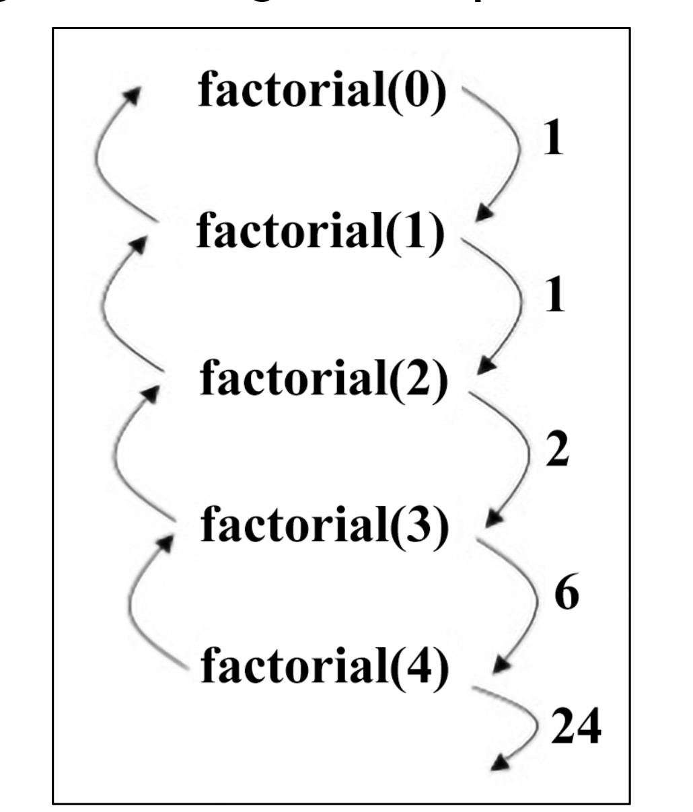

# **Understanding Recursion** 🔄✨

Recursion is a powerful technique in algorithm design where a function solves a problem by calling itself repeatedly. It breaks the problem into smaller pieces until a specific condition, called the **base case**, is met. This guide explains recursion in detail with examples, a flowchart breakdown, its pros and cons, and real-world applications—all in simple English! Let’s dive in! 🚀

---

## What is Recursion? 🤔

Recursion is like a loop, but instead of repeating a block of code, a function calls *itself* to solve a smaller version of the same problem. It keeps doing this until it reaches a point where the problem is so small that it can be solved directly—this is the **base case**. Without a proper base case, recursion can run forever and crash your program! 😱

### Key Parts of Recursion 🛠️

1. **Base Case** 🛑\
   This is the stopping condition. It tells the function when to stop calling itself and return a simple answer.

2. **Recursive Case** 🔄\
   This is where the function calls itself with a smaller input, moving closer to the base case with each call.

Each recursive call creates a new "layer" in memory (called a stack frame), and once the base case is reached, the function "unwinds" by returning values back up the stack to compute the final result.

---

## How Recursion Works: Factorial Example 🧮

Let’s look at a classic example: calculating the factorial of a number. The factorial of `n` (written as `n!`) is the product of all numbers from 1 to `n`. For example, `4! = 4 × 3 × 2 × 1 = 24`.

### Step-by-Step Breakdown 📝

**Problem**: Calculate `factorial(4)`.

- **Base Case**: If `n = 0`, return `1` (because `0! = 1` by definition).
- **Recursive Case**: If `n > 0`, return `n × factorial(n-1)`.

### How Recursion Works 🔍
<div align="center">
  
</div>

#### Flow of Execution 🌟

Here’s how the recursive calls happen:

1. **Call 1**: `factorial(4)`

   - Since `4 ≠ 0`, it computes `4 × factorial(3)` and calls `factorial(3)`.

2. **Call 2**: `factorial(3)`

   - Since `3 ≠ 0`, it computes `3 × factorial(2)` and calls `factorial(2)`.

3. **Call 3**: `factorial(2)`

   - Since `2 ≠ 0`, it computes `2 × factorial(1)` and calls `factorial(1)`.

4. **Call 4**: `factorial(1)`

   - Since `1 ≠ 0`, it computes `1 × factorial(0)` and calls `factorial(0)`.

5. **Call 5**: `factorial(0)`

   - This is the base case! Since `n = 0`, it returns `1`.

Now, the function starts "unwinding" (going back up the stack):

- `factorial(1)` = `1 × factorial(0)` = `1 × 1` = `1`
- `factorial(2)` = `2 × factorial(1)` = `2 × 1` = `2`
- `factorial(3)` = `3 × factorial(2)` = `3 × 2` = `6`
- `factorial(4)` = `4 × factorial(3)` = `4 × 6` = `24`

**Final Output**: `factorial(4)` = `24` 🎉

#### Flowchart Explanation 📊

The flowchart below shows this process visually:

- `factorial(0)` → Returns `1`
- `factorial(1)` → Returns `1`
- `factorial(2)` → Returns `2`
- `factorial(3)` → Returns `6`
- `factorial(4)` → Returns `24`

Each arrow represents a recursive call going down to the base case, and then the results are passed back up to compute the final answer.

---

## Another Example: Sum of First N Natural Numbers 🔢

Let’s explore another example to solidify your understanding.

**Problem**: Calculate the sum of the first `N` natural numbers. For `N = 5`, the sum is `1 + 2 + 3 + 4 + 5 = 15`.

### Python Code

```python
def sum(n):
    if n == 0:
        return 0
    else:
        return n + sum(n - 1)


print(sum(5))  # Output: 15
```

### Step-by-Step Breakdown 📝

- **Base Case**: If `n = 0`, return `0` (sum of zero numbers is zero).
- **Recursive Case**: If `n > 0`, return `n + sum(n-1)`.

#### Flow of Execution 🌟

For `sum(5)`:

1. **Call 1**: `sum(5)`

   - Computes `5 + sum(4)` and calls `sum(4)`.

2. **Call 2**: `sum(4)`

   - Computes `4 + sum(3)` and calls `sum(3)`.

3. **Call 3**: `sum(3)`

   - Computes `3 + sum(2)` and calls `sum(2)`.

4. **Call 4**: `sum(2)`

   - Computes `2 + sum(1)` and calls `sum(1)`.

5. **Call 5**: `sum(1)`

   - Computes `1 + sum(0)` and calls `sum(0)`.

6. **Call 6**: `sum(0)`

   - Base case! Returns `0`.

Now, unwind:

- `sum(1)` = `1 + sum(0)` = `1 + 0` = `1`
- `sum(2)` = `2 + sum(1)` = `2 + 1` = `3`
- `sum(3)` = `3 + sum(2)` = `3 + 3` = `6`
- `sum(4)` = `4 + sum(3)` = `4 + 6` = `10`
- `sum(5)` = `5 + sum(4)` = `5 + 10` = `15`

**Final Output**: Sum of first 5 natural numbers = `15` 🎉

### Real-World Use Case 🌍

**Financial Calculations**: Imagine calculating compound interest over several years. Each year’s interest depends on the previous year’s total. Recursion can compute each year’s amount by calling itself for the previous year until you reach the starting year (base case).

---

## Pros and Cons of Recursion ✅❌

### Pros 🌟

- **Simplifies Complex Problems**: Recursion makes hard problems (like tree traversal) easier to solve.
- **Clean Code**: The code is often shorter and more readable.
- **Natural Fit**: Perfect for problems with repeating structures, like factorials, trees, or graphs.

### Cons 🚨

- **Memory Usage**: Each recursive call adds a new layer to the memory stack, which can lead to high memory usage.
- **Stack Overflow Risk**: If the base case is missing or incorrect, the function may never stop, causing a crash.
- **Can Be Slow**: For very deep recursion, it might be slower than iterative solutions (loops).

---

## When to Use Recursion? 🤷‍♂️

Recursion is best for problems that can be broken into smaller, similar subproblems. Here are some cases where it shines:

- **Mathematical Problems**: Like factorials, Fibonacci numbers, or summing numbers.
- **Tree and Graph Traversal**: Exploring nested structures, like folders in a file system.
- **Divide-and-Conquer Algorithms**: Many algorithms, like merge sort, use recursion to split problems.

---

## Important Tip for Using Recursion 💡

Always ensure your recursion has:

1. **A Proper Base Case**: This prevents infinite loops and crashes.
2. **Progress Toward the Base Case**: Each recursive call should make the problem smaller, so you eventually reach the base case.

If you’re not careful, recursion can lead to errors like stack overflow, especially with large inputs.

---

## Why Learn Recursion? 🌟

Recursion is a key concept in algorithm design and computer science. It helps you think about problems in a new way and is the foundation for other techniques like Divide and Conquer. Understanding recursion also makes it easier to work with advanced data structures like trees and graphs, which are common in real-world applications.
