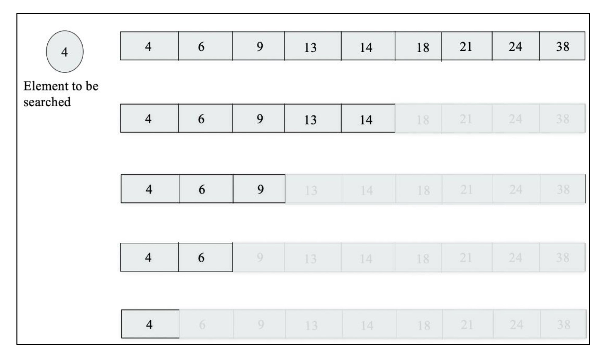
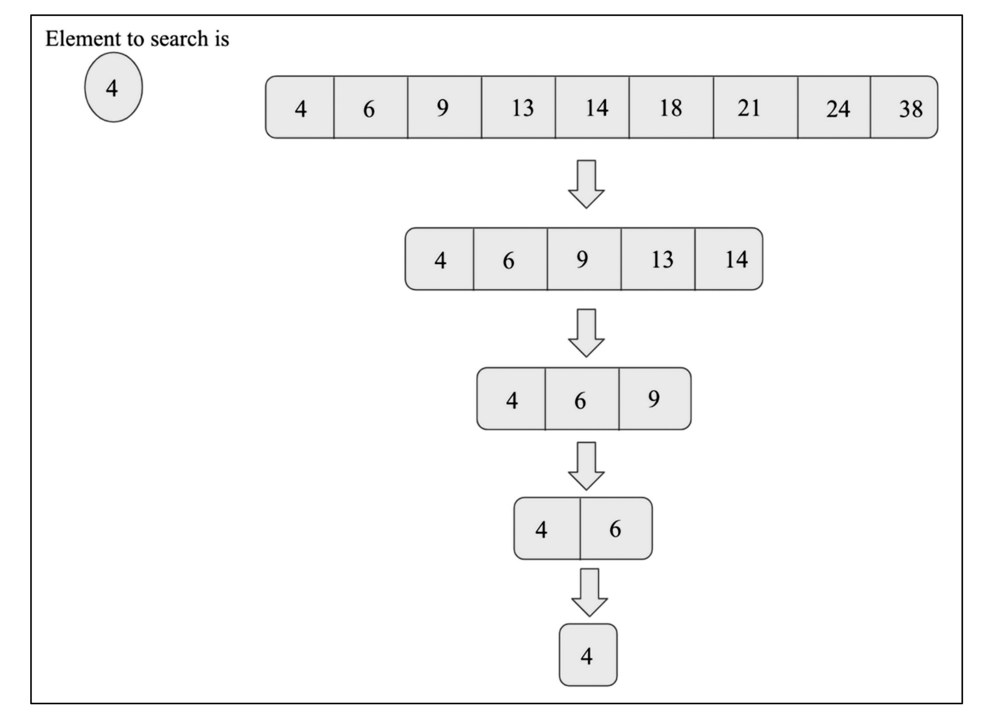
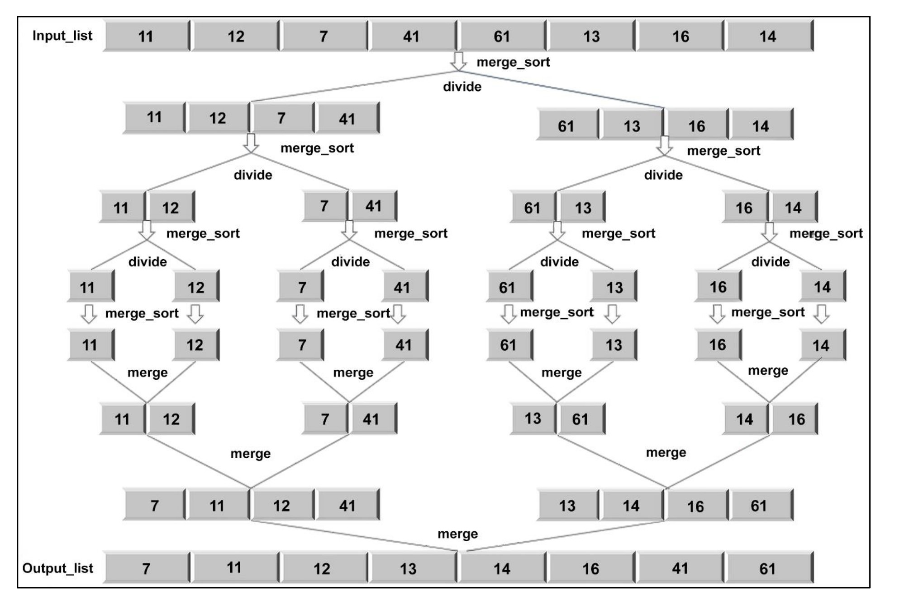
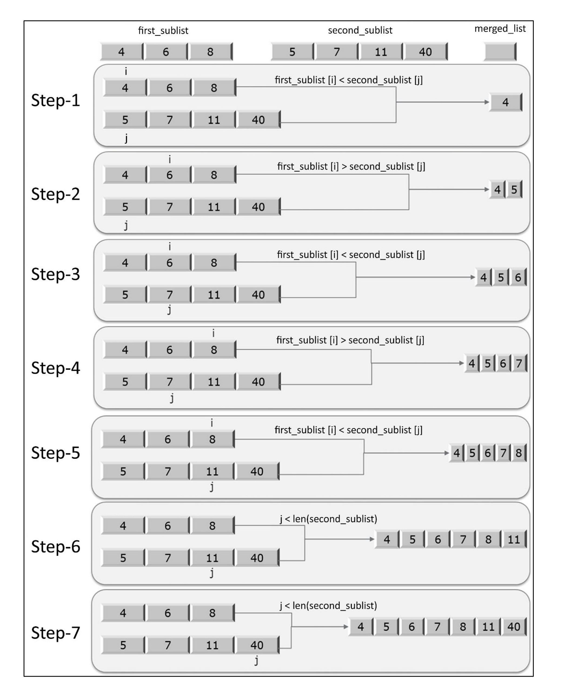

# **Divide and Conquer** 📊

One of the important and effective techniques for solving a complex problem is divide and conquer.The divide-and-conquer paradigm divides a problem into smaller sub-problems, and then solves these; finally, it combines the results to obtain a global, optimal solution. More specifically, in divide-and-conquer design, the problem is divided into two smaller sub-problems, with each of them being solved recursively. The partial solutions are merged to obtain a final solution. This is a very common problem-solving technique, and is, arguably, the most commonly used approach
in algorithm design.

---

## Table of Contents 📋
- [**Divide and Conquer** 📊](#divide-and-conquer-)
  - [Table of Contents 📋](#table-of-contents-)
  - [What is Divide and Conquer? ❓](#what-is-divide-and-conquer-)
  - [Binary Search 🔍](#binary-search-)
    - [Key Points:](#key-points)
  - [Visual Explanation with the Image 🖼️](#visual-explanation-with-the-image-️)
  - [Python Code Implementation 💻](#python-code-implementation-)
    - [Code Breakdown:](#code-breakdown)
    - [Output:](#output)
  - [Why is Binary Search Efficient? ⚡](#why-is-binary-search-efficient-)
  - [Merge Sort 🛠️](#merge-sort-️)
  - [**What is Merge Sort? 🌟**](#what-is-merge-sort-)
      - [**How Does Merge Sort Work? 🔧**](#how-does-merge-sort-work-)
      - [**Detailed Explanation of the First Image 🖼️**](#detailed-explanation-of-the-first-image-️)
      - [**Detailed Explanation of the Second Image (Merge Process) 🌈**](#detailed-explanation-of-the-second-image-merge-process-)
      - [**Understanding the Python Code 💻**](#understanding-the-python-code-)
      - [**Why is Merge Sort Efficient? ⚡**](#why-is-merge-sort-efficient-)
      - [**Example Dry Run with Steps 🌱**](#example-dry-run-with-steps-)
      - [**Conclusion 🎉**](#conclusion-)
  - [Quick Sort ⚡](#quick-sort-)
  - [Karatsuba Multiplication 🧮](#karatsuba-multiplication-)
  - [Strassen’s Matrix Multiplication 📊](#strassens-matrix-multiplication-)
  - [Conclusion 🎉](#conclusion--1)

---

## What is Divide and Conquer? ❓

Divide and Conquer is a problem-solving strategy that tackles large problems by:
1. **Dividing** the problem into smaller sub-problems.
2. **Conquering** each sub-problem recursively.
3. **Combining** the solutions to form the final answer.

This approach is widely used in algorithm design due to its efficiency and clarity. Examples include sorting, searching, and mathematical computations. Let’s dive into specific algorithms to see it in action! 🚀

---

## Binary Search 🔍

Binary Search is a **divide-and-conquer** algorithm used to search for an element in a **sorted list**. It works by repeatedly dividing the search space in half, making it much faster than a linear search. The time complexity of Binary Search is **O(log n)**, which means it scales logarithmically with the size of the list. 📈

### Key Points:
- The list **must be sorted** for Binary Search to work.
- It compares the target element with the middle element of the list.
- If the target is smaller, the right half is discarded; if larger, the left half is discarded.
- This process repeats until the element is found or the search space is exhausted.

## Visual Explanation with the Image 🖼️

<div align="center">
  
</div>

<div align="center">
  
</div>


The image illustrates the Binary Search process for finding the element **4** in the sorted list: `[4, 6, 9, 13, 14, 18, 21, 24, 38]`. Let's break it down step by step:

1. **Initial List**: `[4, 6, 9, 13, 14, 18, 21, 24, 38]`
   - Middle element: `14` (index 4).
   - Compare: `4 < 14`, so discard the right half (`[14, 18, 21, 24, 38]`).

2. **Updated List**: `[4, 6, 9, 13]`
   - Middle element: `6` (index 1).
   - Compare: `4 < 6`, so discard the right half (`[6, 9, 13]`).

3. **Updated List**: `[4]`
   - Middle element: `4` (index 0).
   - Compare: `4 == 4`, element found! 🎉

The image shows how the list shrinks with each step, eventually locating the element **4** at index 0.

## Python Code Implementation 💻

Here’s the Python code to perform a Binary Search on the given list:

```python
def binary_search(arr, start, end, key):
    while start <= end:
        mid = start + (end - start) // 2
        if arr[mid] == key:
            return mid
        elif arr[mid] < key:
            start = mid + 1
        else:
            end = mid - 1
    return -1

# Example usage
arr = [4, 6, 9, 13, 14, 18, 21, 24, 38]
x = 4
result = binary_search(arr, 0, len(arr)-1, x)
print(f"Element {x} found at index: {result} 🥳")
```

### Code Breakdown:
- **Function Definition**: `binary_search(arr, start, end, key)` takes the list (`arr`), starting index (`start`), ending index (`end`), and the element to search (`key`).
- **Middle Index Calculation**: `mid = start + (end - start) // 2` computes the middle index.
- **Comparison**:
  - If `arr[mid] == key`, return the index.
  - If `arr[mid] < key`, search the right half (`start = mid + 1`).
  - If `arr[mid] > key`, search the left half (`end = mid - 1`).
- **Not Found**: If the element isn’t found, return `-1`.

### Output:
For `x = 4`, the output is:
```
Element 4 found at index: 0 🥳
```

## Why is Binary Search Efficient? ⚡

Binary Search is highly efficient because it halves the search space in each iteration. For a list of size `n`, the worst-case time complexity is **O(log n)**. For example:
- For `n = 8`, it takes up to 4 searches.
- For `n = 16`, it takes up to 5 searches.

This logarithmic growth makes Binary Search ideal for large datasets! 🌟

---

## Merge Sort 🛠️

## **What is Merge Sort? 🌟**
Merge Sort is like a smart way to arrange a messy list of numbers from smallest to biggest (increasing order). It uses a trick called **divide-and-conquer**, which means we break the big problem into smaller pieces, solve them one by one, and then put everything back together in order. It’s super efficient, and its time complexity is **O(n log n)**, which means it works fast even with big lists! 📈

#### **How Does Merge Sort Work? 🔧**
Let’s take an example list: `[11, 12, 7, 41, 61, 13, 16, 14]` (just like in the first image). Here’s how Merge Sort does its magic step by step:

1. **Divide Step 🎨**:
   - First, we split the list into two almost equal parts.
   - We find the middle point: `mid = length of list // 2`.
   - For 8 elements, `mid = 8 // 2 = 4`.
   - So, the list becomes:
     - First half: `[11, 12, 7, 41]`
     - Second half: `[61, 13, 16, 14]`

2. **Recursive Divide 🔄**:
   - Now, we keep splitting each half into smaller parts until every small list has just one number.
   - `[11, 12, 7, 41]` splits into `[11, 12]` and `[7, 41]`.
   - `[61, 13, 16, 14]` splits into `[61, 13]` and `[16, 14]`.
   - Then, `[11, 12]` splits into `[11]` and `[12]`, and so on for all parts.

3. **Conquer/Merge Step 🤝**:
   - When each small list has only one number (which is already sorted because it’s just one!), we start combining them in order.
   - Combine `[11]` and `[12]` → `[11, 12]`.
   - Combine `[7]` and `[41]` → `[7, 41]`.
   - Then combine `[11, 12]` and `[7, 41]` → `[7, 11, 12, 41]`.
   - For the second half:
     - `[61, 13]` → `[13, 61]`
     - `[16, 14]` → `[14, 16]`
     - Then `[13, 61]` and `[14, 16]` → `[13, 14, 16, 61]`.
   - Finally, combine `[7, 11, 12, 41]` and `[13, 14, 16, 61]` → `[7, 11, 12, 13, 14, 16, 41, 61]`.

<div align="center">
  
</div>

#### **Detailed Explanation of the First Image 🖼️**
The first image shows the whole Merge Sort process like a tree:
- **Input List**: `[11, 12, 7, 41, 61, 13, 16, 14]`.
- **Divide Phase**: The list keeps splitting:
  - First into `[11, 12, 7, 41]` and `[61, 13, 16, 14]`.
  - Then into smaller pieces like `[11]`, `[12]`, `[7]`, `[41]`, and so on.
- **Merge Phase**: The small pieces come back together in order:
  - `[11]` and `[12]` make `[11, 12]`.
  - `[7]` and `[41]` make `[7, 41]`.
  - `[11, 12]` and `[7, 41]` make `[7, 11, 12, 41]`.
  - Same happens for the second half, and finally, everything merges into `[7, 11, 12, 13, 14, 16, 41, 61]`. 🎉

<div align="center">
  
</div>

#### **Detailed Explanation of the Second Image (Merge Process) 🌈**
The second image shows how two sorted lists, `[4, 6, 8]` and `[5, 7, 11, 40]`, are combined step by step:
- **Step 1**: Compare `4` and `5`. `4` is smaller, so add `4` → `[4]`.
- **Step 2**: Compare `6` and `5`. `5` is smaller, so add `5` → `[4, 5]`.
- **Step 3**: Compare `6` and `7`. `6` is smaller, so add `6` → `[4, 5, 6]`.
- **Step 4**: Compare `8` and `7`. `7` is smaller, so add `7` → `[4, 5, 6, 7]`.
- **Step 5**: Compare `8` and `11`. `8` is smaller, so add `8` → `[4, 5, 6, 7, 8]`.
- **Step 6**: The first list (`[4, 6, 8]`) is empty now, so add the rest `[11, 40]` → `[4, 5, 6, 7, 8, 11, 40]`.

This shows how the `merge` function works by picking the smallest number each time!

#### **Understanding the Python Code 💻**
Let’s break down the Python code for Merge Sort:

```python
def merge_sort(unsorted_list):
    if len(unsorted_list) == 1:
        return unsorted_list
    mid_point = len(unsorted_list) // 2
    first_half = unsorted_list[:mid_point]
    second_half = unsorted_list[mid_point:]
    half_a = merge_sort(first_half)
    half_b = merge_sort(second_half)
    return merge(half_a, half_b)

def merge(first_sublist, second_sublist):
    i = j = 0
    merged_list = []
    while i < len(first_sublist) and j < len(second_sublist):
        if first_sublist[i] < second_sublist[j]:
            merged_list.append(first_sublist[i])
            i += 1
        else:
            merged_list.append(second_sublist[j])
            j += 1
    while i < len(first_sublist):
        merged_list.append(first_sublist[i])
        i += 1
    while j < len(second_sublist):
        merged_list.append(second_sublist[j])
        j += 1
    return merged_list

# Example usage
a = [11, 12, 7, 41, 61, 13, 16, 14]
print("Sorted list:", merge_sort(a))
```

**Line-by-Line Explanation**:
1. **`merge_sort` Function**:
   - `if len(unsorted_list) == 1`: If the list has only one number, return it (this is the stopping point).
   - `mid_point = len(unsorted_list) // 2`: Find the middle to split the list.
   - `first_half = unsorted_list[:mid_point]`: Take the first half of the list.
   - `second_half = unsorted_list[mid_point:]`: Take the second half.
   - `half_a = merge_sort(first_half)` and `half_b = merge_sort(second_half)`: Recursively sort both halves.
   - `return merge(half_a, half_b)`: Combine the sorted halves using the `merge` function.

2. **`merge` Function**:
   - `i = j = 0`: Start pointers at the beginning of both sublists.
   - `merged_list = []`: Create an empty list to store the sorted result.
   - `while i < len(first_sublist) and j < len(second_sublist)`: While both lists have numbers:
     - `if first_sublist[i] < second_sublist[j]`: If the number from the first list is smaller, add it and move `i` forward.
     - `else`: If the number from the second list is smaller, add it and move `j` forward.
   - `while i < len(first_sublist)`: Add any leftover numbers from the first list.
   - `while j < len(second_sublist)`: Add any leftover numbers from the second list.
   - `return merged_list`: Return the final sorted list.

**Output**: `Sorted list: [7, 11, 12, 13, 14, 16, 41, 61]` 🥳

#### **Why is Merge Sort Efficient? ⚡**
Merge Sort is fast because:
- **Divide Step**: Finding the middle takes O(1) time (super quick!).
- **Recursive Divide**: Splitting the list happens log n times (O(log n)).
- **Merge Step**: Combining n numbers takes O(n) time.
- Total time: `O(n) * O(log n) = O(n log n)`, which is great for big lists! 🌟

#### **Example Dry Run with Steps 🌱**
Let’s merge `[4, 6, 8]` and `[5, 7, 11, 40]`:
- **Step 1**: `4 < 5`, add `4` → `[4]`.
- **Step 2**: `6 > 5`, add `5` → `[4, 5]`.
- **Step 3**: `6 < 7`, add `6` → `[4, 5, 6]`.
- **Step 4**: `8 > 7`, add `7` → `[4, 5, 6, 7]`.
- **Step 5**: `8 < 11`, add `8` → `[4, 5, 6, 7, 8]`.
- **Step 6**: First list is empty, add `[11, 40]` → `[4, 5, 6, 7, 8, 11, 40]`.

#### **Conclusion 🎉**
Merge Sort is an awesome way to sort lists with a steady **O(n log n)** time complexity. It breaks the problem into small pieces (divide), solves them (conquer), and puts them back together (merge), as shown in the images and code. Now you’re ready to use it—happy coding! 😄

---

## Quick Sort ⚡

---

## Karatsuba Multiplication 🧮

---

## Strassen’s Matrix Multiplication 📊

---

---

## Conclusion 🎉

The Divide and Conquer paradigm is a versatile and powerful approach to problem-solving, enabling efficient solutions for searching, sorting, multiplication, and geometric problems. By mastering algorithms like Binary Search, Merge Sort, Quick Sort, Karatsuba Multiplication, Strassen’s Matrix Multiplication, and Closest Pair of Points, you’ll gain a deep understanding of how to break down complex problems into manageable parts. Keep practicing, and you’ll be a Divide and Conquer pro in no time! 💪

