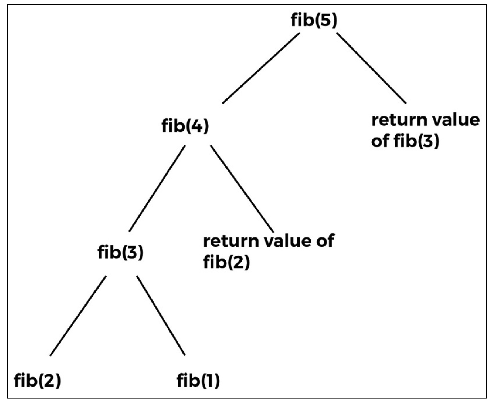

# **Dynamic Programming**

Dynamic programming (DP) is a powerful technique for solving **optimization problems** with multiple possible solutions. It builds on the intuition of the **divide-and-conquer** approach but is tailored for problems with **overlapping sub-problems**. Let’s dive into the world of DP and explore its mechanics, characteristics, and techniques with clear examples! 🌟

---

## What is Dynamic Programming? 🤔

Dynamic programming solves complex problems by:

- Breaking them into smaller **sub-problems**.
- Solving each sub-problem **only once** and storing its result.
- Combining sub-problem solutions to solve the larger problem.

Unlike **divide-and-conquer**, where sub-problems are **non-overlapping** (disjoint), DP handles **overlapping sub-problems** by reusing previously computed results. This avoids redundant calculations, making DP highly efficient for problems like the Fibonacci series or shortest path algorithms. 💡

### Key Difference: Divide-and-Conquer vs. Dynamic Programming ⚖️

- **Divide-and-Conquer**: Solves independent sub-problems (e.g., merge sort). Each sub-problem is computed separately.
- **Dynamic Programming**: Handles overlapping sub-problems by storing results to avoid recomputation.

---

## Characteristics of Dynamic Programming Problems 🧩

For a problem to be solvable with DP, it must exhibit these two properties:

1. **Optimal Substructure** ✅

   - The optimal solution to the problem can be constructed from the optimal solutions of its sub-problems.
   - **Example**: In the Fibonacci series, `fib(6)` is computed as `fib(5) + fib(4)`, showing that the solution depends on smaller sub-problems.

2. **Overlapping Sub-Problems** 🔄

   - The same sub-problems are solved multiple times during computation.
   - **Example**: Calculating `fib(5)` involves repeatedly computing `fib(3)` and `fib(2)`. DP stores these results to avoid redundant work.

When a problem has these characteristics, DP can significantly improve efficiency by reusing stored solutions. 

---

## Dynamic Programming vs. Recursion 🔍

Both recursion and DP break problems into sub-problems, but they differ in how they handle computation:

- **Recursion**: Solves sub-problems repeatedly, even if they’ve been computed before. This can lead to high time complexity (e.g., O(2^n) for Fibonacci).
- **Dynamic Programming**: Solves each sub-problem **once** and stores the result, ensuring no recomputation. This reduces time complexity (e.g., O(n) for Fibonacci).

By tracking previously solved sub-problems, DP eliminates the inefficiency of redundant calculations. 🛠️

---

## Dynamic Programming Approaches 🛤️

DP problems can be solved using two main strategies:

### 1. Top-Down with Memoization 📝

- **How it works**:
  - Start with the original problem and recursively break it into smaller sub-problems.
  - Store the solution to each sub-problem in a data structure (e.g., array or hash table).
  - When a sub-problem is encountered again, retrieve its precomputed result instead of recalculating.
- **Memoization**: The process of storing sub-problem solutions to "remember" them for future use.
- **Advantages**:
  - Intuitive, as it follows the recursive structure of the problem.
  - Efficient for problems with many overlapping sub-problems.
- **Example**: Fibonacci series with memoization.

### 2. Bottom-Up Approach 🏗️

- **How it works**:
  - Solve the smallest sub-problems first and use their solutions to build solutions for larger sub-problems.
  - Store results in a table (e.g., array) and iterate until the final problem is solved.
  - Each sub-problem is solved only once, and prerequisite solutions are always available.
- **Advantages**:
  - Iterative, so it avoids recursive stack overhead.
  - Often more space-efficient for some problems.
- **Example**: Fibonacci series using a table.

---


### **Calculating the Fibonacci series**
The Fibonacci series is a sequence of numbers where each number is the sum of the two preceding ones, starting with a base case. The sequence typically starts as:

- **F(0) = 1**
- **F(1) = 1**
- **F(n) = F(n-1) + F(n-2) for n > 1**

So, if we calculate the first few terms:
- F(0) = 1
- F(1) = 1
- F(2) = F(1) + F(0) = 1 + 1 = 2
- F(3) = F(2) + F(1) = 2 + 1 = 3
- F(4) = F(3) + F(2) = 3 + 2 = 5
- F(5) = F(4) + F(3) = 5 + 3 = 8

The sequence is: **1, 1, 2, 3, 5, 8, ...**

However, in the problem statement, the output for the dynamic programming implementation starts with 0 for F(0), which suggests a slight variation in the base case for that implementation. We’ll address that when we get to the dynamic programming code.

---

### **Recursive Approach to Calculate Fibonacci**
The problem provides a recursive implementation to calculate Fibonacci numbers. Let’s break down the code:

```python
def fib(n):
    if n <= 1:
        return 1
    else:
        return fib(n-1) + fib(n-2)

for i in range(5):
    print(fib(i))
```

#### **How the Code Works**
- **Base Case**: If `n <= 1` (i.e., n is 0 or 1), the function returns 1. This matches the Fibonacci definition given in the problem: `func(0) = 1`, `func(1) = 1`.
- **Recursive Case**: For `n > 1`, the function calls itself with `fib(n-1)` and `fib(n-2)` and returns their sum.
- **Loop**: The `for` loop runs from `i = 0` to `i = 4` (since `range(5)` gives 0, 1, 2, 3, 4), printing `fib(0)`, `fib(1)`, ..., `fib(4)`.

#### **Output**
- `fib(0)` = 1 (base case)
- `fib(1)` = 1 (base case)
- `fib(2)` = `fib(1)` + `fib(0)` = 1 + 1 = 2
- `fib(3)` = `fib(2)` + `fib(1)` = 2 + 1 = 3
- `fib(4)` = `fib(3)` + `fib(2)` = 3 + 2 = 5

The output is: **1, 1, 2, 3, 5**, which matches the problem’s expected output.

#### **Problem with Recursion: Overlapping Sub-Problems**
The recursive approach, while simple, is inefficient because it recalculates the same values multiple times. For example, to compute `fib(5)`, it needs `fib(4)` and `fib(3)`. Then, `fib(4)` needs `fib(3)` and `fib(2)`, and `fib(3)` needs `fib(2)` and `fib(1)`. Notice that `fib(3)` and `fib(2)` are computed multiple times. This redundancy is what the recursion trees in the images illustrate.

---

<div align="center">
  
</div>


### **Explanation of the Images**

#### **Figure 3.5: Recursion Tree for fib(5)**
This image shows the full recursion tree for calculating `fib(5)` using the recursive approach.

- **Root Node**: `fib(5)`
- **First Level**: `fib(5)` splits into `fib(4)` and `fib(3)`.
- **Second Level**:
  - `fib(4)` splits into `fib(3)` and `fib(2)`.
  - `fib(3)` splits into `fib(2)` and `fib(1)`.
- **Third Level**:
  - From `fib(4)`’s branch: `fib(3)` splits into `fib(2)` and `fib(1)`, and `fib(2)` is a leaf node (we’ll assume it’s computed).
  - From `fib(3)`’s branch: `fib(2)` and `fib(1)` are leaf nodes.
- **Leaf Nodes**: The recursion stops at `fib(2)` and `fib(1)` because they are base cases (`n <= 1`).

The tree looks like this:
```
         fib(5)
        /      \
     fib(4)    fib(3)
     /    \    /    \
  fib(3) fib(2) fib(2) fib(1)
  /    \
fib(2) fib(1)
```

**Key Observation**: There’s no highlighting of overlapping sub-problems here. This figure simply shows the structure of the recursive calls.

<div align="center">
  
</div>

#### **Figure 3.6: Overlapping Sub-Problems in the Recursion Tree for fib(5)**
This figure is the same recursion tree as Figure 3.5, but it highlights the overlapping sub-problems by shading the nodes that are computed multiple times.

- **Shaded Nodes**:
  - `fib(3)` appears twice: once under `fib(4)` and once directly under `fib(5)`.
  - `fib(2)` appears three times: under `fib(4)`, under the first `fib(3)`, and under the second `fib(3)`.
  - `fib(1)` appears twice: under the first `fib(3)` and directly under `fib(5)`.

**What This Means**: The recursive approach wastes time by recomputing `fib(3)`, `fib(2)`, and `fib(1)` multiple times. For example:
- `fib(3)` is computed once for `fib(5)` and again for `fib(4)`.
- `fib(2)` is computed three times across the tree.

This inefficiency is why the recursive approach has a high time complexity, which we’ll discuss later.

<div align="center">
  
</div>


#### **Figure 3.7: Recursion Tree for fib(5) Showing Re-Use of Already Computed Values**
This figure illustrates how dynamic programming (using memoization) avoids recomputing overlapping sub-problems. The tree is the same, but it includes annotations to show that once a value is computed, it’s reused.

- **Annotations**:
  - The right `fib(3)` (under `fib(5)`) has a note: “return value of fib(3)”. This means that instead of recomputing `fib(3)`, we use the value already computed from the left branch (under `fib(4)`).
  - The right `fib(2)` (under the second `fib(3)`) has a note: “return value of fib(2)”. This means we reuse the value of `fib(2)` that was already computed earlier in the tree.

**What This Means**: In dynamic programming, we store the results of `fib(3)`, `fib(2)`, and `fib(1)` the first time they’re computed. When we encounter them again, we simply return the stored value instead of recomputing. This is the essence of **memoization**.

---

### **Dynamic Programming Approach (Memoization)**
The problem introduces a dynamic programming solution to avoid the inefficiency of the recursive approach. Let’s break down the code:

```python
def dyna_fib(n):
    if n == 0:
        return 0
    if n == 1:
        return 1
    if lookup[n] is not None:
        return lookup[n]

    lookup[n] = dyna_fib(n-1) + dyna_fib(n-2)
    return lookup[n]

lookup = [None]*(1000)
for i in range(6):
    print(dyna_fib(i))
```

#### **How the Code Works**
- **Global Lookup Table**: `lookup = [None]*(1000)` creates a list of 1000 elements, all initialized to `None`. This will store the Fibonacci numbers as they’re computed.
- **Base Cases**:
  - If `n == 0`, return 0.
  - If `n == 1`, return 1.
  - **Note**: This is different from the recursive approach, where `fib(0)` returned 1. This explains why the output for the dynamic programming approach starts with 0 instead of 1.
- **Memoization Check**: `if lookup[n] is not None`, check if `fib(n)` has already been computed. If yes, return the stored value from `lookup[n]`.
- **Recursive Case with Storage**: If `fib(n)` hasn’t been computed, calculate it as `dyna_fib(n-1) + dyna_fib(n-2)`, store the result in `lookup[n]`, and return it.
- **Loop**: The `for` loop runs from `i = 0` to `i = 5` (since `range(6)` gives 0, 1, 2, 3, 4, 5), printing `dyna_fib(0)`, ..., `dyna_fib(5)`.

#### **Output**
- `dyna_fib(0)` = 0 (base case)
- `dyna_fib(1)` = 1 (base case)
- `dyna_fib(2)` = `dyna_fib(1)` + `dyna_fib(0)` = 1 + 0 = 1
- `dyna_fib(3)` = `dyna_fib(2)` + `dyna_fib(1)` = 1 + 1 = 2
- `dyna_fib(4)` = `dyna_fib(3)` + `dyna_fib(2)` = 2 + 1 = 3
- `dyna_fib(5)` = `dyna_fib(4)` + `dyna_fib(3)` = 3 + 2 = 5

The output is: **0, 1, 1, 2, 3, 5**.

**Why the Difference in Output?**
- The recursive approach used `fib(0) = 1`, so its sequence started as 1, 1, 2, 3, 5.
- The dynamic programming approach used `dyna_fib(0) = 0`, so its sequence starts as 0, 1, 1, 2, 3, 5. This is a common variation in Fibonacci definitions—some start with 0, 1, while others start with 1, 1.

#### **How Memoization Helps**
- When `dyna_fib(3)` is computed the first time (under `dyna_fib(4)`), its value (2) is stored in `lookup[3]`.
- When `dyna_fib(3)` is needed again (directly under `dyna_fib(5)`), the code sees that `lookup[3]` is not `None` and returns 2 without recomputing.
- Similarly, `dyna_fib(2)` and `dyna_fib(1)` are computed once and reused.

This eliminates the redundant computations seen in the recursive approach, as shown in Figure 3.7.

---

### **Time Complexity Analysis**
#### **Recursive Approach**
- In the recursive approach, each call to `fib(n)` splits into two calls: `fib(n-1)` and `fib(n-2)`.
- This forms a binary tree of calls, where the depth of the tree is `n`.
- The total number of calls is approximately **O(2^n)** (exponential time complexity).

For example, for `n = 5`, the recursion tree (Figure 3.5) has many nodes because of overlapping sub-problems. The total number of nodes grows exponentially.

#### **Dynamic Programming Approach**
- In the dynamic programming approach, each Fibonacci number from `fib(0)` to `fib(n)` is computed exactly once.
- The `lookup` table ensures that we don’t recompute values.
- We compute `n + 1` values (from 0 to n), and each computation takes constant time (just one addition).
- The total time complexity is **O(n)** (linear time complexity), which is a massive improvement over the recursive approach.

#### **Space Complexity**
- The dynamic programming approach uses the `lookup` table, which has 1000 elements in this case. For `fib(n)`, we only need `n + 1` elements, so the space complexity is **O(n)**.
- The recursive approach uses the call stack for recursion, which can go up to a depth of `n`, so its space complexity is also **O(n)** (but it does a lot more work in that space).

---

### **Summary of Key Points**
1. **Fibonacci Definition**:
   - Recursive approach: `fib(0) = 1`, `fib(1) = 1`, output starts as 1, 1, 2, 3, 5.
   - Dynamic approach: `dyna_fib(0) = 0`, `dyna_fib(1) = 1`, output starts as 0, 1, 1, 2, 3, 5.
2. **Recursive Approach**:
   - Simple but inefficient due to overlapping sub-problems.
   - Time complexity: O(2^n).
   - Recursion tree (Figure 3.5) shows the full structure of calls.
   - Figure 3.6 highlights the overlaps: `fib(3)` (twice), `fib(2)` (three times), `fib(1)` (twice).
3. **Dynamic Programming (Memoization)**:
   - Stores results in a `lookup` table to avoid recomputation.
   - Time complexity: O(n).
   - Figure 3.7 shows how values are reused instead of recomputed.
4. **Improvement**:
   - Dynamic programming reduces the time complexity from exponential to linear, making it much more efficient for large `n`.

---

### **Final Thoughts**
The images and code together illustrate a classic computer science problem: optimizing a recursive algorithm using dynamic programming. The recursion trees visually demonstrate the inefficiency of the naive recursive approach (overlapping sub-problems) and how memoization solves this by storing and reusing results. This is a fundamental concept in algorithm design, often used to introduce dynamic programming.