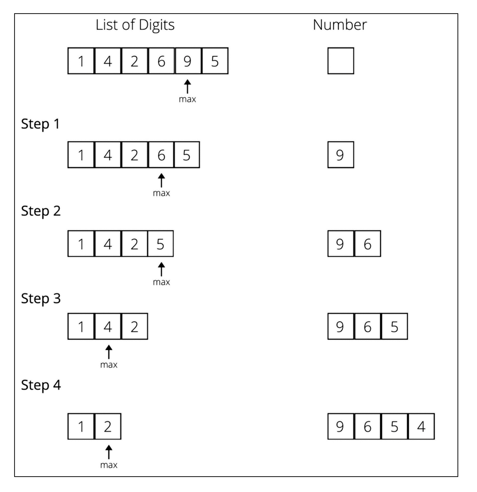
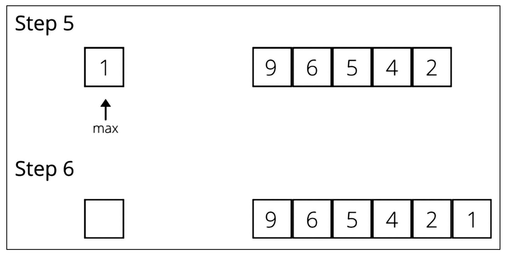

# 🧩 **What Are Greedy Algorithms?**
Greedy algorithms are a method used to solve optimization problems (finding the best solution) and combinatorial problems (choosing the best option from many possibilities). In this approach, at each step, we make the decision that seems best at that moment (local optimum), hoping it will lead us to the overall best solution (global optimum). However, it is not always guaranteed that the greedy approach will give the optimal solution, but it does provide a feasible and simple solution.

## 🔢 Example 1: Forming the Largest Number
Let's look at the first example you provided, where we are given some digits (1, 4, 2, 6, 9, 5), and we need to form the largest number using all the digits without repeating any. According to the greedy approach, at each step, we select the largest digit and add it to our number, then remove that digit from the list. This process continues until the list is empty. The images show this process step-by-step:

<div align="center">
  
  
</div>

### 📝 Step-by-Step Process:
1. **Step 1:** List of digits: [1, 4, 2, 6, 9, 5]
   - Choose the largest digit: 9 (because 9 is the biggest).
   - Add 9 to the number: Number = 9
   - Remove 9 from the list: List = [1, 4, 2, 6, 5]

2. **Step 2:** List of digits: [1, 4, 2, 6, 5]
   - Choose the largest digit: 6
   - Add 6 to the number: Number = 9, 6 (i.e., 96)
   - Remove 6 from the list: List = [1, 4, 2, 5]

3. **Step 3:** List of digits: [1, 4, 2, 5]
   - Choose the largest digit: 5
   - Add 5 to the number: Number = 9, 6, 5 (i.e., 965)
   - Remove 5 from the list: List = [1, 4, 2]

4. **Step 4:** List of digits: [1, 4, 2]
   - Choose the largest digit: 4
   - Add 4 to the number: Number = 9, 6, 5, 4 (i.e., 9654)
   - Remove 4 from the list: List = [1, 2]

5. **Step 5:** List of digits: [1, 2]
   - Choose the largest digit: 2
   - Add 2 to the number: Number = 9, 6, 5, 4, 2 (i.e., 96542)
   - Remove 2 from the list: List = [1]

6. **Step 6:** List of digits: [1]
   - Choose the largest digit: 1
   - Add 1 to the number: Number = 9, 6, 5, 4, 2, 1 (i.e., 965421)
   - Remove 1 from the list: List = []

Now the list is empty, and our final number is **965421**, formed by choosing the largest digit at each step. This is a perfect example of the greedy approach, where we selected the local optimum (largest digit) at every step, leading us to the global optimum (largest number).

## 💵 Example 2: Giving Amount with Minimum Notes
The second example involves giving 29 Indian rupees using the minimum number of notes, giving one note at a time without exceeding the owed amount. The available notes are in denominations of 1, 2, 5, 10, 20, and 50. According to the greedy approach, at each step, we choose the largest note that is less than or equal to the remaining amount.

### 📝 Step-by-Step Process:
1. Total amount = 29 rupees
   - Choose the largest note less than or equal to 29: 20
   - Give a 20-rupee note, remaining amount = 29 - 20 = 9 rupees

2. Remaining amount = 9 rupees
   - Choose the largest note less than or equal to 9: 5
   - Give a 5-rupee note, remaining amount = 9 - 5 = 4 rupees

3. Remaining amount = 4 rupees
   - Choose the largest note less than or equal to 4: 2
   - Give a 2-rupee note, remaining amount = 4 - 2 = 2 rupees

4. Remaining amount = 2 rupees
   - Choose the largest note less than or equal to 2: 2
   - Give a 2-rupee note, remaining amount = 2 - 2 = 0 rupees

So, we used a total of 4 notes: 20, 5, 2, and 2. However, when the denominations change (e.g., 1, 14, 25), the greedy approach doesn't always give the best solution. For example, to give 29 rupees with notes of 1, 14, and 25:
- Greedy approach: Give a 25-rupee note, remaining = 29 - 25 = 4, then give four 1-rupee notes. Total = 5 notes.
- Better solution: Give notes of 14, 14, and 1. Total = 3 notes.

This shows that the greedy approach doesn't always provide the optimal solution, but it does give a feasible and simple one.

### 🚀 Applications of Greedy Algorithms
Greedy algorithms are used in many problems, such as:
- **🌳 Kruskal's Minimum Spanning Tree:** To create a minimum-weight tree in a graph.
- **🛣️ Dijkstra's Shortest Path Problem:** To find the shortest path from one node to another in a graph.
- **🎒 Knapsack Problem:** To maximize the value of items placed in a bag with limited capacity.
- **🔄 Prim's Minimal Spanning Tree Algorithm:** Another method to create a minimum spanning tree in a graph.
- **🚗 Traveling Salesperson Problem:** To find the shortest route to visit all cities.

---

## What Is the Shortest Path Problem? 🛤️
The shortest path problem is about finding the shortest route between two nodes in a graph. 📍 A graph has nodes (vertices) and edges (lines connecting them), and each edge has a weight representing distance or cost. Dijkstra’s algorithm is a famous greedy algorithm that solves this problem. 🧠 It finds the shortest path from a source node to all other nodes in a weighted directed or undirected graph.

### How Dijkstra’s Algorithm Works 🔍
Dijkstra’s algorithm uses a greedy approach, meaning at each step it picks the node with the smallest distance from the source. Here are the steps:
1. **Initial Setup:** Mark all nodes as unvisited and set their distance from the source node to infinity (source node’s distance is 0). 📊
2. **Choose Source Node:** Set the source node as the current node. 🏁
3. **Check Adjacent Nodes:** For the current node’s unvisited adjacent nodes:
   - Calculate the distance from the source to these nodes through the current node. 🧮
   - If this new distance is smaller than the previous distance, update it. ✅
4. **Mark as Visited:** Mark the current node as visited. ✔️
5. **Check for Completion:** If the destination node is visited or all unvisited nodes are done, the algorithm stops. 🏁
6. **Pick Next Node:** Choose the unvisited node with the smallest distance from the source and repeat from step 2. 🔄

### Graph Structure 🌟
We have a graph with 6 nodes: A, B, C, D, E, and F. This graph is weighted, and the edge weights are (from Figure 3.9):
- A to B: 5
- A to D: 9
- A to E: 2
- B to C: 2
- C to D: 3
- D to F: 2
- E to F: 3

This graph is represented as an adjacency list:
```
graph = {
    'A': {'B': 5, 'D': 9, 'E': 2},
    'B': {'A': 5, 'C': 2},
    'C': {'B': 2, 'D': 3},
    'D': {'A': 9, 'F': 2, 'C': 3},
    'E': {'A': 2, 'F': 3},
    'F': {'E': 3, 'D': 2}
}
```

### Initial Table Setup 📋
Before starting the algorithm, we create a table to track the shortest distance from the source (A) and the previous node for each node. Initially, it looks like this (Table 3.2):
| Node | Shortest Distance from Source | Previous Node |
|------|------------------------------|---------------|
| A    | 0                            | None          |
| B    | ∞                            | None          |
| C    | ∞                            | None          |
| D    | ∞                            | None          |
| E    | ∞                            | None          |
| F    | ∞                            | None          |

Here, A is the source node, so its distance is 0, and all other nodes’ distances are set to infinity because we don’t yet know the shortest path to them. 🌌

### Step-by-Step Dijkstra’s Algorithm 🚶‍♂️
Now, let’s apply Dijkstra’s algorithm step-by-step and update the table and graph at each step. This process is shown in Figures 3.10 to 3.16.

#### Step 1: Start with Node A (Figures 3.10 and 3.11) 🟢
- **Current Node:** A
- **Adjacent Nodes:** A’s adjacent nodes are B, D, and E.
- **Calculate Distances:** 🧮
  - A to B: Distance = 0 (A’s distance) + 5 (A to B weight) = 5
  - A to D: Distance = 0 + 9 = 9
  - A to E: Distance = 0 + 2 = 2
- **Update Table:** Compare these distances with the previous ones (infinity). They’re all smaller, so update:
  - B: ∞ to 5
  - D: ∞ to 9
  - E: ∞ to 2
  - Also update the previous node (A for all since we came directly from A).
- **Mark A as Visited:** Mark A as visited (shown in blue in Figure 3.11). ✔️

**Updated Table (Table 3.3):**
| Node | Shortest Distance from Source | Previous Node |
|------|------------------------------|---------------|
| A*   | 0                            | None          |
| B    | 5                            | A             |
| C    | ∞                            | None          |
| D    | 9                            | A             |
| E    | 2                            | A             |
| F    | ∞                            | None          |

#### Step 2: Choose Node E (Figure 3.12) 🔵
- **Pick Next Node:** Look at the table for unvisited nodes (B, C, D, E, F). E has the smallest distance of 2. 🌟
- **Current Node:** E
- **Adjacent Nodes:** E’s adjacent nodes are A and F. A is already visited, so only look at F.
- **Calculate Distances:**
  - E to F: Distance = 2 (E’s distance from A) + 3 (E to F weight) = 5
- **Update Table:** F’s previous distance was infinity, 5 is smaller, so update:
  - F: ∞ to 5
  - Previous node: E
- **Mark E as Visited:** Mark E as visited (shown in blue). ✔️

**Updated Table (Table 3.4):**
| Node | Shortest Distance from Source | Previous Node |
|------|------------------------------|---------------|
| A*   | 0                            | None          |
| B    | 5                            | A             |
| C    | ∞                            | None          |
| D    | 9                            | A             |
| E*   | 2                            | A             |
| F    | 5                            | E             |

#### Step 3: Choose Node B (Figure 3.13) 🟣
- **Pick Next Node:** From unvisited nodes (B, C, D, F), B and F both have a distance of 5, but alphabetically B comes first, so choose B. 📖
- **Current Node:** B
- **Adjacent Nodes:** B’s adjacent nodes are A and C. A is visited, so only look at C.
- **Calculate Distances:**
  - B to C: Distance = 5 (B’s distance from A) + 2 (B to C weight) = 7
- **Update Table:** C’s previous distance was infinity, 7 is smaller, so update:
  - C: ∞ to 7
  - Previous node: B
- **Mark B as Visited:** Mark B as visited. ✔️

**Updated Table (Table 3.5):**
| Node | Shortest Distance from Source | Previous Node |
|------|------------------------------|---------------|
| A*   | 0                            | None          |
| B*   | 5                            | A             |
| C    | 7                            | B             |
| D    | 9                            | A             |
| E*   | 2                            | A             |
| F    | 5                            | E             |

#### Step 4: Choose Node F (Figure 3.14) 🔴
- **Pick Next Node:** From unvisited nodes (C, D, F), F has the smallest distance of 5 (C and D have 7 and 9). 🌟
- **Current Node:** F
- **Adjacent Nodes:** F’s adjacent nodes are E and D. E is visited, so only look at D.
- **Calculate Distances:**
  - F to D: Distance = 5 (F’s distance from A) + 2 (F to D weight) = 7
- **Update Table:** D’s previous distance was 9, 7 is smaller, so update:
  - D: 9 to 7
  - Previous node: F (was A before, now F because this path is shorter)
- **Mark F as Visited:** Mark F as visited. ✔️

**Updated Table (Table 3.6):**
| Node | Shortest Distance from Source | Previous Node |
|------|------------------------------|---------------|
| A*   | 0                            | None          |
| B*   | 5                            | A             |
| C    | 7                            | B             |
| D    | 7                            | F             |
| E*   | 2                            | A             |
| F*   | 5                            | E             |

#### Step 5: Choose Node C (Figure 3.15) 🟠
- **Pick Next Node:** From unvisited nodes (C, D), both have a distance of 7, but alphabetically C comes first, so choose C. 📖
- **Current Node:** C
- **Adjacent Nodes:** C’s adjacent nodes are B and D. Both are visited (B was already visited, and D is now visited), so no updates needed.
- **Mark C as Visited:** Mark C as visited. ✔️

**Table Remains Unchanged:**
| Node | Shortest Distance from Source | Previous Node |
|------|------------------------------|---------------|
| A*   | 0                            | None          |
| B*   | 5                            | A             |
| C*   | 7                            | B             |
| D    | 7                            | F             |
| E*   | 2                            | A             |
| F*   | 5                            | E             |

#### Step 6: Choose Node D (Figure 3.16) 🟡
- **Pick Next Node:** Only D is unvisited now.
- **Current Node:** D
- **Adjacent Nodes:** D’s adjacent nodes are A, C, and F. All are visited, so no updates needed.
- **Mark D as Visited:** Mark D as visited. ✔️

**Final Table (Table 3.7):**
| Node | Shortest Distance from Source | Previous Node |
|------|------------------------------|---------------|
| A*   | 0                            | None          |
| B*   | 5                            | A             |
| C*   | 7                            | B             |
| D*   | 7                            | F             |
| E*   | 2                            | A             |
| F*   | 5                            | E             |

### Verification ✅
Let’s verify if the table is correct:
- **Shortest Path from A to F:** The table says F’s distance is 5, and the path is A → E → F. 🛤️
  - A to E: 2
  - E to F: 3
  - Total: 2 + 3 = 5 (Matches the table). 🎉
- **Shortest Path from A to D:** The table says D’s distance is 7, and the path is A → E → F → D.
  - A to E: 2
  - E to F: 3
  - F to D: 2
  - Total: 2 + 3 + 2 = 7 (Matches the table). 🎉

This confirms the algorithm worked correctly. The direct path from A to D was 9, but A → E → F → D is 7, which is shorter. 🚀

### Python Code Explanation 💻
Now let’s understand the Python implementation of Dijkstra’s algorithm.

#### Initial Table Setup in Code 📋
The table is created as a dictionary:
```
table = {
    'A': [0, None],
    'B': [float("inf"), None],
    'C': [float("inf"), None],
    'D': [float("inf"), None],
    'E': [float("inf"), None],
    'F': [float("inf"), None],
}
```
- Each node maps to a list with two items: [distance, previous_node].
- Distance is initially infinity, except for A, which is 0. 🌟

#### Helper Functions 🛠️
The algorithm uses some helper functions:
1. **get_shortest_distance:** Returns the shortest distance of a node from the table.
   ```
   def get_shortest_distance(table, vertex):
       shortest_distance = table[vertex][DISTANCE]
       return shortest_distance
   ```
2. **set_shortest_distance:** Updates the shortest distance in the table.
   ```
   def set_shortest_distance(table, vertex, new_distance):
       table[vertex][DISTANCE] = new_distance
   ```
3. **set_previous_node:** Updates the previous node.
   ```
   def set_previous_node(table, vertex, previous_node):
       table[vertex][PREVIOUS_NODE] = previous_node
   ```
4. **get_distance:** Returns the distance between two nodes from the graph.
   ```
   def get_distance(graph, first_vertex, second_vertex):
       return graph[first_vertex][second_vertex]
   ```
5. **get_next_node:** Picks the unvisited node with the smallest distance.
   ```
   def get_next_node(table, visited_nodes):
       unvisited_nodes = list(set(table.keys()).difference(set(visited_nodes)))
       assumed_min = table[unvisited_nodes[0]][DISTANCE]
       min_vertex = unvisited_nodes[0]
       for node in unvisited_nodes:
           if table[node][DISTANCE] < assumed_min:
               assumed_min = table[node][DISTANCE]
               min_vertex = node
       return min_vertex
   ```

#### Main Function: find_shortest_path 🏆
This is the main function that implements Dijkstra’s algorithm:
```
def find_shortest_path(graph, table, origin):
    visited_nodes = []
    current_node = origin
    starting_node = origin
    while True:
        adjacent_nodes = graph[current_node]
        if set(adjacent_nodes).issubset(set(visited_nodes)):
            pass
        else:
            unvisited_nodes = set(adjacent_nodes).difference(set(visited_nodes))
            for vertex in unvisited_nodes:
                distance_from_starting_node = get_shortest_distance(table, vertex)
                if distance_from_starting_node == INFINITY and current_node == starting_node:
                    total_distance = get_distance(graph, vertex, current_node)
                else:
                    total_distance = get_shortest_distance(table, current_node) + get_distance(graph, current_node, vertex)
                if total_distance < distance_from_starting_node:
                    set_shortest_distance(table, vertex, total_distance)
                    set_previous_node(table, vertex, current_node)
        visited_nodes.append(current_node)
        if len(visited_nodes) == len(table.keys()):
            break
        current_node = get_next_node(table, visited_nodes)
    return table
```
- **How It Works:**
  - The function takes the graph, table, and starting node (A) as inputs. 📝
  - A while loop runs, checking the current node’s adjacent nodes at each step. 🔄
  - If an adjacent node is unvisited, it calculates its distance and updates the table if the new distance is smaller. ✅
  - Marks the current node as visited. ✔️
  - When all nodes are visited, the loop ends and returns the table. 🏁

#### Output 🎉
After running the code, the output is:
```
A - [0, None]
B - [5, 'A']
C - [7, 'B']
D - [7, 'F']
E - [2, 'A']
F - [5, 'E']
```
This matches our final table (Table 3.7). 🎊

### Time Complexity ⏳
The time complexity of Dijkstra’s algorithm depends on how vertices are stored and retrieved:
- **With an Array:** If vertices are stored in an array, each operation takes O(V) time, and the total time complexity is O(V²). 📊
- **With a Fibonacci Heap:** If a min-priority queue is implemented using a Fibonacci heap, the time complexity is O(|E| + |V|log|V|), where |V| is the number of vertices and |E| is the number of edges. 🚀

### Conclusion 🌟
Dijkstra’s algorithm showed us the shortest paths from source node A to all other nodes. In this example, we saw that the direct path from A to D was 9, but A → E → F → D was 7, which is shorter. 🛤️ This algorithm uses a greedy approach, picking the shortest path at each step, and in the end, it gives us the correct shortest paths. If you have any more questions or want to dive deeper into any step, let me know! 😊