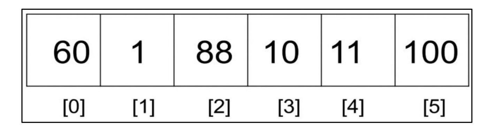
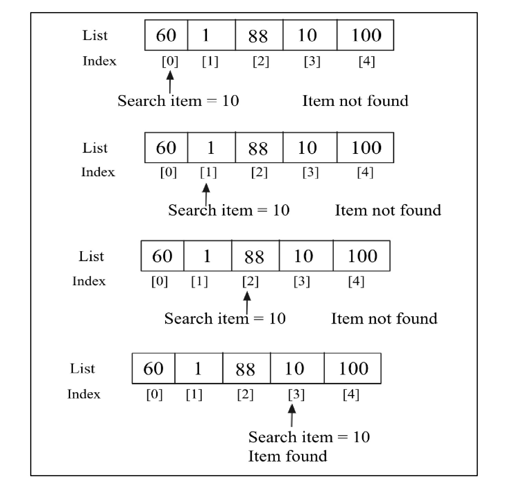
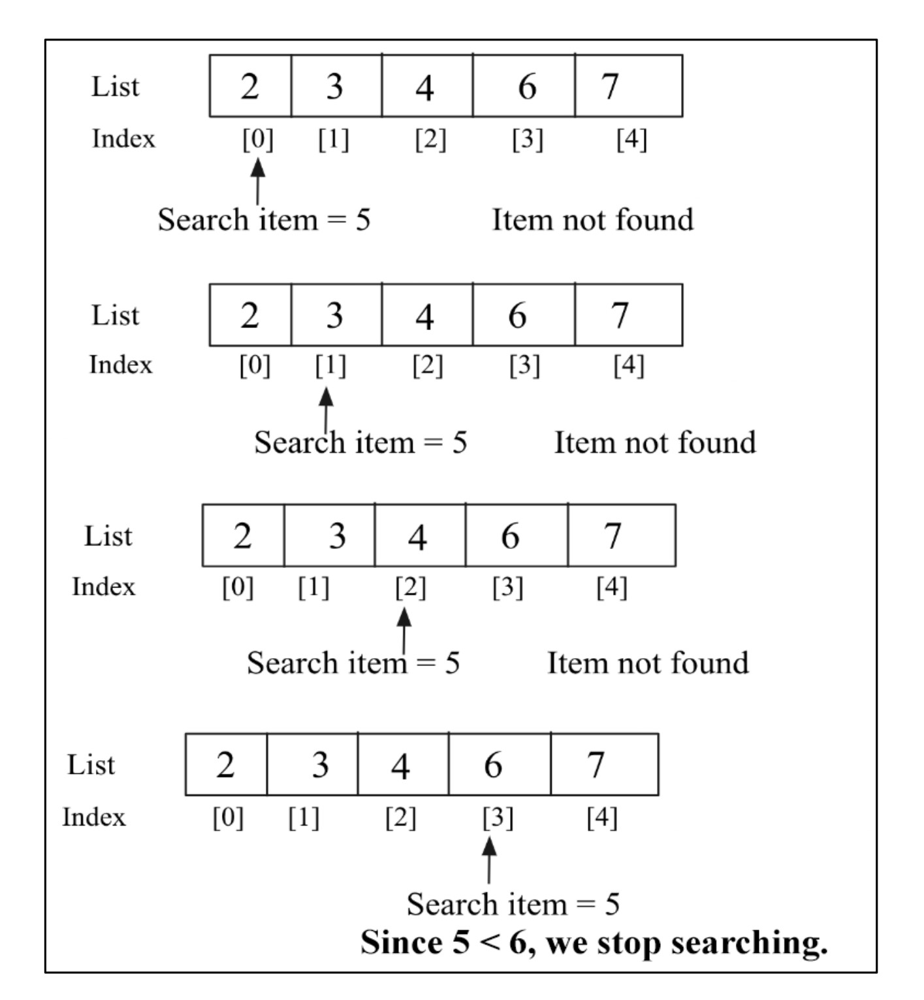

# 🔍 **Introduction to Searching**

A **search operation** is performed to find the location of a specific data item within a larger collection of data. The goal of a search algorithm is to return the position (or index) where the desired value is found. If the data item isn't in the collection, the algorithm typically returns `None` to indicate that it wasn't found.

---

### Why is Efficient Searching Important? 🤔

Efficient searching is crucial for quickly retrieving the location of an item from a stored list. Imagine you have a long list of numbers, like `{1, 45, 65, 23, 65, 75, 23}`, and you need to check if the number **75** is present. While it's easy for a short list, having an efficient search algorithm becomes extremely important when the list of data items grows very large.

---

### How Data Organization Affects Searching 📂

The way data is organized in a list significantly affects how a search algorithm works. There are two main scenarios:

* **Sorted Data** 📈
    * The search algorithm is applied to a list of items that is already **sorted**, meaning it's an ordered set.
    * For example: `[1, 3, 5, 7, 9, 11, 13, 15, 17]`

* **Unsorted Data** 📉
    * The search algorithm is applied to an **unordered** set of items, which is not sorted in any particular way.
    * For example: `[11, 3, 45, 76, 99, 11, 13, 35, 37]`

---

## 🚶‍♂️ **Linear Search**

A **search operation** is used to find the index position of a specific data item within a list. If the item you're looking for is in the list, the search algorithm returns its index (location). Otherwise, it reports that the item was not found. The index position is simply the location of the desired item in the list.

The most straightforward way to search for an item is to do it **linearly**, which means we check each item in the list, one by one, from beginning to end.

Let's look at an example list with six items: `{60, 1, 88, 10, 11, 100}`.

<div align="center">
  
</div>

> **Figure 10.1: An example of linear search**
> This image shows a list of six numbers, each with an index from `[0]` to `[5]`. This represents the data we'll be searching through.

To find an element, we can search linearly by traversing the list from the first element to the last, using the index to move. We check each element, and if it doesn't match our search item, we move to the next one. This sequential hopping from one item to the next is how the list is traversed.

For simplicity, we'll use integer values in this chapter because they're easy to compare. However, a list can hold any data type.

The linear search approach changes depending on how the list items are stored. Let's first see how it works if the list is **not sorted**.

-----

## **Unordered Linear Search  disorganized:**

An **unordered linear search** is a search algorithm applied to a list where the items are not in any particular order.

The process is simple:

1.  Start at the beginning of the list.
2.  Compare the desired item with the current item in the list.
3.  If they match, the search is over\!
4.  If they don't match, move to the next item and repeat.
5.  This continues until the item is found or you reach the end of the list.

Let's consider an unordered list with the elements `60, 1, 88, 10, 100`. If we want to search for the number **10**, the process looks like this:

<div align="center">
  
</div>

> **Figure 10.2: Unordered linear search**
> This figure shows the step-by-step process of searching for the number **10**:
>
> 1.  **Step 1:** The search item `10` is compared with the first element `60` (at index `[0]`). They don't match, so the item is "not found" yet.
> 2.  **Step 2:** The search moves to the next element `1` (at index `[1]`). `10` is not equal to `1`.
> 3.  **Step 3:** The search continues to `88` (at index `[2]`). Still no match.
> 4.  **Step 4:** The search moves to `10` (at index `[3]`). A match is found\! The algorithm returns this index.

Once the item is found, we return the index position where the match occurred.

-----

### 🐍 Python Implementation

Here is a Python implementation for a linear search on an unordered list:

```python
def search(unordered_list, term):
 for i, item in enumerate(unordered_list):
  if term == unordered_list[i]:
   return i
 return None
```

#### Code Explanation 🧑‍🏫

  * **`def search(unordered_list, term):`**

      * This defines a function named `search` that takes two parameters.
      * `unordered_list`: The list that holds the data we want to search through.
      * `term`: The item that we are looking for.

  * **`for i, item in enumerate(unordered_list):`**

      * This starts a `for` loop that iterates through every item in the list.
      * The `enumerate` function is a handy tool that gives us both the index (`i`) and the value (`item`) for each element in the list during each pass of the loop.

  * **`if term == unordered_list[i]:`**

      * Inside the loop, this `if` statement checks if the `term` we're looking for is equal to the current item in the list.

  * **`return i`**

      * If a match is found (the `if` statement is `True`), the search is successful. The function immediately stops and returns the current index `i`. There's no need to check the rest of the list.

  * **`return None`**

      * If the `for` loop completes without finding any matches, it means the search term is not in the list. In this case, the function returns `None`.

-----

### Example Usage 🚀

Here is a code snippet to test our `search` function with both numbers and strings:

```python
# Example 1: Searching for a number
list1 = [60, 1, 88, 10, 11, 600]
search_term = 10
index_position = search(list1, search_term)
print(index_position)

# Example 2: Searching for a string
list2 = ['packt', 'publish', 'data']
search_term2 = 'data'
Index_position2 = search(list2, search_term2)
print(Index_position2)
```

#### Output

```
3
2
```

In the first example, the index position `3` is returned because the number `10` is found at that location in `list1`. In the second example, index `2` is returned because the string `'data'` is at that position in `list2`. This shows that the same algorithm works for non-numeric data, since Python can compare strings just like numbers.

-----

### Performance ⏱️

When searching an unordered list, what's the **worst-case scenario**?

The desired item might be in the very last position, or it might not be in the list at all. In either situation, you have to compare the search term with **every single element** in the list.

If a list has `n` items, you will have to make `n` comparisons in the worst case. Therefore, the unordered linear search has a worst-case time complexity of **O(n)**.


---

## 📈 **Ordered Linear Search**

If the data elements in a list are already sorted, we can make the linear search algorithm more efficient.

The improved linear search algorithm for a **sorted list** has the following steps:

1.  Move through the list sequentially, one item at a time.
2.  If the search item's value is **less than** the item you are currently looking at, you can stop the search and return `None`.

The key idea is this: in a sorted list, if you pass the point where your search term *should* be, you know it's not in the list, so there's no need to check the rest of the elements.

Let's see how this works with an example. Imagine we have a sorted list `{2, 3, 4, 6, 7}` and we want to search for the number **5**.

<div align="center">
  
</div>

> **Figure 10.3: Example of ordered linear search**
> This figure shows the step-by-step process of searching for **5**:
>
> 1.  **Step 1:** The search item `5` is compared with `2`. No match.
> 2.  **Step 2:** `5` is compared with `3`. No match.
> 3.  **Step 3:** `5` is compared with `4`. No match.
> 4.  **Step 4:** `5` is compared with `6`. Since the list is sorted and **5 is less than 6**, we know that 5 cannot appear anywhere later in the list. The search stops immediately.

The search operation begins by comparing our desired item `5` with the first element, `2`. No match. We continue to `3`, then `4`, and still find no match. When we get to the fourth element, `6`, we see that our search term `5` is less than `6`. Because the list is sorted in ascending order, this tells us that `5` cannot possibly be found in any later position. We can stop searching right away.

-----

### 🐍 Python Implementation

Here's the Python implementation of a linear search for an already sorted list:

```python
def search_ordered(ordered_list, term):
  ordered_list_size = len(ordered_list)
  for i in range(ordered_list_size):
    # If we find the item, return its index
    if term == ordered_list[i]:
      return i
    # If the current item is greater than our term, stop searching
    elif ordered_list[i] > term:
      return None
  # If the loop finishes, the item was not found
  return None
```

#### Code Explanation 🧑‍🏫

  * **`if term == ordered_list[i]:`**: This is the standard check. If the current item is a match, we return its index `i`.
  * **`elif ordered_list[i] > term:`**: This is our optimization\! If the current item in the list is **greater than** our search term, we know the term can't be in the rest of the list, so we stop and return `None`.
  * **`return None`**: The final `return None` at the end handles the case where the loop finishes. This happens if the search term is larger than all the elements in the list.

-----

### Example Usage 🚀

Here is a code snippet that uses our `search_ordered` algorithm:

```python
# Example 1: Searching for a number that isn't there
list1 = [2, 3, 4, 6, 7]
search_term = 5
index_position1 = search_ordered(list1, search_term)

if index_position1 is None:
    print(f"{search_term} not found")
else:
    print(f"{search_term} found at position {index_position1}")

# Example 2: Searching for a string that is there
list2 = ['book','data','packt', 'structure']
search_term2 = 'structure'
index_position2 = search_ordered(list2, search_term2)

if index_position2 is None:
    print(f"{search_term2} not found")
else:
    print(f"{search_term2} found at position {index_position2}")
```

#### Output

```
5 not found
structure found at position 3
```

In the first example, the item `5` is not found, and the search stops early (after checking `6`). In the second example, the string `structure` is found at index position `3`. This shows that the algorithm works perfectly for sorted lists of non-numeric data, just like a contact list on your phone. 📱

-----

### Performance ⏱️

In the **worst-case scenario**, the item you're looking for is either at the very last position or it's not in the list at all (and is larger than every element). In this situation, you still have to check the entire list of `n` elements.

Therefore, even with the optimization, the worst-case time complexity of an ordered linear search is still **O(n)**.

---