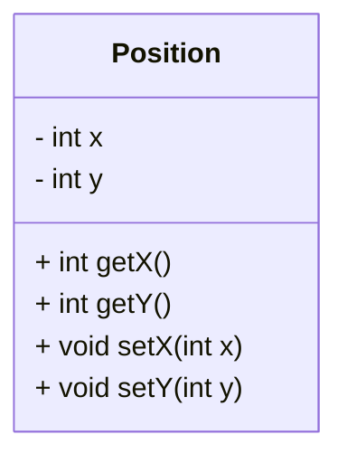
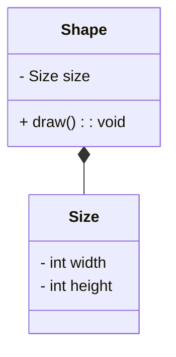
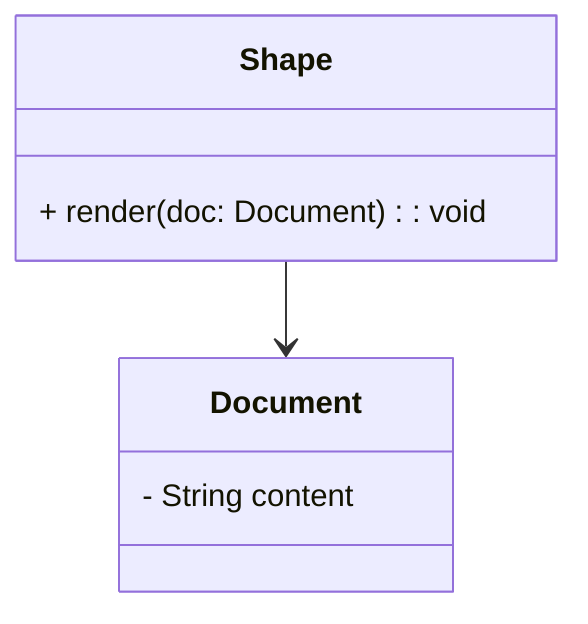

# **Unified Modeling Language (UML)** 🌟

## 🖋️ **What is UML?**
**UML (Unified Modeling Language)** is a standardized way to **visualize, specify, construct, and document the components of a system**. It is widely used to model the structure and behavior of systems during the design phase. UML enables developers to:
- Represent **classes** (blueprints for objects).
- Show **relationships** between classes.
- Communicate system designs effectively.

### ✨ Key Benefits of UML:
- 📚 **Standardization:** Provides a common visual language for developers.
- 🛠️ **System Design:** Helps plan the structure before implementation.
- 🚀 **Ease of Collaboration:** Enhances communication among team members.

---

## 🟦 **How Classes Are Represented in UML**

In UML, **classes** are represented as **rectangles** divided into three sections:
1. **Class Name:** Appears at the top.
2. **Fields (Attributes):** Represented in the middle section.
3. **Methods (Functions/Behaviors):** Listed in the bottom section.

### **Visibility Modifiers in UML**:
- **`-` (Minus):** Denotes a **private** member (accessible only within the class).
- **`+` (Plus):** Denotes a **public** member (accessible from anywhere).

### 💡 UML Class Example
Let’s consider a simple `Position` class:
```plaintext
---------------------
|     Position      |  <-- Class Name
---------------------
| - x: int          |  <-- Private Fields
| - y: int          |  
---------------------
| + getX(): int     |  <-- Public Methods
| + getY(): int     |
| + setX(x: int):   |  <-- Public Methods with Parameters
| + setY(y: int):   |
---------------------
```

---

## 🖼️ **Markdown Diagram for a UML Class**
Here’s a UML diagram for the `Position` class in Markdown:


### **Corresponding Python Code:**
```python
class Position:
    def __init__(self, x: int, y: int):
        self.__x = x  # Private field
        self.__y = y  # Private field

    # Public getter for x
    def getX(self) -> int:
        return self.__x

    # Public getter for y
    def getY(self) -> int:
        return self.__y

    # Public setter for x
    def setX(self, x: int):
        self.__x = x

    # Public setter for y
    def setY(self, y: int):
        self.__y = y

# Example Usage
position = Position(5, 10)
print(position.getX())  # Output: 5
position.setX(20)
print(position.getX())  # Output: 20
```

---

## 🌐 **Understanding Relationships in UML**

Relationships between classes are essential in UML. Here are the primary ones we’ll discuss:

### 1️⃣ **Composition Relationship**
- **Definition:** Represents a "whole-part" relationship where one class **contains** another. The contained class's lifecycle is tied to the container.
- **Notation:** Represented by a **filled diamond** pointing to the contained class.

#### 🛠️ **Example: Shape and Size**
- A `Shape` class is **composed** of a `Size` class. This means the `Shape` class has a field of type `Size`.

#### 📘 UML Diagram:


#### 🖥️ **Python Code Example**:
```python
class Size:
    def __init__(self, width: int, height: int):
        self.width = width
        self.height = height

class Shape:
    def __init__(self, size: Size):
        self.size = size  # Composition: Shape contains Size

    def draw(self):
        print(f"Drawing a shape of size: {self.size.width}x{self.size.height}")

# Example Usage
size = Size(100, 200)
shape = Shape(size)
shape.draw()
```

**Explanation:**
- The `Shape` class contains an instance of the `Size` class.
- If the `Shape` object is destroyed, the `Size` object is also destroyed.

---

### 2️⃣ **Reference Relationship**
- **Definition:** Represents a relationship where one class **uses** another class, but does not own it. The referred class exists independently.
- **Notation:** Represented by a **plain arrow** pointing to the referred class.

#### 🛠️ **Example: Shape and Document**
- A `Shape` class has a method `render()` that takes a `Document` parameter. This indicates that `Shape` **uses** `Document` temporarily.

#### 📘 UML Diagram:


#### 🖥️ **Python Code Example**:
```python
class Document:
    def __init__(self, content: str):
        self.content = content

class Shape:
    def render(self, document: Document):
        print(f"Rendering shape with document content: {document.content}")

# Example Usage
doc = Document("Sample Content")
shape = Shape()
shape.render(doc)
```

**Explanation:**
- The `Shape` class **refers** to the `Document` class via the `render()` method parameter.
- The `Document` object exists independently of the `Shape`.

---

## 🎯 **Key Takeaways**
1. **UML Basics:**
   - UML is a powerful tool for **visualizing and designing systems**.
   - Classes in UML are represented with a **rectangle divided into three sections**: Class Name, Fields, and Methods.

2. **Visibility Modifiers:**
   - `-` (Private): Members accessible only within the class.
   - `+` (Public): Members accessible from outside the class.

3. **Relationships in UML:**
   - **Composition:** One class contains another (e.g., `Shape` and `Size`).
   - **Reference:** One class uses another without owning it (e.g., `Shape` and `Document`).

4. **Practical Usage:**
   - Composition ties the lifecycle of contained objects to the container.
   - Reference allows flexibility and independence between objects.

---

### 💡 UML for System Design:
UML helps you **plan and visualize** your system architecture effectively before writing code. Use diagrams, relationships, and visibility modifiers to simplify complex systems! 🌟
