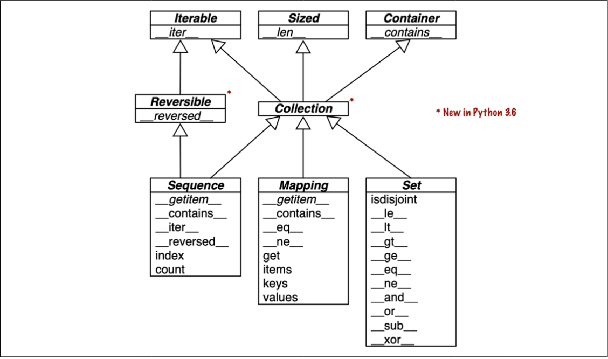

# Collection API

This Section provides an overview of Python's fundamental collection interfaces as represented by Abstract Base Classes (ABCs). These interfaces define the essential methods that collection types should implement.
 

  

## Top-Level ABCs

### Iterable
- **Method**: `__iter__`
- Represents objects that can be iterated over, such as in a `for` loop.

### Sized
- **Method**: `__len__`
- Represents objects that have a length, supporting the `len()` function.

### Container
- **Method**: `__contains__`
- Represents objects that support the `in` operator for membership testing.

### Reversible
- **Method**: `__reversed__`
- Represents objects that can be reversed, supporting the `reversed()` function.

### Collection (New in Python 3.6)
- Combines `Iterable`, `Sized`, and `Container`.
- Represents a unified interface for collections.

## Specializations of Collection

### Sequence
- Represents ordered collections like `list` and `str`.
- **Methods**: 
  - `__getitem__`
  - `__contains__`
  - `__iter__`
  - `__reversed__`
  - `index`
  - `count`

### Mapping
- Represents collections like `dict` and `collections.defaultdict`.
- **Methods**: 
  - `__getitem__`
  - `__contains__`
  - `__eq__`
  - `__ne__`
  - `get`
  - `items`
  - `keys`
  - `values`

### Set
- Represents collections like `set` and `frozenset`.
- **Methods**: 
  - `isdisjoint`
  - `__le__`
  - `__lt__`
  - `__gt__`
  - `__ge__`
  - `__eq__`
  - `__ne__`
  - `__and__`
  - `__or__`
  - `__sub__`
  - `__xor__`

## Additional Notes

- **Ordered Dicts in Python 3.7**: Since Python 3.7, the `dict` type is officially "ordered," meaning it preserves the key insertion order.
- **Infix Operators in Set ABC**: All special methods in the Set ABC implement infix operators. For example, `a & b` computes the intersection of sets `a` and `b`, and is implemented using the `__and__` special method.

## Summary

The provided UML class diagram illustrates the hierarchy and relationships among Python’s fundamental collection types. Each of these interfaces (ABCs) defines a set of methods that must be implemented by any concrete class that adheres to that interface, allowing for the creation of custom collection classes that integrate seamlessly with Python’s built-in operations.
