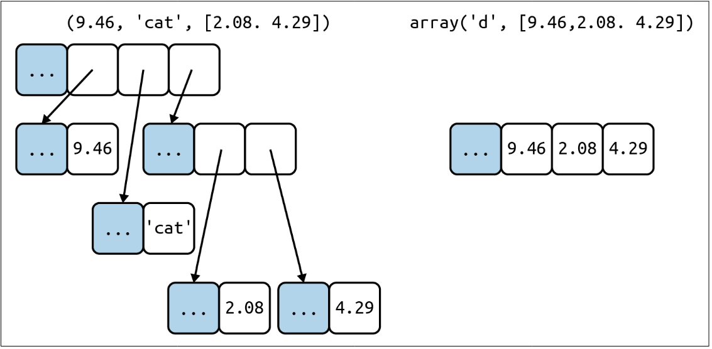
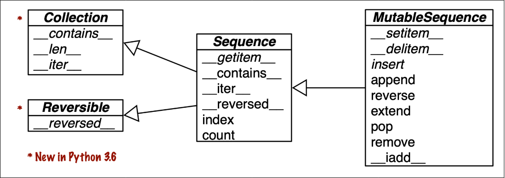

# Overview of built-in sequences

## Understanding Container and Flat Sequences in Python
Welcome to a simplified explanation of the differences between container and flat sequences in Python, perfect for beginners!

## Container Sequences

**Container Sequence**: In Python, container sequences such as lists or tuples don't hold data directly. Instead, they hold references to where the data is stored elsewhere in memory. This allows the sequence to contain items of various types, making it incredibly versatile. Think of it as a row of houses (the sequence), with each house holding a map to where its actual contents are located.

## Flat Sequences
**Flat Sequence**: Contrarily, flat sequences store the actual data within their own allocated memory space. Examples include strings and bytes in Python, where the sequence consists of uniform elements like characters or bytes. Imagine this as a storage unit filled directly with boxes of the same size, each box packed tightly next to the other without any extra space.


<figure><b>Figure 1.0</b></figure>

## Visual Comparison (Figure 1.0)

To better understand, consider Figure 1.0 which provides a simplified memory diagram of both a tuple (a common container sequence) and an array (a type of flat sequence), each containing three items:

- **Tuple**: Shown as having a main array that contains references to its items. Each item is a separate Python object, which might also contain references to other objects, like a two-item list.

- **Python Array**: Depicted as a single Python object that holds a compact C language array of three double values.

## Key Differences

Flat sequences are more memory-efficient since they store data directly and compactly, but they can only hold simple, primitive types like bytes, integers, and floats. This makes them less flexible compared to container sequences but excellent for performance-sensitive applications where memory usage is critical.

# Understanding Python Object Memory Structure

This section explains the memory structure of Python objects, focusing on the simple Python float object as an example, to help beginners understand how Python manages memory.

## Python Object Memory Details

Every Python object in memory includes a header with essential metadata. Let's break down the components using the simplest Python object, a float, as an example:

- **ob_refcnt**: This is the object’s reference count. It keeps track of how many references there are to the object, which helps Python manage memory and deallocate objects that are no longer needed.
  
- **ob_type**: This is a pointer to the object’s type, which Python uses to keep track of what kind of object it is dealing with.
  
- **ob_fval**: This field is specific to float objects and holds the float's value as a C double.

On a 64-bit Python build, each of these fields occupies 8 bytes.

## Why Arrays of Floats are More Compact Than Tuples

Given the structure of Python objects, it becomes clear why an array of floats is much more compact than a tuple of floats:

- **Array of Floats**: The array is treated as a single object with multiple float values stored directly within it. Since the array itself is one contiguous block, it only requires additional space for the array's metadata and not for each individual float.

- **Tuple of Floats**: In contrast, a tuple contains multiple separate float objects. Each float in the tuple has its own metadata as described above. Therefore, the tuple not only occupies memory for its own metadata but also for the metadata of each float it contains. This makes it significantly less memory-efficient than an array of floats.

# Python Collections and Sequences

This is an  overview of various collection types in Python, specifically focusing on sequences and their relationships.



## Classes and Methods

### Collection
- **Methods**: `__contains__`, `__len__`, `__iter__`
- A basic container that supports:
  - Checking if an item is in it (`in` keyword).
  - Getting the number of items (`len()`).
  - Iterating over items (`for item in collection`).

### Reversible
- **Methods**: `__reversed__`
- Supports reverse iteration (`for item in reversed(collection)`).

### Sequence
- **Inherits from**: `Collection`, `Reversible`
- **Methods**: `__getitem__`, `__contains__`, `__iter__`, `__reversed__`, `index`, `count`
- Supports:
  - Indexing (`sequence[i]`).
  - Counting occurrences of an item (`sequence.count(item)`).
  - Finding the position of an item (`sequence.index(item)`).

### MutableSequence
- **Inherits from**: `Sequence`
- **Methods**: `__setitem__`, `__delitem__`, `insert`, `append`, `reverse`, `extend`, `pop`, `remove`, `__iadd__`
- Supports modifying the sequence by:
  - Setting items (`sequence[i] = item`).
  - Deleting items (`del sequence[i]`).
  - Inserting, appending, reversing, extending, popping, removing items, and in-place addition.

## Examples

### Mutable Sequences
- `list`
- `bytearray`
- `collections.deque`

### Immutable Sequences
- `tuple`
- `str`
- `bytes`

## Relationships

The following diagram visualizes the relationships between these classes:

```
          +----------------------+
          |      Collection      |
          |----------------------|
          | __contains__         |
          | __len__              |
          | __iter__             |
          +----------------------+
                    ^
                    |
                    |
          +----------------------+
          |     Reversible       |
          |----------------------|
          | __reversed__         |
          +----------------------+
                    ^
                    |
                    |
          +----------------------+
          |      Sequence        |
          |----------------------|
          | __getitem__          |
          | __contains__         |
          | __iter__             |
          | __reversed__         |
          | index                |
          | count                |
          +----------------------+
                    ^
                    |
                    |
          +----------------------+
          |  MutableSequence     |
          |----------------------|
          | __setitem__          |
          | __delitem__          |
          | insert               |
          | append               |
          | reverse              |
          | extend               |
          | pop                  |
          | remove               |
          | __iadd__             |
          +----------------------+
```

## Key Points

- Mutable sequences like `list` and `deque` can be modified.
- Immutable sequences like `tuple` and `str` cannot be modified.
- Built-in sequence types are registered as virtual subclasses of these abstract base classes.

## Conclusion

Understanding these relationships helps you work with different types of sequences in Python and know which methods are available for each type. This knowledge is crucial for effective and efficient programming in Python.
