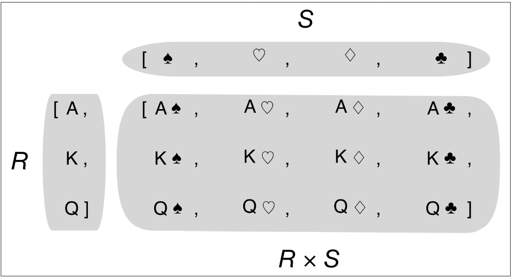

# List Comprehensions and Generator Expressions
- **List Comprehensions** (listcomps) and **Generator Expressions** (genexps) are quick ways to build sequences.
- They often make code more readable and faster.

### Readability
- **List Comprehensions**:
  - Explicitly show the intent to build a new list.
  - Example:
    ```python
    symbols = '$¢£¥€¤'
    codes = [ord(symbol) for symbol in symbols]
    print(codes)  # Output: [36, 162, 163, 165, 8364, 164]
    ```
  - This is more readable compared to using a `for` loop:
    ```python
    symbols = '$¢£¥€¤'
    codes = []
    for symbol in symbols:
        codes.append(ord(symbol))
    print(codes)  # Output: [36, 162, 163, 165, 8364, 164]
    ```

### Best Practices
- Use list comprehensions for creating new lists.
- Avoid using them for side effects (e.g., just repeating a block of code).
- Keep list comprehensions short, if they span more than two lines, consider using a `for` loop.

### Syntax Tips
- Python ignores line breaks inside `[]`, `{}`, or `()`.
- You can build multiline lists, listcomps, tuples, and dictionaries without using the `\` line continuation escape.
- When defining a literal with comma-separated items, a trailing comma is ignored. Adding a trailing comma makes it easier to add new items later and reduces noise in diffs.

## Example Comparison

### Example 2-1: Using a `for` Loop
```python
symbols = '$¢£¥€¤'
codes = []
for symbol in symbols:
    codes.append(ord(symbol))
print(codes)  # Output: [36, 162, 163, 165, 8364, 164]
```
#### Explanation

1. **Initial Setup**:
   - `symbols = '$¢£¥€¤'`: This line creates a string `symbols` that contains six different currency symbols.
   - `codes = []`: This line initializes an empty list `codes`.

2. **Loop Through Symbols**:
   - `for symbol in symbols:`: This line starts a `for` loop that iterates over each character in the `symbols` string.
   
3. **Convert Symbol to Unicode Code Point**:
   - Inside the loop, `codes.append(ord(symbol))`:
     - `ord(symbol)`: The `ord()` function takes a character and returns its Unicode code point (an integer representing the character).
     - `codes.append()`: This method adds the Unicode code point to the `codes` list.

4. **Output the Codes**:
   - `print(codes)`: This line prints the `codes` list, which now contains the Unicode code points of the symbols.

#### Result
- The output is `[36, 162, 163, 165, 8364, 164]`, which are the Unicode code points for the symbols `$`, `¢`, `£`, `¥`, `€`, and `¤`.

### Example 2-2: Using a List Comprehension
```python
symbols = '$¢£¥€¤'
codes = [ord(symbol) for symbol in symbols]
print(codes)  # Output: [36, 162, 163, 165, 8364, 164]
```
#### Explanation

1. **Initial Setup**:
   - `symbols = '$¢£¥€¤'`: The same string `symbols` as in Example 2-1.

2. **List Comprehension**:
   - `codes = [ord(symbol) for symbol in symbols]`:
     - This single line does the same thing as the `for` loop in Example 2-1.
     - `ord(symbol)`: Converts each symbol to its Unicode code point.
     - `for symbol in symbols`: Iterates over each character in the `symbols` string.
     - The list comprehension `[ord(symbol) for symbol in symbols]` creates a new list by applying `ord(symbol)` to each `symbol` in `symbols`.

3. **Output the Codes**:
   - `print(codes)`: This line prints the `codes` list, which contains the Unicode code points of the symbols.

#### Result
- The output is the same as in Example 2-1: `[36, 162, 163, 165, 8364, 164]`.

### Comparison

- **`for` Loop**:
  - More lines of code.
  - Explicitly shows each step (initializing the list, iterating, appending).
  
- **List Comprehension**:
  - More concise and compact.
  - Combines iteration and list creation into a single line.
  - Clearer intent for creating a new list.

### Conclusion

- Both examples achieve the same result: creating a list of Unicode code points from a string of symbols.
- The list comprehension in Example 2-2 is more concise and can be easier to read, especially for those familiar with Python.
- Use list comprehensions for straightforward list transformations to keep your code clean and readable.

## Understanding Scope in Python Comprehensions and Generator Expressions

### Local Scope in Comprehensions

In Python 3, list comprehensions and generator expressions (along with set and dict comprehensions) maintain a local scope for variables that are assigned within the `for` clause of the comprehension. This means that these variables do not affect or interfere with variables outside the comprehension that have the same name.

### Example

```python
x = 'ABC'
codes = [ord(x) for x in x]
print(x)    # Output: 'ABC'
print(codes) # Output: [65, 66, 67]
```

In the above example, the `x` inside the list comprehension shadows the `x` defined before the comprehension. However, after the comprehension, the original `x` is still intact and `codes` reflects the ASCII values of the characters in `'ABC'`.

### Scope of the Walrus Operator

Introduced in Python 3.8, the Walrus operator (`:=`) allows variables assigned in this manner within an expression to be accessible outside the expression. This operator is particularly useful in comprehensions and generator expressions.

### Example

```python
x = 'ABC'
codes = [last := ord(c) for c in x]
print(last)   # Output: 67
```

Here, `last` uses the Walrus operator to capture the last ASCII value calculated in the list comprehension. Unlike other variables in a comprehension, `last` remains accessible outside of the comprehension.

### Attempting to Access a Local Variable

Trying to access a comprehension-local variable outside of it results in an error:

```python
print(c)
```
**Output**
```bash
Traceback (most recent call last):
  File "c:\Users\aaaa\Desktop\Python-Deep-Dive\06_advance_python_deep_dive\01_data_structure\02_array_of_squences\02_list_comprehension_and_generator_expressions\main.py", line 17, in <module>  
    print(c)
          ^
NameError: name 'c' is not defined
```

This code snippet will result in a `NameError` because `c` only exists within the list comprehension and is not accessible outside of it.

List comprehensions in Python provide a more readable and often more efficient way to create lists compared to the `map` and `filter` functions, especially when combined with Python's `lambda` functions. This is particularly evident when you're processing items in a sequence to create a new list based on certain conditions.

## Example 2-3: Comparing List Comprehensions with map and filter

Let's look at how list comprehensions stack up against using `map` and `filter` with an example that processes a string of currency symbols, filtering out those with ASCII values beyond 127.

### Using a List Comprehension

A list comprehension provides a clear and concise way to achieve this:

```python
symbols = '$¢£¥€¤'
beyond_ascii = [ord(s) for s in symbols if ord(s) > 163]
print(beyond_ascii)
# Output: [165, 8364, 164]
```

Here, `ord(s)` converts each symbol to its ASCII (or Unicode) code, and the condition `if ord(s) > 163` filters out symbols with codes within the standard ASCII range.

### Using map and filter with Lambda

The same result can be achieved using `map` and `filter`, although it requires more boilerplate:

```python
symbols = '$¢£¥€¤'
beyond_ascii = list(filter(lambda c: c > 163, map(ord, symbols)))
print(beyond_ascii)
# Output: [165, 8364, 164]
```

In this case, `map(ord, symbols)` converts the symbols to their ASCII codes, and `filter(lambda c: c > 163, ...)` filters out the codes that are within the standard ASCII range. The use of `lambda` makes this approach less readable compared to the list comprehension.

### Performance Considerations

It was once believed that `map` and `filter` might offer performance advantages over list comprehensions, particularly due to their functional nature and direct implementation in Python's C backend. However, practical tests, such as those found in the "Fluent Python" code repository (see [`listcomp_speed.py`](https://github.com/fluentpython/example-code-2e/blob/master/02-array-seq/listcomp_speed.py)), have shown that list comprehensions are at least as fast as, if not faster than, the equivalent `map` and `filter` composition in many cases.
 
# Cartesian Product


List comprehensions in Python can be used to build lists that represent the Cartesian product of two or more iterables. The Cartesian product combines each element of one iterable with each element of another, resulting in pairs (or tuples) of elements. The length of the resulting list is the product of the lengths of the input iterables.

### Cartesian Product of Card Ranks and Suits


Consider Figure 2-3 which illustrates the Cartesian product of three card ranks (`A`, `K`, `Q`) and four suits (`♠`, `♥`, `♦`, `♣`). The resulting list has 12 pairs, as each rank is combined with each suit.

### Example: Producing a List of T-shirts

Imagine you need to produce a list of T-shirts available in two colors and three sizes. You can use a list comprehension to create this list.

#### Using List Comprehension

```python
colors = ['black', 'white']
sizes = ['S', 'M', 'L']
tshirts = [(color, size) for color in colors for size in sizes]
print(tshirts)
# Output: [('black', 'S'), ('black', 'M'), ('black', 'L'), ('white', 'S'), ('white', 'M'), ('white', 'L')]
```

This list comprehension iterates over each color and, for each color, iterates over each size, producing a tuple for every combination.

#### Equivalent Nested Loops

The above list comprehension is equivalent to:

```python
for color in colors:
    for size in sizes:
        print((color, size))
# Output:
# ('black', 'S')
# ('black', 'M')
# ('black', 'L')
# ('white', 'S')
# ('white', 'M')
# ('white', 'L')
```

### Reversing the Order of Iteration

You can change the order of iteration to get a different arrangement of the tuples:

```python
tshirts = [(color, size) for size in sizes for color in colors]
print(tshirts)
# Output: [('black', 'S'), ('white', 'S'), ('black', 'M'), ('white', 'M'), ('black', 'L'), ('white', 'L')]
```
## Understanding Generator Expressions in Python

Generator expressions in Python are a memory-efficient way to create iterables. Unlike list comprehensions, which build an entire list in memory, generator expressions yield items one by one, using the iterator protocol. This approach is useful when working with large datasets or when you want to initialize other types of sequences like tuples or arrays without the overhead of storing all items in memory.

### Basic Syntax

Generator expressions use the same syntax as list comprehensions but are enclosed in parentheses instead of brackets.

### Example: Initializing a Tuple and an Array

#### Using a Generator Expression to Create a Tuple

```python
symbols = '$¢£¥€¤'
tuple_genexp = tuple(ord(symbol) for symbol in symbols)
print(tuple_genexp)
# Output: (36, 162, 163, 165, 8364, 164)
```

#### Using a Generator Expression to Create an Array

```python
import array
array_genexp = array.array('I', (ord(symbol) for symbol in symbols))
print(array_genexp)
# Output: array('I', [36, 162, 163, 165, 8364, 164])
```

If the generator expression is the only argument in a function call, you can omit the enclosing parentheses. However, when used as part of another expression or with multiple arguments, the parentheses are required.

### Example: Cartesian Product with a Generator Expression

A common use of generator expressions is to generate items on the fly, such as computing the Cartesian product of two lists. This can be particularly useful for large datasets, as it avoids the need to store the entire product in memory.

#### Generating T-shirts Combinations

```python
colors = ['black', 'white']
sizes = ['S', 'M', 'L']
for tshirt in (f'{c} {s}' for c in colors for s in sizes):
    print(tshirt)
# Output:
# black S
# black M
# black L
# white S
# white M
# white L
```

In this example, the generator expression `(f'{c} {s}' for c in colors for s in sizes)` yields one T-shirt combination at a time, directly to the `for` loop. This way, the entire list of T-shirt combinations is never stored in memory, making it a more efficient approach when dealing with larger datasets.

## Conclusion

Generator expressions provide a powerful and efficient way to create iterables in Python, especially when dealing with large data or initializing other types of sequences. They yield items one by one, which can save significant memory and processing time compared to list comprehensions..