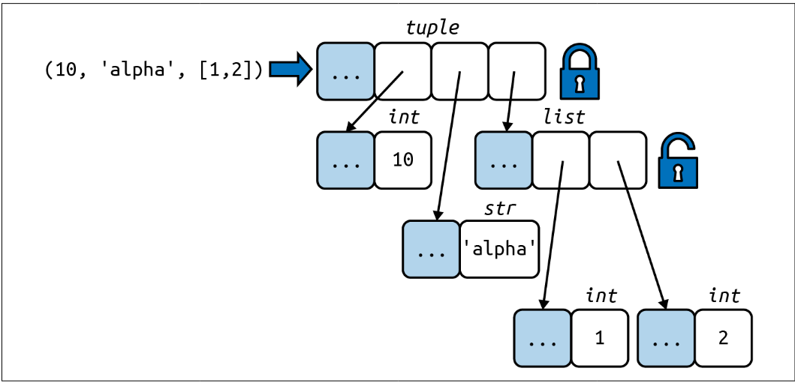

# Tuples as Immutable Lists

## Introduction
Tuples in Python are extensively used as immutable lists, providing two key benefits: clarity and performance.

### Clarity
When you see a tuple in code, you know its length will never change.

### Performance
- **Memory Efficiency**: A tuple uses less memory than a list of the same length.
- **Optimizations**: Tuples allow Python to perform certain optimizations.

## Immutability Explained
The immutability of a tuple applies only to the references contained within it. This means that you cannot delete or replace references in a tuple. However, if one of those references points to a mutable object, changes to that object will reflect in the tuple.


<figure>figure 1</figure>
Figure 1. The content of the tuple itself is immutable, but that only means the references held by the tuple will always point to the same objects. However, if one of the referenced objects is mutable—like a list—its content may change.

### Example
Consider the following example:
```python
a = (10, 'alpha', [1, 2])
b = (10, 'alpha', [1, 2])
```
Initially, `a` and `b` are equal:
```python
a == b  # True
```
If we change the last item in `b`:
```python
b[-1].append(99)
```
Now, `a` and `b` are different:
```python
a == b  # False
b  # (10, 'alpha', [1, 2, 99])
```
**Output**
```bash
>>> a = (10, 'alpha', [1, 2])
>>> b = (10, 'alpha', [1, 2])
>>> a == b
True
>>> b[-1].append(99)
>>> a == b
False
>>> b
(10, 'alpha', [1, 2, 99])
```
### Explanation of Tuple and List Evaluation and Memory Allocation

#### 1. Bytecode Generation
- **Tuple Literal Evaluation**:
  - When you create a tuple, the Python compiler generates bytecode for the entire tuple in one operation.
  - Example: `t = (1, 2, 3)` is evaluated as a single tuple constant.

- **List Literal Evaluation**:
  - When you create a list, the Python compiler generates bytecode that pushes each element individually to the data stack and then builds the list.
  - Example: `l = [1, 2, 3]` involves multiple operations to add each element to the list.

#### 2. Tuple and List Constructors
- **Tuple Constructor**:
  - Given a tuple `t`, calling `tuple(t)` simply returns a reference to the same tuple `t` without creating a new copy.
  - Example: 
    ```python
    t = (1, 2, 3)
    t_copy = tuple(t)  # t_copy is the same as t
    ```

- **List Constructor**:
  - Given a list `l`, calling `list(l)` creates a new copy of the list `l`.
  - Example:
    ```python
    l = [1, 2, 3]
    l_copy = list(l)  # l_copy is a new list with the same elements as l
    ```

#### 3. Memory Allocation
- **Tuple Memory Allocation**:
  - A tuple has a fixed length, so it is allocated the exact amount of memory space it needs when it is created.
  - Example: `t = (1, 2, 3)` will allocate memory for exactly three elements.

- **List Memory Allocation**:
  - A list is allocated with extra space to accommodate future additions, which helps to minimize the cost of resizing the list when new elements are appended.
  - Example: `l = [1, 2, 3]` might be allocated more memory than needed for three elements to allow for efficient growth.

#### 4. Storage of References
- **Tuple References**:
  - The references to the items in a tuple are stored directly in an array within the tuple structure.
  - Example: The tuple `t = (1, 2, 3)` directly holds references to the integers `1`, `2`, and `3`.

- **List References**:
  - A list holds a pointer to an array of references that are stored elsewhere. When a list grows beyond its currently allocated space, Python needs to reallocate the array to make room for new elements.
  - Example: The list `l = [1, 2, 3]` holds a pointer to an array of references. If you append another element, Python may need to reallocate space for the expanded list.

- **Impact on CPU Caches**:
  - The additional indirection required for lists (due to potential reallocations) makes CPU caches less effective compared to tuples, where references are directly stored in a contiguous block.

### Summary
- **Tuple Evaluation**: Efficient bytecode generation in one operation.
- **List Evaluation**: Bytecode generated by pushing each element separately and then building the list.
- **Tuple Constructor**: Returns the same reference without copying.
- **List Constructor**: Creates a new copy of the list.
- **Tuple Memory**: Allocated exactly as needed.
- **List Memory**: Allocated with extra space for future growth.
- **Tuple References**: Stored directly in an array within the tuple.
- **List References**: Held by a pointer to an array stored elsewhere, requiring possible reallocations.

These differences explain why tuples can be more memory and performance-efficient compared to lists in certain scenarios.