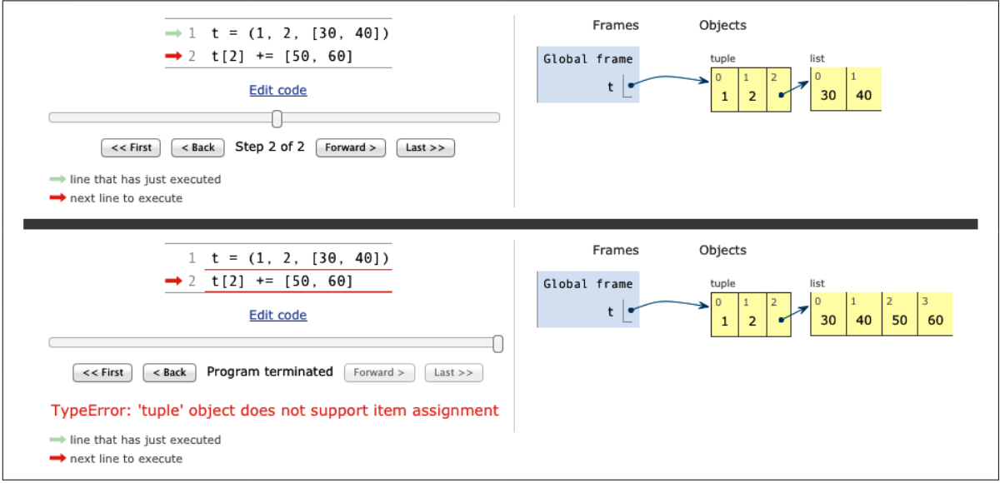

# A += Assignment Puzzler

## Introduction

This section presents a puzzling behavior of the `+=` operator with tuples in Python. It challenges our understanding of how in-place addition works with mutable and immutable types.

## The Riddle

### Example
Consider the following code:
```python
t = (1, 2, [30, 40])
t[2] += [50, 60]
```
What happens next? Choose the best answer:<br>
A. `t` becomes `(1, 2, [30, 40, 50, 60])`.<br>
B. A `TypeError` is raised with the message `'tuple' object does not support item assignment`.<br>
C. Neither.<br>
D. Both A and B.<br>

### Expected vs. Actual Outcome
Most would expect answer B, but the correct answer is D: "Both A and B". Let's break down why.

## Explanation

### Example Output
```python
t = (1, 2, [30, 40])
t[2] += [50, 60]
```
- **Output:**
```python
Traceback (most recent call last):
  File "<stdin>", line 1, in <module>
TypeError: 'tuple' object does not support item assignment
```
- **State of `t`:**
```python
(1, 2, [30, 40, 50, 60])
```

### Reasoning
- **Tuple Immutability:** Tuples are immutable, meaning their items cannot be changed. This is why the `TypeError` occurs.
- **List Mutability:** The list within the tuple is mutable. The in-place addition `+=` modifies this list, even though it raises an error for trying to assign to the tuple.

## Visual Explanation

Using the [Online Python Tutor](http://pythontutor.com) is a great way to visualize how Python 
<br>

<br>
processes this code. Here's a step-by-step explanation:
1. **Initial State:** The tuple `t` is created with elements `(1, 2, [30, 40])`.
2. **In-Place Addition Attempt:** `t[2] += [50, 60]` tries to extend the list `[30, 40]` with `[50, 60]`.
3. **Error Raised:** Python attempts to assign the result back to `t[2]`, causing a `TypeError` because tuples do not support item assignment.
4. **List Modified:** Despite the error, the list inside the tuple is modified to `[30, 40, 50, 60]`.

### Bytecode Insight
Looking at the bytecode generated for `t[2] += [50, 60]` helps explain the behavior:
- **Bytecode Steps:**
  1. Load the tuple `t`.
  2. Extract the list from the tuple.
  3. Perform in-place addition on the list.
  4. Attempt to assign the modified list back to the tuple index, raising an error.

## Bytecode Analysis

### Example Bytecode
To understand this better, let's look at the bytecode Python generates for the expression `s[a] += b`.

#### Bytecode for the expression `s[a] += b`
```python
import dis
dis.dis('s[a] += b')
```
**Output:**
```plaintext
  1           0 LOAD_NAME                0 (s)
              3 LOAD_NAME                1 (a)
              6 DUP_TOP_TWO
              7 BINARY_SUBSCR
              8 LOAD_NAME                2 (b)
             11 INPLACE_ADD
             12 ROT_THREE
             13 STORE_SUBSCR
             14 LOAD_CONST               0 (None)
             17 RETURN_VALUE
```

### Explanation of Bytecode
- **LOAD_NAME 0 (s):** Put the value of `s` on the top of the stack (TOS).
- **LOAD_NAME 1 (a):** Put the value of `a` on TOS.
- **DUP_TOP_TWO:** Duplicate the top two items on the stack.
- **BINARY_SUBSCR:** Perform `s[a]` and put the result on TOS.
- **LOAD_NAME 2 (b):** Put the value of `b` on TOS.
- **INPLACE_ADD:** Perform `TOS += b`. This succeeds if TOS refers to a mutable object (like a list in our case).
- **ROT_THREE:** Rotate the top three stack items.
- **STORE_SUBSCR:** Assign `s[a] = TOS`. This fails if `s` is immutable (like the tuple in our example).
- **LOAD_CONST 0 (None):** Load the constant `None`.
- **RETURN_VALUE:** Return the value on TOS.

## Lessons Learned
1. **Avoid Mutable Items in Tuples:** Placing mutable items in tuples can lead to unexpected behavior.
2. **Augmented Assignment is Not Atomic:** The operation can throw an exception after partially completing its task.
3. **Inspecting Python Bytecode:** Understanding bytecode can provide insights into the inner workings of Python and help debug complex behaviors.

## Conclusion

- **Immutable Containers:** Even when contained in an immutable type like a tuple, mutable objects like lists can still be modified.
- **Operator Behavior:** The `+=` operator modifies the object in place, then attempts an assignment, which can cause unexpected behavior with immutable containers.

Next, we will explore how the `+=` and `*=` operators work differently based on the mutability of the target sequence.
