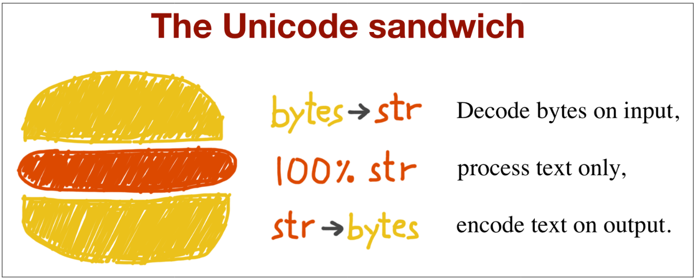

### Handling Text Files

The best practice for handling text I/O is the “Unicode sandwich.” This means that bytes should be decoded to `str` as early as possible on input (e.g., when opening a file for reading). The “filling” of the sandwich is the business logic of your program, where text handling is done exclusively on `str` objects. Encoding to bytes should happen as late as possible on output.



### The Unicode Sandwich

- **Decode bytes on input**: Convert bytes to `str` immediately.
- **Process text only**: Handle all text as `str`.
- **Encode text on output**: Convert `str` to bytes just before output.

### Example: Handling Text Files

Python 3 makes it easy to follow this approach because the `open()` built-in function handles decoding when reading and encoding when writing files in text mode. However, relying on default encodings can lead to issues.

#### Example 4-8: Platform Encoding Issue

Consider the following code:

```python
path = r"C:\Users\aaaa\Desktop\Python-Deep-Dive\06_advance_python_deep_dive\04_unicode_text_versus_bytes\07_handling_text_files\cafe.txt"

# Writing to a file with UTF-8 encoding
open(path, 'w', encoding='utf_8').write('café')

# Reading the file without specifying encoding
print(open(path).read())
```

This may output:

```plaintext
'café'
```

**The bug**: The file was written with UTF-8 encoding but read without specifying the encoding, leading Python to assume the Windows default encoding (cp1252), resulting in incorrect characters.

### Detailed Inspection and Fix

#### Example 4-9: Inspecting the Bug and Fixing It

```python
path = r"C:\Users\aaaa\Desktop\Python-Deep-Dive\06_advance_python_deep_dive\04_unicode_text_versus_bytes\07_handling_text_files\cafe.txt"

# Writing to a file with UTF-8 encoding
fp = open(path, 'w', encoding='utf_8')
print(fp)  # <_io.TextIOWrapper name='cafe.txt' mode='w' encoding='utf_8'>
fp.write('café')
fp.close()

# Checking file size
import os
print(os.stat(path).st_size)  # 5 bytes

# Reading the file without specifying encoding
fp2 = open(path)
print(fp2)  # <_io.TextIOWrapper name='cafe.txt' mode='r' encoding='cp1252'>
print(fp2.encoding)  # 'cp1252'
print(fp2.read())  # 'café'

# Reading the file with the correct encoding
fp3 = open(path, encoding='utf_8')
print(fp3)  # <_io.TextIOWrapper name='cafe.txt' mode='r' encoding='utf_8'>
print(fp3.read())  # 'café'

# Reading the file in binary mode
fp4 = open(path, 'rb')
print(fp4)  # <_io.BufferedReader name='cafe.txt'>
print(fp4.read())  # b'caf\xc3\xa9'
```

Key Points:
- The `write` method on a `TextIOWrapper` returns the number of Unicode characters written.
- `os.stat` shows the file size in bytes. UTF-8 encodes 'é' as 2 bytes (`0xc3` and `0xa9`), resulting in a total of 5 bytes.
- Opening a text file without specifying the encoding uses the locale default encoding, which can cause issues if the encoding differs from when the file was written.
- The `encoding` attribute of a `TextIOWrapper` shows the encoding used.
- Reading in binary mode (`rb`) returns bytes, not `str`.

### Best Practices

- **Always specify an explicit encoding** when opening text files to avoid relying on defaults that may vary across platforms or locales.
- **Use binary mode** only when necessary, such as when analyzing file contents to determine the encoding.
- **Use libraries like Chardet** to detect encoding instead of guessing.

By following these practices, you can handle text files correctly and avoid encoding-related issues across different platforms and environments.