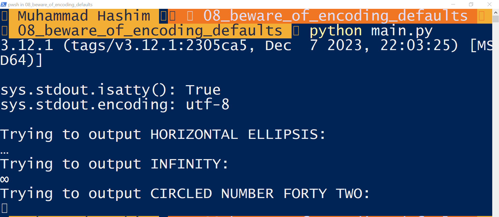

## Beware of Encoding Defaults

Several settings affect the encoding defaults for I/O in Python. The script in Example 4-10 explores these default settings.

#### Example 4-10: Exploring Encoding Defaults

```python
import locale
import sys

expressions = """
locale.getpreferredencoding()
type(my_file)
my_file.encoding
sys.stdout.isatty()
sys.stdout.encoding
sys.stdin.isatty()
sys.stdin.encoding
sys.stderr.isatty()
sys.stderr.encoding
sys.getdefaultencoding()
sys.getfilesystemencoding()
"""

my_file = open('dummy', 'w')
for expression in expressions.split():
    value = eval(expression)
    print(f'{expression:>30} -> {value!r}')
```

The output of this script on different systems reveals the default encodings used.

#### Output on GNU/Linux and macOS

```plaintext
$ python3 default_encodings.py
 locale.getpreferredencoding() -> 'UTF-8'
 type(my_file) -> <class '_io.TextIOWrapper'>
 my_file.encoding -> 'UTF-8'
 sys.stdout.isatty() -> True
 sys.stdout.encoding -> 'utf-8'
 sys.stdin.isatty() -> True
 sys.stdin.encoding -> 'utf-8'
 sys.stderr.isatty() -> True
 sys.stderr.encoding -> 'utf-8'
 sys.getdefaultencoding() -> 'utf-8'
 sys.getfilesystemencoding() -> 'utf-8'
```

On these systems, UTF-8 is used everywhere.

#### Output on Windows

```plaintext
> chcp
Active code page: 437
> python default_encodings.py
 locale.getpreferredencoding() -> 'cp1252'
 type(my_file) -> <class '_io.TextIOWrapper'>
 my_file.encoding -> 'cp1252'
 sys.stdout.isatty() -> True
 sys.stdout.encoding -> 'utf-8'
 sys.stdin.isatty() -> True
 sys.stdin.encoding -> 'utf-8'
 sys.stderr.isatty() -> True
 sys.stderr.encoding -> 'utf-8'
 sys.getdefaultencoding() -> 'utf-8'
 sys.getfilesystemencoding() -> 'utf-8'
```

In this case, `chcp` shows the active code page for the console: 437. Notice that `sys.stdout.encoding` is not the same as the console code page reported by `chcp`.

### Handling Text Files

If the output of Example 4-10 is redirected to a file, `sys.stdout.isatty()` becomes `False`, and `sys.stdout.encoding` is set by `locale.getpreferredencoding()`, which is 'cp1252' on this machine.

#### Example 4-12: stdout_check.py

This example demonstrates potential issues with different encodings.

```python
import sys
from unicodedata import name

print(sys.version)
print()
print('sys.stdout.isatty():', sys.stdout.isatty())
print('sys.stdout.encoding:', sys.stdout.encoding)
print()

test_chars = [
    '\N{HORIZONTAL ELLIPSIS}', # exists in cp1252, not in cp437
    '\N{INFINITY}', # exists in cp437, not in cp1252
    '\N{CIRCLED NUMBER FORTY TWO}', # not in cp437 or in cp1252
]

for char in test_chars:
    print(f'Trying to output {name(char)}:')
    print(char)
```

This script shows the result of `sys.stdout.isatty()`, the value of `sys.stdout.encoding`, and attempts to print three characters:
- '…' (HORIZONTAL ELLIPSIS) exists in CP 1252 but not in CP 437.
- '∞' (INFINITY) exists in CP 437 but not in CP 1252.
- '㊷' (CIRCLED NUMBER FORTY TWO) doesn’t exist in CP 1252 or CP 437.

#### Running stdout_check.py

When run in PowerShell or cmd.exe, it produces the correct output for UTF-8 encoding, but may display incorrect characters or raise errors when redirected to a file.



### Summary of Encoding Defaults

- **locale.getpreferredencoding()**: Default for opening text files and for `sys.stdout/stdin/stderr` when redirected to files.
- **sys.stdout|stdin|stderr encoding**: Set to UTF-8 for interactive I/O or `locale.getpreferredencoding()` when redirected.
- **sys.getdefaultencoding()**: Used internally by Python.
- **sys.getfilesystemencoding()**: Used to encode/decode filenames.

### Best Practices

- **Always specify an explicit encoding** when opening text files.
- **Avoid relying on default encodings** as they may vary across platforms and locales.
- **Use binary mode** only when necessary, such as when analyzing file contents to determine the encoding.
- **Use libraries like Chardet** to detect encoding instead of guessing.

### Best Practices with Examples

#### Always Specify an Explicit Encoding

To avoid issues with default encodings, always specify the encoding explicitly when opening text files.

```python
# Writing to a file with explicit UTF-8 encoding
with open('example.txt', 'w', encoding='utf-8') as file:
    file.write('Hello, world!')

# Reading from a file with explicit UTF-8 encoding
with open('example.txt', 'r', encoding='utf-8') as file:
    content = file.read()
    print(content)  # Output: Hello, world!
```

#### Avoid Relying on Default Encodings

Do not rely on default encodings, as they can vary across platforms and locales.

```python
import locale

# Print the default locale encoding
default_encoding = locale.getpreferredencoding()
print(f'Default locale encoding: {default_encoding}')

# Always specify encoding to avoid relying on defaults
with open('example.txt', 'w', encoding='utf-8') as file:
    file.write('Café')

with open('example.txt', 'r', encoding='utf-8') as file:
    content = file.read()
    print(content)  # Output: Café
```

#### Use Binary Mode Only When Necessary

Use binary mode when you need to analyze the file contents to determine the encoding.

```python
# Reading a file in binary mode
with open('example.txt', 'rb') as file:
    binary_content = file.read()
    print(binary_content)  # Output: b'Caf\xc3\xa9'

# Determine encoding (using chardet or similar library is recommended)
import chardet

detected_encoding = chardet.detect(binary_content)['encoding']
print(f'Detected encoding: {detected_encoding}')

# Decode the binary content
decoded_content = binary_content.decode(detected_encoding)
print(decoded_content)  # Output: Café
```

#### Use Libraries Like Chardet to Detect Encoding

Using the Chardet library can help detect the encoding of a byte sequence.

```python
import chardet

# Sample byte sequence
byte_sequence = b'\xe2\x9c\x93'

# Detect the encoding
result = chardet.detect(byte_sequence)
encoding = result['encoding']
confidence = result['confidence']
print(f'Detected encoding: {encoding} with confidence {confidence}')

# Decode the byte sequence
decoded_text = byte_sequence.decode(encoding)
print(decoded_text)  # Output: ✓
```

### Summary of Code Examples

1. **Specify an explicit encoding** when opening files to avoid issues with platform-dependent default encodings.
2. **Print and understand the default locale encoding** using `locale.getpreferredencoding()`.
3. **Read files in binary mode** when necessary to determine the encoding, and use libraries like Chardet to detect the encoding.
4. **Decode the binary content** using the detected encoding.

By following these best practices and using these examples, you can handle text files more reliably across different environments.