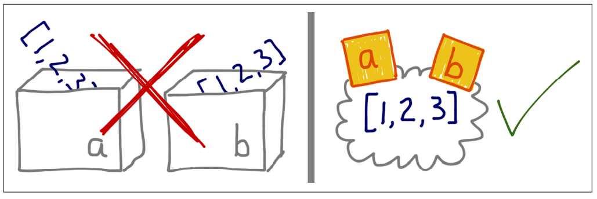

# Variables Are Not Boxes

## Introduction
In Python, variables are not like boxes that hold values. Instead, think of them as sticky notes (labels) attached to objects. This concept helps in understanding how Python handles references and assignments.

## Explanation with Examples

### Example 1: Variables as Labels
Let's look at an example to understand this concept.

#### Code:
```python
a = [1, 2, 3]  # Create a list and attach a label 'a' to it
b = a  # Attach another label 'b' to the same list
a.append(4)  # Modify the list through 'a'
print(b)  # Output: [1, 2, 3, 4]
```

#### Console Screen Visualization:

```python
Before appending:

a ------> [1, 2, 3]
b ------> [1, 2, 3]

After appending a new item to the list:

a ------> [1, 2, 3, 4]
b ------> [1, 2, 3, 4]
```

#   Explanation:
- Both 'a' and 'b' are labels (sticky notes) pointing to the same list object.
- When the list is modified through 'a', the change is reflected in 'b' as well, because they both point to the same list. 



### Why the Box Metaphor Fails
If you think of `a` and `b` as boxes, you might expect that `b` should still hold the original list `[1, 2, 3]`. But that's not the case because `a` and `b` are not boxes, they are sticky notes pointing to the same list.

### Example 2: Order of Assignment
This example shows that the right-hand side of an assignment is evaluated first.

#### Code:
```python
class Gizmo:
    def __init__(self):
        print(f'Gizmo id: {id(self)}')

x = Gizmo()  # Creates a Gizmo object and assigns it to x
try:
    y = Gizmo() * 10  # Tries to create another Gizmo and multiply, but fails
except TypeError as e:
    print(e)  # Output: unsupported operand type(s) for *: 'Gizmo' and 'int'

# Check current variables
print(dir())  # Output: shows 'x' but not 'y'
```

#### Console Screen Visualization:
```python
Before multiplication error:

x ------> Gizmo(id: <some_id>)
y ------> (attempting to create Gizmo and multiply by 10)

After multiplication error (exception occurs, y is not created):

x ------> Gizmo(id: <some_id>)
y is not created due to the error
```

### Explanation:
1. **Create a Gizmo instance**: and assign it to `x`. This prints the `Gizmo id`.
2. **Attempt to multiply**: a Gizmo instance by 10 and assign it to `y`. This fails because you can't multiply a `Gizmo` object.

The key point is that `y` is never created because the right-hand side of the assignment fails. This shows that the object is created first, and then the variable is assigned to it.

## Conclusion
In Python, variables are labels (like sticky notes) attached to objects. This means multiple variables can point to the same object, and understanding this helps avoid confusion. Forget about thinking of variables as boxes; instead, think of them as sticky notes that you stick onto objects.

