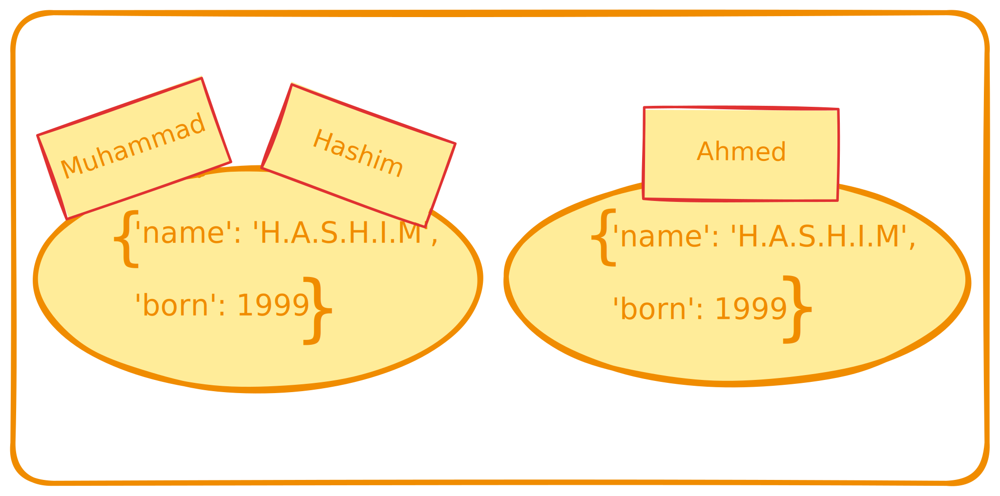

# Identity, Equality, and Aliases

## Introduction
In Python, objects can have aliases and identities. Understanding these concepts is crucial for writing efficient and bug-free code. This README explains these concepts using simple examples and provides complete examples where needed.

## Aliasing
Aliasing occurs when two or more variables refer to the same object in memory. Changes made through one alias affect the object and can be seen through the other alias.

### Example of Aliasing
```python
muhammad = {'name': 'H.A.S.H.I.M', 'born': 1999}
hashim = muhammad

# Checking if they refer to the same object
hashim is muhammad  # Output: True

# Checking their IDs
id(muhammad), id(hashim)  # Output: (ID_value, ID_value)

# Modifying the object through one alias
hashim['balance'] = 950

# Checking the original object
print(muhammad)  # Output: {'name': 'H.A.S.H.I.M', 'born': 1999, 'balance': 950}
```
In this example:
- `muhammad` and `hashim` are aliases.
- The `is` operator confirms they are the same object.
- Adding an item to `hashim` also affects `muhammad`.




## Identity and Equality
Identity (`is` operator) checks if two variables refer to the same object. Equality (`==` operator) checks if two objects have the same value.

### Example of Identity and Equality
```python
ahmed = {'name': 'H.A.S.H.I.M', 'born': 1999, 'balance': 950}

# Checking if the objects have the same value
ahmed == muhammad  # Output: True

# Checking if they are the same object
ahmed is not muhammad  # Output: True
```
In this example:
- `ahmed` is a separate object with the same value as `muhammad`.
- The `==` operator confirms they have the same value.
- The `is` operator confirms they are different objects.

## Important Concepts
- **Identity**: An object's identity never changes once it is created. It can be thought of as the object's address in memory.
- **is Operator**: Compares the identity of two objects.
- **id() Function**: Returns an integer representing the object's identity.

## Usage of `id()` and `is`
- In practice, `id()` is rarely used in regular programming but can be useful in debugging.
- The `is` operator is commonly used for identity checks.

### Example Usage in Debugging
When debugging, if two objects' `repr()` outputs look alike, you can use `id()` to check if they are the same object.

```python
obj1 = {'key': 'value'}
obj2 = {'key': 'value'}

# Using repr() to get the string representation
print(repr(obj1))  # Output: {'key': 'value'}
print(repr(obj2))  # Output: {'key': 'value'}

# Debugging to check if they are the same object
print(id(obj1), id(obj2))  # Outputs different IDs

# Checking if they are the same object using 'is'
print(obj1 is obj2)  # Output: False
```
In this example:
- `repr(obj1)` and `repr(obj2)` both return the string `{'key': 'value'}`.
- `id(obj1)` and `id(obj2)` return different values, showing they are stored at different memory addresses.
- `obj1 is obj2` returns `False`, indicating they are not the same object.

In The Python Language Reference, **[3.1. Objects, values and types](https://docs.python.org/3/reference/datamodel.html#objects-values-and-types)**

## Conclusion
Understanding identity, equality, and aliasing in Python is essential for writing effective code. Use the `is` operator to check identity and `==` for value equality. Use `id()` for debugging to understand object references better.

