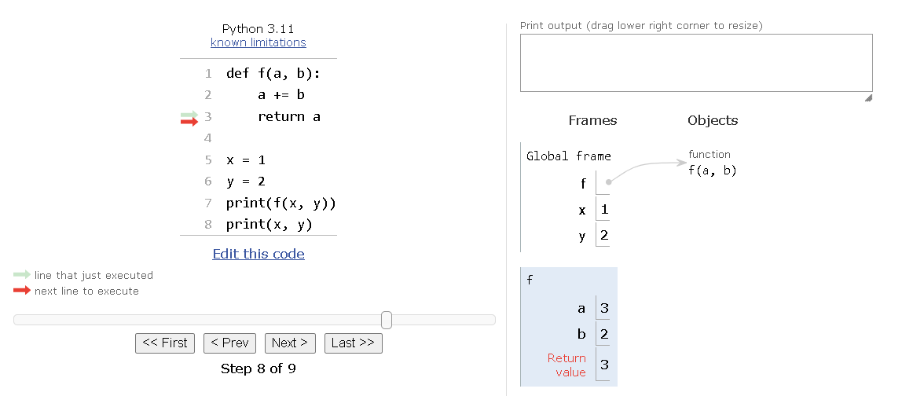
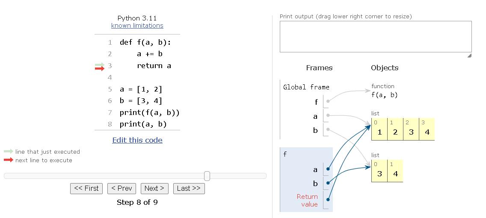
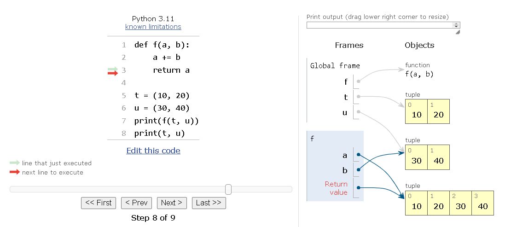
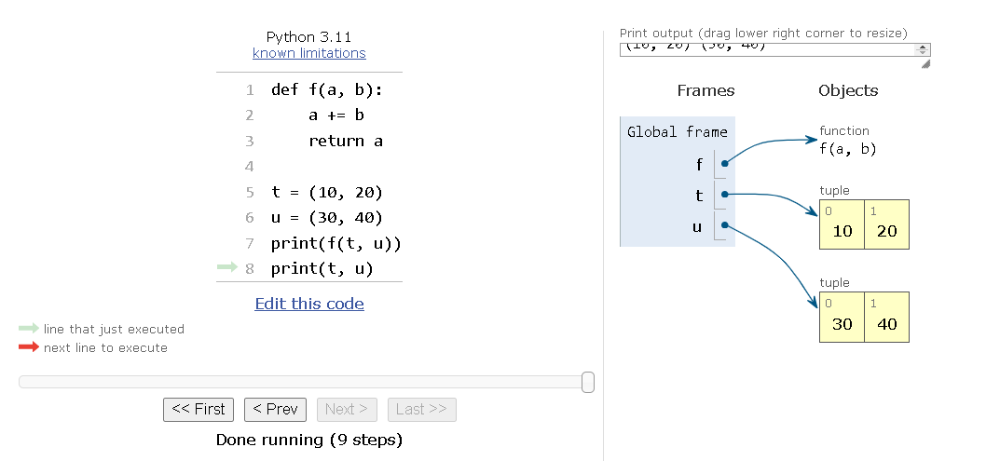

# Function Parameters as References

## Introduction

In Python, the only mode of parameter passing is call by sharing. This is the same mode used in most object-oriented languages, including JavaScript, Ruby, and Java (for reference types; primitive types use call by value). Call by sharing means that each formal parameter of the function gets a copy of each reference in the arguments. The parameters inside the function become aliases of the actual arguments.

## Behavior of Function Parameters

As a result, a function can change any mutable object passed as a parameter, but it cannot change the identity of those objects (i.e., it cannot replace an object with another). 

## Example

Let's see an example of a function using `+=` on one of its parameters and observe the effects on different types of arguments.

### Function Definition

```python
def f(a, b):
    a += b
    return a
```

### Using the Function with Different Types of Arguments

#### Passing Integers

```python
x = 1
y = 2
print(f(x, y))  # Output: 3
print(x, y)     # Output: (1, 2)
```

- The number `x` is unchanged.

#### Representation
<p align="center">

</p>

#### Passing Lists

```python
a = [1, 2]
b = [3, 4]
print(f(a, b))  # Output: [1, 2, 3, 4]
print(a, b)     # Output: ([1, 2, 3, 4], [3, 4])
```

- The list `a` is changed.

#### Representation
**Part 1**
<p align="center">

</p>

**Part 2**
<p align="center">

</p>

#### Passing Tuples

```python
t = (10, 20)
u = (30, 40)
print(f(t, u))  # Output: (10, 20, 30, 40)
print(t, u)     # Output: ((10, 20), (30, 40))
```

- The tuple `t` is unchanged.

#### Representation
**Part 1**
<p align="center">

</p>

**Part 2**
<p align="center">

</p>


### Explanation

1. When passing integers, the value of `x` is not modified outside the function.
2. When passing lists, the list `a` is modified because lists are mutable.
3. When passing tuples, the value of `t` remains unchanged outside the function because tuples are immutable.

## Conclusion

Understanding the behavior of function parameters in Python is crucial. Functions can modify mutable objects passed as arguments but cannot change their identities. This distinction is important when working with different types of objects in Python.

## Next Topic

The next topic covers the use of mutable values for default parameters and the related issues.
