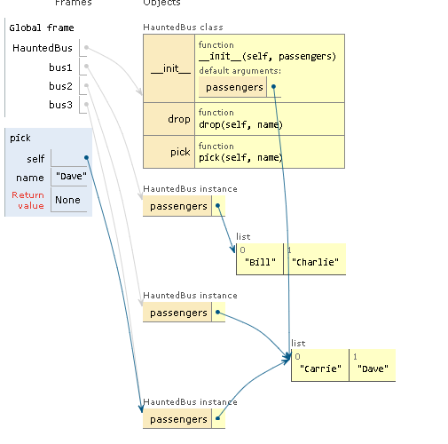

# Mutable Types as Parameter Defaults: Bad Idea

## Introduction

Optional parameters with default values are a great feature of Python function definitions, allowing APIs to evolve while remaining backward compatible. However, using mutable objects as default values for parameters should be avoided.

## Example

To illustrate this point, we take the `Bus` class and modify its `__init__` method to create `HauntedBus`. Instead of using `passengers=None`, we use `passengers=[]`, which leads to unintended behavior.

### HauntedBus Class Definition

```python
class HauntedBus:
    """A bus model haunted by ghost passengers"""
    def __init__(self, passengers=[]):
        self.passengers = passengers

    def pick(self, name):
        self.passengers.append(name)

    def drop(self, name):
        self.passengers.remove(name)
```

- When the `passengers` argument is not provided, it defaults to an empty list.
- `self.passengers` becomes an alias for this default list.
- Methods `.remove()` and `.append()` mutate the default list, affecting all instances that use it.

### Eerie Behavior of HauntedBus

Consider the following example demonstrating the unintended behavior:

#### Creating Bus Instances

```python
bus1 = HauntedBus(['Alice', 'Bill'])
print(bus1.passengers)  # Output: ['Alice', 'Bill']

bus1.pick('Charlie')
bus1.drop('Alice')
print(bus1.passengers)  # Output: ['Bill', 'Charlie']
```

- `bus1` starts with two passengers and behaves as expected.

```python
bus2 = HauntedBus()
bus2.pick('Carrie')
print(bus2.passengers)  # Output: ['Carrie']

bus3 = HauntedBus()
print(bus3.passengers)  # Output: ['Carrie']

bus3.pick('Dave')
print(bus2.passengers)  # Output: ['Carrie', 'Dave']

print(bus2.passengers is bus3.passengers)  # Output: True
print(bus1.passengers)  # Output: ['Bill', 'Charlie']
```

- `bus2` and `bus3` start empty and use the default list.
- Changes to `bus3`'s passengers affect `bus2`'s passengers because they share the same list.

## Explanation

1. `bus1` starts with a specific passenger list and behaves normally.
2. `bus2` and `bus3` start with the default empty list, leading to shared state issues.
3. Modifying one bus's passengers list affects the other due to the shared default list.

#### Representation
<p align="center">

</p>

### Inspecting the HauntedBus

After running the above lines, you can inspect the `HauntedBus.__init__` object:

```python
dir(HauntedBus.__init__)  # doctest: +ELLIPSIS
# Output: ['__annotations__', '__call__', ..., '__defaults__', ...]

print(HauntedBus.__init__.__defaults__)  
# Output: (['Carrie', 'Dave'],)
```

- The default list can be seen in the `__defaults__` attribute.
- `bus2.passengers` is an alias for the first element of `HauntedBus.__init__.__defaults__`:

```python
print(HauntedBus.__init__.__defaults__[0] is bus2.passengers)  
# Output: True
```

## Best Practice

To avoid such issues, use `None` as the default value for parameters that may receive mutable values:

```python
class Bus:
    def __init__(self, passengers=None):
        if passengers is None:
            self.passengers = []
        else:
            self.passengers = list(passengers)
```

- This ensures each instance gets its own list, avoiding shared state issues.
- The correct implementation binds a copy of the argument to `self.passengers`.

## Conclusion

Using mutable objects as default parameter values can lead to subtle bugs and unexpected behavior. Instead, use `None` and explicitly handle the creation of mutable objects within the function.

