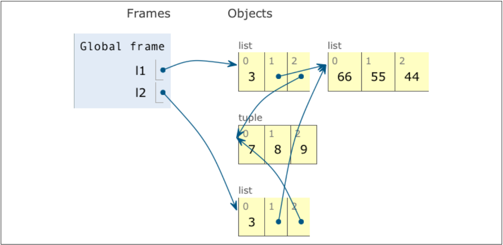

# Copies are Shallow default
When copying lists or other mutable collections in Python, the copies created are shallow by default. This means the outermost container is duplicated, but the copy contains references to the same items as the original container. 

## Example

Let's see an example to understand this better:

```python
l1 = [3, [55, 44], (7, 8, 9)]
l2 = list(l1)
```

In the above code:
- `l1` is a list containing an integer, another list, and a tuple.
- `l2` is created by copying `l1` using `list(l1)`.

```python
print(l2)  # Output: [3, [55, 44], (7, 8, 9)]
print(l2 == l1)  # Output: True
print(l2 is l1)  # Output: False
```

- `l2` is equal to `l1` because they contain the same items.
- `l2` is not the same object as `l1`.

## Shallow Copy Behavior

Creating a shallow copy using the constructor or slicing (`[:]`) duplicates the outermost container but keeps references to the same items.

## Practical Example

Consider the following example, which shows the behavior of shallow copies:

```python
l1 = [3, [66, 55, 44], (7, 8, 9)]
l2 = list(l1)
l1.append(100)
l1[1].remove(55)

print('l1:', l1)  # Output: l1: [3, [66, 44], (7, 8, 9), 100]
print('l2:', l2)  # Output: l2: [3, [66, 44], (7, 8, 9)]

l2[1] += [33, 22]
l2[2] += (10, 11)

print('l1:', l1)  # Output: l1: [3, [66, 44, 33, 22], (7, 8, 9), 100]
print('l2:', l2)  # Output: l2: [3, [66, 44, 33, 22], (7, 8, 9, 10, 11)]
```

### Visual Representation


### Explanation

1. `l2` is a shallow copy of `l1`.
2. Appending `100` to `l1` does not affect `l2` because the outermost list is duplicated.
3. Removing `55` from the inner list `l1[1]` affects `l2` because both `l1[1]` and `l2[1]` refer to the same list.
4. Using `+=` on `l2[1]` modifies the list in place, which is reflected in `l1[1]`.
5. Using `+=` on `l2[2]` creates a new tuple and rebinds `l2[2]`, so `l1[2]` and `l2[2]` no longer refer to the same object.

### Output of the Example

After running the code, the output is as follows:

```python
print('l1:', l1)  # Output: l1: [3, [66, 44], (7, 8, 9), 100]
print('l2:', l2)  # Output: l2: [3, [66, 44], (7, 8, 9)]

print('l1:', l1)  # Output: l1: [3, [66, 44, 33, 22], (7, 8, 9), 100]
print('l2:', l2)  # Output: l2: [3, [66, 44, 33, 22], (7, 8, 9, 10, 11)]
```

### Visual Representation


## Conclusion

It should be clear now that shallow copies are easy to make, but they may or may not be what you want. The next topic covers how to make deep copies.
