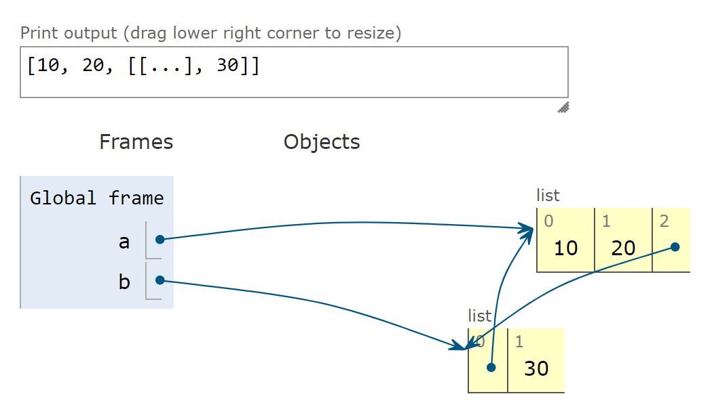
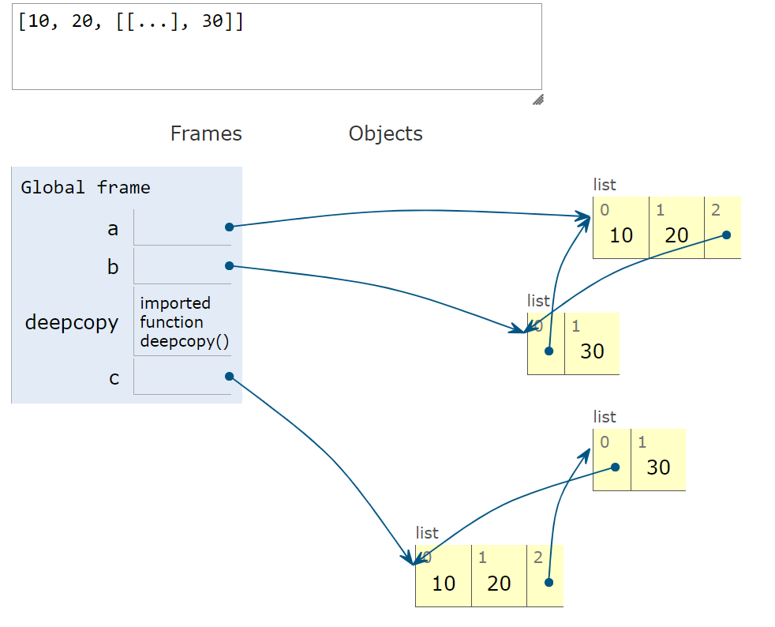

# Deep and Shallow Copies of Arbitrary Objects

## Introduction

Working with shallow copies is not always a problem, but sometimes you need to make deep copies. Deep copies are duplicates that do not share references of embedded objects. The `copy` module provides the `deepcopy` and `copy` functions to create deep and shallow copies of arbitrary objects.

## Example

To illustrate the use of `copy()` and `deepcopy()`, we define a simple class, `Bus`, representing a school bus that picks up or drops off passengers on its route.

### Bus Class Definition

```python
class Bus:
    def __init__(self, passengers=None):
        if passengers is None:
            self.passengers = []
        else:
            self.passengers = list(passengers)

    def pick(self, name):
        self.passengers.append(name)

    def drop(self, name):
        self.passengers.remove(name)
```

### Creating Bus Instances

In the following example, we create a bus object (`bus1`) and two clones—a shallow copy (`bus2`) and a deep copy (`bus3`)—to observe what happens when `bus1` drops off a student.

### Effects of Using `copy` versus `deepcopy`

```python
import copy
bus1 = Bus(['Alice', 'Bill', 'Claire', 'David'])
bus2 = copy.copy(bus1)
bus3 = copy.deepcopy(bus1)
print(f'id(bus1)={id(bus1)}, id(bus2)={id(bus2)}, id(bus3)={id(bus3)}')
# Output: id(bus1)=2294379765664, id(bus2)=2294379861856, id(bus3)=2294379861952
bus1.drop('Bill')
print(bus2.passengers)  # Output: ['Alice', 'Claire', 'David']
print(f'id(bus1)={id(bus1)}, id(bus2)={id(bus2)}, id(bus3)={id(bus3)}')
# Output: id(bus1)=2294379765664, id(bus2)=2294379861856, id(bus3)=2294379861952
print(bus3.passengers)  # Output: ['Alice', 'Bill', 'Claire', 'David']
```

### Explanation

1. Using `copy` and `deepcopy`, we create three distinct `Bus` instances.
2. After `bus1` drops 'Bill', he is also missing from `bus2`.
3. Inspecting the `passengers` attributes shows that `bus1` and `bus2` share the same list object because `bus2` is a shallow copy of `bus1`.
4. `bus3` is a deep copy of `bus1`, so its `passengers` attribute refers to a different list.

### Handling Cyclic References

Deep copies can handle cyclic references gracefully. This is demonstrated in the following example:

```python
a = [10, 20]
b = [a, 30]
a.append(b)
print(a)  # Output: [10, 20, [[...], 30]]
```
#### Visual Representation


```python
from copy import deepcopy
c = deepcopy(a)
print(c)  # Output: [10, 20, [[...], 30]]
```

#### Visual Representation


### Customizing Copy Behavior

Deep copies can sometimes be too deep. For example, objects may refer to external resources or singletons that should not be copied. You can control the behavior of both `copy` and `deepcopy` by implementing the `__copy__()` and `__deepcopy__()` special methods, as described in the [copy module documentation](https://docs.python.org/3/library/copy.html).

## Conclusion

Understanding the difference between shallow and deep copies is crucial when working with mutable objects in Python. Shallow copies are easy to make but may not always be suitable. Deep copies can handle complex structures and cyclic references but may require customization to avoid copying external resources or singletons.

