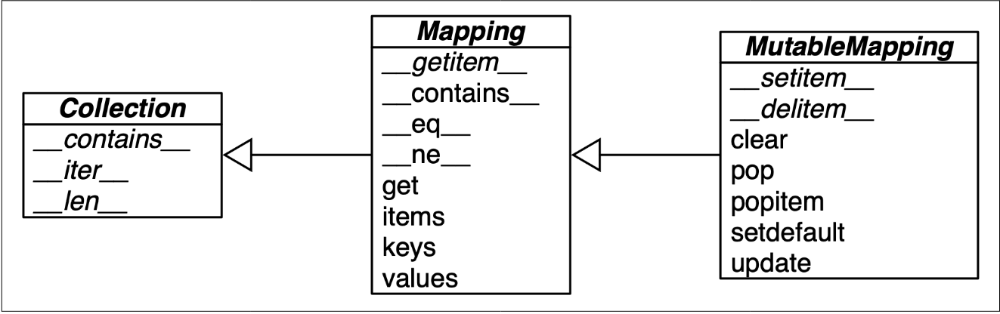

# Standard API of Mapping Types

The `collections.abc` module provides the `Mapping` and `MutableMapping` Abstract Base Classes (ABCs) that describe the interfaces of `dict` and similar types. The main value of these ABCs is documenting and formalizing the standard interfaces for mappings and serving as criteria for `isinstance` tests in code that needs to support mappings in a broad sense.

## UML Class Diagram

Below is a simplified UML class diagram for the `MutableMapping` and its superclasses from `collections.abc`. Inheritance arrows point from subclasses to superclasses; names in italic are abstract classes and abstract methods.



### Explanation of the UML Diagram

1. **Collection**
   - **Abstract Methods**:
     - `__contains__`
     - `__iter__`
     - `__len__`

2. **Mapping (inherits from Collection)**
   - **Abstract Methods**:
     - `__getitem__`
     - `__contains__`
     - `__eq__`
     - `__ne__`
   - **Concrete Methods**:
     - `get`
     - `items`
     - `keys`
     - `values`

3. **MutableMapping (inherits from Mapping)**
   - **Abstract Methods**:
     - `__setitem__`
     - `__delitem__`
   - **Concrete Methods**:
     - `clear`
     - `pop`
     - `popitem`
     - `setdefault`
     - `update`

## Example Usage of ABCs

The `collections.abc` module provides a way to test whether a particular object conforms to the `Mapping` or `MutableMapping` interface using `isinstance`.

```python
from collections import abc

my_dict = {}
print(isinstance(my_dict, abc.Mapping))  # Output: True
print(isinstance(my_dict, abc.MutableMapping))  # Output: True
```

### Explanation
- **Mapping**: The `isinstance` test checks if `my_dict` conforms to the `Mapping` interface, which includes methods like `__getitem__`, `__contains__`, and others.
- **MutableMapping**: The `isinstance` test checks if `my_dict` conforms to the `MutableMapping` interface, which includes additional methods like `__setitem__` and `__delitem__`.

## Advantages of Using ABCs

Using `isinstance` with an ABC is often better than checking whether a function argument is of the concrete `dict` type, because this allows for the use of alternative mapping types. This approach provides flexibility and extensibility in code that handles mappings.

## Implementing Custom Mappings

To implement a custom mapping, it is easier to extend `collections.UserDict` or to wrap a `dict` by composition, instead of subclassing these ABCs. The `collections.UserDict` class and all concrete mapping classes in the standard library encapsulate the basic `dict` in their implementation, which is built on a hash table. Therefore, they all share the limitation that the keys must be hashable (the values need not be hashable, only the keys).
